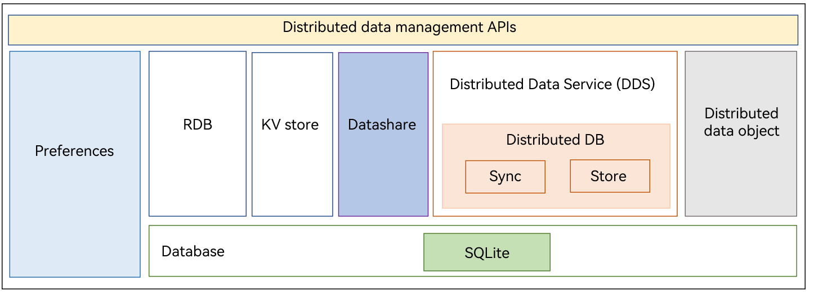

# Distributed Data Management


## Introduction

**Distributed Data Management Subsystem**

The Distributed Data Management subsystem can persistently store various structured data of a single device. It also supports data synchronization and sharing across devices. With the Distributed Data Management subsystem, application data can be seamlessly processed across devices, ensuring consistent user experience for the same application across devices.

-   Local data management

    This module allows you to store and access structured data on a single device. It uses the SQLite engine to provide the relational database (RDB) and preferences database. With these databases, you can persistently store and access app data using different models.


-   DDS

    The distributed data service (DDS) can synchronize data across devices, so that users can access consistent data on different devices. The DDS isolates data based on a triplet of the account, application, and database. DDS synchronizes data between trusted devices to provide the cross-device data access capability.


**Architecture**

**Figure 1** Architecture




## Directory Structure

Level 1 and 2 directories of the distributed data management subsystem:

```
distributeddatamgr/                 # Distributed Data Management subsystem
├── appdatamgr                      # Local data management
└── distributeddatamgr              # DDS
│   ├── frameworks                  # Framework code
│   │   ├── common                  # Common utility class
│   │   ├── innerkitsimpl           # Implementation of APIs between components
│   │   ├── jskitsimpl              # Implementation of JS APIs 
│   │   ├── libs                    # Implementation of DB code 
│   │   └── native                  # Implementation of internal APIs 
│   ├── interfaces                  # API code
│   │    ├── inner_api              # Declaration of internal APIs
│   │    ├── innerkits              # Declaration of APIs between components
│   │    └── jskits                 # Declaration of JS APIs 
│   └── services                    # Service layer code
│       └── distributeddataservice  # DDS implementation
└── objectstore                     # Distributed data object directory
    ├─frameworks                    # Framework code
    │  ├─innerkitsimpl              # Implementation of APIs between components
    │  └─jskitsimpl                 # Implementation of JS APIs
    └─interfaces                    # API code
        ├─innerkits                 # Declaration of APIs between components
        └─jskits                    # Declaration of JS APIs
    
│third_party/                       # Open-source software
├── flatbuffers                     # FlatBuffers code
└── sqlite                          # SQLite code
```

## Usage

### Local Data Management

-   RDB store

    Basic concepts are as follows:

    -   **RDB**

        A database created on the basis of relational models. The RDB stores data in rows and columns.

    -   **Result set**

        A set of query results used to access the data. You can access the required data in a result set in flexible modes.

    -   **SQLite**

        A lightweight RDB in compliance with the atomicity, consistency, isolation, and durability (ACID) properties. It is an open-source database.


-   Preferences database

    Basic concepts are as follows:

    -   **KV store**

        A database that stores data in key-value (KV) pairs. The **key** indicates a keyword, and **value** indicates the corresponding value.

    -   **Non-relational database**

        A database not in compliance with the ACID database management properties of relational data transactions. Instead, the data in a non-relational database is independent and scalable.

    -   **Preference data**

        A type of data that is frequently accessed and used.

    
### DDS

The DDS implements database collaboration across devices for applications. The DDS isolates data based on a triplet of the account, application, and database. The DDS synchronizes data between trusted devices, delivering a consistent data access experience on different devices.

### KV Data Model

A KV store is a type of NoSQL database. Data in this type of database is organized, indexed, and stored in the form of KV pairs.

The KV data model is suitable for storing service data that does not involve too many data or service relationships. It provides better read and write performance than the SQL database. The KV data model is widely used in distributed scenarios because it handles conflict more easily in database version compatibility and data synchronization. The distributed database is based on the KV data model and provides KV-based access interfaces.

### Distributed Data Object

The distributed data object management framework is an object-oriented in-memory data management framework. It provides APIs for basic data object management, such as creating, querying, deleting, modifying, and subscribing to in-memory objects. Moreover, it provides distributed capabilities to implement data object collaboration for the same application between multiple devices that form a Super Device.

The **Distributed Data Object** module provides JS APIs to help you use distributed data objects like using local data objects. The distributed data objects support basic data types, such as number, string, and Boolean, as well as complex data types, such as array and nested basic types.

## Repositories Involved

Distributed Data Management subsystem

distributeddatamgr\_appdatamgr

distributeddatamgr\_distributeddatamgr

distributeddatamgr\_objectstore

third\_party\_sqlite

third\_party\_flatbuffers
