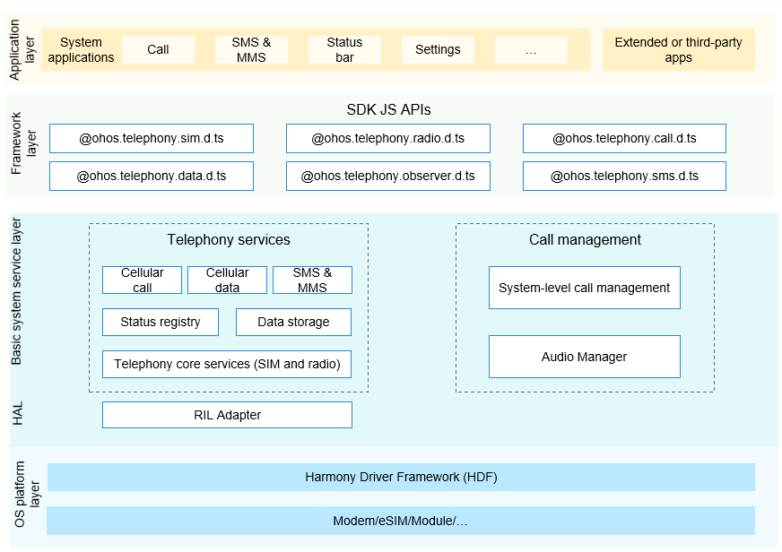

# Telephony <a name="EN-US_TOPIC_0000001162422291"></a>

-   [Introduction](#section104mcpsimp)
-   [Directory Structure](#section119mcpsimp)
-   [Constraints](#section123mcpsimp)
-   [Usage](#section128mcpsimp)
    -   [Obtaining the Current Cellular Network Signal Information](#section1458213210369)
    -   [Observing Changes to the Cellular Network Status](#section750135512369)

-   [Repositories Involved](#section152mcpsimp)

## Introduction<a name="section104mcpsimp"></a>

The Telephony subsystem provides APIs for obtaining information about the wireless cellular network and SIM card. Applications can call these APIs to obtain information such as the name of the currently registered network, network service status, signal strength, and SIM card information.

The Telephony subsystem consists of the following modules:

-   Telephony core service: initializes the Radio Interface Layer (RIL) Manager, SIM card module, and radio module.
-   Call Manager module: manages three types of calls – circuit switched \(CS\), IP multimedia subsystem \(IMS\), and over the top \(OTT\) calls. It is responsible for applying for the audio and video resources required for a call and resolving conflicts in a multi-channel call.
-   Cellular call module: implements basic calls over carrier networks.
-   Cellular data module: implements cellular data services over carrier networks.
-   SMS & MMS module: provides the capabilities of sending and receiving short message service \(SMS\) messages and encoding and decoding multimedia messaging service \(MMS\) messages.
-   State registry module: provides APIs to register and deregister an observer that listens for various callback events of the telephony subsystem. 
-   Data storage module: stores persistent data and provides **DataAbility** access APIs.
-   RIL Adapter module: implements adaptation of the modem communication interfaces.

**Figure 1** Telephony subsystem architecture



## Directory Structure<a name="section119mcpsimp"></a>

```
base/telephony/
├── core_service            # Telephony core service
├── call_manager            # Call Manager module
├── cellular_call           # Cellular call module
├── cellular_data           # Cellular data module
├── sms_mms                 # SMS & MMS module
├── state_registry          # State registry module
├── data_storage            # Data storage module
└── ril_adapter             # RIL Adapter module
```

## Constraints<a name="section123mcpsimp"></a>

1.  The open-source version currently provides the cellular call (CS call only), SMS & MMS, and cellular data services and supports the dual-SIM framework.
2.  The Hardware Device Interface (HDI) support is subject to the chip vendors' adaptation capability. For details, see [Telephony Service Development](../device-dev/subsystems/subsys-tel-overview.md).

## Usage Guidelines<a name="section128mcpsimp"></a>

To learn more about the usage of each subsystem module, refer to the respective README. The following illustrates API usage by exemplifying how to obtain the current cellular network signal information and observe the cellular network status changes.

### Obtaining the Current Cellular Network Signal Information<a name="section1458213210369"></a>

1.  Import the **radio** namespace from **@ohos.telephony.radio.d.ts**.
2.  Call the **getSignalInformation\(slotId: number\)** function via callback or promise. This function works in asynchronous mode. 
3.  Obtain the result from the **SignalInformation** array in the callback.
4.  Traverse the **SignalInformation** array to obtain the **signalLevel** (signal strength) for each **signalType** (radio access technology).

    ```
    // Import the radio package.
    import radio from "@ohos.telephony.radio";
    
    // Set the value of slotId.
    let slotId = 0;
    
    // Call the API in callback mode.
    radio.getSignalInformation(slotId, (err, value) => {
      if (err) {
        // If the API call fails, err is not empty.
        console.error(`failed to getSignalInformation because ${err.message}`);
        return;
      }
      // If the API call is successful, err is empty.
      for (let i = 0; i < value.length; i++) {
        console.log(`success to getSignalInformation: type is ${value[i].signalType}, level is ${value[i].signalLevel}`);
      }
    });
    
    // Call the API in promise mode.
    let promise = radio.getSignalInformation(slotId);
    promise.then((value) => {
      // The API call is successful.
      for (let i = 0; i < value.length; i++) {
        console.log(`success to getSignalInformation: type is ${value[i].signalType}, level is ${value[i].signalLevel}`);
      }
    }).catch((err) => {
      // The API call fails.
      console.error(`failed to getSignalInformation because ${err.message}`);
    });
    ```


### Observing Cellular Network Status Changes<a name="section750135512369"></a>

Adding an Observer

1.  Import the **observer** namespace from **@ohos.telephony.observer.d.ts**.
2.  Call the **on\(type:'networkStateChange'\)** function with **slotId** (slot ID, optional) and **callback** (callback processing function) passed in.
3.  Register an **observer** instance for callback events of network status changes.

    ```
    // Import the observer package.
    import observer from '@ohos.telephony.observer';
    
    // Registers an observer.
    observer.on('networkStateChange', {slotId: 0}, (value) => {
      console.log(`network state is ` + value);
    });
    ```


Removing the Observer

1.  Import the **observer** namespace from **@ohos.telephony.observer.d.ts**.
2.  Call the **off\(type: 'networkStateChange'\)** function with the **callback** object passed to **observer**.

    ```
    // Import the observer package.
    import observer from '@ohos.telephony.observer';
    
    // Unregister the observer.
    observer.off('networkStateChange');
    ```


## Repositories Involved<a name="section152mcpsimp"></a>

**Telephony Subsystem**

[telephony\_core\_service](https://gitee.com/openharmony/telephony_core_service/blob/master/README.md)

[telephony\_call\_manager](https://gitee.com/openharmony/telephony_call_manager/blob/master/README.md)

[telephony\_cellular\_call](https://gitee.com/openharmony/telephony_cellular_call/blob/master/README.md)

[telephony\_cellular\_data](https://gitee.com/openharmony/telephony_cellular_data/blob/master/README.md)

[telephony\_sms\_mms](https://gitee.com/openharmony/telephony_sms_mms/blob/master/README.md)

[telephony\_state\_registry](https://gitee.com/openharmony/telephony_state_registry/blob/master/README.md)

telephony\_data\_storage

[telephony\_ril\_adapter](https://gitee.com/openharmony/telephony_ril_adapter/blob/master/README.md)
