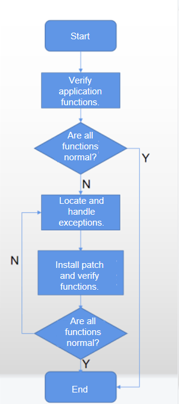
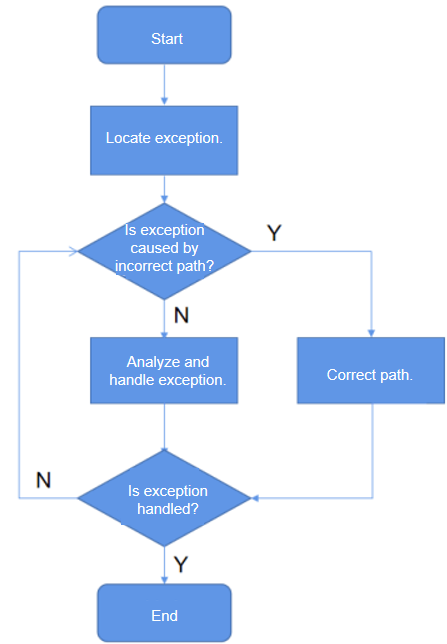

# Adaptation Guide for the Application Sandbox

## Verification Process

1. Verify your application functions. If all the functions are normal, no adaptation is required.
2. If any function is found to be abnormal, analyze the code to identify the exception. Then adapt the file access model by following the instructions provided in [Adaptation Process](#adaptation-process).
3. After the adaptation is complete, verify the functions again. If all the functions are normal, the adaptation process is complete. If any function is found to be abnormal, repeat the operations described in Step 2.

## Adaptation Process

1. Check whether the identified exception is caused by an incorrect access path of the application source code. You can check the correctness of an access path against [Sandbox File Access Specifications](#sandbox-file-access-specifications).
2. If the application source code accesses an incorrect path, change the path access policy. Specifically, use the **Context** API rather than the absolute path to access the **/data** directory. For details about the **Context** API, see the following documents:
   https://gitee.com/openharmony/docs/blob/master/zh-cn/application-dev/application-models/application-context-stage.md
3. If the exception is caused by a third-party module invoked by the application and the application source code does not use an absolute path to access files, proceed as follows:
   - Request the third-party module to access the file path through the **Context** API instead of using the absolute path.
   - If the third-party module is a common module used by both appspawn incubated processes and native processes, abstract the third-party module as a service and access the service in IPC mode.

## Sandbox File Access Specifications

**Access Paths in the Application Root Directory**

| Path               | Description                                      |
| --------------------- | ------------------------------------------ |
| bin                   | Binary file directory.                      |
| config                | Configuration directory.                                  |
| data                  | Application data directory.                              |
| dev                   | Device node directory.                                  |
| etc                   | Soft link of **/system/etc**.                       |
| init                  | Soft link of **/system/bin/init**.                  |
| lib                   | Soft link of **/system/lib**.                       |
| mnt                   | Mount directory.                                  |
| proc                  | Directory of the proc file system.                          |
| sys                   | Directory of the sys file system.                           |
| sys_prod              | This directory varies according to devices. Some devices do not have this directory.|
| system/app            | System directory resources.                              |
| system/fonts          | System fonts.                              |
| system/lib            | System libraries.                                    |
| system/data           | System directory resources.                              |
| system/usr            | System directory resources.                              |
| system/profile        | System directory resources.                              |
| system/bin            | System programs.                                  |
| system/etc            | System configuration.                                  |
| vendor/lib/chipsetsdk | Chip component directory. Currently, only chipsetsdk is mounted.        |

**Access Paths in the Application Data Directory**

| Path                            | Description                                                        |
| ---------------------------------- | ------------------------------------------------------------ |
| /data                              | Application data directory.                                                |
| /data/storage                      | Application data.                                                    |
| /data/bundles                      | Installation directory of all applications. Only applications with the BASIC or higher ability privilege level (APL) can access this directory.|
| /data/storage/el1                  | Data directory of applications with encryption level 1.                                     |
| /data/storage/el2                  | Data directory of applications with encryption level 2.                                     |
| /data/storage/el1/base             | Data directory of applications with encryption level 1.                                     |
| /data/storage/el1/bundles          | Installation package directory of applications with encryption level 1.                               |
| /data/storage/el1/database         | Database directory of applications with encryption level 1.                               |
| /data/storage/el2/base             | Data directory of applications with encryption level 2.                                     |
| /data/storage/el2/database         | Database directory of applications with encryption level 2.                               |
| /data/storage/el2/auth_groups      | Distributed data directory of applications with encryption level 2 but without an account.                     |
| /data/storage/el2/distributedfiles | Distributed data directory of applications with encryption level 2 and an account.                     |

When the application sandbox is enabled, your application cannot access the physical paths in the application data directory in the application namespace. It must use the **Context** API for the access.
For a specific application, its physical data directory and sandbox data directory store the same set of data, which is associated using bind mounts. Any change to one directory affects the data in the other directory. Applications can access data in namespaces only through sandbox paths. The following table lists the mapping between physical paths and sandbox paths in the application data directory.

**Mapping Between Physical Paths and Sandbox Paths in the Application Data Directory**

| Physical Path                                                    | Sandbox Path                          | Description                                   |
| ------------------------------------------------------------ | ---------------------------------- | --------------------------------------- |
| /data/app/el1/bundle/public/\<PackageName>\                  | /data/storage/el1/bundle           | Application installation package directory.                         |
| /data/app/el1/\<USERID\>/base/\<PACKAGENAME\>                | /data/storage/el1/base             | Encrypted data directory of applications with encryption level 1.                |
| /data/app/el2/\<USERID\>/base/\<PACKAGENAME\>                | /data/storage/el2/base             | Encrypted data directory of applications with encryption level 2.                |
| /data/app/el1/\<USERID\>/database/\<PACKAGENAME\>            | /data/storage/el1/database         | Encrypted database directory of applications with encryption level 1.              |
| /data/app/el2/\<USERID\>/database/\<PACKAGENAME\>            | /data/storage/el2/database         | Encrypted database directory of applications with encryption level 2.              |
| /mnt/hmdfs/\<USERID\>/account/merge_view/data/\<PACKAGENAME\> | /data/storage/el2/distributedfiles | Distributed data directory of applications with encryption level 2 and an account.|
| /mnt/hmdfs/\<USERID\>/non_account/merge_view/data/           | /data/storage/el2/auth_groups      | Distributed data directory of applications with encryption level 2 but without an account.|
| /mnt/hmdfs/                                                  | /mnt/hmdfs/                        | Distributed file system directory.                     |

> **NOTE**
>
>  \<USERID\> indicates the current user ID.
> \<PACKAGENAME\> indicates the name of the current application package.

For more information about the mapping between physical paths and sandbox paths, see the following:
https://gitee.com/OpenHarmony/startup_appspawn/blob/master/appdata-sandbox64.json

## Case: No Audio in the Contacts.hap Dialing Scenario

As shown in the figure below, the access path is a hardcoded absolute path, **/data/app/el1**. The access to such paths is not allowed in the application sandbox, causing the access failure.

The preceding code snippet uses the **fileIO** interface to open a fixed path to obtain a **fdNumber**, which will be used for subsequent file access. Since the **fdNumber** can no longer be obtained using a fixed path, you can use other methods to obtain the **fdNumber**.
In OpenHarmony, you can use **resourceManager** to obtain a **fdNumber**.
The new code is as follows:

## Workaround

If an application exception persists after the preceding adaptation process, you can disable the application sandbox.

1. Open the source code of the OpenHarmony startup_appspawn repository, and find the application sandbox configuration file based on the build type.
   For a 32-bit system, modify the file **https://gitee.com/OpenHarmony/startup_appspawn/blob/master/appdata-sandbox.json**.
   For a 64-bit system, modify the file **https://gitee.com/OpenHarmony/startup_appspawn/blob/master/appdata-sandbox.json**.

2. Find the camera configuration in the .json file, and copy it to create your own application configuration record. In this new record, change the bundle name to your actual application name, and retain the other settings. The value **OFF** indicates that the application sandbox is disabled.

   
