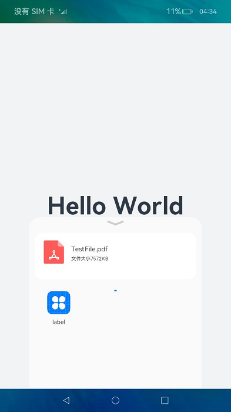

# 使用隐式Want打开网址

以打开浏览器为例，假设设备上安装了一个或多个浏览器应用。为了使浏览器应用能够正常工作，需要在[module.json5配置文件](../quick-start/module-configuration-file.md)进行配置，具体配置如下：

```json
{
  "module": {
    // ...
    "abilities": [
      {
        // ...
        "skills": [
          {
            "entities": [
              "entity.system.home",
              "entity.system.browsable"
              // ...
            ],
            "actions": [
              "action.system.home",
              "ohos.want.action.viewData"
              // ...
            ],
            "uris": [
              {
                "scheme": "https",
                "host": "www.test.com",
                "port": "8080",
                // prefix matching
                "pathStartWith": "query",
                "type": "text/*"
              },
              {
                "scheme": "http",
                // ...
              }
              // ...
            ]
          }
        ]
      }
    ]
  }
}
```

在调用方UIAbility中，使用隐式Want方式启动浏览器应用。

```ts
import common from '@ohos.app.ability.common';

function implicitStartAbility() {
  let context = getContext(this) as common.UIAbilityContext;
  let wantInfo = {
    // uncomment line below if wish to implicitly query only in the specific bundle.
    // bundleName: "com.example.myapplication",
    "action": "ohos.want.action.viewData",
    // entities can be omitted.
    "entities": ["entity.system.browsable"],
    "uri": "https://www.test.com:8080/query/student",
    "type": "text/plain"
  }
  context.startAbility(wantInfo).then(() => {
    // ...
  }).catch((err) => {
    // ...
  })
}
```

匹配过程分析：

1. 调用方传入的want参数的action不为空，待匹配Ability的skills配置中的actions不为空且包含调用方传入的want参数的action，action匹配成功。
2. 调用方传入的want参数的entities不为空，待匹配Ability的skills配置中的entities不为空且包含调用方传入的want参数的entities，entities匹配成功。
3. 待匹配Ability的skills配置中内uris拼接为`https://www.test.com:8080/query*` （其中*表示通配符），包含调用方传入的want参数的uri，uri匹配成功。
4. 调用方传入的want参数的type不为空，待匹配Ability的skills配置中的type不为空且包含调用方传入的want参数的type，type匹配成功。

当有多个匹配应用时，会被应用选择器展示给用户进行选择。 示意效果如下图所示。  

