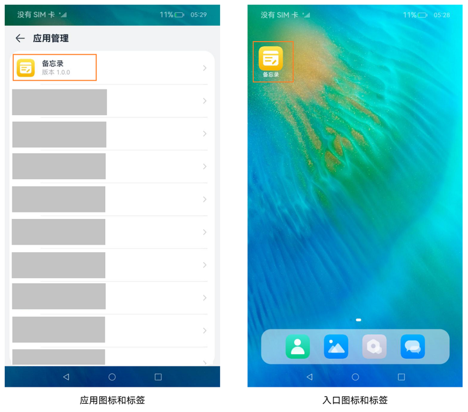
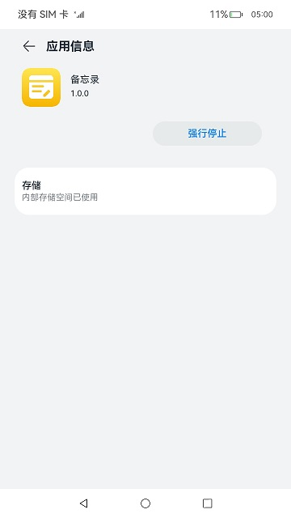

# 应用/组件级配置

在开发应用时，需要配置应用的一些标签，例如应用的包名、图标等标识特征的属性。本文描述了在开发应用需要配置的一些关键标签。

图标和标签通常一起配置，可以分为应用图标、应用标签和入口图标、入口标签，分别对应[app.json5配置文件](../quick-start/app-configuration-file.md)和[module.json5配置文件](../quick-start/module-configuration-file.md)中的icon和label标签。

应用图标和标签是在设置应用中使用，例如设置应用中的应用列表。入口图标是应用安装完成后在设备桌面上显示出来的，如下图所示。入口图标是以[UIAbility](uiability-overview.md)为粒度，支持同一个应用存在多个入口图标和入口标签，点击后进入对应的UIAbility界面。

**图1** 应用图标和标签    



- **应用包名配置**
  
  应用需要在工程的AppScope目录下的[app.json5配置文件](../quick-start/app-configuration-file.md)中配置bundleName标签，该标签用于标识应用的唯一性。推荐采用反域名形式命名（如com.example.demo，建议第一级为域名后缀com，第二级为厂商/个人名，第三级为应用名，也可以多级）。
  
- **应用图标和标签配置**

  Stage模型的应用需要配置应用图标和应用标签。应用图标和标签是在设置应用中使用，例如设置应用中的应用列表，会显示出对应的图标和标签。

  应用图标需要在工程的AppScope目录下的[app.json5配置文件](../quick-start/app-configuration-file.md)中配置icon标签。应用图标需配置为图片的资源索引，配置完成后，该图片即为应用的图标。

  应用标签需要在工程的AppScope模块下的[app.json5配置文件](../quick-start/app-configuration-file.md)中配置label标签。标识应用对用户显示的名称，需要配置为字符串资源的索引。

  ```json
  {
    "app": {
      "icon": "$media:app_icon",
      "label": "$string:app_name"
      ...
    }
  }
  ```

- **入口图标和标签配置**
  
    Stage模型支持对组件配置入口图标和入口标签。入口图标和入口标签会显示在桌面上。

    入口图标需要在[module.json5配置文件](../quick-start/module-configuration-file.md)中配置，在abilities标签下面有icon标签。例如希望在桌面上显示该UIAbility的图标，则需要在skills标签下面的entities中添加"entity.system.home"、actions中添加"ohos.want.action.home"。同一个应用有多个UIAbility配置上述字段时，桌面上会显示出多个图标，分别对应各自的UIAbility。
  
  ```json
  {
    "module": {
      ...
      "abilities": [
        {
          // $开头的为资源值
          "icon": "$media:icon",
          "label": "$string:EntryAbility_label",
          "skills": [
            {
              "entities": [
                "entity.system.home"
              ],
              "actions": [
                "ohos.want.action.home"
              ]
            }
          ],
        }
      ]
    }
  }
  ```
  OpenHarmony系统对无图标应用严格管控，防止一些恶意应用故意配置无入口图标，导致用户找不到软件所在的位置，无法操作卸载应用，在一定程度上保证用户的手机安全。

  如果应用确需隐藏入口图标，需要配置AllowAppDesktopIconHide应用特权，具体配置方式参考[应用特权配置指南](../../device-dev/subsystems/subsys-app-privilege-config-guide.md)。详细的入口图标及入口标签的显示规则如下。

  * HAP中包含UIAbility
    * 配置文件（module.json5）中abilities配置中设置了入口图标
      * 该应用没有隐藏图标的特权
        * 系统将使用该UIAbility配置的icon作为入口图标，并显示在桌面上。用户点击该图标，页面跳转到该UIAbility首页。
        * 系统将使用该UIAbility配置的label作为入口标签，并显示在桌面上（如果没有配置label，返回包名）。
      * 该应用具有隐藏图标的特权
        * 桌面查询时不返回应用信息，不会在桌面上显示对应的入口图标和标签。
    * 配置文件（module.json5）中abilities配置中未设置入口图标
      * 该应用没有隐藏图标的特权
        * 系统将使用app.json5中的icon作为入口图标，并显示在桌面上（app.json5中icon为必填项）。用户点击该图标，页面跳转到应用管理中对应的应用详情页面（参考下图）。
        * 系统将使用app.json5中的label作为入口标签，并显示在桌面上（app.json5中label为必填项）。
      * 该应用具有隐藏图标的特权
        * 桌面查询时不返回应用信息，不会在桌面上显示对应的入口图标和标签。
  * HAP中不包含UIAbility
    * 该应用没有隐藏图标的特权
      * 系统将使用app.json5中的icon作为入口图标，并显示在桌面上（app.json5中icon为必填项）。用户点击该图标，页面跳转到应用管理中对应的应用详情页面（参考下图）。
      * 系统将使用app.json5中的label作为入口标签，并显示在桌面上（app.json5中label为必填项）。
    * 该应用具有隐藏图标的特权
      * 桌面查询时不返回应用信息，不会在桌面上显示对应的入口图标和标签。<br><br>

  **图2** 应用的详情页示意图  
  
 
- **应用版本声明配置**
  
  应用版本声明需要在工程的AppScope目录下的[app.json5配置文件](../quick-start/app-configuration-file.md)中配置versionCode标签和versionName标签。versionCode用于标识应用的版本号，该标签值为32位非负整数。此数字仅用于确定某个版本是否比另一个版本更新，数值越大表示版本越高。versionName标签标识版本号的文字描述。
  
- **Module支持的设备类型配置**

  Module支持的设备类型需要在[module.json5配置文件](../quick-start/module-configuration-file.md)中配置deviceTypes标签，如果deviceTypes标签中添加了某种设备，则表明当前的Module支持在该设备上运行。

- **Module权限配置**

  Module访问系统或其他应用受保护部分所需的权限信息需要在[module.json5配置文件](../quick-start/module-configuration-file.md)中配置requestPermission标签。该标签用于声明需要申请权限的名称、申请权限的原因以及权限使用的场景。
