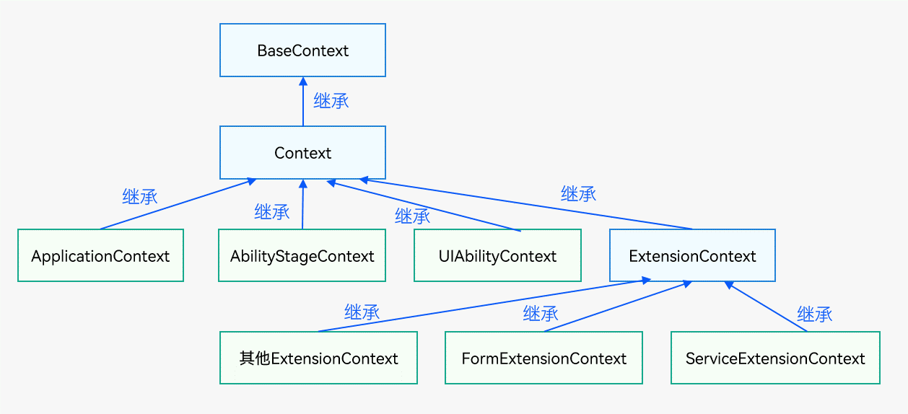
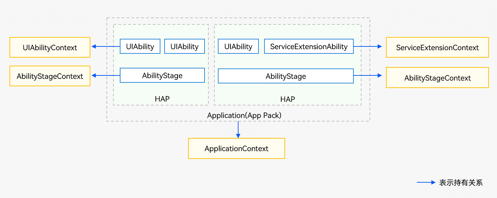
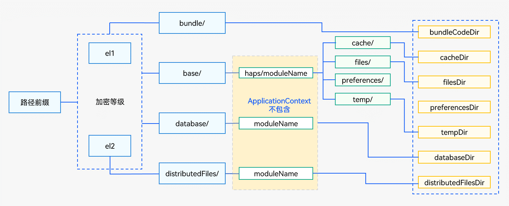
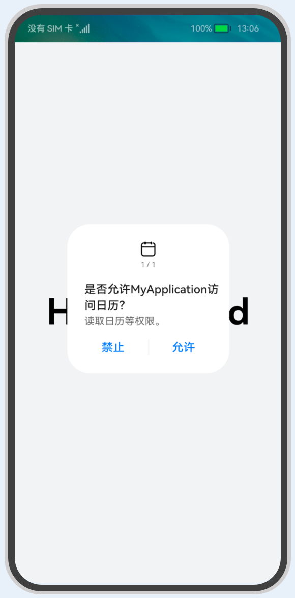

# 应用上下文Context


## 概述

[Context](../reference/apis/js-apis-inner-application-context.md)是应用中对象的上下文，其提供了应用的一些基础信息，例如resourceManager（资源管理）、applicationInfo（当前应用信息）、dir（应用开发路径）、area（文件分区）等，以及应用的一些基本方法，例如createBundleContext()、getApplicationContext()等。UIAbility组件和各种ExtensionAbility派生类组件都有各自不同的Context类。分别有基类Context、ApplicationContext、AbilityStageContext、UIAbilityContext、ExtensionContext、ServiceExtensionContext等Context。

- 各类Context的继承关系

  

- 各类Context的持有关系

  

- 各类Context的获取方式
  - 获取[UIAbilityContext](../reference/apis/js-apis-inner-application-uiAbilityContext.md)。每个UIAbility中都包含了一个Context属性，提供操作Ability、获取Ability的配置信息、应用向用户申请授权等能力。
    
     ```ts
     import UIAbility from '@ohos.app.ability.UIAbility';
     export default class EntryAbility extends UIAbility {
         onCreate(want, launchParam) {
             let uiAbilityContext = this.context;
             // ...
         }
     }
     ```
  - 获取特定场景[ExtensionContext](../reference/apis/js-apis-inner-application-extensionContext.md)。以ServiceExtensionContext为例，表示后台服务的上下文环境，继承自ExtensionContext，提供后台服务相关的接口能力。
    
     ```ts
     import ServiceExtensionAbility from '@ohos.app.ability.ServiceExtensionAbility';
     export default class MyService extends ServiceExtensionAbility {
         onCreate(want) {
             let serviceExtensionContext = this.context;
             // ...
         }
     }
     ```
  - 获取[AbilityStageContext](../reference/apis/js-apis-inner-application-abilityStageContext.md)。Module级别的Context，和基类Context相比，额外提供HapModuleInfo、Configuration等信息。
    
     ```ts
     import AbilityStage from "@ohos.app.ability.AbilityStage";
     export default class MyAbilityStage extends AbilityStage {
         onCreate() {
             let abilityStageContext = this.context;
             // ...
         }
     }
     ```
  - 获取[ApplicationContext](../reference/apis/js-apis-inner-application-applicationContext.md)。应用级别的Context。ApplicationContext在基类Context的基础上提供了订阅应用内Ability的生命周期的变化、订阅系统内存变化和订阅应用内系统环境的变化的能力，在UIAbility、ExtensionAbility、AbilityStage中均可以获取。
    
     ```ts
     import UIAbility from '@ohos.app.ability.UIAbility';
     export default class EntryAbility extends UIAbility {
         onCreate(want, launchParam) {
             let applicationContext = this.context.getApplicationContext();
             // ...
         }
     }
     ```


## Context的典型使用场景


本章节通过如下典型场景来介绍Context的用法：


- [获取应用开发路径](#获取应用开发路径)

- [获取和修改加密分区](#获取和修改加密分区)

- [创建其他应用或其他Module的Context](#创建其他应用或其他module的context)

- [订阅进程内Ability生命周期变化](#订阅进程内ability生命周期变化)

- [通过AbilityContext向用户申请授权](#通过uiabilitycontext向用户申请授权)


### 获取应用开发路径

从Context中获取的应用开发路径如下表所示。

  **表1** 应用开发路径说明

| 属性名称 | 参数类型 | 可读 | 可写 | 说明 |
| -------- | -------- | -------- | -------- | -------- |
| cacheDir | string | 是 | 否 | 应用在内部存储上的缓存路径。<br/>对应于"设置&nbsp;&gt;&nbsp;应用管理"，找到对应应用的"存储"中的缓存内容。 |
| tempDir | string | 是 | 否 | 应用的临时文件路径。<br/>在应用卸载后，系统会删除存储在此目录中的文件。 |
| filesDir | string | 是 | 否 | 应用在内部存储上的文件路径。<br/>本目录下存放的文件可能会被应用迁移或者备份的时候同步到其他目录中。 |
| databaseDir | string | 是 | 否 | 获取本地数据库存储路径。 |
| bundleCodeDir | string | 是 | 否 | 应用在内部存储上的安装路径。不能拼接路径访问资源文件，请使用[资源管理接口](../reference/apis/js-apis-resource-manager.md)访问资源。 |
| distributedFilesDir | string | 是 | 否 | 应用的分布式文件路径。 |
| preferencesDir | string | 是 | 是 | 指示应用程序首选项目录。 |

获取路径的能力是基类Context中提供的能力，因此在ApplicationContext、AbilityStageContext、UIAbilityContext和ExtensionContext中均可以获取，在各类Context中获取到的路径会有一些差别，具体差别如下图所示。

  **图1** Context中获取的应用开发路径

    

- 通过ApplicationContext获取的应用级别路径。应用全局信息建议存放的路径，存放在此路径的文件内容仅在应用卸载时会被删除。
    | 属性 | 路径 |
  | -------- | -------- |
  | bundleCodeDir | {路径前缀}/el1/bundle/ |
  | cacheDir | {路径前缀}/{加密等级}/base/cache/ |
  | filesDir | {路径前缀}/{加密等级}/base/files/ |
  | preferencesDir | {路径前缀}/{加密等级}/base/preferences/ |
  | tempDir | {路径前缀}/{加密等级}/base/temp/ |
  | databaseDir | {路径前缀}/{加密等级}/database/ |
  | distributedFilesDir | {路径前缀}/el2/distributedFiles/ |

- 通过AbilityStageContext、UIAbilityContext、ExtensionContext获取的HAP级别路径。HAP对应的信息建议存放的路径，存放在此路径的文件内容会跟随HAP的卸载而删除，不会影响应用级别路径的文件内容，除非该应用的HAP已全部卸载。
    | 属性 | 路径 |
  | -------- | -------- |
  | bundleCodeDir | {路径前缀}/el1/bundle/ |
  | cacheDir | {路径前缀}/{加密等级}/base/**haps/{moduleName}/**cache/ |
  | filesDir | {路径前缀}/{加密等级}/base/**haps/{moduleName}/**files/ |
  | preferencesDir | {路径前缀}/{加密等级}/base/**haps/{moduleName}/**preferences/ |
  | tempDir | {路径前缀}/{加密等级}/base/**haps/{moduleName}/**temp/ |
  | databaseDir | {路径前缀}/{加密等级}/database/**{moduleName}/** |
  | distributedFilesDir | {路径前缀}/el2/distributedFiles/**{moduleName}/** |

获取应用开发路径的示例代码如下所示。


```ts
import UIAbility from '@ohos.app.ability.UIAbility';

export default class EntryAbility extends UIAbility {
    onCreate(want, launchParam) {
        let cacheDir = this.context.cacheDir;
        let tempDir = this.context.tempDir;
        let filesDir = this.context.filesDir;
        let databaseDir = this.context.databaseDir;
        let bundleCodeDir = this.context.bundleCodeDir;
        let distributedFilesDir = this.context.distributedFilesDir;
        let preferencesDir = this.context.preferencesDir;
        // ...
    }
}
```


### 获取和修改加密分区

上一个场景中，引入了加密等级的概念，通过对[Context的area属性](../reference/apis/js-apis-inner-application-context.md)的读写来实现获取和设置当前加密分区，支持如下两种加密等级：

- AreaMode.EL1：设备级加密区，设备开机后可访问的数据区。

- AreaMode.EL2：用户级加密区，设备开机，首次输入密码后才能够访问的数据区。

```ts
import UIAbility from '@ohos.app.ability.UIAbility';

export default class EntryAbility extends UIAbility {
    onCreate(want, launchParam) {
        // 存储普通信息前，切换到EL1设备机加密
        if (this.context.area === 1) { // 获取area
            this.context.area = 0;     // 修改area
        }
        // 存储普通信息

        // 存储敏感信息前，切换到EL2用户级加密
        if (this.context.area === 0) { // 获取area
            this.context.area = 1;     // 修改area
        }
        // 存储敏感信息
    }
}
```


### 创建其他应用或其他Module的Context

基类Context提供创建其他应用或其他Module的Context的方法有[createBundleContext(bundleName:string)](../reference/apis/js-apis-inner-application-context.md#contextcreatebundlecontext)、[createModuleContext(moduleName:string)](../reference/apis/js-apis-inner-application-context.md#contextcreatemodulecontext)和[createModuleContext(bundleName:string, moduleName:string)](../reference/apis/js-apis-inner-application-context.md#contextcreatemodulecontext-1)接口，创建其他应用或者其他Module的Context，从而通过该Context获取相应的资源信息（例如获取其他Module的[获取应用开发路径](#获取应用开发路径)信息）。

- 调用createBundleContext(bundleName:string)方法，创建其他应用的Context信息。
  >  **说明：**
  > 当获取的是其他应用的Context时：
  > 
  > - 申请`ohos.permission.GET_BUNDLE_INFO_PRIVILEGED`权限，配置方式请参阅[访问控制授权申请指导](../security/accesstoken-guidelines.md#stage模型)。
  > 
  > - 接口为系统接口，三方应用不支持调用。

  例如在桌面上显示的应用信息，包括应用名称和应用图标等，桌面应用可以通过调用上述的方法获取相应应用的Context信息从而获取到相应的应用名称、图标等资源信息。
  
  ```ts
  import UIAbility from '@ohos.app.ability.UIAbility';
  
  export default class EntryAbility extends UIAbility {
      onCreate(want, launchParam) {
          let bundleName2 = "com.example.application";
          let context2 = this.context.createBundleContext(bundleName2);
          let label2 = context2.applicationInfo.label;
          // ...
      }
  }
  ```

- 调用createModuleContext(bundleName:string, moduleName:string)方法，获取指定应用指定Module的上下文信息。获取到指定应用指定Module的Context之后，即可获取到相应应用Module的资源信息。
  >  **说明：**
  > 当获取的是其他应用的指定Module的Context时：
  > 
  > - 申请`ohos.permission.GET_BUNDLE_INFO_PRIVILEGED`权限，配置方式请参阅[访问控制授权申请指导](../security/accesstoken-guidelines.md#stage模型)。
  > 
  > - 接口为系统接口，三方应用不支持调用。

  ```ts
  import UIAbility from '@ohos.app.ability.UIAbility';
  
  export default class EntryAbility extends UIAbility {
      onCreate(want, launchParam) {
          let bundleName2 = "com.example.application";
          let moduleName2 = "module1";
          let context2 = this.context.createModuleContext(bundleName2, moduleName2);
          // ...
      }
  }
  ```
  
- 调用createModuleContext(moduleName:string)方法，获取本应用中其他Module的Context。获取到其他Module的Context之后，即可获取到相应Module的资源信息。
  
  ```ts
  import UIAbility from '@ohos.app.ability.UIAbility';
  
  export default class EntryAbility extends UIAbility {
      onCreate(want, launchParam) {
          let moduleName2 = "module1";
          let context2 = this.context.createModuleContext(moduleName2);
          // ...
      }
  }
  ```


### 订阅进程内Ability生命周期变化

在应用内的DFX统计场景，如需要统计对应页面停留时间和访问频率等信息，可以使用订阅进程内Ability生命周期变化功能。

在进程内Ability生命周期变化时，如创建、可见/不可见、获焦/失焦、销毁等，会触发进入相应的回调，其中返回的此次注册监听生命周期的ID（每次注册该ID会自增+1，当超过监听上限数量2^63-1时，返回-1），以在[UIAbilityContext](../reference/apis/js-apis-inner-application-uiAbilityContext.md)中使用为例进行说明。


```ts
import UIAbility from '@ohos.app.ability.UIAbility';
import Window from '@ohos.window';

const TAG: string = "[Example].[Entry].[EntryAbility]";

export default class EntryAbility extends UIAbility {
    lifecycleId: number;

    onCreate(want, launchParam) {
        let abilityLifecycleCallback = {
            onAbilityCreate(ability) {
                console.info(TAG, "onAbilityCreate ability:" + JSON.stringify(ability));
            },
            onWindowStageCreate(ability, windowStage) {
                console.info(TAG, "onWindowStageCreate ability:" + JSON.stringify(ability));
                console.info(TAG, "onWindowStageCreate windowStage:" + JSON.stringify(windowStage));
            },
            onWindowStageActive(ability, windowStage) {
                console.info(TAG, "onWindowStageActive ability:" + JSON.stringify(ability));
                console.info(TAG, "onWindowStageActive windowStage:" + JSON.stringify(windowStage));
            },
            onWindowStageInactive(ability, windowStage) {
                console.info(TAG, "onWindowStageInactive ability:" + JSON.stringify(ability));
                console.info(TAG, "onWindowStageInactive windowStage:" + JSON.stringify(windowStage));
            },
            onWindowStageDestroy(ability, windowStage) {
                console.info(TAG, "onWindowStageDestroy ability:" + JSON.stringify(ability));
                console.info(TAG, "onWindowStageDestroy windowStage:" + JSON.stringify(windowStage));
            },
            onAbilityDestroy(ability) {
                console.info(TAG, "onAbilityDestroy ability:" + JSON.stringify(ability));
            },
            onAbilityForeground(ability) {
                console.info(TAG, "onAbilityForeground ability:" + JSON.stringify(ability));
            },
            onAbilityBackground(ability) {
                console.info(TAG, "onAbilityBackground ability:" + JSON.stringify(ability));
            },
            onAbilityContinue(ability) {
                console.info(TAG, "onAbilityContinue ability:" + JSON.stringify(ability));
            }
        }
        // 1. 通过context属性获取applicationContext
        let applicationContext = this.context.getApplicationContext();
        // 2. 通过applicationContext注册监听应用内生命周期
        this.lifecycleId = applicationContext.on("abilityLifecycle", abilityLifecycleCallback);
        console.info(TAG, "register callback number: " + JSON.stringify(this.lifecycleId));
    }

    onDestroy() {
        let applicationContext = this.context.getApplicationContext();
        applicationContext.off("abilityLifecycle", this.lifecycleId, (error, data) => {
            console.info(TAG, "unregister callback success, err: " + JSON.stringify(error));
        });
    }
}
```


### 通过UIAbilityContext向用户申请授权

每个Ability中都包含了一个Context属性。Ability功能主要是处理生命周期，其余操作Ability的方法（例如startAbility()、connectServiceExtensionAbility()、terminateSelf()等）都是在对应的Context中实现的，同时Context也提供了获取Ability的配置信息、向用户申请授权等能力，如何获取Context请参见[获取UIAbility的上下文信息](uiability-usage.md#获取uiability的上下文信息)。


应用需要获取用户的隐私信息或使用系统能力时，例如获取位置信息、访问日历、使用相机拍摄照片或录制视频等，需要向用户申请授权，示意效果如下图所示。具体使用请参见[访问控制授权申请指导](../security/accesstoken-guidelines.md)。

  **图2** 向用户申请日历访问授权

  