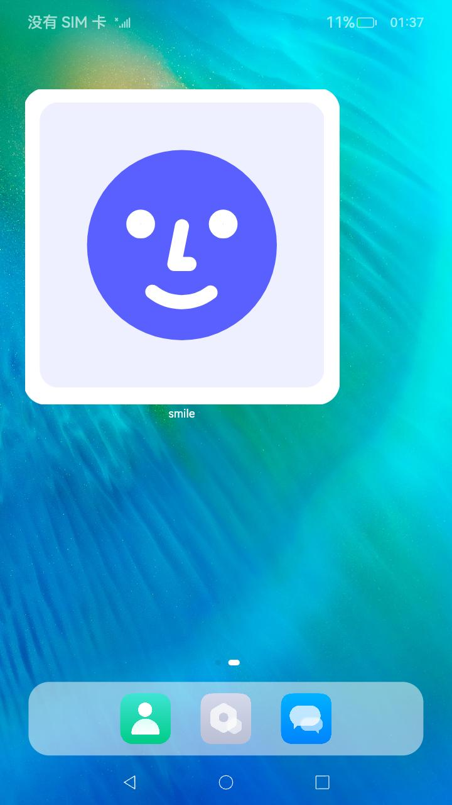

# 卡片使用自定义绘制能力


  ArkTS卡片开放了自定义绘制的能力，在卡片上可以通过[Canvas](../reference/arkui-ts/ts-components-canvas-canvas.md)组件创建一块画布，然后通过[CanvasRenderingContext2D](../reference/arkui-ts/ts-canvasrenderingcontext2d.md)对象在画布上进行自定义图形的绘制，如下示例代码实现了在画布的中心绘制了一个笑脸。

```typescript
@Entry
@Component
struct Card {
  private canvasWidth: number = 0;
  private canvasHeight: number = 0;
  // 初始化CanvasRenderingContext2D和RenderingContextSettings
  private settings: RenderingContextSettings = new RenderingContextSettings(true);
  private context: CanvasRenderingContext2D = new CanvasRenderingContext2D(this.settings);

  build() {
    Column() {
      Row() {
        Canvas(this.context)
          .margin('5%')
          .width('90%')
          .height('90%')
          .onReady(() => {
            console.info('[ArkTSCard] onReady for canvas draw content');
            // 在onReady回调中获取画布的实际宽和高
            this.canvasWidth = this.context.width;
            this.canvasHeight = this.context.height;
            // 绘制画布的背景
            this.context.fillStyle = 'rgba(203, 154, 126, 1.00)';
            this.context.fillRect(0, 0, this.canvasWidth, this.canvasHeight);
            // 在画布的中心绘制一个红色的圆
            this.context.beginPath();
            let radius = this.context.width / 3
            let circleX = this.context.width / 2
            let circleY = this.context.height / 2
            this.context.moveTo(circleX - radius, circleY);
            this.context.arc(circleX, circleY, radius, 2 * Math.PI, 0, true);
            this.context.closePath();
            this.context.fillStyle = 'red';
            this.context.fill();
            // 绘制笑脸的左眼
            let leftR = radius / 4
            let leftX = circleX - (radius / 2)
            let leftY = circleY - (radius / 3.5)
            this.context.beginPath();
            this.context.arc(leftX, leftY, leftR, 0, Math.PI, true);
            this.context.strokeStyle = '#ffff00'
            this.context.lineWidth = 10
            this.context.stroke()
            // 绘制笑脸的右眼
            let rightR = radius / 4
            let rightX = circleX + (radius / 2)
            let rightY = circleY - (radius / 3.5)
            this.context.beginPath();
            this.context.arc(rightX, rightY, rightR, 0, Math.PI, true);
            this.context.strokeStyle = '#ffff00'
            this.context.lineWidth = 10
            this.context.stroke()
            // 绘制笑脸的嘴巴
            let mouthR = radius / 2.5
            let mouthX = circleX
            let mouthY = circleY + (radius / 3)
            this.context.beginPath();
            this.context.arc(mouthX, mouthY, mouthR, Math.PI, 0, true);
            this.context.strokeStyle = '#ffff00'
            this.context.lineWidth = 10
            this.context.stroke()
          })
      }
    }.height('100%').width('100%')
  }
}
```


运行效果如下图所示。



