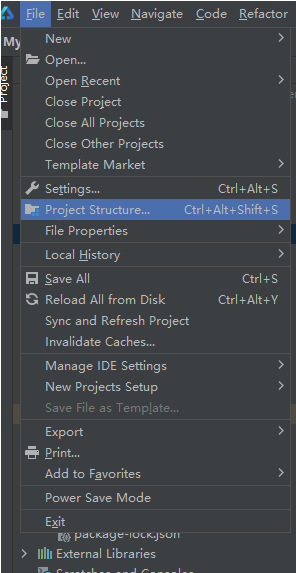
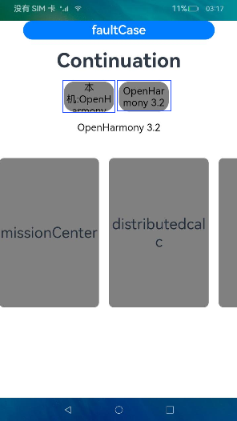
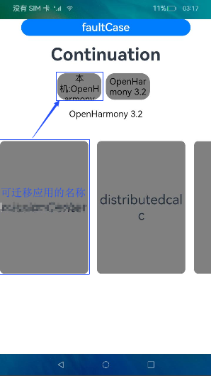

# 跨端迁移

## 功能描述

跨端迁移的主要工作是实现将应用当前任务（包括页面控件状态变量等）迁移到目标设备，能在目标设备上接续。主要功能包括：

- 支持用户自定义数据存储及恢复。
- 支持页面路由信息和页面控件状态数据的存储及恢复。
- 支持应用兼容性检测。
- 支持应用根据实际使用场景动态设置迁移状态（默认迁移状态为 **ACTIVE** 激活状态）。如编辑类应用在编辑文本的页面下才需要迁移，其他页面不需要迁移，则可以通过[setMissionContinueState](../reference/apis/js-apis-inner-application-uiAbilityContext.md#uiabilitycontextsetmissioncontinuestate10)进行控制。
- 支持应用动态选择是否进行页面栈恢复（默认进行页面栈信息恢复）。如应用希望自定义迁移到其他设备后显示的页面，则可以通过[SUPPORT_CONTINUE_PAGE_STACK_KEY](../reference/apis/js-apis-app-ability-wantConstant.md#wantconstantparams)进行控制。
- 支持应用动态选择迁移成功后是否退出迁移发起端应用（默认迁移成功后退出迁移发起端应用）。则可以通过[SUPPORT_CONTINUE_SOURCE_EXIT_KEY](../reference/apis/js-apis-app-ability-wantConstant.md#wantconstantparams)进行控制。


## 跨端迁移流程

跨端迁移流程如下图所示。

**图1** 跨端迁移流程图


## 约束限制

- 应用迁移的发起依赖系统应用控制，系统应用开发者可以参考[验证指导中的demo示例](#验证指导)实现相关的控制能力。
- 跨端迁移要求在同UIAbility之间进行，也就是需要相同的bundleName、abilityName和签名。
- 为了获得最佳体验，使用wantParam传输的数据建议在100KB以下。


## 接口说明

跨端迁移主要接口如下。详细接口介绍请参见[API参考](../reference/apis/js-apis-app-ability-uiAbility.md)。

  **表1** 跨端迁移接口

| **接口名** | **描述** |
| -------- | -------- |
| onContinue(wantParam&nbsp;:&nbsp;{[key:&nbsp;string]:&nbsp;Object}):&nbsp;OnContinueResult | 迁移发起端在该回调中保存迁移所需要的数据，同时返回是否同意迁移：<br/>-&nbsp;AGREE：表示同意。<br/>-&nbsp;REJECT：表示拒绝：如应用在onContinue中异常会导致钱以后数据恢复时显示异常，则可以建议REJECT。<br/>-&nbsp;MISMATCH：表示版本不匹配：迁移发起端应用可以在onContinue中获取到迁移目标端应用的版本号，进行协商后，如果版本不匹配导致无法迁移，可以返回该错误。 |
| onCreate(want:&nbsp;Want,&nbsp;launchParam:&nbsp;AbilityConstant.LaunchParam):&nbsp;void; | 应用迁移目标端为冷启动或多实例应用热启动时，在该回调中完成数据恢复，并触发页面恢复。详见[应用组件启动模式](uiability-launch-type.md) |
| onNewWant(want:&nbsp;Want,&nbsp;launchParam:&nbsp;AbilityConstant.LaunchParam):&nbsp;void; | 迁移目标端为单实例应用热启动时，在该回调中完成数据恢复，并触发页面恢复。详见[应用组件启动模式](uiability-launch-type.md) |


## 开发步骤

1.需要申请`ohos.permission.DISTRIBUTED_DATASYNC`权限

配置方式请参见[配置文件权限声明](../security/accesstoken-guidelines.md#配置文件权限声明)。

2.同时需要在应用首次启动时弹窗向用户申请授权

使用方式请参见[向用户申请授权](../security/accesstoken-guidelines.md#向用户申请授权)。

3.在配置文件中配置跨端迁移相关标签字段。

配置应用支持迁移
在module.json5中配置continuable标签：true表示支持迁移，false表示不支持，默认为false。配置为false的UIAbility将被系统识别为无法迁移。


   ```json
   {
     "module": {
       ...
       "abilities": [
         {
           ...
           "continuable": true,
         }
       ]
     }
   }
   ```

   根据需要配置应用启动模式类型，配置详情请参照[UIAbility组件启动模式](uiability-launch-type.md)。

4.在发起端UIAbility中实现[onContinue](../reference/apis/js-apis-app-ability-uiAbility.md#abilityoncontinue)接口。

当应用触发迁移时，[onContinue](../reference/apis/js-apis-app-ability-uiAbility.md#abilityoncontinue)接口在发起端被调用，开发者可以在该接口中保存迁移数据，实现应用兼容性检测，决定是否支持此次迁移。

- 保存迁移数据：开发者可以将要迁移的数据通过键值对的方式保存在wantParam中。

- 应用兼容性检测：开发者可以通过从wantParam中获取目标应用的版本号与本应用版本号做兼容性校验。开发者可以在触发迁移时从`onContinue`接口中`wantParam.version`获取到迁移目标端应用的版本号与迁移发起端应用版本号做兼容校验。

- 迁移决策：开发者可以通过onContinue接口的返回值决定是否支持此次迁移，返回值信息见[接口说明](#接口说明)。

  示例如下：
  
```ts
import UIAbility from '@ohos.app.ability.UIAbility';
import AbilityConstant from '@ohos.app.ability.AbilityConstant';

onContinue(wantParam : {[key: string]: Object}) {
    console.info(`onContinue version = ${wantParam.version}, targetDevice: ${wantParam.targetDevice}`)           //准备迁移数据
    let continueInput = '迁移的数据';
    // 将要迁移的数据保存在wantParam的自定义字段（如：data）中;
    wantParam["data"] = continueInput       
    console.info(`onContinue input = ${wantParam["input"]}`);
    return AbilityConstant.OnContinueResult.AGREE
}
```

5.在Stage模型中，应用在不同启动模式下将调用不同的接口，以恢复数据、加载界面。

不同情况下的函数调用如下图所示：


在目标端设备UIAbility中实现onCreate与onNewWant接口，恢复迁移数据。

- onCreate实现示例
   - 目标端设备上，在onCreate中根据launchReason判断该次启动是否为迁移LaunchReason.CONTINUATION。
   - 开发者可以从want中获取保存的迁移数据。
   - 完成数据恢复后，开发者需要调用restoreWindowStage来触发页面恢复：包括页面栈信息。
     
      ```ts
      import UIAbility from '@ohos.app.ability.UIAbility'; 
      import AbilityConstant from '@ohos.app.ability.AbilityConstant';  
      
      export default class EntryAbility extends UIAbility {     
          storage : LocalStorage;     
          onCreate(want, launchParam) {         
              console.info(`EntryAbility onCreate ${AbilityConstant.LaunchReason.CONTINUATION}`)         
              if (launchParam.launchReason == AbilityConstant.LaunchReason.CONTINUATION) {             
                  // 将上述的保存的数据取出恢复             
                  let continueInput = want.parameters.data             
                  console.info(`continue input ${continueInput}`) 
                  // 将数据显示当前页面
                  this.storage = new LocalStorage();             
                  this.context.restoreWindowStage(this.storage);         
              }     
          } 
      }
      ```
- 如果是单实例应用，需要额外实现onNewWant接口，实现方式与onCreate的实现相同。
   - 在onNewWant中判断迁移场景，恢复数据，并触发页面恢复

      ```ts  
      export default class EntryAbility extends UIAbility {     
          storage : LocalStorage;     
          onNewWant(want, launchParam) {         
              console.info(`EntryAbility onNewWant ${AbilityConstant.LaunchReason.CONTINUATION}`)         
              if (launchParam.launchReason == AbilityConstant.LaunchReason.CONTINUATION) {             
                  // get user data from want params             
                  let continueInput = want.parameters.data             
                  console.info(`continue input ${continueInput}`)          
                  this.storage = new LocalStorage();             
                  this.context.restoreWindowStage(this.storage);         
              }     
          } 
      }
      ```


## 迁移功能可选配置

### 1.动态配置迁移能力

从API 10 起，提供了支持动态配置迁移能力的功能。即应用可以根据实际使用场景，在需要迁移功能时，设置开启应用迁移能力；在业务不需要迁移时，则可以关闭迁移能力。开发者可以通过调用[setMissionContinueState](../reference/apis/js-apis-inner-application-uiAbilityContext.md#uiabilitycontextsetmissioncontinuestate10)接口对迁移能力进行设置。默认状态下，可迁移应用的迁移能力为**ACTIVE**状态，即迁移能力开启，可以迁移。

| 接口状态值                             | 含义                   |
| :------------------------------------- | ---------------------- |
| AbilityConstant.ContinueState.ACTIVE   | 应用当前可迁移能力开启 |
| AbilityConstant.ContinueState.INACTIVE | 应用当前可迁移能力关闭 |

**设置迁移能力的时机**

迁移能力的改变可以根据实际业务需求和代码实现，发生在应用生命周期的绝大多数时机。本文介绍常用的几种配置方式。

在ability的onCreate函数中调用接口，可以在应用创建时设置应用的迁移状态。

```ts
// EntryAbility.ets
onCreate(want, launchParam) {
  ...
  this.context.setMissionContinueState(AbilityConstant.ContinueState.ACTIVE, (result) => {
    console.info('setMissionContinueState ACTIVE result: ', JSON.stringify(result));
  };
  ...
}
```

在页面的onPageShow函数中调用接口，可以设置单个页面出现时应用的迁移状态。

```ts
// PageName.ets
struct PageName {
  Build() {
    ...
  }
  ...
  onPageShow(){
  // 进入该页面时，将应用设置为可迁移状态
    this.context.setMissionContinueState(AbilityConstant.ContinueState.ACTIVE, (result) => {
      console.info('setMissionContinueState ACTIVE result: ', JSON.stringify(result));
    };
  }
}
```

在某个组件的触发事件中设置应用迁移能力。如下例中，使用 **Button** 组件的 **onClick** 事件，触发迁移能力的改变。

```ts
// xxx.ets
Button(){
  ...
}
.onClick(()=>{
  //点击该按钮时，将应用设置为可迁移状态
  this.context.setMissionContinueState(AbilityConstant.ContinueState.ACTIVE, (result) => {
    console.info('setMissionContinueState ACTIVE result: ', JSON.stringify(result));
  };
})
```

**保证迁移连续性**

由于迁移加载时，目标端拉起的应用可能执行过自己的迁移状态设置命令（如：冷启动时目标端在onCreate中设置了 **INACTIVE** ；热启动时对端已打开了不可迁移的页面，迁移状态为 **INACTIVE** 等情况）。为了保证迁移过后的应用依然具有可以迁移回发起端的能力，应在 onCreate和onNewWant的迁移调用判断中，将迁移状态设置为 **ACTIVE** 。

```ts
// EntryAbility.ets
onCreate(want, launchparam) {
  ...
  // 调用原因为迁移时，设置状态为可迁移，应对冷启动情况
  if (launchParam.launchReason == AbilityConstant.LaunchReason.CONTINUATION) {
    this.context.setMissionContinueState(AbilityConstant.ContinueState.ACTIVE, (result) => {
      console.info('setMissionContinueState ACTIVE result: ', JSON.stringify(result));
    };
  }
}

onNewWant(want, launchparam) {
  ...
  // 调用原因为迁移时，设置状态为可迁移，应对热启动情况
  if (launchParam.launchReason == AbilityConstant.LaunchReason.CONTINUATION) {
    this.context.setMissionContinueState(AbilityConstant.ContinueState.ACTIVE, (result) => {
      console.info('setMissionContinueState ACTIVE result: ', JSON.stringify(result));
    };
  }
}
```


### 2.按需迁移页面栈

支持应用动态选择是否进行页面栈恢复（默认进行页面栈信息恢复）。如果应用不想使用系统默认恢复的页面栈，则可以设置不进行页面栈迁移，而需要在`onWindowStageRestore`设置迁移后进入的页面，参数定义见[SUPPORT_CONTINUE_PAGE_STACK_KEY](../reference/apis/js-apis-app-ability-wantConstant.md#wantconstantparams)。

应用在发起端的页面栈中存在Index和Second路由，而在目标端恢复时不需要按照发起端页面栈进行恢复，需要恢复到指定页面。

- 示例：应用迁移不需要自动迁移页面栈信息

    ```ts
    import UIAbility from '@ohos.app.ability.UIAbility';
    import wantConstant from '@ohos.app.ability.wantConstant';
    
    onContinue(wantParam :  {[key: string]: Object}) {
        console.info(`onContinue version = ${wantParam.version}, targetDevice: ${wantParam.targetDevice}`)         
        wantParam[wantConstant.Params.SUPPORT_CONTINUE_PAGE_STACK_KEY] = false;
        return AbilityConstant.OnContinueResult.AGREE;
    }
    
    onWindowStageRestore(windowStage) {
        // 若不需要自动迁移页面栈信息，则需要在此处设置应用迁移后进入的页面
        windowStage.setUIContent(this.contex, "pages/index", null);
    }
    ```

### 3.按需退出

支持应用动态选择迁移成功后是否退出迁移发起端应用（默认迁移成功后退出迁移发起端应用）。如果应用不想让系统自动退出迁移发起端应用，则可以设置不退出，参数定义见[SUPPORT_CONTINUE_SOURCE_EXIT_KEY](../reference/apis/js-apis-app-ability-wantConstant.md#wantconstantparams)。

- 示例：应用迁移设置不需要迁移成功后退出迁移发起端应用

    ```ts
    import UIAbility from '@ohos.app.ability.UIAbility';
    import wantConstant from '@ohos.app.ability.wantConstant';
    
    onContinue(wantParam :  {[key: string]: Object}) {
        console.info(`onContinue version = ${wantParam.version}, targetDevice: ${wantParam.targetDevice}`)         
        wantParam[wantConstant.Params.SUPPORT_CONTINUE_SOURCE_EXIT_KEY] = false;
        return AbilityConstant.OnContinueResult.AGREE;
    }
    ```

## 验证指导

为方便开发者验证已开发的可迁移应用，当前OpenHarmony提供了一个全局任务中心demo作为迁移的入口。下面介绍通过安装全局任务中心来验证迁移的方式。

### 1. 编译安装全局任务中心

#### **配置环境**

public-SDK不支持开发者使用所有的系统API，例如：全局任务中心使用的[**@ohos.distributedDeviceManager**](https://gitee.com/openharmony/docs/blob/master/zh-cn/application-dev/reference/apis/js-apis-distributedDeviceManager.md)不包括在public_SDK中。因此为了正确编译安装全局任务中心，开发者需要替换full-SDK，具体操作可参见[替换指南](https://gitee.com/openharmony/docs/blob/master/zh-cn/application-dev/faqs/full-sdk-switch-guide.md)。

**说明**：本文中的截图仅为参考，具体的显示界面请以实际使用的DevEco Studio和SDK的版本为准。

#### **下载MissionCenter_Demo[示例代码](https://gitee.com/openharmony/ability_dmsfwk/tree/master/services/dtbschedmgr/test/missionCenterDemo/dmsDemo/entry/src/main)**

#### **编译工程文件**

**新建OpenHarmony 空的工程，找到对应的文件夹替换下载文件**



**自动签名，编译安装。**

​		DevEco的自动签名模板默认签名权限为normal级。而本应用设计到ohos.permission.MANAGE_MISSIONS权限为system_core级别。自动生成的签名无法获得足够的权限，所以需要将权限升级为system_core级别，然后签名。

**系统权限设置**(以api10目录为例): 将Sdk目录下的openharmony\api版本(如：10)\toolchains\lib\UnsgnedReleasedProfileTemplate.json文件中的"apl":"normal_core"改为"apl":"system_core"。

①点击file->Project Structrue


②点击Signing Configs  点击OK



③连接开发板运行生成demo。

### 2.设备组网

①打开A，B两设备的计算器

②点击右上角箭头选择B设备

③在B设备选择信任设备，弹出PIN码

④在A设备输入PIN码

⑤已组网成功，验证方法：在A设备输入数字，B设备同步出现则证明组网成功

### 3.发起迁移

1.在B设备打开多设备协同权限的应用，A设备打开全局任务中心demo，A设备出现A设备名称(即：本机:OpenHarmony 3.2)和B设备名称(OpenHarmony 3.2)。


2.点击B设备名称，然后出现B设备的应用。



3.最后将应用拖拽到A设备名称处，A设备应用被拉起，B设备应用退出。


