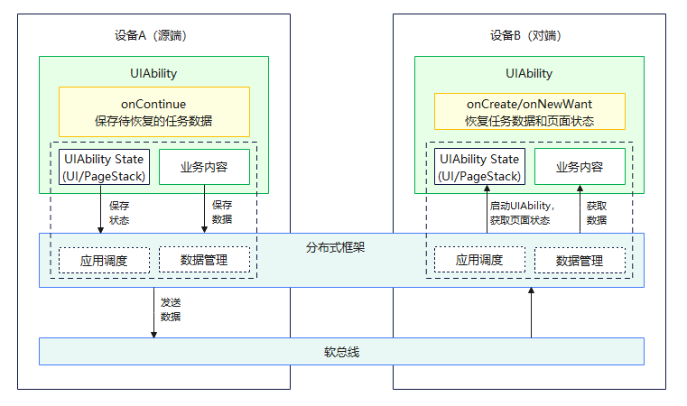

# 跨端迁移


## 功能描述

跨端迁移的主要工作是实现将应用当前任务（包括页面控件状态变量等）迁移到目标设备，能在目标设备上接续。主要功能包括：

- 支持用户自定义数据存储及恢复。

- 支持页面路由信息和页面控件状态数据的存储及恢复。

- 支持应用兼容性检测。

- 支持应用根据实际使用场景动态设置迁移状态（默认迁移状态为ACTIVE激活状态）。如编辑类应用在编辑文本的页面下才需要迁移，其他页面不需要迁移，则可以通过[setMissionContinueState](../reference/apis/js-apis-inner-application-uiAbilityContext.md#uiabilitycontextsetmissioncontinuestate10)进行控制。

- 支持应用动态选择是否进行页面栈恢复（默认进行页面栈信息恢复）。如应用希望自定义迁移到其他设备后显示的页面，则可以通过[SUPPORT_CONTINUE_PAGE_STACK_KEY](../reference/apis/js-apis-app-ability-wantConstant.md#wantconstantparams)进行控制。

- 支持应用动态选择流转成功后是否退出迁移发起端应用（默认流转成功后退出迁移发起端应用）。则可以通过[SUPPORT_CONTINUE_SOURCE_EXIT_KEY](../reference/apis/js-apis-app-ability-wantConstant.md#wantconstantparams)进行控制。


## 跨端迁移流程

跨端迁移流程如下图所示。

**图1** 跨端迁移流程图  



## 约束限制

- 由于“跨端迁移任务管理”能力尚未具备，开发者当前只能开发具备跨端迁移能力的应用，但不能发起迁移。

- 跨端迁移要求在同UIAbility之间进行，也就是需要相同的bundleName、abilityName和签名。


## 最佳实践

为了获得最佳体验，使用wantParam传输的数据建议在100KB以下。


## 接口说明

跨端迁移主要接口如下。详细接口介绍请参见[API参考](../reference/apis/js-apis-app-ability-uiAbility.md)。

  **表1** 跨端迁移接口

| **接口名** | **描述** |
| -------- | -------- |
| onContinue(wantParam&nbsp;:&nbsp;{[key:&nbsp;string]:&nbsp;any}):&nbsp;OnContinueResult | 迁移发起端在该回调中保存迁移所需要的数据，同时返回是否同意迁移：<br/>-&nbsp;AGREE：表示同意。<br/>-&nbsp;REJECT：表示拒绝：如应用在onContinue中异常可以直接REJECT。<br/>-&nbsp;MISMATCH：表示版本不匹配：迁移发起端应用可以在onContinue中获取到迁移接收端应用的版本号，进行协商后，如果版本不匹配导致无法迁移，可以返回该错误。 |
| onCreate(want:&nbsp;Want,&nbsp;param:&nbsp;AbilityConstant.LaunchParam):&nbsp;void; | 应用迁移接收端为冷启动或多实例应用热启动时，在该回调中完成数据恢复，并触发页面恢复。详见[应用组件启动模式](uiability-launch-type.md) |
| onNewWant(want:&nbsp;Want,&nbsp;launchParams:&nbsp;AbilityConstant.LaunchParam):&nbsp;void; | 迁移接收端为单实例应用热启动时，在该回调中完成数据恢复，并触发页面恢复。详见[应用组件启动模式](uiability-launch-type.md) |


## 开发步骤

1. 需要申请`ohos.permission.DISTRIBUTED_DATASYNC`权限，配置方式请参见[配置文件权限声明](../security/accesstoken-guidelines.md#配置文件权限声明)。

2. 同时需要在应用首次启动时弹窗向用户申请授权，使用方式请参见[向用户申请授权](../security/accesstoken-guidelines.md#向用户申请授权)。

3. 在配置文件中配置跨端迁移相关标签字段。

   配置应用支持迁移
   在module.json5中配置continuable标签：true表示支持迁移，false表示不支持，默认为false。配置为false的UIAbility将被系统识别为无法迁移。


   ```json
   {
     "module": {
       ...
       "abilities": [
         {
           ...
           "continuable": true,
         }
       ]
     }
   }
   ```

   根据需要配置应用启动模式类型，配置详情请参照[UIAbility组件启动模式](uiability-launch-type.md)。

4. 在发起端UIAbility中实现[onContinue()](../reference/apis/js-apis-app-ability-uiAbility.md#abilityoncontinue)接口。
   当应用触发迁移时，[onContinue()](../reference/apis/js-apis-app-ability-uiAbility.md#abilityoncontinue)接口在发起端被调用，开发者可以在该接口中保存迁移数据，实现应用兼容性检测，决定是否支持此次迁移。
   - 保存迁移数据：开发者可以将要迁移的数据通过键值对的方式保存在wantParam中。

   - 应用兼容性检测：开发者可以通过从wantParam中获取目标应用的版本号与本应用版本号做兼容性校验。开发者可以在触发迁移时从`onContinue`接口中`wantParam.version`获取到迁移接收端应用的版本号与迁移发起端应用版本号做兼容校验。

   - 迁移决策：开发者可以通过onContinue接口的返回值决定是否支持此次迁移，返回值信息见[接口说明](#接口说明)。

     示例如下：
     
   ```ts
   import UIAbility from '@ohos.app.ability.UIAbility';
   import AbilityConstant from '@ohos.app.ability.AbilityConstant';
   
   onContinue(wantParam : {[key: string]: any}) {         
       console.info(`onContinue version = ${wantParam.version}, targetDevice: ${wantParam.targetDevice}`)         
       let workInput = AppStorage.Get<string>('ContinueWork');         
       // set user input data into want params         
       wantParam["work"] = workInput // set user input data into want params         
       console.info(`onContinue input = ${wantParam["input"]}`);         
       return AbilityConstant.OnContinueResult.AGREE     
   }
   ```

5. 在目标端设备UIAbility中实现onCreate()与onNewWant()接口，恢复迁移数据。
   - onCreate实现示例
      - 目标端设备上，在onCreate中根据launchReason判断该次启动是否为迁移LaunchReason.CONTINUATION。
      - 开发者可以从want中获取保存的迁移数据。
      - 完成数据恢复后，开发者需要调用restoreWindowStage来触发页面恢复：包括页面栈信息。
        
         ```ts
         import UIAbility from '@ohos.app.ability.UIAbility'; 
         import AbilityConstant from '@ohos.app.ability.AbilityConstant';
         import distributedObject from '@ohos.data.distributedDataObject';  
         
         export default class EntryAbility extends UIAbility {     
             storage : LocalStorage;     
             onCreate(want, launchParam) {         
                 console.info(`EntryAbility onCreate ${AbilityConstant.LaunchReason.CONTINUATION}`)         
                 if (launchParam.launchReason == AbilityConstant.LaunchReason.CONTINUATION) {             
                     // get user data from want params             
                     let workInput = want.parameters.work             
                     console.info(`work input ${workInput}`)             
                     AppStorage.SetOrCreate<string>('ContinueWork', workInput)             
                     this.storage = new LocalStorage();             
                     this.context.restoreWindowStage(this.storage);         
                 }     
             } 
         }
         ```
   - 如果是单实例应用，需要额外实现onNewWant()接口，实现方式与onCreate()的实现相同。
      - 在onNewWant()中判断迁移场景，恢复数据，并触发页面恢复

         ```ts  
         export default class EntryAbility extends UIAbility {     
             storage : LocalStorage;     
             onNewWant(want, launchParam) {         
                 console.info(`EntryAbility onNewWant ${AbilityConstant.LaunchReason.CONTINUATION}`)         
                 if (launchParam.launchReason == AbilityConstant.LaunchReason.CONTINUATION) {             
                     // get user data from want params             
                     let workInput = want.parameters.work             
                     console.info(`work input ${workInput}`)             
                     AppStorage.SetOrCreate<string>('ContinueWork', workInput)             
                     this.storage = new LocalStorage();             
                     this.context.restoreWindowStage(this.storage);         
                 }     
             } 
         }

6. **可选配置：** 在应用支持迁移特性时，默认开启应用迁移状态开关，根据应用当前任务获取焦点/失去焦点通知周边的可信设备当前任务可流转/取消流转。若应用需要在特定场景下才通知周边设备可流转，则需要在应用打开时设置迁移状态为INACTIVE，在后续的业务流程中需要迁移时再设置迁移状态为ACTIVE。接口见[setMissionContinueState](../reference/apis/js-apis-inner-application-uiAbilityContext.md#uiabilitycontextsetmissioncontinuestate10)。

    - 示例：应用启动不需要流转

        ```ts
        import UIAbility from '@ohos.app.ability.UIAbility';
        import AbilityConstant from '@ohos.app.ability.AbilityConstant';

        onCreate(want, launchParam) {
          this.context.setMissionContinueState(AbilityConstant.ContinueState.INACTIVE, (result) => {
            console.info(`setMissionContinueState: ${JSON.stringify(result)}`);
          });
        }
        ```
    - 示例：应用在后续的业务流程中需要流转了

        ```ts
        import UIAbility from '@ohos.app.ability.UIAbility';
        import AbilityConstant from '@ohos.app.ability.AbilityConstant';

        this.context.setMissionContinueState(AbilityConstant.ContinueState.ACTIVE, (result) => {
          console.info(`setMissionContinueState: ${JSON.stringify(result)}`);
        });
        ```

7. **可选配置：** 支持应用动态选择是否进行页面栈恢复（默认进行页面栈信息恢复）。如果应用不想使用系统默认恢复的页面栈，则可以设置不进行页面栈迁移，而需要在`onWindowStageRestore`设置流转后进入的页面，参数定义见[SUPPORT_CONTINUE_PAGE_STACK_KEY](../reference/apis/js-apis-app-ability-wantConstant.md#wantconstantparams)。

    - 示例：应用迁移不需要自动流转页面栈信息

        ```ts
        import UIAbility from '@ohos.app.ability.UIAbility';
        import wantConstant from '@ohos.app.ability.wantConstant.d.ts';

        onContinue(wantParam : {[key: string]: any}) {         
            console.info(`onContinue version = ${wantParam.version}, targetDevice: ${wantParam.targetDevice}`)         
            wantParam[wantConstant.Params.SUPPORT_CONTINUE_PAGE_STACK_KEY] = false;
            return AbilityConstant.OnContinueResult.AGREE;
        }

        onWindowStageRestore(windowStage) {
            // 若不需要自动流转页面栈信息，则需要在此处设置应用流转后进入的页面
            windowStage.setUIContent(this.contex, "pages/index", null);
        }
        ```

8. **可选配置：** 支持应用动态选择迁移成功后是否退出迁移发起端应用（默认流转成功后退出迁移发起端应用）。如果应用不想让系统自动退出迁移发起端应用，则可以设置不退出，参数定义见参数定义见[SUPPORT_CONTINUE_SOURCE_EXIT_KEY](../reference/apis/js-apis-app-ability-wantConstant.md#wantconstantparams)。

    - 示例：应用迁移设置不需要迁移成功后退出迁移发起端应用

        ```ts
        import UIAbility from '@ohos.app.ability.UIAbility';
        import wantConstant from '@ohos.app.ability.wantConstant.d.ts';

        onContinue(wantParam : {[key: string]: any}) {         
            console.info(`onContinue version = ${wantParam.version}, targetDevice: ${wantParam.targetDevice}`)         
            wantParam[wantConstant.Params.SUPPORT_CONTINUE_SOURCE_EXIT_KEY] = false;
            return AbilityConstant.OnContinueResult.AGREE;
        }
        ```