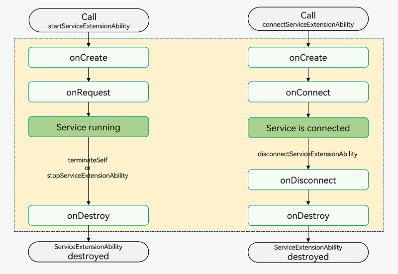

# ServiceExtensionAbility


[ServiceExtensionAbility](../reference/apis/js-apis-app-ability-serviceExtensionAbility.md)是SERVICE类型的ExtensionAbility组件，提供后台服务相关扩展能力。


[ServiceExtensionAbility](../reference/apis/js-apis-app-ability-serviceExtensionAbility.md)可以被其他组件启动或连接，并根据调用者的请求信息在后台处理相关事务。[ServiceExtensionAbility](../reference/apis/js-apis-app-ability-serviceExtensionAbility.md)支持以启动和连接两种形式运行，系统应用可以调用[startServiceExtensionAbility()](../reference/apis/js-apis-inner-application-uiAbilityContext.md#abilitycontextstartserviceextensionability)方法启动后台服务，也可以调用[connectServiceExtensionAbility()](../reference/apis/js-apis-inner-application-uiAbilityContext.md#abilitycontextconnectserviceextensionability)方法连接后台服务，而三方应用只能调用[connectServiceExtensionAbility()](../reference/apis/js-apis-inner-application-uiAbilityContext.md#abilitycontextconnectserviceextensionability)方法连接后台服务。启动和连接后台服务的差别：


- 启动：AbilityA启动ServiceB，启动后AbilityA和ServiceB为弱关联，AbilityA退出后，ServiceB可以继续存在。

- 连接：AbilityA绑定ServiceB，绑定后AbilityA和ServiceB为强关联，AbilityA退出后，ServiceB也一起退出。


每个类型的ExtensionAbility都有自己的Context，ServiceExtensionAbility通过[ServiceExtensionContext](../reference/apis/js-apis-inner-application-serviceExtensionContext.md)提供相关能力。本文描述中称被启动的ServiceExtensionAbility为服务端，称启动ServiceExtensionAbility的组件为客户端。


本章节将从如下场景来介绍ServiceExtensionAbility的基本使用。


- [实现一个后台服务（仅对系统应用开放）](#实现一个后台服务仅对系统应用开放)

- [启动一个后台服务（仅对系统应用开放）](#启动一个后台服务仅对系统应用开放)

- [连接一个后台服务](#连接一个后台服务)


>  **说明：**
> 1. OpenHarmony当前不支持三方应用实现ServiceExtensionAbility。如果三方开发者想要实现后台处理相关事务的功能，可以使用后台任务，具体请参见[后台任务](../task-management/background-task-overview.md)。
> 
> 2. 三方应用的UIAbility组件可以通过Context连接系统提供的ServiceExtensionAbility。
> 
> 3. 三方应用需要在前台获焦的情况下才能连接系统提供的ServiceExtensionAbility。


## 实现一个后台服务（仅对系统应用开放）

[ServiceExtensionAbility](../reference/apis/js-apis-app-ability-serviceExtensionAbility.md)提供了onCreate()、onRequest()、onConnect()、onDisconnect()和onDestory()生命周期回调，根据需要重写对应的回调方法。下图展示了ServiceExtensionAbility的生命周期。

  **图1** ServiceExtensionAbility生命周期


- **onCreate**
  服务被首次创建时触发该回调，开发者可以在此进行一些初始化的操作，例如注册公共事件监听等。

  >  **说明：**
  > 如果服务已创建，再次启动该ServiceExtensionAbility不会触发onCreate()回调。

- **onRequest**
  当另一个组件调用startServiceExtensionAbility()方法启动该服务组件时，触发该回调。执行此方法后，服务会启动并在后台运行。

- **onConnect**
  当另一个组件调用connectServiceExtensionAbility()方法与该服务连接时，触发该回调。开发者在此方法中，返回一个远端代理对象（IRemoteObject），客户端拿到这个对象后可以通过这个对象与服务端进行RPC通信。

- **onDisconnect**
  其他组件调用disconnectServiceExtensionAbility()方法时，如果没有任何其他组件连接该服务，触发该回调。

- **onDestroy**
  当不再使用服务且准备将其销毁该实例时，触发该回调。开发者可以在该回调中清理资源，如注销监听等。


## 开发步骤

开发者在实现一个后台服务时，需要在DevEco Studio工程中手动新建一个ServiceExtensionAbility，具体步骤如下。

1. 在工程Module对应的ets目录下，右键选择“New &gt; Directory”，新建一个目录并命名为serviceextability。

2. 在serviceextability目录，右键选择“New &gt; ts File”，新建一个TS文件并命名为ServiceExtAbility.ts。

3. 打开ServiceExtAbility.ts文件，导入[RPC通信模块](../reference/apis/js-apis-rpc.md)，重载onRemoteMessageRequest()方法，接收客户端传递过来的消息，并将处理的结果返回给客户端。REQUEST_VALUE用于校验客户端发送的服务请求码。
   
   ```ts
   import rpc from '@ohos.rpc';
   
   const REQUEST_CODE = 99;
   
   class StubTest extends rpc.RemoteObject {
     constructor(des) {
       super(des);
     }
     
     // 接收客户端传递过来的消息处理，以及将处理的结果返回给客户端
     onRemoteMessageRequest(code, data, reply, option) {
       if (code === REQUEST_CODE) {
         // 接收客户端传递过来的数据
         // 客户端使用多次调用data.writeInt()写入多个数据时，服务端可以通过多次调用data.readInt()方法接收对应的数据
         let optFir = data.readInt();
         let optSec = data.readInt();
         // 服务端将数据的处理结果返回给客户端
         // 示例中为接收了两个数据，并将两个数据的求和返回给客户端
         reply.writeInt(optFir + optSec);
       }
       return true;
     }
   
     // 以同步或异步方式向客户端发送消息
     sendRequest(code, data, reply, options) {
       return null;
     }
   }
   ```

4. 在ServiceExtAbility.ts文件中，增加导入ServiceExtensionAbility的依赖包，自定义类继承ServiceExtensionAbility并加上需要的生命周期回调。
   
   ```ts
   import ServiceExtensionAbility from '@ohos.app.ability.ServiceExtensionAbility';
   import rpc from '@ohos.rpc';
   
   const TAG: string = "[Example].[Entry].[ServiceExtAbility]";
   const REQUEST_CODE = 99;
   
   class StubTest extends rpc.RemoteObject {
     // ...
   }
   
   export default class ServiceExtAbility extends ServiceExtensionAbility {
     onCreate(want) {
       console.info(TAG, `onCreate, want: ${want.abilityName}`);
     }
   
     onRequest(want, startId) {
       console.info(TAG, `onRequest, want: ${want.abilityName}`);
     }
   
     onConnect(want) {
       console.info(TAG, `onConnect, want: ${want.abilityName}`);
       return new StubTest("test");
     }
   
     onDisconnect(want) {
       console.info(TAG, `onDisconnect, want: ${want.abilityName}`);
     }
   
     onDestroy() {
       console.info(TAG, `onDestroy`);
     }
   }
   ```

5. 在工程Module对应的[module.json5配置文件](../quick-start/module-configuration-file.md)中注册ServiceExtensionAbility，type标签需要设置为“service”，srcEntrance标签表示当前ExtensionAbility组件所对应的代码路径。
   
   ```json
   {
     "module": {
       // ...
       "extensionAbilities": [
         {
           "name": "ServiceExtAbility",
           "icon": "$media:icon",
           "description": "service",
           "type": "service",
           "visible": true,
           "srcEntrance": "./ets/serviceextability/ServiceExtAbility.ts"
         }
       ]
     }
   }
   ```


## 启动一个后台服务（仅对系统应用开放）

系统应用通过[startServiceExtensionAbility()](../reference/apis/js-apis-inner-application-uiAbilityContext.md#abilitycontextstartserviceextensionability)方法启动一个后台服务，服务的[onRequest()](../reference/apis/js-apis-app-ability-serviceExtensionAbility.md#serviceextensionabilityonrequest)回调就会被调用，并在该回调方法中接收到调用者传递过来的want对象。后台服务启动后，其生命周期独立于客户端，即使客户端已经销毁，该后台服务仍可继续运行。因此，后台服务需要在其工作完成时通过调用ServiceExtensionContext的[terminateSelf()](../reference/apis/js-apis-inner-application-serviceExtensionContext.md#serviceextensioncontextterminateself)来自行停止，或者由另一个组件调用[stopServiceExtensionAbility()](../reference/apis/js-apis-inner-application-uiAbilityContext.md#abilitycontextstopserviceextensionability)来将其停止。

>  **说明：**
> ServiceExtensionContext的[startServiceExtensionAbility()](../reference/apis/js-apis-inner-application-uiAbilityContext.md#abilitycontextstartserviceextensionability)、[stopServiceExtensionAbility()](../reference/apis/js-apis-inner-application-uiAbilityContext.md#abilitycontextstopserviceextensionability)和[terminateSelf()](../reference/apis/js-apis-inner-application-serviceExtensionContext.md#serviceextensioncontextterminateself)为系统接口，三方应用不支持调用。

1. 在系统应用中启动一个新的ServiceExtensionAbility。示例中的context的获取方式参见[获取UIAbility的Context属性](uiability-usage.md#获取uiability的上下文信息)。
   
   ```ts
   let want = {
       "deviceId": "",
       "bundleName": "com.example.myapplication",
       "abilityName": "ServiceExtAbility"
   };
   this.context.startServiceExtensionAbility(want).then(() => {
       console.info('startServiceExtensionAbility success');
   }).catch((error) => {
       console.info('startServiceExtensionAbility failed');
   })
   ```

2. 在系统应用中停止一个已启动的ServiceExtensionAbility。
   
   ```ts
   let want = {
       "deviceId": "",
       "bundleName": "com.example.myapplication",
       "abilityName": "ServiceExtAbility"
   };
   this.context.stopServiceExtensionAbility(want).then(() => {
       console.info('stopServiceExtensionAbility success');
   }).catch((error) => {
       console.info('stopServiceExtensionAbility failed');
   })
   ```

3. 已启动的ServiceExtensionAbility停止自身。
   
   ```ts
   // this是当前ServiceExtensionAbility
   this.context.terminateSelf().then(() => {
       console.info('terminateSelf success');
   }).catch((error) => {
       console.info('terminateSelf failed');
   })
   ```


>  **说明：**
> 后台服务可以在后台长期运行，为了避免资源浪费，需要对后台服务的生命周期进行管理。即一个后台服务完成了请求方的任务，需要及时销毁。销毁已启动的后台服务有两种方式：
> 
> - 后台服务自身调用[terminateSelf()](../reference/apis/js-apis-inner-application-serviceExtensionContext.md#serviceextensioncontextterminateself)方法来自行停止。
> 
> - 由其他组件调用[stopServiceExtensionAbility()](../reference/apis/js-apis-inner-application-uiAbilityContext.md#abilitycontextstopserviceextensionability)方法来停止。
> 
> 调用[terminateSelf()](../reference/apis/js-apis-inner-application-serviceExtensionContext.md#serviceextensioncontextterminateself)或[stopServiceExtensionAbility()](../reference/apis/js-apis-inner-application-uiAbilityContext.md#abilitycontextstopserviceextensionability)方法之后，系统将销毁后台服务。


## 连接一个后台服务

系统应用或者三方应用可以通过[connectServiceExtensionAbility()](../reference/apis/js-apis-inner-application-uiAbilityContext.md#abilitycontextconnectserviceextensionability)连接一个服务（在Want对象中指定启动的目标服务），服务的[onConnect()](../reference/apis/js-apis-app-ability-serviceExtensionAbility.md#serviceextensionabilityonconnect)就会被调用，并在该回调方法中接收到调用者传递过来的Want对象，从而建立长连接。

ServiceExtensionAbility服务组件在[onConnect()](../reference/apis/js-apis-app-ability-serviceExtensionAbility.md#serviceextensionabilityonconnect)中返回IRemoteObject对象，开发者通过该IRemoteObject定义通信接口，用于客户端与服务端进行RPC交互。多个客户端可以同时连接到同一个后台服务，客户端完成与服务的交互后，客户端需要通过调用[disconnectServiceExtensionAbility()](../reference/apis/js-apis-inner-application-uiAbilityContext.md#abilitycontextdisconnectserviceextensionability)来断开连接。如果所有连接到某个后台服务的客户端均已断开连接，则系统会销毁该服务。

- 使用connectServiceExtensionAbility()建立与后台服务的连接。示例中的context的获取方式参见[获取UIAbility的Context属性](uiability-usage.md#获取uiability的上下文信息)。
  
  ```ts
  import rpc from '@ohos.rpc';
  
  const REQUEST_CODE = 99;
  let want = {
      "deviceId": "",
      "bundleName": "com.example.myapplication",
      "abilityName": "ServiceExtAbility"
  };
  let options = {
      onConnect(elementName, remote) {
          console.info('onConnect callback');
          if (remote === null) {
              console.info(`onConnect remote is null`);
              return;
          }
          let option = new rpc.MessageOption();
          let data = new rpc.MessageParcel();
          let reply = new rpc.MessageParcel();
          data.writeInt(100);
          data.writeInt(200);
  
          // @param code 表示客户端发送的服务请求代码。
          // @param data 表示客户端发送的{@link MessageParcel}对象。
          // @param reply 表示远程服务发送的响应消息对象。
          // @param options 指示操作是同步的还是异步的。
          // 
          // @return 如果操作成功返回{@code true}； 否则返回 {@code false}。
          remote.sendRequest(REQUEST_CODE, data, reply, option).then((ret) => {
              let msg = reply.readInt();
              console.info(`sendRequest ret:${ret} msg:${msg}`);
          }).catch((error) => {
              console.info('sendRequest failed');
          });
      },
      onDisconnect(elementName) {
          console.info('onDisconnect callback')
      },
      onFailed(code) {
          console.info('onFailed callback')
      }
  }
  // 建立连接后返回的Id需要保存下来，在解绑服务时需要作为参数传入
  let connectionId = this.context.connectServiceExtensionAbility(want, options);
  ```

- 使用disconnectServiceExtensionAbility()断开与后台服务的连接。
  
  ```ts
  let connectionId = 1 // 在通过connectServiceExtensionAbility绑定服务时返回的Id
  this.context.disconnectServiceExtensionAbility(connectionId).then((data) => {
      console.info('disconnectServiceExtensionAbility success');
  }).catch((error) => {
      console.error('disconnectServiceExtensionAbility failed');
  })
  ```


## 相关示例

针对ServiceExtensionAbility开发，有以下相关示例可供参考：

- [`ServiceExtAbility`：StageExtAbility的创建与使用（ArkTS）（API9）（Full SDK）](https://gitee.com/openharmony/applications_app_samples/tree/OpenHarmony-3.2-Release/ability/ServiceExtAbility)
