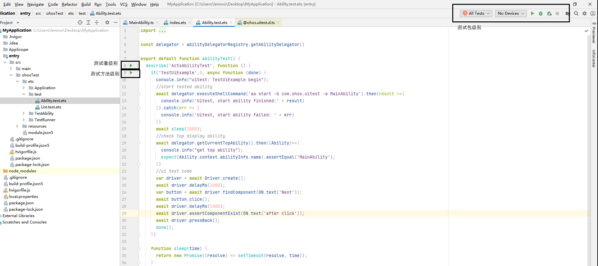

# 自动化测试框架使用指南


## 概述

为支撑OpenHarmony操作系统的自动化测试活动开展，我们提供支持JS/TS语言的单元及UI测试框架，支持开发者针对应用接口或系统接口进行单元测试，并且可基于模拟UI操作进行UI自动化脚本的编写。

本指南重点介绍自动化测试框架的主要功能，同时介绍单元/UI自动化测试脚本的编写方法以及执行过程。


### 简介

OpenHarmony自动化测试框架arkxtest，作为OpenHarmony工具集的重要组成部分，提供了OpenHarmony自动化脚本编写和运行的基础能力。编写方面提供了一系列支持测试脚本编写的API，包括了基础流程API、断言API以及UI操作相关的API，运行方面提供了识别测试脚本、调度执行测试脚本以及汇总测试脚本执行结果的能力。


### 实现原理

框架重要分为两大部分：单元测试框架和UI测试框架。

- 单元测试框架

  单元测试框架是测试框架的基础底座，提供了最基本的用例识别、调度、执行及结果汇总的能力。主要功能如下图所示：

  

  单元测试脚本的基础运行流程如下图所示，依赖aa test命令作为执行入口。


- UI测试框架

  UI测试框架主要对外提供了[UiTest API](../reference/apis/js-apis-uitest.md)供开发人员在对应测试场景调用，而其脚本的运行基础还是上面提到的单元测试框架。

  UI测试框架的主要功能如下图所示：


### 约束与限制

- UI测试框架能力在OpenHarmony 3.1 release版本之后方可使用，历史版本不支持使用。
- 单元测试框架的部分能力与其版本有关，具体能力与版本匹配信息可见代码仓中的[文档介绍](https://gitee.com/openharmony/testfwk_arkxtest/blob/master/README_zh.md)。


## 环境准备

### 环境要求

OpenHarmony自动化脚本的编写主要基于DevEco Studio，建议使用3.0之后的版本进行脚本编写。

脚本执行需要PC连接OpenHarmony设备，如RK3568开发板等。

### 搭建环境

DevEco Studio可参考其官网介绍进行[下载](https://developer.harmonyos.com/cn/develop/deveco-studio#download)，并进行相关的配置动作。


## 新建测试脚本

1. 在DevEco Studio中新建应用开发工程，其中ohos目录即为测试脚本所在的目录。
2. 在工程目录下打开待测试模块下的ets文件，将光标置于代码中任意位置，单击**右键 > Show Context Actions** **> Create Ohos Test**或快捷键**Alt+enter** **> Create Ohos Test**创建测试类，更多指导请参考DevEco Studio中[指导](https://developer.harmonyos.com/cn/docs/documentation/doc-guides/ohos-openharmony-test-framework-0000001267284568)。

## 编写单元测试脚本

```TS
import { describe, beforeAll, beforeEach, afterEach, afterAll, it, expect } from '@ohos/hypium'
import abilityDelegatorRegistry from '@ohos.application.abilityDelegatorRegistry'

const delegator = abilityDelegatorRegistry.getAbilityDelegator()
export default function abilityTest() {
  describe('ActsAbilityTest', function () {
    it('testUiExample',0, async function (done) {
      console.info("uitest: TestUiExample begin");
      //start tested ability
      await delegator.executeShellCommand('aa start -b com.ohos.uitest -a MainAbility').then(result =>{
        console.info('Uitest, start ability finished:' + result)
      }).catch(err => {
        console.info('Uitest, start ability failed: ' + err)
      })
      await sleep(1000);
      //check top display ability
      await delegator.getCurrentTopAbility().then((Ability)=>{
        console.info("get top ability");
        expect(Ability.context.abilityInfo.name).assertEqual('MainAbility');
      })
      done();
    })

    function sleep(time) {
      return new Promise((resolve) => setTimeout(resolve, time));
    }
  })
}
```

单元测试脚本需要包含如下基本元素：

1、依赖导包，使用依赖的测试接口。

2、测试代码编写，主要编写测试代码的相关逻辑，如接口调用等。

3、断言接口调用，设置测试代码中的检查点，如无检查点，则不可认为一个完整的测试脚本。

## 编写UI测试脚本

UI测试脚本是在单元测试框架的基础上编写，主要就是增加了UI测试框架提供的接口调用，实现对应的测试逻辑。

下面的示例代码是在上面的单元测试脚本基础上增量编写，首先需要增加依赖导包，如下示例代码所示：

```js
import {Driver,ON,Component,MatchPattern} from '@ohos.uitest'
```

然后是具体UI测试代码编写，场景较为简单，在启动的应用页面上进行点击操作，然后检查点击效果。

```js
export default function abilityTest() {
  describe('ActsAbilityTest', function () {
    it('testUiExample',0, async function (done) {
      console.info("uitest: TestUiExample begin");
      //start tested ability
      await delegator.executeShellCommand('aa start -b com.ohos.uitest -a MainAbility').then(result =>{
        console.info('Uitest, start ability finished:' + result)
      }).catch(err => {
        console.info('Uitest, start ability failed: ' + err)
      })
      await sleep(1000);
      //check top display ability
      await delegator.getCurrentTopAbility().then((Ability)=>{
        console.info("get top ability");
        expect(Ability.context.abilityInfo.name).assertEqual('MainAbility');
      })
      //ui test code
      //init driver
      var driver = await Driver.create();
      await driver.delayMs(1000);
      //find button by text 'Next'
      var button = await driver.findComponent(ON.text('Next'));
      //click button
      await button.click();
      await driver.delayMs(1000);
      //check text
      await driver.assertComponentExist(BY.text('after click'));
      await driver.pressBack();
      done();
    })

    function sleep(time) {
      return new Promise((resolve) => setTimeout(resolve, time));
    }
  })
}
```

## 执行测试脚本

### DevEco Studio执行

通过点击按钮执行，当前支持以下执行方式：

1、测试包级别执行即执行测试包内的全部用例。

2、测试套级别执行即执行describe方法中定义的全部测试用例。

3、测试方法级别执行即执行指定it方法也就是单条测试用例。



**查看测试结果**

测试执行完毕后可直接在DevEco Studio中查看测试结果，如下图示例所示：


### CMD执行

通过在cmd窗口中输入aa命令执行触发用例执行，并通过设置执行参数触发不同功能。

**aa test命令执行配置参数**

| 执行参数全写  | 执行参数缩写 | 执行参数含义                           | 执行参数示例                       |
| ------------- | ------------ | -------------------------------------- | ---------------------------------- |
| --bundleName  | -b           | 应用包名                               | - b com.test.example               |
| --packageName | -p           | 应用模块名，适用于FA模型应用           | - p com.test.example.entry         |
| --moduleName  | -m           | 应用模块名，适用于STAGE模型应用        | -m entry                           |
| NA            | -s           | 特定参数，以<key, value>键值对方式传入 | - s unittest OpenHarmonyTestRunner |

框架当前支持多种用例执行方式，通过上表中的-s参数后的配置键值对参数传入触发，如下表所示。

| 配置参数值     | 配置参数含义                                                 | 配置参数有值                                                 | 配置参数示例                              |
| ------------ | -----------------------------------------------------------------------------    | ------------------------------------------------------------ | ----------------------------------------- |
| unittest     | 用例执行所使用OpenHarmonyTestRunner对象  | OpenHarmonyTestRunner或用户自定义runner名称                  | - s unittest OpenHarmonyTestRunner        |
| class        | 指定要执行的测试套或测试用例                                   | {describeName}#{itName}，{describeName}                      | -s class attributeTest#testAttributeIt    |
| notClass     | 指定不需要执行的测试套或测试用例                               | {describeName}#{itName}，{describeName}                      | -s notClass attributeTest#testAttributeIt |
| itName       | 指定要执行的测试用例                                         | {itName}                                                     | -s itName testAttributeIt                 |
| timeout      | 测试用例执行的超时时间                                        | 正整数（单位ms），如不设置默认为 5000                        | -s timeout 15000                          |
| breakOnError | 遇错即停模式，当执行用例断言失败或者发生错误时，退出测试执行流程 | true/false(默认值)                                           | -s breakOnError true                      |
| testType     | 指定要执行用例的用例类型                                      | function，performance，power，reliability， security，global，compatibility，user，standard，safety，resilience' | -s testType function                      |
| level        | 指定要执行用例的用例级别                                      | 0,1,2,3,4                                                    | -s level 0                                |
| size         | 指定要执行用例的用例规模                                    | small，medium，large                                         | -s size small                             |

**通过在cmd窗口直接执行命令。**

> 使用cmd的方式，需要配置好hdc_std相关的环境变量

- 打开cmd窗口
- 执行 aa test 命令

**示例代码1**：执行所有测试用例。

```shell  
 hdc_std shell aa test -b xxx -p xxx -s unittest OpenHarmonyTestRunner
```

**示例代码2**：执行指定的describe测试套用例，指定多个需用逗号隔开。

```shell  
  hdc_std shell aa test -b xxx -p xxx -s unittest OpenHarmonyTestRunner -s class s1,s2
```

**示例代码3**：执行指定测试套中指定的用例，指定多个需用逗号隔开。

```shell  
  hdc_std shell aa test -b xxx -p xxx -s unittest OpenHarmonyTestRunner -s class testStop#stop_1,testStop1#stop_0
```

**示例代码4**：执行指定除配置以外的所有的用例，设置不执行多个测试套需用逗号隔开。

```shell  
  hdc_std shell aa test -b xxx -p xxx -s unittest OpenHarmonyTestRunner -s notClass testStop
```

**示例代码5**：执行指定it名称的所有用例，指定多个需用逗号隔开。

```shell  
  hdc_std shell aa test -b xxx -p xxx -s unittest OpenHarmonyTestRunner -s itName stop_0
```

**示例代码6**：用例执行超时时长配置。

```shell  
  hdc_std shell aa test -b xxx -p xxx -s unittest OpenHarmonyTestRunner  -s timeout 15000
```

**示例代码7**：用例以breakOnError模式执行用例。

```shell  
  hdc_std shell aa test -b xxx -p xxx -s unittest OpenHarmonyTestRunner   -s breakOnError true
```

**示例代码8**：执行测试类型匹配的测试用例。

```shell  
  hdc_std shell aa test -b xxx -p xxx -s unittest OpenHarmonyTestRunner   -s testType function
```

**示例代码9**：执行测试级别匹配的测试用例。

```shell  
  hdc_std shell aa test -b xxx -p xxx -s unittest OpenHarmonyTestRunner   -s level 0
```

**示例代码10**：执行测试规模匹配的测试用例。

```shell  
  hdc_std shell aa test -b xxx -p xxx -s unittest OpenHarmonyTestRunner   -s size small
```

**查看测试结果**

- cmd模式执行过程,会打印如下相关日志信息。

```
OHOS_REPORT_STATUS: class=testStop
OHOS_REPORT_STATUS: current=1
OHOS_REPORT_STATUS: id=JS
OHOS_REPORT_STATUS: numtests=447
OHOS_REPORT_STATUS: stream=
OHOS_REPORT_STATUS: test=stop_0
OHOS_REPORT_STATUS_CODE: 1

OHOS_REPORT_STATUS: class=testStop
OHOS_REPORT_STATUS: current=1
OHOS_REPORT_STATUS: id=JS
OHOS_REPORT_STATUS: numtests=447
OHOS_REPORT_STATUS: stream=
OHOS_REPORT_STATUS: test=stop_0
OHOS_REPORT_STATUS_CODE: 0
OHOS_REPORT_STATUS: consuming=4
```

| 日志输出字段               | 日志输出字段含义       |
| -------           | -------------------------|
| OHOS_REPORT_SUM    | 当前测试套用例总数 |
| OHOS_REPORT_STATUS: class | 当前执行用例测试套名称|
| OHOS_REPORT_STATUS: id | 用例执行语言,默认JS  |
| OHOS_REPORT_STATUS: numtests | 测试包中测试用例总数 |
| OHOS_REPORT_STATUS: stream | 当前用例发生错误时，记录错误信息 |
| OHOS_REPORT_STATUS: test| 当前用例执行的it name |
| OHOS_REPORT_STATUS_CODE | 当前用例执行结果状态 0 (pass) 1(error) 2(fail) |
| OHOS_REPORT_STATUS: consuming | 当前用例执行消耗的时长 |

- cmd执行完成后,会打印如下相关日志信息。

```
OHOS_REPORT_RESULT: stream=Tests run: 447, Failure: 0, Error: 1, Pass: 201, Ignore: 245
OHOS_REPORT_CODE: 0

OHOS_REPORT_RESULT: breakOnError model, Stopping whole test suite if one specific test case failed or error
OHOS_REPORT_STATUS: taskconsuming=16029

```
| 日志输出字段               | 日志输出字段含义           |
| ------------------| -------------------------|
| run    | 当前测试包用例总数 |
| Failure | 当前测试失败用例个数 |
| Error | 当前执行用例发生错误用例个数  |
| Pass | 当前执行用例通过用例个数 |
| Ignore | 当前未执行用例个数 |
| taskconsuming| 执行当前测试用例总耗时 |

> 当处于breakOnError模式，用例发生错误时,注意查看Ignore以及中断说明

## 常见问题

### 单元测试用例常见问题

**1、用例中增加的打印日志在用例结果之后才打印**

**问题描述**

用例中增加的日志打印信息，没有在用例执行过程中出现，而是在用例执行结束之后才出现。

**可能原因**

此类情况只会存在于用例中有调用异步接口的情况，原则上用例中所有的日志信息均在用例执行结束之前打印。

**解决方法**

当被调用的异步接口多于一个时，建议将接口调用封装成Promise方式调用。

**2、执行用例时报error：fail to start ability**

**问题描述**

执行测试用例时候，用例执行失败，控制台返回错误：fail to start ability。

**可能原因**

测试包打包过程中出现问题，未将测试框架依赖文件打包在测试包中。

**解决方法**

检查测试包中是否包含OpenHarmonyTestRunner.abc文件，如没有则重新编译打包后再次执行测试。

**3、执行用例时报用例超时错误**

**问题描述**

用例执行结束，控制台提示execute time XXms错误，即用例执行超时

**可能原因**

1.用例执行异步接口，但执行过程中没有执行到done函数，导致用例执行一直没有结束，直到超时结束。

2.用例调用函数耗时过长，超过用例执行设置的超时时间。

3.用例调用函数中断言失败，抛出失败异常，导致用例执行一直没有结束，直到超时结束。

**解决方法**

1.检查用例代码逻辑，确保即使断言失败场景认可走到done函数，保证用例执行结束。

2.可在IDE中Run/Debug Configurations中修改用例执行超时配置参数，避免用例执行超时。

3.检查用例代码逻辑，断言结果，确保断言Pass。
### UI测试用例常见问题

**1、失败日志有“Get windows failed/GetRootByWindow failed”错误信息**

**问题描述**

UI测试用例执行失败，查看hilog日志发现日志中有“Get windows failed/GetRootByWindow failed”错误信息。

**可能原因**

系统ArkUI开关未开启，导致被测试界面控件树信息未生成。

**解决方法**

执行如下命令，并重启设备再次执行用例。

```shell
hdc shell param set persist.ace.testmode.enabled 1
```

**2、失败日志有“uitest-api dose not allow calling concurrently”错误信息**

**问题描述**

UI测试用例执行失败，查看hilog日志发现日志中有“uitest-api dose not allow calling concurrently”错误信息。

**可能原因**

1.用例中UI测试框架提供异步接口没有增加await语法糖调用。

2.多进程执行UI测试用例，导致拉起多个UITest进程，框架不支持多进程调用。

**解决方法**

1.检查用例实现，异步接口增加await语法糖调用。

2.避免多进程执行UI测试用例。

**3、失败日志有“dose not exist on current UI! Check if the UI has changed after you got the widget object”错误信息**

**问题描述**

UI测试用例执行失败，查看hilog日志发现日志中有“dose not exist on current UI! Check if the UI has changed after you got the widget object”错误信息。

**可能原因**

在用例中代码查找到目标控件后，设备界面发生了变化，导致查找到的控件丢失，无法进行下一步的模拟操作。

**解决方法**

重新执行UI测试用例。
<style>
    table th:nth-of-type(2) {
        width: 200px;
    }
</style>