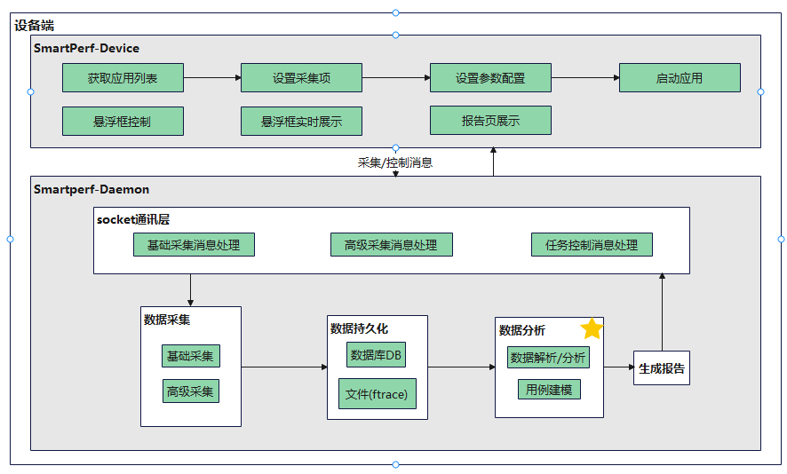

# SmartPerf性能工具使用指导

## 概述

为支撑系统性能测试，我们向用户提供了符合功能需求并且可靠、易用的性能测试工具。支持开发者针对应用进行相应的性能数据采集以及指标计算功能。

## 简介

SmartPerf端是一款基于系统开发的性能功耗测试工具，操作简单易用，可提供包括性能、功耗的关键KPI指标，给出具体指标的测试值，包括采集设备的FPS、CPU、GPU、Ftrace等指标数据；

目前SmartPerf工具提供了两种使用方式，分别为hap应用可视化操作方式(SmartPerf-Device)和shell命令行方式(SmartPerf-Daemon),其中SmartPerf-Device支持可视化操作、悬浮窗控制暂停，悬浮窗实时展示数据，SmartPerf-Daemon支持无屏设备、性能较差的设备以及3568设备等。

## 实现原理

SmartPerf工具主要包括SmartPerf-Device、SmartPerf-Daemon两个部分，其中Device采集的FPS、RAM、Trace等指标需要通过发送消息给Daemon端去采集数据，然后接收Daemon回传的数据展示，同时Daemon端也提供了shell命令的方式单独执行采集，工具的主要功能组成如下图：



## 约束与限制

1.SmartPerf-Device、SmartPerf-Daemon在Openharmony3.2系统版本后开始预制使用。

2.其中SmartPerf-Device的使用必须是具备屏幕的设备。

## 准备工作

首次使用SmartPerf工具前，您需要完成如下操作：

1.设备准备

SmartPerf-Daemon执行需要PC连接硬件设备，如开发板等。

2.hdc环境配置

SmartPerf-Daemon执行需要配置hdc环境，若您还没有配置，详细操作请参考：https://gitee.com/openharmony/developtools_hdc。

## 执行性能测试

**SmartPerf-Device应用可视化使用示例**

以下SmartPerf-Device应用内截图以RK3568设备为例。

1.应用采集配置。

点击SmartPerf-Device应用图标，进入首页，点击请选择一个应用，在应用列表页选择一个您需要测试的应用。


应用选择完成后回到开始测试页面，配置测试指标（您可以根据实际情况配置采集项），可修改测试名称，选择是否开启截图，是否抓取trace，配置完成后，点击底部开始测试按钮。

| 配置测试指标项|说明 |
| :------------|:---------------------------------------------|
| CPU          | 每一秒读取一次设备节点下各CPU的频点信息和负载信息|
| GPU          | 每一秒读取一次设备节点下各GPU的频点信息和负载信息|
| DDR          | 每一秒读取一次设备节点下各DDR的频点信息|
| FPS          | 每1秒内游戏画面或者应用界面真实刷新次数|
| POWER        | 每1秒读取一次设备节点下的电流信息、电池的电压信息|
| TEMP         | 每1秒读取一次读取一次设备节点下的soc温度等信息|
| RAM          | 每1秒读取一次应用进程的实际物理内存|
| TRACE        | 当帧绘制时间超过100ms以上会自动抓取trace，1min内只抓取1次|
| 屏幕截图      | 每1秒截取一张截图|

2.悬浮窗控制采集。

点击悬浮窗”start“开始采集，单击悬浮窗”计时器“暂停采集，再次单击继续采集双击计时器，实时展示采集数据，可拖动悬浮框更改悬浮框位置，长按”计时器“，结束采集。


3.查看报告。

点击“报告”，查看测试报告列表，点击报告项，进入报告详情页，查看测试指标项详情。


**SmartPerf-Daemon采集命令使用示例解析**

| 命令   | 功能                   |是否必选|
| :-----| :--------------------- |:-----|
| -N    | 设置采集次数             |是|
| -PKG  | 设置包名                | 否|
| -PID  | 设置进程pid(对于ram适用) |否|
| -c    | 是否采集cpu             | 否|
| -g    | 是否采集gpu             |否|
| -f    | 是否采集fps             |否|
| -t    | 是否采集温度             |否|
| -p    | 是否采集电流             |否|
| -r    | 是否采集内存             |否|

**SmartPerf-Daemon命令行使用示例**

1.Win + R 打开命令行窗口，进入shell。
```
:# hdc shell
```
```
C:\Users\issusser>hdc shell
#
```
2.拉起daemon进程。
```
:# SP_daemon
```
```
C:\Users\issusser>hdc shell
# SP_daemon
#
```
3.查看daemon进程是否存在
```
ps -ef | grep SP_daemon
```
```
C:\Users\issusser>hdc shell
# SP_daemon
# ps -ef | grep SP_daemon
root          1584     1 0 21:50:05 ?     00:00:00 SP_daemon
root          1595  1574 3 21:51:02 pts/0 00:00:00 grep SP_daemon
#
```
4.执行查看帮助命令。
```
SP_daemon --help
```
```
# SP_daemon --help
usage: SP_daemon <options> <arguments>
--------------------------------------------------------------------
These are common commands list:
 -N             set num of profiler <must be non-null>
 -PKG           set pkgname of profiler
 -PID           set process id of profiler
 -OUT           set output path of CSV
 -c             get cpuFreq and cpuLoad
 -g             get gpuFreq and gpuLoad
 -f             get fps and fps jitters
 -t             get soc-temp gpu-temp ..
 -p             get current_now and voltage_now
 -r             get ram(pss)
 -snapshot      get screen capture
--------------------------------------------------------------------
Example: SP_daemon -N 20 -PKG ohos.samples.ecg -c -g -t -p -f
--------------------------------------------------------------------


command exec finished!
#
```
5.执行采集命令。

5.1采集2次CPU
```
:# SP_daemon -N 2 -PKG com.ohos.contacts -c
```
```
# SP_daemon -N 2 -PKG com.ohos.contacts -c

order:0 cpu0Frequency=1992000
order:1 cpu0Load=-1.000000
order:2 cpu1Frequency=1992000
order:3 cpu1Load=-1.000000
order:4 cpu2Frequency=1992000
order:5 cpu2Load=-1.000000
order:6 cpu3Frequency=1992000
order:7 cpu3Load=-1.000000
order:8 timestamp=1501941447968


order:0 cpu0Frequency=1416000
order:1 cpu0Load=43.000000
order:2 cpu1Frequency=1416000
order:3 cpu1Load=54.216866
order:4 cpu2Frequency=1416000
order:5 cpu2Load=30.851065
order:6 cpu3Frequency=1416000
order:7 cpu3Load=32.183907
order:8 timestamp=1501941448971

command exec finished!
#
```
5.2采集1次GPU
```
SP_daemon -N 1 -PKG com.ohos.contacts -g
```
```
# SP_daemon -N 1 -PKG com.ohos.contacts -g

order:0 gpuFrequency=200000000
order:1 gpuLoad=0.000000
order:2 timestamp=1501941537559

command exec finished!
#
```
5.3采集2次温度
```
SP_daemon -N 2 -PKG com.ohos.contacts -t
```
```
# SP_daemon -N 2 -PKG com.ohos.contacts -t

order:0 gpu-thermal=40625
order:1 soc-thermal=42500
order:2 timestamp=1501941630698


order:0 gpu-thermal=40625
order:1 soc-thermal=41875
order:2 timestamp=1501941631703

command exec finished!
#
```
5.4采集1次电流和电压
```
SP_daemon -N 1 -PKG com.ohos.contacts -p
```
```
# SP_daemon -N 1 -PKG com.ohos.contacts -p

order:0 currentNow=152
order:1 timestamp=1501941900574
order:2 voltageNow=3812359

command exec finished!
#
```
5.5采集1次内存

查看pid
```
ps -ef | grep com.ohos.contacts
```
```
# ps -ef | grep com.ohos.contacts
10005         1697   264 1 21:56:33 ?     00:00:03 com.ohos.contacts
20010019      1721   264 0 21:56:33 ?     00:00:00 com.ohos.contactsdataability
root          1889  1574 1 22:07:11 pts/0 00:00:00 grep com.ohos.contacts
#
```
采集内存
```
SP_daemon -N 1 -PID 1697(进程pid) -r
```
```
# SP_daemon -N 1 -PID 1697 -r

order:0 pss=48890
order:1 timestamp=1501942183080

command exec finished!
#
```
5.6采集2次该应用的CPU、GPU、当前设备的温度、当前读取的电流和电压。
```
SP_daemon -N 2 -PKG com.ohos.contacts -c -g -t -p
```
```
# SP_daemon -N 2 -PKG com.ohos.contacts -c -g -t -p

order:0 cpu0Frequency=1416000
order:1 cpu0Load=-1.000000
order:2 cpu1Frequency=1416000
order:3 cpu1Load=-1.000000
order:4 cpu2Frequency=1416000
order:5 cpu2Load=-1.000000
order:6 cpu3Frequency=1416000
order:7 cpu3Load=-1.000000
order:8 currentNow=119
order:9 gpu-thermal=35000
order:10 gpuFrequency=200000000
order:11 gpuLoad=0.000000
order:12 soc-thermal=36111
order:13 timestamp=1501945516584
order:14 voltageNow=3812635


order:0 cpu0Frequency=408000
order:1 cpu0Load=1.980198
order:2 cpu1Frequency=408000
order:3 cpu1Load=0.990099
order:4 cpu2Frequency=408000
order:5 cpu2Load=0.000000
order:6 cpu3Frequency=408000
order:7 cpu3Load=0.990099
order:8 currentNow=111
order:9 gpu-thermal=35000
order:10 gpuFrequency=200000000
order:11 gpuLoad=0.000000
order:12 soc-thermal=35555
order:13 timestamp=1501945517589
order:14 voltageNow=3812408

command exec finished!
#
```

**测试结果默认输出路径如下**
```
报告存放路径：/data/local/tmp/data.csv
```

**查看文件位置**
```
# cd data/local/tmp
# ls
data.csv
#
```

**导出文件**
```
hdc file recv data/local/tmp/data.csv D:\
```
```
C:\Users\issusser>hdc file recv data/local/tmp/data.csv D:\
[I][2023-11-08 16:16:41] HdcFile::TransferSummary success
FileTransfer finish, Size:429, File count = 1, time:6ms rate:71.50kB/s

C:\Users\issusser>
```

**打开data.csv查看数据**

在自定义导出路径里找到data.csv文件打开查看采集数据表。

**data.csv数据名描述**

| 被测数据项    | 含义             |备注|
| :-----| :--------------------- |:-----|
| cpuFrequ     | CPU的频率        |单位Hz|
| cpuLoad      | CPU的负载占比     |%|
| currentNow   | 当前读到的电流值  |单位mA|  
| fps          | 屏幕刷新帧率      |单位fps|
| fpsJitters   | 每一帧绘制间隔    |单位ns|
| gpuFrequ     | GPU的频率         |单位Hz|
| gpuLoad      | GPU的负载占比     |%|
| shell_front  | 前壳温度          |单位°C|
| shell_frame  | 边框温度          |单位°C|
| shell_back   | 后壳温度          |单位°C|
| soc_thermal  | SOC温度           |单位°C|
| system_h     | 系统温度          |单位°C|
| timeStamp    | 当前时间戳        |对应采集时间|
| voltageNow   | 当前读到的电压值   |单位μV(微伏)|
```
