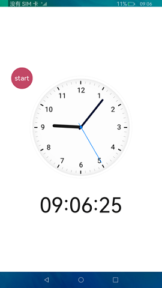

# SmartPerf性能工具使用指导

## 概述

为支撑系统性能测试，我们向用户提供了符合功能需求并且可靠、易用的性能测试工具。支持开发者针对应用进行相应的性能数据采集以及指标计算功能。

## 简介

SmartPerf端是一款基于系统开发的性能功耗测试工具，操作简单易用，可提供包括性能、功耗的关键KPI指标，给出具体指标的测试值，包括采集设备的FPS、CPU、GPU、Ftrace等指标数据；

目前SmartPerf工具提供了两种使用方式，分别为hap应用可视化操作方式(SmartPerf-Device)和shell命令行方式(SmartPerf-Daemon),其中SmartPerf-Device支持可视化操作、悬浮窗控制暂停，悬浮窗实时展示数据，SmartPerf-Daemon主要适用于无屏设备、性能较差的设备，对3568等设备同样支持。

## 实现原理

SmartPerf工具主要包括SmartPerf-Device、SmartPerf-Daemon两个部分，其中Device采集的FPS、RAM、Trace等指标需要通过发送消息给Daemon端去采集数据，然后接收Daemon回传的数据展示，同时Daemon端也提供了shell命令的方式单独执行采集，工具的主要功能组成如下图：


## 约束与限制

1.SmartPerf-Device、SmartPerf-Daemon在3.2系统版本后开始预制使用。

2.其中SmartPerf-Device的使用必须是具备屏幕的设备。

## 环境准备

SmartPerf-Daemon执行需要PC连接硬件设备，如开发板等。

## 执行性能测试

**SmartPerf-Device应用可视化使用示例**

以下SmartPerf-Device应用内截图以RK3568设备为例。

1.应用采集配置。

启动SmartPerf-Device进入首页，选择测试应用、测试指标项，点击”开始测试“，拉起测试应用。


2.悬浮窗控制采集。

点击悬浮窗”start“开始采集，单击悬浮窗”计时器“暂停采集，再次单击继续采集双击计时器，实时展示采集数据，可拖动悬浮框更改悬浮框位置，长按”计时器“，结束采集。




3.查看报告。

点击“报告”，查看测试报告列表，点击“报告列表”，查看测试指标项详情。


**SmartPerf-Daemon命令行使用示例**

1.进入shell, 执行查看帮助命令。
```
:# SP_daemon --help
```
2.执行采集命令。
```
:# SP_daemon -N 2 -PKG com.ohos.contacts -c -g -t -p -r
```

**采集命令使用示例解析**

| 命令   | 功能                   |是否必选|
| :-----| :--------------------- |:-----|
| -N    | 设置采集次数             |是|
| -PKG  | 设置包名                | 否|
| -PID  | 设置进程pid(对于ram适用) |否|
| -c    | 是否采集cpu             | 否|
| -g    | 是否采集gpu             |否|
| -f    | 是否采集fps             |否|
| -t    | 是否采集温度             |否|
| -p    | 是否采集电流             |否|
| -r    | 是否采集内存             |否|

**测试结果默认输出路径如下**
```
报告存放路径：/data/local/tmp/data.csv
```

**data.csv数据名描述**

| 被测数据项    | 含义             |备注|
| :-----| :--------------------- |:-----|
| cpuFrequ     | CPU的频率        |单位Hz|
| cpuLoad      | CPU的负载占比     |%|
| currentNow   | 当前读到的电流值  |单位mA|  
| fps          | 屏幕刷新帧率      |单位fps|
| fpsJitters   | 每一帧绘制间隔    |单位ns|
| gpuFrequ     | GPU的频率         |单位Hz|
| gpuLoad      | GPU的负载占比     |%|
| shell_front  | 前壳温度          |单位°C|
| shell_frame  | 边框温度          |单位°C|
| shell_back   | 后壳温度          |单位°C|
| soc_thermal  | SOC温度           |单位°C|
| system_h     | 系统温度          |单位°C|
| timeStamp    |当前时间戳         |对应采集时间|
| voltageNow   |当前读到的电压值    |单位μV(微伏)|
```
