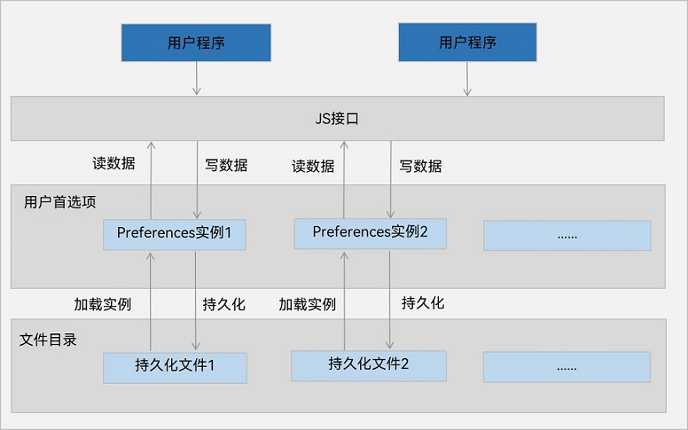

# 通过用户首选项实现数据持久化


## 场景介绍

用户首选项为应用提供Key-Value键值型的数据处理能力，支持应用持久化轻量级数据，并对其修改和查询。当用户希望有一个全局唯一存储的地方，可以采用用户首选项来进行存储。Preferences会将该数据缓存在内存中，当用户读取的时候，能够快速从内存中获取数据。Preferences会随着存放的数据量越多而导致应用占用的内存越大，因此，Preferences不适合存放过多的数据，适用的场景一般为应用保存用户的个性化设置（字体大小，是否开启夜间模式）等。


## 运作机制

如图所示，用户程序通过JS接口调用用户首选项读写对应的数据文件。开发者可以将用户首选项持久化文件的内容加载到Preferences实例，每个文件唯一对应到一个Preferences实例，系统会通过静态容器将该实例存储在内存中，直到主动从内存中移除该实例或者删除该文件。

应用首选项的持久化文件保存在应用沙箱内部，可以通过context获取其路径。具体可见[获取应用文件路径](../application-models/application-context-stage.md#获取应用文件路径)。

**图1** 用户首选项运作机制  




## 约束限制

- Key键为string类型，要求非空且长度不超过80个字节。

- 如果Value值为string类型，请使用UTF-8编码格式，可以为空，不为空时长度不超过8192个字节。

- 内存会随着存储数据量的增大而增大，所以存储的数据量应该是轻量级的，建议存储的数据不超过一万条，否则会在内存方面产生较大的开销。


## 接口说明

以下是用户首选项持久化功能的相关接口，更多接口及使用方式请见[用户首选项](../reference/apis/js-apis-data-preferences.md)。

  | 接口名称                                                                                             | 描述                                                         | 
|--------------------------------------------------------------------------------------------------|------------------------------------------------------------|
| getPreferences(context: Context, name: string, callback: AsyncCallback&lt;Preferences&gt;): void | 获取Preferences实例。                                           | 
| putSync(key: string, value: ValueType): void                | 将数据写入Preferences实例，可通过flush将Preferences实例持久化。该接口存在异步接口。    | 
| hasSync(key: string): void                                   | 检查Preferences实例是否包含名为给定Key的存储键值对。给定的Key值不能为空。该接口存在异步接口。    | 
| getSync(key: string, defValue: ValueType): void            | 获取键对应的值，如果值为null或者非默认值类型，返回默认数据defValue。该接口存在异步接口。         | 
| deleteSync(key: string): void                                   | 从Preferences实例中删除名为给定Key的存储键值对。该接口存在异步接口。                  | 
| flush(callback: AsyncCallback&lt;void&gt;): void                                                 | 将当前Preferences实例的数据异步存储到用户首选项持久化文件中。                       | 
| on(type: 'change', callback: Callback&lt;{ key : string }&gt;): void                             | 订阅数据变更，订阅的Key的值发生变更后，在执行flush方法后，触发callback回调。             | 
| off(type: 'change', callback?: Callback&lt;{ key : string }&gt;): void                           | 取消订阅数据变更。                                                  | 
| deletePreferences(context: Context, name: string, callback: AsyncCallback&lt;void&gt;): void     | 从内存中移除指定的Preferences实例。若Preferences实例有对应的持久化文件，则同时删除其持久化文件。 | 


## 开发步骤

1. 导入`@ohos.data.preferences`模块。
     
   ```js
   import dataPreferences from '@ohos.data.preferences';
   ```

2. 要通过用户首选项实现数据持久化，首先要获取Preferences实例。读取指定文件，将数据加载到Preferences实例，用于数据操作。

   Stage模型示例：

     
   ```js
   import UIAbility from '@ohos.app.ability.UIAbility';
   
   class EntryAbility extends UIAbility {
     onWindowStageCreate(windowStage) {
       try {
         dataPreferences.getPreferences(this.context, 'mystore', (err, preferences) => {
           if (err) {
             console.error(`Failed to get preferences. Code:${err.code},message:${err.message}`);
             return;
           }
           console.info('Succeeded in getting preferences.');
           // 请确保获取到Preferences实例后，再进行相关数据操作
         })
       } catch (err) {
         console.error(`Failed to get preferences. Code:${err.code},message:${err.message}`);
       }
     }
   }
   ```

   FA模型示例：

     
   ```js
   import featureAbility from '@ohos.ability.featureAbility';
   
   // 获取context
   let context = featureAbility.getContext();
   
   try {
     dataPreferences.getPreferences(context, 'mystore', (err, preferences) => {
       if (err) {
         console.error(`Failed to get preferences. Code:${err.code},message:${err.message}`);
         return;
       }
       console.info('Succeeded in getting preferences.');
       // 请确保获取到Preferences实例后，再进行相关数据操作
     })
   } catch (err) {
     console.error(`Failed to get preferences. Code is ${err.code},message:${err.message}`);
   }
   ```

3. 写入数据。

   使用putSync()方法保存数据到缓存的Preferences实例中。在写入数据后，如有需要，可使用flush()方法将Preferences实例的数据存储到持久化文件。

   > **说明：**
   >
   > 当对应的键已经存在时，putSync()方法会修改其值。可以使用hasSync()方法检查是否存在对应键值对。

   示例代码如下所示：

     
   ```js
   try {
     if (preferences.hasSync('startup')) {
       console.info("The key 'startup' is contained.");
     } else {
       console.info("The key 'startup' does not contain.");
       // 此处以此键值对不存在时写入数据为例
       preferences.putSync('startup', 'auto');
     }
   } catch (err) {
     console.error(`Failed to check the key 'startup'. Code:${err.code}, message:${err.message}`);
   }
   ```

4. 读取数据。

     使用getSync()方法获取数据，即指定键对应的值。如果值为null或者非默认值类型，则返回默认数据。示例代码如下所示：
     
   ```js
   try {
     let val = preferences.getSync('startup', 'default');
     console.info(`Succeeded in getting value of 'startup'. val: ${val}.`);
   } catch (err) {
     console.error(`Failed to get value of 'startup'. Code:${err.code}, message:${err.message}`);
   }
   ```

5. 删除数据。

   使用deleteSync()方法删除指定键值对，示例代码如下所示：

     
   ```js
   try {
     preferences.deleteSync('startup');
   } catch (err) {
     console.error(`Failed to delete the key 'startup'. Code:${err.code}, message:${err.message}`);
   }
   ```

6. 数据持久化。

     应用存入数据到Preferences实例后，可以使用flush()方法实现数据持久化。示例代码如下所示：
     
   ```js
   try {
     preferences.flush((err) => {
       if (err) {
         console.error(`Failed to flush. Code:${err.code}, message:${err.message}`);
         return;
       }
       console.info('Succeeded in flushing.');
     })
   } catch (err) {
     console.error(`Failed to flush. Code:${err.code}, message:${err.message}`);
   }
   ```

7. 订阅数据变更。

     应用订阅数据变更需要指定observer作为回调方法。订阅的Key值发生变更后，当执行flush()方法时，observer被触发回调。示例代码如下所示：
     
   ```js
   let observer = function (key) {
     console.info('The key' + key + 'changed.');
   }
   preferences.on('change', observer);
   // 数据产生变更，由'auto'变为'manual'
   preferences.put('startup', 'manual', (err) => {
     if (err) {
       console.error(`Failed to put the value of 'startup'. Code:${err.code},message:${err.message}`);
       return;
     }
     console.info("Succeeded in putting the value of 'startup'.");
     preferences.flush((err) => {
       if (err) {
         console.error(`Failed to flush. Code:${err.code}, message:${err.message}`);
         return;
       }
       console.info('Succeeded in flushing.');
     })
   })
   ```

8. 删除指定文件。

   使用deletePreferences()方法从内存中移除指定文件对应的Preferences实例，包括内存中的数据。若该Preference存在对应的持久化文件，则同时删除该持久化文件，包括指定文件及其备份文件、损坏文件。

   > **说明：**
   >
   > - 调用该接口后，应用不允许再使用该Preferences实例进行数据操作，否则会出现数据一致性问题。
   > 
   > - 成功删除后，数据及文件将不可恢复。

   示例代码如下所示：

     
   ```js
   try {
     dataPreferences.deletePreferences(this.context, 'mystore', (err, val) => {
       if (err) {
         console.error(`Failed to delete preferences. Code:${err.code}, message:${err.message}`);
         return;
       }
       console.info('Succeeded in deleting preferences.');
     })
   } catch (err) {
     console.error(`Failed to delete preferences. Code:${err.code}, message:${err.message}`);
   }
   ```

## 相关实例

针对用户首选项开发，有以下相关实例可供参考：

- [游戏2048（ArkTS）（API9）](https://gitee.com/openharmony/applications_app_samples/tree/master/code/Solutions/Game/Game2048)

- [图案密码锁（ArkTS）（API9）](https://gitee.com/openharmony/applications_app_samples/tree/master/code/Solutions/Tools/PatternLock)

- [首选项（ArkTS）（API9）](https://gitee.com/openharmony/applications_app_samples/tree/master/code/BasicFeature/DataManagement/Preferences)

- [首选项（ArkTS）（API9）](https://gitee.com/openharmony/codelabs/tree/master/Data/Preferences)

- [用户首选项（JS）（API9）](https://gitee.com/openharmony/codelabs/tree/master/Data/PreferenceJS)

- [备忘录（ArkTS）（API9）](https://gitee.com/openharmony/codelabs/tree/master/Data/NotePadOpenHarmony)

- [应用的首次启动（ArkTS）（API9）](https://gitee.com/openharmony/codelabs/tree/master/Data/FirstStartDemo)

- [应用内字体大小调节（ArkTS）（API9）](https://gitee.com/openharmony/codelabs/tree/master/Data/SetAppFontSize)