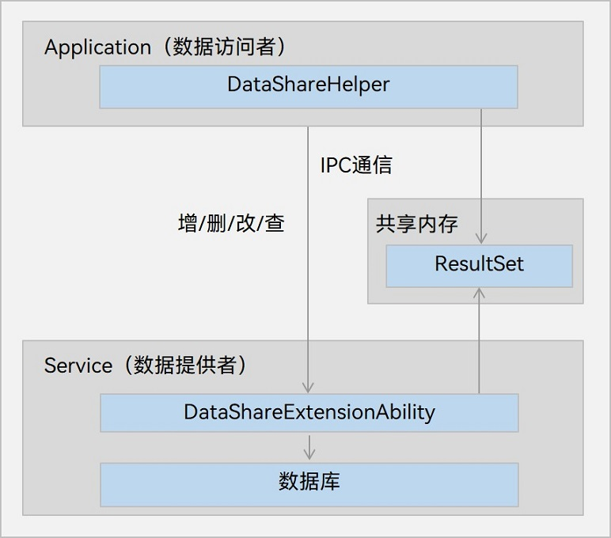

# 通过DataShareExtensionAbility实现数据共享


## 场景介绍

跨应用访问数据时，可以通过DataShareExtensionAbility拉起数据提供方的应用以实现对数据的访问。

此种方式支持跨应用拉起数据提供方的DataShareExtension，数据提供方的开发者可以在回调中实现灵活的业务逻辑。用于跨应用复杂业务场景。


## 运作机制

数据共享可分为数据的提供方和访问方两部分。

- 数据提供方：[DataShareExtensionAbility](../reference/apis/js-apis-application-dataShareExtensionAbility.md)，可以选择性实现数据的增、删、改、查，以及文件打开等功能，并对外共享这些数据。

- 数据访问方：由[createDataShareHelper()](../reference/apis/js-apis-data-dataShare.md#datasharecreatedatasharehelper)方法所创建的工具类，利用工具类，便可以访问提供方提供的这些数据。

**图1** 数据共享运作机制  


- DataShareExtensionAbility模块为数据提供方，实现跨应用数据共享的相关业务。

- DataShareHelper模块为数据访问方，提供各种访问数据的接口，包括增删改查等。

- 数据访问方与提供方通过IPC进行通信，数据提供方可以通过数据库实现，也可以通过其他数据存储方式实现。

- ResultSet模块通过共享内存实现，用于存储查询数据得到的结果集，并提供了遍历结果集的方法。


## 实现说明


### 数据提供方应用的开发（仅限系统应用）

[DataShareExtensionAbility](../reference/apis/js-apis-application-dataShareExtensionAbility.md)提供以下API，根据需要重写对应回调方法。

- **onCreate**：DataShare客户端连接DataShareExtensionAbility服务端时，服务端需要在此回调中实现初始化业务逻辑，该方法可以选择性重写。

- **insert**：业务函数，客户端请求插入数据时回调此接口，服务端需要在此回调中实现插入数据功能，该方法可以选择性重写。

- **update**：业务函数，客户端请求更新数据时回调此接口，服务端需要在此回调中实现更新数据功能，该方法可以选择性重写。

- **delete**：业务函数，客户端请求删除数据时回调此接口，服务端需要在此回调中实现删除数据功能，该方法可以选择性重写。

- **query**：业务函数，客户端请求查询数据时回调此接口，服务端需要在此回调中实现查询数据功能，该方法可以选择性重写。

- **batchInsert**：业务函数，客户端请求批量插入数据时回调此接口，服务端需要在此回调中实现批量插入数据的功能，该方法可以选择性重写。

- **normalizeUri**：业务函数，客户端给定的URI转换为服务端使用的URI时回调此接口，该方法可以选择性重写。

- **denormalizeUri**：业务函数，服务端使用的URI转换为客户端传入的初始URI时服务端回调此接口，该方法可以选择性重写。

开发者在实现一个数据共享服务时，需要在DevEco Studio工程中手动新建一个DataShareExtensionAbility，具体步骤如下。

1. 在工程Module对应的ets目录下，右键选择“New &gt; Directory”，新建一个目录并命名为DataShareExtAbility。

2. 在DataShareAbility目录，右键选择“New &gt; TypeScript File”，新建一个TypeScript文件并命名为DataShareExtAbility.ts。

3. 在DataShareExtAbility.ts文件中，导入
`@ohos.application.DataShareExtensionAbility`模块，开发者可根据应用需求选择性重写其业务实现。例如数据提供方只提供插入、删除和查询服务，则可只重写这些接口，并导入对应的基础依赖模块。
   
   ```ts
   import Extension from '@ohos.application.DataShareExtensionAbility';
   import dataSharePredicates from '@ohos.data.dataSharePredicates';
   import relationalStore from '@ohos.data.relationalStore';
   import Want from '@ohos.app.ability.Want';
   import { BusinessError } from '@ohos.base'
   ```

4. 数据提供方的业务实现由开发者自定义。例如可以通过数据库、读写文件或访问网络等各方式实现数据提供方的数据存储。
   
   ```ts
   const DB_NAME = 'DB00.db';
   const TBL_NAME = 'TBL00';
   const DDL_TBL_CREATE = "CREATE TABLE IF NOT EXISTS "
     + TBL_NAME
     + ' (id INTEGER PRIMARY KEY AUTOINCREMENT, name TEXT, age INTEGER, isStudent BOOLEAN, Binary BINARY)';

   let rdbStore: relationalStore.RdbStore;
   let result: string;

   export default class DataShareExtAbility extends Extension {
     // 重写onCreate接口
     onCreate(want: Want, callback: Function) {
       result = this.context.cacheDir + '/datashare.txt';
       // 业务实现使用RDB
       relationalStore.getRdbStore(this.context, {
         name: DB_NAME,
         securityLevel: relationalStore.SecurityLevel.S1
       }, (err, data) => {
         rdbStore = data;
         rdbStore.executeSql(DDL_TBL_CREATE, [], (err) => {
           console.info(`DataShareExtAbility onCreate, executeSql done err:${err}`);
         });
         if (callback) {
           callback();
         }
       });
     }

     // 重写query接口
     query(uri: string, predicates: dataSharePredicates.DataSharePredicates, columns: Array<string>, callback: Function) {
       if (predicates === null || predicates === undefined) {
         console.info('invalid predicates');
       }
       try {
         rdbStore.query(TBL_NAME, predicates, columns, (err, resultSet) => {
           if (resultSet !== undefined) {
             console.info(`resultSet.rowCount:${resultSet.rowCount}`);
           }
           if (callback !== undefined) {
             callback(err, resultSet);
           }
         });
       } catch (err) {
         let code = (err as BusinessError).code;
         let message = (err as BusinessError).message
         console.error(`Failed to query. Code:${code},message:${message}`);
       }
     }
     // 可根据应用需求，选择性重写各个接口
   };
   ```

5. 在module.json5中定义DataShareExtensionAbility。

     **表1** module.json5对应属性字段
   
   | 属性名称 | 备注说明 | 必填 | 
   | -------- | -------- | -------- |
   | name | Ability名称，对应Ability派生的ExtensionAbility类名。 | 是 | 
   | type | Ability类型，DataShare对应的Ability类型为“dataShare”，表示基于datashare模板开发的。 | 是 | 
   | uri | 通信使用的URI，是客户端链接服务端的唯一标识。 | 是 | 
   | exported | 对其他应用是否可见，设置为true时，才能与其他应用进行通信传输数据。 | 是 | 
   | readPermission | 访问数据时需要的权限，不配置默认不进行读权限校验。 | 否 | 
   | writePermission | 修改数据时需要的权限，不配置默认不进行写权限校验。 | 否 | 
   | metadata   | 增加静默访问所需的额外配置项，包含name和resource字段。<br /> name类型固定为"ohos.extension.dataShare"，是配置的唯一标识。 <br /> resource类型固定为"$profile:data_share_config"，表示配置文件的名称为data_share_config.json。 | 若Ability启动模式为"singleton"，则metadata必填，Ability启动模式可见[abilities对象的内部结构-launchType](../quick-start/module-structure.md#abilities对象的内部结构)；其他情况下无需填写。 | 

   **module.json5配置样例：**
   
   ```json
   "extensionAbilities": [
     {
       "srcEntry": "./ets/DataShareExtAbility/DataShareExtAbility.ts",
       "name": "DataShareExtAbility",
       "icon": "$media:icon",
       "description": "$string:description_datashareextability",
       "type": "dataShare",
       "uri": "datashareproxy://com.samples.datasharetest.DataShare",
       "exported": true,
       "metadata": [{"name": "ohos.extension.dataShare", "resource": "$profile:data_share_config"}]
     }
   ]
   ```
   
   **表2** data_share_config.json对应属性字段

   | 属性名称          | 备注说明                                     | 必填   |
   | ------------- | ---------------------------------------- | ---- |
   | tableConfig   | 配置标签。                                    | 是    |
   | uri           | 指定配置生效的范围，uri支持以下三种格式，优先级为**表配置>库配置>\***，如果同时配置，高优先级会覆盖低优先级 。<br /> 1. "*" : 所有的数据库和表。<br /> 2. "datashareproxy://{bundleName}/{moduleName}/{storeName}" : 指定数据库。<br /> 3. "datashareproxy://{bundleName}/{moduleName}/{storeName}/{tableName}" : 指定表。 | 是    |
   | crossUserMode | 标识数据是否为多用户共享，配置为1则多用户数据共享，配置为2则多用户数据隔离。  | 是    |

   **data_share_config.json配置样例**

   ```json
   "tableConfig": [
    {
      "uri": "*",
      "crossUserMode": 1
    },
    {
      "uri": "datashareproxy://com.acts.datasharetest/entry/DB00",
      "crossUserMode": 1
    },
    {
      "uri": "datashareproxy://com.acts.datasharetest/entry/DB00/TBL00",
      "crossUserMode": 2
    }
   ]
   ```


### 数据访问方应用的开发

1. 导入基础依赖包。
   
   ```ts
   import UIAbility from '@ohos.app.ability.UIAbility';
   import dataShare from '@ohos.data.dataShare';
   import dataSharePredicates from '@ohos.data.dataSharePredicates';
   import { ValuesBucket } from '@ohos.data.ValuesBucket'
   import window from '@ohos.window';
   ```

2. 定义与数据提供方通信的URI字符串。
   
   ```ts
   // 作为参数传递的URI，与module.json5中定义的URI的区别是多了一个"/"，是因为作为参数传递的URI中，在第二个与第三个"/"中间，存在一个DeviceID的参数
   let dseUri = ('datashareproxy://com.samples.datasharetest.DataShare');
   ```

3. 创建工具接口类对象。
   
   ```ts
   let dsHelper: dataShare.DataShareHelper | undefined = undefined;
   let abilityContext: Context;

   export default class EntryAbility extends UIAbility {
     onWindowStageCreate(windowStage: window.WindowStage) {
       abilityContext = this.context;
       dataShare.createDataShareHelper(abilityContext, dseUri, (err, data) => {
         dsHelper = data;
       });
     }
   }
   ```

4. 获取到接口类对象后，便可利用其提供的接口访问提供方提供的服务，如进行数据的增删改查等。
   
   ```ts
   // 构建一条数据
   let key1 = 'name';
   let key2 = 'age';
   let key3 = 'isStudent';
   let key4 = 'Binary';
   let valueName1 = 'ZhangSan';
   let valueName2 = 'LiSi';
   let valueAge1 = 21;
   let valueAge2 = 18;
   let valueIsStudent1 = false;
   let valueIsStudent2 = true;
   let valueBinary = new Uint8Array([1, 2, 3]);
   let valuesBucket: ValuesBucket = { key1: valueName1, key2: valueAge1, key3: valueIsStudent1, key4: valueBinary };
   let updateBucket: ValuesBucket = { key1: valueName2, key2: valueAge2, key3: valueIsStudent2, key4: valueBinary };
   let predicates = new dataSharePredicates.DataSharePredicates();
   let valArray = ['*'];
   if (dsHelper != undefined) {
     // 插入一条数据
     (dsHelper as dataShare.DataShareHelper).insert(dseUri, valuesBucket, (err, data) => {
       console.info(`dsHelper insert result:${data}`);
     });
     // 更新数据
     (dsHelper as dataShare.DataShareHelper).update(dseUri, predicates, updateBucket, (err, data) => {
       console.info(`dsHelper update result:${data}`);
     });
     // 查询数据
     (dsHelper as dataShare.DataShareHelper).query(dseUri, predicates, valArray, (err, data) => {
       console.info(`dsHelper query result:${data}`);
     });
     // 删除指定的数据
     (dsHelper as dataShare.DataShareHelper).delete(dseUri, predicates, (err, data) => {
       console.info(`dsHelper delete result:${data}`);
     });
   }
   ```

## 相关实例

针对数据共享开发，有以下相关实例可供参考：

- [系统应用跨应用数据共享（ArkTS）（Full SDK）（API9）](https://gitee.com/openharmony/applications_app_samples/tree/master/code/SystemFeature/DataManagement/CrossAppDataShare)