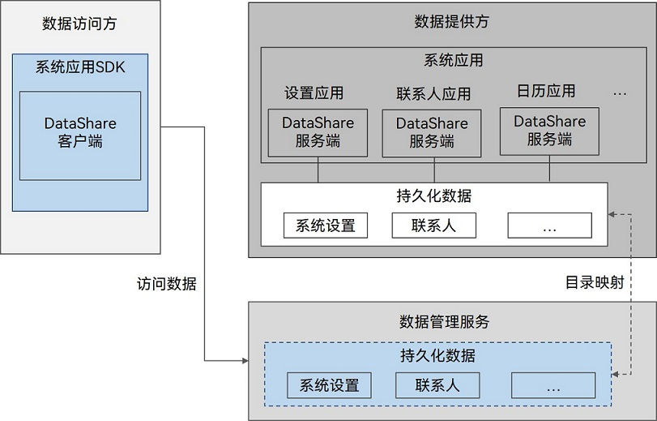

# 通过数据代理服务实现数据共享


## 场景介绍

典型跨应用访问数据的用户场景下，数据提供者会存在多次被拉起的情况。

为了降低数据提供者拉起次数，提高访问速度，OpenHarmony提供了一种不拉起数据提供方直接访问数据库的方式，即静默数据访问。

静默数据访问通过数据代理服务进行数据的访问和修改，无需拉起数据提供者。

静默数据仅支持数据库的基本访问或数据托管，如果有业务处理，需要将业务处理放到提供给数据访问方的SDK中。

如果业务过于复杂，无法放到数据访问方，建议通过DataShareExtensionAbility拉起数据提供方实现功能

## 基本概念

- **数据提供者**：指数据的归属应用，配置数据的访问权限和范围；
- **数据访问者**：指数据的访问者，向数据代理服务请求数据的应用；
- **数据管理服务**：代理访问数据的常驻系统服务。


## 运作机制

可以通过数据代理服务进行代理访问的数据分为以下两种

1. 持久化数据：归属于数据提供者的数据库，这类数据存储于数据提供方的沙箱，可以在数据提供者中通过声明的方式进行共享，按表为粒度配置为可以被其他应用访问的数据表；

2. 过程数据：托管在数据管理服务上的过程数据，这类数据存存储于数据管理服务的沙箱，格式为json或byte数据，无人订阅10天后自动删除。

   | 数据类型  | 存储位置      | 数据格式        | 有效期          | 适用场景                     |
   | ----- | --------- | ----------- | ------------ | ------------------------ |
   | 持久化数据 | 数据提供方的沙箱  | 数据库中的数据表    | 永久存储         | 数据格式类似关系型数据库，如日程，会议等     |
   | 过程数据  | 数据管理服务的沙箱 | json或byte数据 | 无人订阅10天后自动删除 | 数据有时效性，且格式较简单，如步数，天气，心率等 |

   ​

图1** 静默数据访问视图



- 和跨应用数据共享方式不同的是，静默数据访问借助数据管理服务通过目录映射方式直接读取数据提供方的配置，按规则进行预处理后，并访问数据库。

- 数据访问方如果使用静默数据访问方式，URI需严格按照如下格式：
  datashare:///{bundleName}/{dataPath}

  数据管理服务会读取对应bundleName作为数据提供方应用，读取配置，进行权限校验并访问对应数据。

  dataPath为数据标识，可以自行定义，在同一个数据提供者应用中需要保持唯一。


## 约束与限制

- 目前持久化数据中仅关系型数据库支持静默数据访问方式。
- 整个系统最多同时并发16路查询，有多出来的查询请求需要排队处理。
- 持久化数据不支持代理创建数据库，如果需要创建数据库，需要拉起数据提供方。
- 数据提供者如果是normal级别签名的应用，配置的数据读写权限必须为system_basic及以上权限。


## 接口说明

以下是静默数据访问的相关接口，大部分为异步接口。异步接口均有callback和Promise两种返回形式，下表均以callback形式为例，更多接口及使用方式请见[数据共享](../reference/apis/js-apis-data-dataShare.md)。

通用接口

| 接口名称                                     | 描述                   |
| ---------------------------------------- | -------------------- |
| createDataShareHelper(context: Context, uri: string, options: DataShareHelperOptions, callback: AsyncCallback&lt;DataShareHelper&gt;): void | 创建DataShareHelper实例。 |

持久化数据

| 接口名称                                     | 描述                   |
| ---------------------------------------- | -------------------- |
| insert(uri: string, value: ValuesBucket, callback: AsyncCallback&lt;number&gt;): void | 向目标表中插入一行数据。         |
| delete(uri: string, predicates: dataSharePredicates.DataSharePredicates, callback: AsyncCallback&lt;number&gt;): void | 从数据库中删除一条或多条数据记录。    |
| query(uri: string, predicates: dataSharePredicates.DataSharePredicates, columns: Array&lt;string&gt;, callback: AsyncCallback&lt;DataShareResultSet&gt;): void | 查询数据库中的数据            |
| update(uri: string, predicates: dataSharePredicates.DataSharePredicates, value: ValuesBucket, callback: AsyncCallback&lt;number&gt;): void | 更新数据库中的数据记录          |
| addTemplate(uri: string, subscriberId: string, template: Template): void | 添加一个指定订阅者的数据模板。      |
| on(type: 'rdbDataChange', uris: Array&lt;string&gt;, templateId: TemplateId, callback: AsyncCallback&lt;RdbDataChangeNode&gt;): Array&lt;OperationResult | 订阅指定URI和模板对应的数据变更事件。 |

过程数据

| 接口名称                                     | 描述                 |
| ---------------------------------------- | ------------------ |
| publish(data: Array&lt;PublishedItem&gt;, bundleName: string, version: number, callback: AsyncCallback&lt;Array&lt;OperationResult&gt;&gt;): void | 发布数据，将数据托管至数据管理服务。 |
| on(type: 'publishedDataChange', uris: Array&lt;string&gt;, subscriberId: string, callback: AsyncCallback&lt;PublishedDataChangeNode&gt;): Array&lt;OperationResult&gt; | 订阅已发布数据的数据变更通知。    |


## 持久化数据实现说明

首先，以共享一个关系型数据库为例，说明开发步骤。

### 数据提供方应用的开发

1. 数据提供者需要在module.json5中的proxyDatas节点定义要共享的表的标识，读写权限和基本信息

   1. **表1** module.json5对应属性字段

   | 属性名称                    | 备注说明                                     | 必填   |
   | ----------------------- | ---------------------------------------- | ---- |
   | uri                     | 数据使用的URI，是跨应用数据访问的唯一标识。                  | 是    |
   | requiredReadPermission  | 访问数据时需要的权限，不配置默认不允许其他APP访问数据。            | 否    |
   | requiredWritePermission | 修改数据时需要的权限，不配置默认不允许其他APP修改数据。            | 否    |
   | metadata                | 数据源的信息，包含name和resource字段。<br /> name类型固定为"dataProperties"，是配置的唯一标识。 <br /> resource类型固定为"$profile:{fileName}"，表示配置文件的名称为{fileName}.json。 | 是    |

      **module.json5配置样例：**

   ```json
     "proxyDatas":[
         {
             "uri": "datashareproxy://com.acts.ohos.data.datasharetest/test",
             "requiredReadPermission":"ohos.permission.GET_BUNDLE_INFO",
             "requiredWritePermission":"ohos.permission.GET_BUNDLE_INFO",
             "metadata": {
                 "name": "dataProperties",
                 "resource": "$profile:test"
             }
         }
       ]
   ```

      **表2** test.json对应属性字段

   | 属性名称        | 备注说明                                     | 必填   |
   | ----------- | ---------------------------------------- | ---- |
   | tableConfig | 配置标签。                                    | 是    |
   | path        | 指定数据源路径，目前支持关系型数据库，配置为库名/表名              | 是    |
   | type        | 标识数据库类型，目前支持配置为rdb，表示关系型数据库。             | 是    |
   | scope       | 数据库所在范围。<br>1.module表示数据库位于本模块下；<br>2.application表示数据库位于本应用下。 | 否    |

      **test.json配置样例**

   ```json
      "tableConfig": [
          {
              "path": "DB00/TBL00",
              "type": "rdb",
              "scope": "application"
          }
      ]
   ```

   ### 数据访问方应用的开发


   1. 导入基础依赖包。

      ```js
      import dataShare from '@ohos.data.dataShare';
      import dataSharePredicates from '@ohos.data.dataSharePredicates';
      ```

   2. 定义与数据提供方通信的URI字符串。

      ```js
      let dseUri = ('datashareproxy://com.acts.ohos.data.datasharetest/test');
      ```

   3. 创建工具接口类对象。

      ```js
      let dsHelper;
      let abilityContext;

      export default class EntryAbility extends UIAbility {
        onWindowStageCreate(windowStage) {
          abilityContext = this.context;
          dataShare.createDataShareHelper(abilityContext, dseUri, {isProxy : true}, (err, data) => {
            dsHelper = data;
          });
        }
      }
      ```

   4. 获取到接口类对象后，便可利用其提供的接口访问提供方提供的服务，如进行数据的增删改查等。

      ```js
      // 构建一条数据
      let valuesBucket = { 'name': 'ZhangSan', 'age': 21, 'isStudent': false, 'Binary': new Uint8Array([1, 2, 3]) };
      let updateBucket = { 'name': 'LiSi', 'age': 18, 'isStudent': true, 'Binary': new Uint8Array([1, 2, 3]) };
      let predicates = new dataSharePredicates.DataSharePredicates();
      let valArray = ['*'];
      // 插入一条数据
      dsHelper.insert(dseUri, valuesBucket, (err, data) => {
        console.info(`dsHelper insert result:${data}`);
      });
      // 更新数据
      dsHelper.update(dseUri, predicates, updateBucket, (err, data) => {
        console.info(`dsHelper update result:${data}`);
      });
      // 查询数据
      dsHelper.query(dseUri, predicates, valArray, (err, data) => {
        console.info(`dsHelper query result:${data}`);
      });
      // 删除指定的数据
      dsHelper.delete(dseUri, predicates, (err, data) => {
        console.info(`dsHelper delete result:${data}`);
      });

      ```

   5. 对指定的数据进行订阅

      ```js
      function onCallback(err, node:dataShare.RdbDataChangeNode) {
          console.info("uri " + JSON.stringify(node.uri));
          console.info("templateId " + JSON.stringify(node.templateId));
          console.info("data length " + node.data.length);
          for (let i = 0; i < node.data.length; i++) {
              console.info("data " + node.data[i]);
          }
      }
      let template = {
          predicates : {
              "p1" : "select * from TBL00",
              "p2" : "select name from TBL00",
          },
          scheduler : ""
      }
      dsProxyHelper.addTemplate(dseUri, "111", template);
      let templateId:dataShare.TemplateId = {subscriberId:"111", bundleNameOfOwner:"com.acts.ohos.data.datasharetestclient"}
      // 使用数据管理服务修改数据时触发onCallback回调，回调内容是template中的规则查到的数据
      let result:Array<dataShare.OperationResult> = dsProxyHelper.on("rdbDataChange", [dseUri], templateId, onCallback);

      ```

## 过程数据实现说明

以托管一份过程数据维为例，说明开发步骤。

### 数据提供方应用的开发（可选）

数据提供者可以在module.json5中的proxyDatas节点定义要共享的表的标识，读写权限和基本信息

> 注意：该步骤为可选，如果不在module.json5中的proxyDatas配置，则认为
>
> 1. 托管数据不允许其他应用访问。
> 2. 不配置proxyDatas时，数据标识可以为简写，发布，订阅，查询数据可以用简写的数据标识，如weather, 可以不用全写为datashareproxy://com.acts.ohos.data.datasharetest/weather

1. **表1** module.json5对应属性字段

| 属性名称                    | 备注说明                          | 必填   |
| ----------------------- | ----------------------------- | ---- |
| uri                     | 数据使用的URI，是跨应用数据访问的唯一标识。       | 是    |
| requiredReadPermission  | 访问数据时需要的权限，不配置默认不允许其他APP访问数据。 | 否    |
| requiredWritePermission | 修改数据时需要的权限，不配置默认不允许其他APP修改数据。 | 否    |

   **module.json5配置样例：**

```json
  "proxyDatas":[
      {
          "uri": "datashareproxy://com.acts.ohos.data.datasharetest/weather",
          "requiredReadPermission":"ohos.permission.GET_BUNDLE_INFO",
          "requiredWritePermission":"ohos.permission.GET_BUNDLE_INFO",
      }
    ]
```

### 数据访问方应用的开发

1. 导入基础依赖包。

   ```js
   import dataShare from '@ohos.data.dataShare';
   ```

2. 创建工具接口类对象。

   ```js
   let dsHelper;
   let abilityContext;

   export default class EntryAbility extends UIAbility {
     onWindowStageCreate(windowStage) {
       abilityContext = this.context;
       dataShare.createDataShareHelper(abilityContext, dseUri, {isProxy : true}, (err, data) => {
         dsHelper = data;
       });
     }
   }
   ```

3. 获取到接口类对象后，便可利用其提供的接口访问提供方提供的服务，如进行数据的增删改查等。

   ```js
   // 构建三条数据，第一条为免配置的数据，仅自己使用
   let data : Array<dataShare.PublishedItem> = [
     {key:"city", subscriberId:"11", data:"xian"},
     {key:"datashareproxy://com.acts.ohos.data.datasharetest/weather", subscriberId:"11", data:JSON.stringify("Qing")}];
   // 发布数据
    let result: Array<dataShare.OperationResult> = await dsProxyHelper.publish(data, "com.acts.ohos.data.datasharetestclient");
   ```

4. 对指定的数据进行订阅

   ```js
   function onPublishCallback(err, node:dataShare.PublishedDataChangeNode) {
       console.info("onPublishCallback");
   }
   let uris:Array<string> = ["city", "datashareproxy://com.acts.ohos.data.datasharetest/weather"];
   let result: Array<dataShare.OperationResult> = dsProxyHelper.on("publishedDataChange", uris, "11", onPublishCallback);
   ```

   ​

