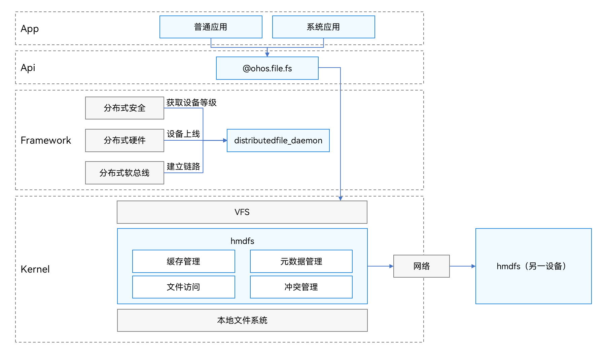

# 分布式文件系统概述

分布式文件系统（hmdfs，OpenHarmony Distributed File System）提供跨设备的文件访问能力，适用于如下场景：

- 两台设备组网，用户可以利用一台设备上的编辑软件编辑另外一台设备上的文档。

- 平板保存的音乐，车载系统直接可见并可播放。

- 户外拍摄的照片，回家打开平板直接访问原设备拍摄的照片。

hmdfs在分布式软总线动态组网的基础上，为网络上各个设备结点提供一个全局一致的访问视图，支持开发者通过基础文件系统接口进行读写访问，具有高性能、低延时等优点。

## 分布式文件系统架构

- distributedfile_daemon：主要负责设备上线监听、通过软总线建立链路，并根据分布式的设备安全等级执行不同的数据流转策略。

- hmdfs：实现在内核的网络文件系统，包括缓存管理、文件访问、元数据管理和冲突管理等。
  - 缓存管理
     - 设备分布式组网后，hmdfs提供文件的互访能力，但不会主动进行文件数据传输和拷贝。如果应用需要将数据保存到本地，需主动拷贝。
     - hmdfs保证Close-to-Open的一致性，即一端写关闭后，另外一端可以读取到最新数据，不保证文件内容的实时一致性。
     - 数据在远端写入，但是由于网络原因未及时回刷，文件系统会在下次网络接入时回刷本地，但是如果远端已修改则无法回刷。
  - 文件访问
     - 文件访问接口与本地一致（[ohos.file.fs](../reference/apis/js-apis-file-fs.md)）。
     - 如果文件在本地，则堆叠访问本地文件系统。
     - 如果文件在其他设备，则同步网络访问远端设备文件。
        > **说明：**
        >
        > symlink：不支持。
  - 元数据管理
     - 分布式组网下，文件一端创建、删除、修改，另一端可以“立即”查看到最新文件，看到速度取决于网络情况。
     - 远端设备离线后，该设备数据将不再在本端设备呈现。但由于设备离线的感知具有延迟，可能会造成部分消息4s超时，因此开发者需要考虑接口的网络超时或一些文件虽然可以看到，但实际设备可能已离线的场景。
  - 冲突处理
     - 本地与远端冲突 ，远端文件被重命名，看到的同名文件是本地同名文件，远端文件被重命名。
     - 远端多个设备冲突，以接入本设备ID为顺序，显示设备ID小的同名文件，其他文件被依次重命名。
     - 如果组网场景，目录树下已经有远端文件，创建同名文件，提示文件已存在。
     - 冲突文件显示_conflict_dev后依次加id，id从1自动递增。
     - 同名目录之间仅融合不存在冲突，文件和远端目录同名冲突，远端目录后缀加_remote_directory。
