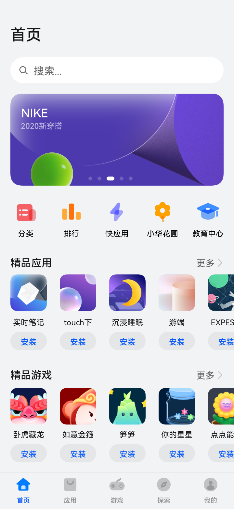
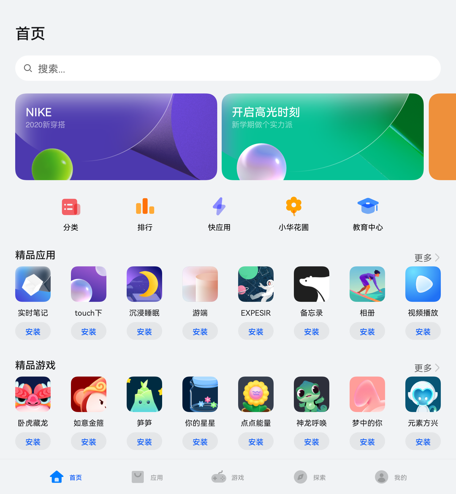
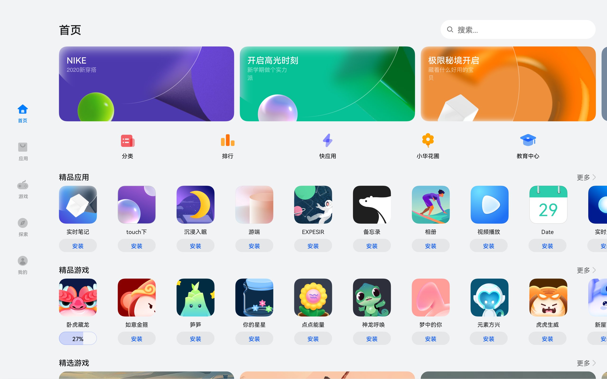
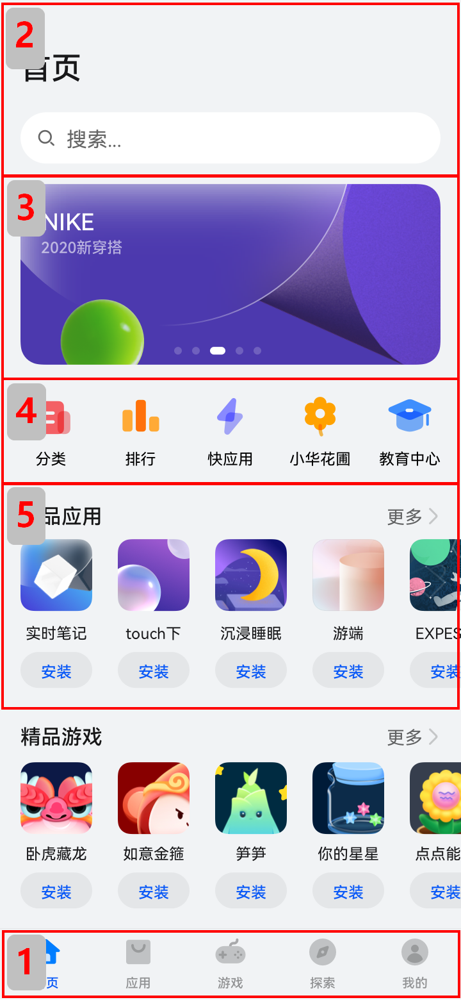
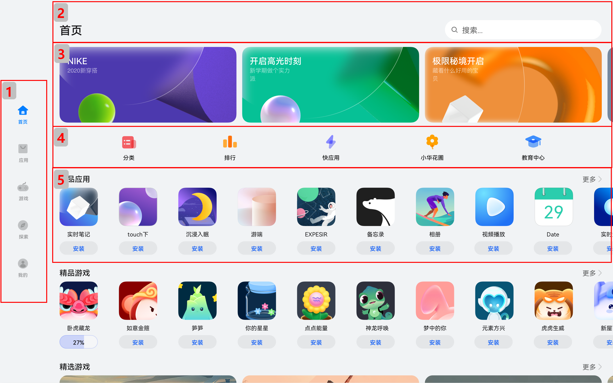
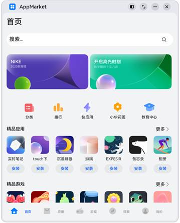
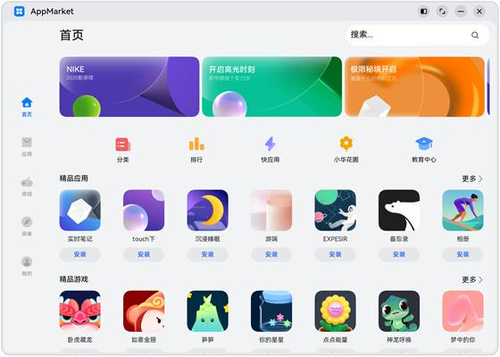

# 应用市场首页


本小节将以应用市场首页为例，介绍如何使用自适应布局能力和响应式布局能力适配不同尺寸窗口。


## 页面设计

一个典型的应用市场首页的UX设计如下所示。

  | sm | md | lg | 
| -------- | -------- | -------- |
|  |  |  | 

观察应用市场首页的页面设计，不同断点下的页面设计有较多相似的地方。

据此，我们可以将页面分拆为多个组成部分。

1. 底部/侧边导航栏

2. 标题栏与搜索栏

3. 运营横幅

4. 快捷入口

5. 精品应用

  | sm | md | lg | 
| -------- | -------- | -------- |
|  |  |  | 

接下来我们逐一分析各部分的实现。


## 底部/侧边导航栏

在sm和md断点下，导航栏在底部；在lg断点下，导航栏在左侧。可以通过[Tab组件](../../reference/arkui-ts/ts-container-tabs.md)的barPosition和vertical属性控制TabBar的位置，同时还可以通过barWidth和barHeight属性控制TabBar的尺寸。

  
```
@Entry
@Component
struct Index {
  ...
  build() {
    // 设置TabBar在主轴方向起始或结尾位置
    Tabs({ barPosition: this.currentBreakpoint === "lg" ? BarPosition.Start : BarPosition.End }) {
      // 首页
      TabContent() {
        Home()
      }.tabBar(this.tabItem1)
      TabContent() {}.tabBar(this.tabItem2)
      TabContent() {}.tabBar(this.tabItem3)
      TabContent() {}.tabBar(this.tabItem4)
      TabContent() {}.tabBar(this.tabItem5)
    }
    .backgroundColor('#F1F3F5')
    .barMode(BarMode.Fixed)
    .barWidth(this.currentBreakpoint === "lg" ? 96 : '100%')
    .barHeight(this.currentBreakpoint === "lg" ? '60%' : 56)
    // 设置TabBar放置在水平或垂直方向
    .vertical(this.currentBreakpoint === "lg") 
  }
}
```

另外在sm及lg断点下，TabBar中各个Item的图标和文字是按照垂直方向排布的，在md断点下，TabBar中各个Item的图标和文字是按照水平方向排布的。

  
```
@Component
export default struct TabBarItem {
  ...
  build() {
    if (this.currentBreakpoint !== 'md' ) {
      // sm及lg断点下，tabBarItem中的图标和文字垂直排布
      Column() {
        ...
      }.justifyContent(FlexAlign.Center).height('100%').width('100%')
    } else {
      // md断点下，tabBarItem中的图标和文字水平排布
      Row() {
        ....
      }.justifyContent(FlexAlign.Center).height('100%').width('100%')
    }
  }
}
```


## 标题栏与搜索栏

标题栏和搜索栏，在sm和md断点下分两行显示，在lg断点下单行显示，可以通过栅格实现。在sm和md断点下，标题栏和搜索栏占满12列，此时会自动换行显示。在lg断点下，标题栏占8列而搜索栏占4列，此时标题栏和搜索栏在同一行中显示。

  |  | sm/md | lg | 
| -------- | -------- | -------- |
| 效果图 |  |  | 
| 栅格布局图 |  |  | 

  
```
@Component
export default struct IndexHeader {
  ...
  build() {
    // 借助栅格实现标题栏和搜索栏在不同断点下的不同布局效果。
    GridRow() {
      GridCol({ span: { xs: 12, lg: 8 } }) {
        this.titleBar()
      }
      GridCol({ span: { xs: 12, lg: 4 } }) {
        this.searchBar()
      }
    }
    .width('100%')
  }
}
```


## 运营横幅

不同断点下的运营横幅，sm断点下显示一张图片，md断点下显示两张图片，lg断点下显示三张图片。可以通过[Swiper组件的displayCount属性](../../reference/arkui-ts/ts-container-swiper.md)实现目标效果。

  
```
@Component
export default struct IndexSwiper {
  ...
  @Builder swiperItem(imageSrc) {
    Image(imageSrc)
      .width('100%')
      .aspectRatio(2.5)
      .objectFit(ImageFit.Fill)
  }

  build() {
    Swiper() {
      this.swiperItem($r('app.media.ic_public_swiper1'))
      this.swiperItem($r('app.media.ic_public_swiper2'))
      this.swiperItem($r('app.media.ic_public_swiper3'))
      ...
    }
    .autoPlay(true)
    .indicator(false)
    .itemSpace(10)
    // 配置不同断点下运行横幅中展示的图片数量
    .displayCount(this.currentBreakpoint === 'sm' ? 1 : (this.currentBreakpoint === 'md' ? 2 : 3))
    .width('100%')
    .padding({ left: 12, right: 12, bottom: 16, top: 16 })
  }
}
```


## 快捷入口

在不同的断点下，快捷入口的5个图标始终均匀排布，这是典型的均分能力使用场景。

  
```
@Component
@Component
export default struct IndexEntrance {
  build() {
    // 将justifyContent参数配置为FlexAlign.SpaceEvenly实现均分布局
    Row() {
      ForEach(entranceIcons, (icon: AllIcons) => {
        // 各快捷入口的图标及名称
        Column() { ... }
      })
    }
    .width('100%')
    .height(64)
    .justifyContent(FlexAlign.SpaceEvenly)
    .padding({ left: 12, right: 12 })
  }
}
```


## 精品应用

随着可用显示区域的增加，精品应用中显示的图标数量也不断增加，这是典型的延伸能力使用场景。精品游戏的实现与精品应用类似，不再展开分析。

  
```
@Component
@Component
export default struct IndexApps {
  ...
  build() {
    Column() {
      this.appListHeader()
      // 借助List组件能力，实现延伸能力场景
      List({ space: this.currentBreakpoint === 'lg' ? 44 : 20}) {
        LazyForEach(new MyAppSource(this.apps), app => {
          ListItem() {
            // 每个应用的图标、名称及安装按钮
            this.appListItem(app)
          }
        }, app => app.id)
      }
      .width('100%')
      .height(this.currentBreakpoint === 'lg' ? 140 : 120)
      .listDirection(Axis.Horizontal)
    }
    .width('100%')
    .height(this.currentBreakpoint === 'lg' ? 188 : 164)
    .padding({ bottom: 8, left: 12, right: 12 })
  }
}
```


## 运行效果

将上述各页面主要部分组合在一起后，即可完成整体页面开发。

  
```
@Component
struct IndexContent {
  ...
  build() {
    List() {
      // 运营横幅
      ListItem() {
        IndexSwiper()
      }
      // 快捷入口
      ListItem() {
        IndexEntrance()
      }
      // 精品应用
      ListItem() {
        IndexApps({ title: $r('app.string.boutique_application'), apps: appList })
      }
      // 精品游戏
      ListItem() {
        IndexApps({ title: $r('app.string.boutique_game'), apps: gameList })
      }
    }
    .width("100%")
  }
}

@Component
export default struct Home {
  ...
  build() {
    Flex({ direction: FlexDirection.Column, justifyContent: FlexAlign.Start, alignItems: ItemAlign.Start }) {
      // 标题栏和搜索栏
      IndexHeader()
      // 运营横幅、快捷入口、精品应用、精品游戏等
      IndexContent()
    }
    .height('100%')
    .backgroundColor("#F1F3F5")
  }
}
```

本页面的实际运行效果如下图所示。

  | sm | md | lg | 
| -------- | -------- | -------- |
|  |  |  | 

## 相关实例

针对应用市场首页开发，有以下相关实例可供参考：

应用市场首页：[应用市场首页应用示例](https://gitee.com/openharmony/applications_app_samples/tree/master/code/SuperFeature/MultiDeviceAppDev/AppMarket)
<!--no_check-->