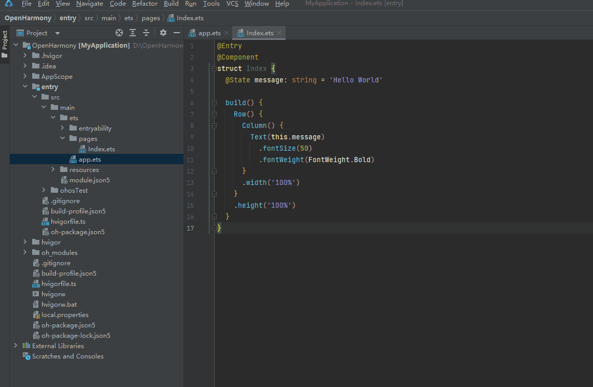

# 功能开发的一多能力介绍
应用开发至少包含两部分工作： UI页面开发和底层功能开发（部分需要联网的应用还会涉及服务端开发）。前面章节介绍了如何解决页面适配的问题，本章节主要介绍应用如何解决设备系统能力差异的兼容问题。

## 系统能力

[系统能力](../../reference/syscap.md)（即SystemCapability，缩写为SysCap）指操作系统中每一个相对独立的特性，如蓝牙，WIFI，NFC，摄像头等，都是系统能力之一。每个系统能力对应多个API，随着目标设备是否支持该系统能力共同存在或消失。


与系统能力相关的，有支持能力集、联想能力集和要求能力集三个核心概念。

- **支持能力集**：设备具备的系统能力集合，在设备配置文件中配置。
- **要求能力集**：应用需要的系统能力集合，在应用配置文件中配置。
- **联想能力集**：开发应用时IDE可联想的API所在的系统能力集合，在应用配置文件中配置。

>  **说明：**
>
> - 只有当应用要求能力集是设备支持能力集的子集的时候，应用才可以在该设备上分发、安装和运行。
> - 可以访问[系统能力列表](../../reference/syscap-list.md)了解OpenHarmony全量的系统能力。
> - OpenHarmony支持的设备类型分为两大类： 典型设备和厂商自定义设备。默认设备、平板等常用的设备类型属于典型设备，其它的属于厂商自定义设备。对于典型设备，系统已经预定义了相应的系统能力集合；对于厂商自定义设备，需要厂商给出其系统能力集合的定义。

## 开发指导
 ### 设备要求能力集的获取及导入

对于厂商自定义设备，需要开发者自行从厂商处获取该设备的要求能力集并导入到IDE中。

在IDE中点击File->New->Import...后选择“Import Product Compatibility ID”即可选择及导入设备要求能力集，导入后的设备要求能力集会被写入工程的syscap.json文件中。


### 多设备应用开发
开发多设备应用时，工程中默认的要求能力集是多个设备支持能力集的交集，默认的联想能力集是多个设备支持能力集的并集。

- 开发者可以在运行时动态判断某设备是否支持特定的系统能力。

- 开发者可以自行修改联想能力集和要求能力集。

**动态逻辑判断**

如果某个系统能力没有写入应用的要求能力集中，那么在使用前需要判断设备是否支持该系统能力。

- 方法1：OpenHarmony定义了API canIUse帮助开发者来判断该设备是否支持某个特定的syscap。

  ```typescript
  if (canIUse("SystemCapability.Communication.NFC.Core")) {
     console.log("该设备支持SystemCapability.Communication.NFC.Core");
  } else {
     console.log("该设备不支持SystemCapability.Communication.NFC.Core");
  }
  ```


- 方法2：开发者可通过import的方式将模块导入，若当前设备不支持该模块，import的结果为undefined，开发者在使用其API时，需要判断其是否存在。 

  ```typescript
  import controller from '@ohos.nfc.controller';
  try {
      controller.enableNfc();
      console.log("controller enableNfc success");
  } catch (busiError) {
      console.log("controller enableNfc busiError: " + busiError);
  }
  ```

> **说明：**
>
> - 如果某系统能力是应用运行必须的，则要将其写入到应用的要求能力集中，以确保应用不会分发和安装到不符合要求的设备上。
> - 如果某系统能力不是应用运行必须的，则可以在运行时做动态判断，这样可以最大程度扩大应用的适用范围。

**配置联想能力集和要求能力集**

IDE会根据创建的工程所支持的设备自动配置联想能力集和要求能力集，同时也支持开发者修改。 

```json5
// syscap.json
{
	"devices": {
		"general": [            // 每一个典型设备对应一个syscap支持能力集，可配置多个典型设备
			"default",
			"tablet"
		],
		"custom": [             // 厂家自定义设备
			{
				"某自定义设备": [
					"SystemCapability.Communication.SoftBus.Core"
				]
			}
		]
	},
	"development": {             // addedSysCaps内的sycap集合与devices中配置的各设备支持的syscap集合的并集共同构成联想能力集
		"addedSysCaps": [
			"SystemCapability.Communication.NFC.Core"
		]
	},
	"production": {              // 用于生成rpcid，慎重添加，可能导致应用无法分发到目标设备上
		"addedSysCaps": [],      // devices中配置的各设备支持的syscap集合的交集，添加addedSysCaps集合再除去removedSysCaps集合，共同构成要求能力集
		"removedSysCaps": []     // 当该要求能力集为某设备的子集时，应用才可被分发到该设备上
	}
}
```

> **说明：**
>
> - 对于要求能力集，开发者修改时要十分慎重，修改不当会导致应用无法分发和安装到目标设备上。
> - 对于联想能力集，通过增加系统能力可以扩大IDE可联想的API范围。但要注意这些API可能在某些设备上不支持，使用前需要判断。 

## 总结

从应用开发到用户使用，通常要经历应用分发和下载、应用安装、应用运行等环节。借助SysCap机制，可以在各个环节中加以拦截或管控，保证应用可以在设备上正常安装和使用。

- 应用分发和下载：只有当应用要求能力集是设备支持能力集的子集时（即设备满足应用运行要求），应用才可以分发到该设备。
- 应用安装：只有当应用要求能力集是设备支持能力集的子集时，应用才可以安装到该设备。
- 应用运行：应用在使用要求能力集之外的能力前，需要动态判断相应系统能力的有效性，防止崩溃或功能异常等问题。

SysCap机制可以帮助开发者仅关注设备的系统能力，而不用考虑成百上千种具体的设备类型，降低多设备应用开发难度。
