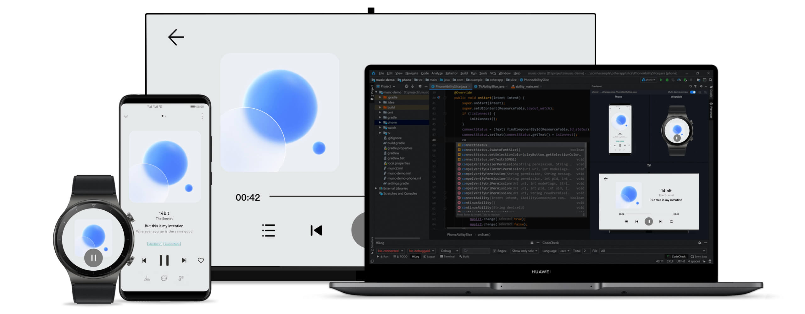

# 简介


## 背景

随着终端设备形态日益多样化，分布式技术逐渐打破单一硬件边界，一个应用或服务，可以在不同的硬件设备之间随意调用、互助共享，让用户享受无缝的全场景体验。而作为应用开发者，广泛的设备类型也能为应用带来广大的潜在用户群体。但是如果一个应用需要在多个设备上提供同样的内容，则需要适配不同的屏幕尺寸和硬件，开发成本较高。OpenHarmony 系统面向多终端提供了“一次开发，多端部署”（后文中简称为“一多”）的能力，让开发者可以基于一种设计，高效构建多端可运行的应用。


## 定义及目标

**定义**：一套代码工程，一次开发上架，多端按需部署。

**目标**：支撑开发者快速高效的开发支持多种终端设备形态的应用，实现对不同设备兼容的同时，提供跨设备的流转、迁移和协同的分布式体验。



为了实现“一多”的目标，需要解决两个基础问题：

- 不同设备间的屏幕尺寸、色彩风格等存在差异，页面如何适配。

- 不同设备的系统能力有差异，如智能穿戴设备是否具备定位能力、智慧屏是否具备摄像头等，功能如何兼容。

从第4章开始将从UX设计、系统能力等角度，详尽的解答上述问题。

> **说明：**
>
> - 应用开发不仅包含应用页面开发，还包括应用后端功能开发以及服务器端开发等。
>
> - 本文旨在指导开发者如何在OpenHarmony系统中开发“一多”应用，服务器端开发不在本文探讨范围内。


## 基础知识

为了更好的阅读后面的章节，本小节主要介绍了一些基础知识，方便读者理解内容。

### 方舟开发框架

OpenHarmony提供了[方舟开发框架](../../ui/arkui-overview.md)（简称：ArkUI），提供开发者进行应用UI开发时所必须的能力。

方舟开发框架提供了两种开发范式，分别是基于JS扩展的类Web开发范式（后文中简称为“类Web开发范式”）和基于ArkTS的声明式开发范式（后文中简称为“声明式开发范式”）。

- **声明式开发范式**：采用TS语言并进行声明式UI语法扩展，从组件、动效和状态管理三个维度提供了UI绘制能力。UI开发更接近自然语义的编程方式，让开发者直观地描述UI界面，不必关心框架如何实现UI绘制和渲染，实现极简高效开发。同时，选用有类型标注的TS语言，引入编译期的类型校验，更适用大型的应用开发。

- **类Web开发范式**：采用经典的HML、CSS、JavaScript三段式开发方式。使用HML标签文件进行布局搭建，使用CSS文件进行样式描述，使用JavaScript文件进行逻辑处理。UI组件与数据之间通过单向数据绑定的方式建立关联，当数据发生变化时，UI界面自动触发更新。此种开发方式，更接近Web前端开发者的使用习惯，快速将已有的Web应用改造成方舟开发框架应用。主要适用于界面较为简单的中小型应用开发。

两种开发范式的对比如下。

  | **开发范式名称** | **语言生态** | **UI更新方式** | **适用场景** | **适用人群** | 
| -------- | -------- | -------- | -------- | -------- |
| 声明式开发范式 | ArkTS语言 | 数据驱动更新 | 复杂度较大、团队合作度较高的程序 | 移动系统应用开发人员、系统应用开发人员 | 
| 类Web开发范式 | JS语言 | 数据驱动更新 | 界面较为简单的中小型应用和卡片 | Web前端开发人员 | 

> **说明：**
> 声明式开发范式占用内存更少，**更推荐开发者选用声明式开发范式来搭建应用UI界面**。

### 应用程序包结构

在进行应用开发时，一个应用通常包含一个或多个Module。Module是OpenHarmony应用/服务的基本功能单元，包含了源代码、资源文件、第三方库及应用/服务配置文件，每一个Module都可以独立进行编译和运行。

Module分为“Ability”和“Library”两种类型：

* “Ability”类型的Module编译后生成HAP包。

* “Library”类型的Module编译后生成HAR包或[HSP包](../../quick-start/shared-guide.md)。

OpenHarmony的应用以APP Pack形式发布，其包含一个或多个HAP包。HAP是OpenHarmony应用安装的基本单位，HAP可以分为Entry和Feature两种类型：

* Entry类型的HAP：应用的主模块。在同一个应用中，同一设备类型只支持一个Entry类型的HAP，通常用于实现应用的入口界面、入口图标、主特性功能等。

* Feature类型的HAP：应用的动态特性模块。Feature类型的HAP通常用于实现应用的特性功能，一个应用程序包可以包含一个或多个Feature类型的HAP，也可以不包含。

> **说明：**
> 关于Entry类型的HAP包、Feature类型的HAP包、HAR包、HSP包以及APP Pack的详细介绍请参考[应用程序包结构说明](../../quick-start/application-package-structure-stage.md) 。

### 部署模型

“一多”有两种部署模型：

- **部署模型A**：不同类型的设备上按照一定的工程结构组织方式，通过一次编译生成**相同**的HAP（或HAP组合）。

- **部署模型B**：不同类型的设备上按照一定的工程结构组织方式，通过一次编译生成**不同**的HAP（或HAP组合）。

开发者可以从应用UX设计及应用功能两个维度，结合具体的业务场景，考虑选择哪种部署模型。当然，也可以借助设备类型分类，快速做出判断。

从屏幕尺寸、输入方式及交互距离三个维度考虑，可以将常用类型的设备分为不同泛类：
- 默认设备、平板

- 车机、智慧屏

- 智能穿戴

- ……

**对于相同泛类的设备，优先选择部署模型A，对于不同泛类设备，优先选择部署模型B。**

> **说明：**
>
> * 应用在不同泛类设备上的UX设计或功能相似时，可以使用部署模型A。
> * 应用在同一泛类不同类型设备上UX设计或功能差异非常大时，可以使用部署模型B，但同时也应审视应用的UX设计及功能规划是否合理。
>
> * 本小节引入部署模型A和部署模型B的概念是为了方便开发者理解。实际上在开发多设备应用时，如果目标设备类型较多，往往是部署模型A和部署模型B混合使用。
>
> * 不管采用哪种部署模型，都应该采用一次编译。

### 工程结构

“一多”推荐在应用开发过程中使用如下的“三层工程结构”。

- common（公共能力层）：用于存放公共基础能力集合（如工具库、公共配置等）。

  common层可编译成一个或多个HAR包或HSP包（HAR中的代码和资源跟随使用方编译，如果有多个使用方，它们的编译产物中会存在多份相同拷贝；而HSP中的代码和资源可以独立编译，运行时在一个进程中代码也只会存在一份），其只可以被products和features依赖，不可以反向依赖。

- features（基础特性层）：用于存放基础特性集合（如应用中相对独立的各个功能的UI及业务逻辑实现等）。

  各个feature高内聚、低耦合、可定制，供产品灵活部署。不需要单独部署的feature通常编译为HAR包或HSP包，供products或其它feature使用。需要单独部署的feature通常编译为Feature类型的HAP包，和products下Entry类型的HAP包进行[组合部署](../../quick-start/multi-hap-objective.md)。features层可以横向调用及依赖common层，同时可以被products层不同设备形态的HAP所依赖，但是不能反向依赖products层。

- products（产品定制层）：用于针对不同设备形态进行功能和特性集成。

  products层各个子目录各自编译为一个Entry类型的HAP包，作为应用主入口。products层不可以横向调用。

代码工程结构抽象后一般如下所示：


```
/application
├── common                  # 可选。公共能力层, 编译为HAR包或HSP包
├── features                # 可选。基础特性层
│   ├── feature1            # 子功能1, 编译为HAR包或HSP包或Feature类型的HAP包
│   ├── feature2            # 子功能2, 编译为HAR包或HSP包或Feature类型的HAP包
│   └── ...
└── products                # 必选。产品定制层
    ├── wearable            # 智能穿戴泛类目录, 编译为Entry类型的HAP包
    ├── default             # 默认设备泛类目录, 编译为Entry类型的HAP包
    └── ...
```

> **说明：**
>
> * 部署模型不同，相应的代码工程结构也有差异。部署模型A和部署模型B的主要差异点集中在products层：部署模型A在products目录下同一子目录中做功能和特性集成；部署模型B在products目录下不同子目录中对不同的产品做差异化的功能和特性集成。
>
>
> * 开发阶段应考虑**不同类型设备间最大程度的复用代码**，以减少开发及后续维护的工作量。
> * 整个代码工程最终构建出一个[APP包](#应用程序包结构)，应用以APP包的形式发布到应用市场中。

