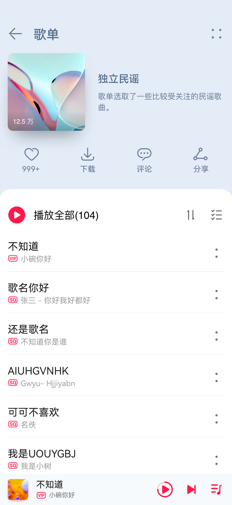
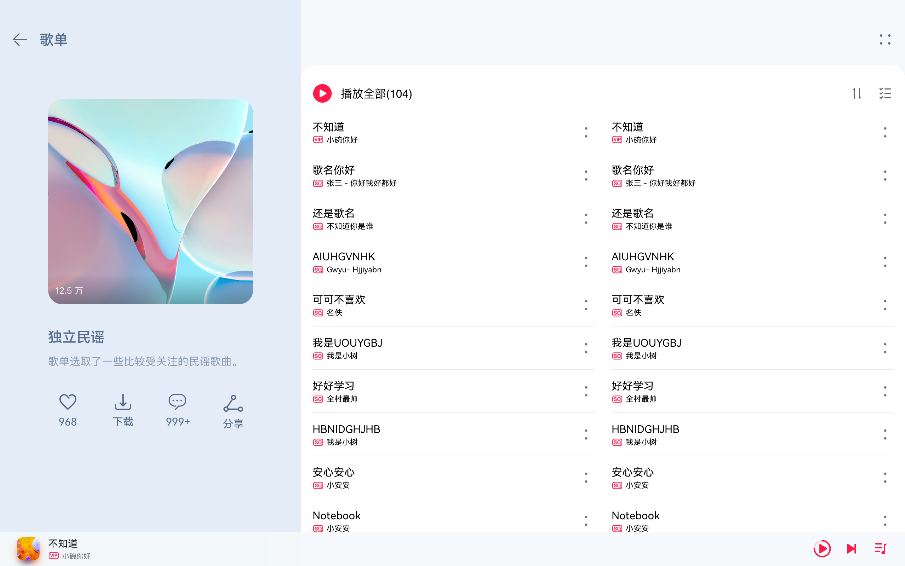
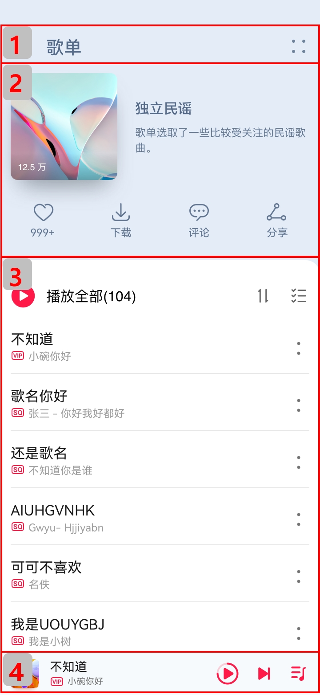
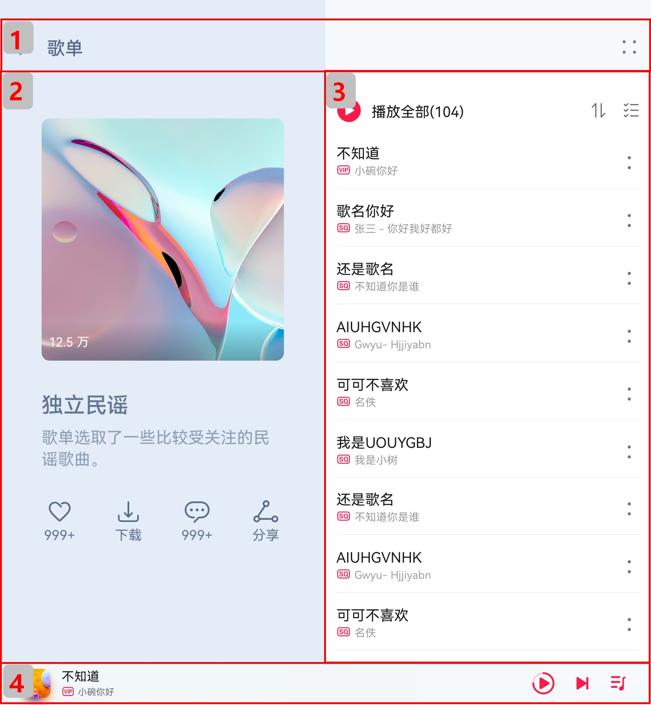
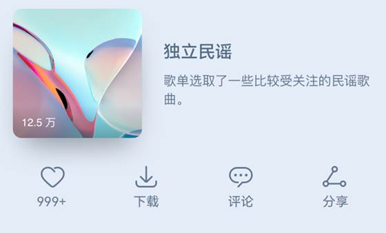
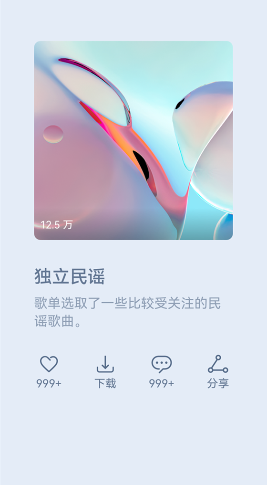
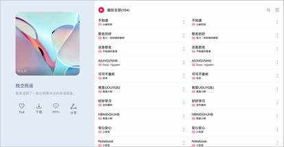
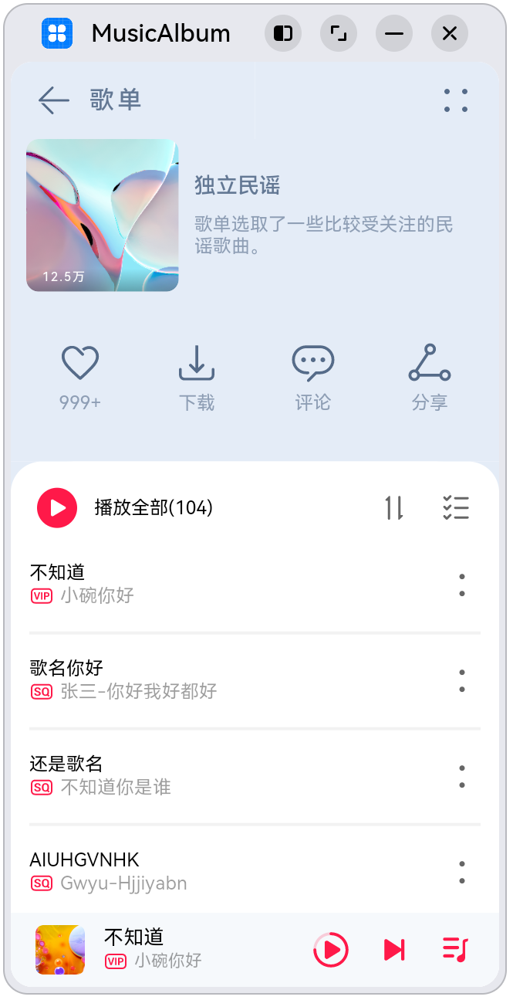
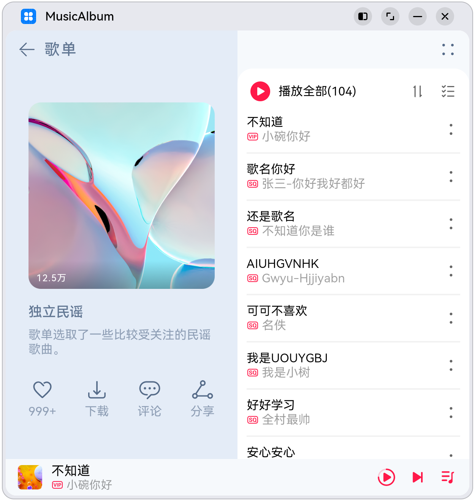
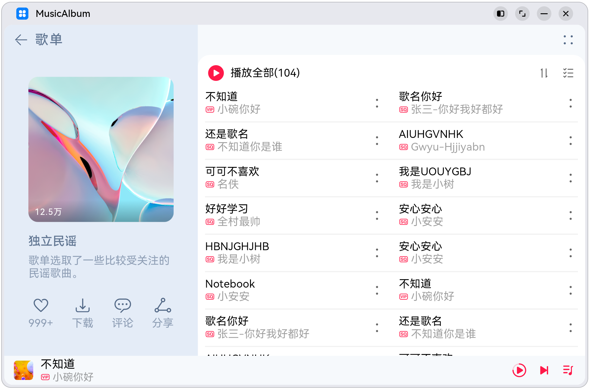

# 音乐专辑页


本小节将以音乐专辑页为例，介绍如何使用自适应布局能力和响应式布局能力适配不同尺寸窗口。


## 页面设计

音乐专辑页的页面设计如下。

  | sm | md | lg | 
| -------- | -------- | -------- |
|  |  |  | 

同样观察音乐专辑的页面设计，不同断点下的页面设计有较多相似的地方。

据此，我们可以将页面分拆为多个组成部分。

1. 标题栏

2. 歌单封面

3. 歌单列表

4. 播放控制栏

  | sm | md | lg | 
| -------- | -------- | -------- |
|  |  |  | 


## 标题栏

不同断点下，标题栏始终只显示“返回按钮”、“歌单”以及“更多按钮”，但“歌单”与“更多按钮”之间的间距不同。由于不同断点下标题栏的背景色也有较大差异，因此无法使用拉伸能力实现，此场景更适合使用栅格实现。我们可以将标题栏划分为“返回按钮及歌单”和“更多按钮”两部分，这两部分在不同断点下占据的列数如下图所示。另外，还可以借助OnBreakpointChange事件，调整不同断点下这两部分的背景色。

  |  | sm | md | lg | 
| -------- | -------- | -------- | -------- |
| 效果图 |  |  |  | 
| 栅格布局图 |  |  |  | 

  
```
@Component
export struct PlayListHeader {
  @State moreBackgroundColor: Resource = $r('app.color.play_list_cover_background_color');
  build() {
    GridRow() {
      GridCol({span: {sm:6, md: 6, lg:4}}) {
        Row() {
          Image($r('app.media.ic_back')).height('24vp').width('24vp')
        }
        .width('100%')
        .height('50vp')
        .justifyContent(FlexAlign.Start)
        .alignItems(VerticalAlign.Center)
        .padding({left:$r('app.float.default_margin')})
        .backgroundColor($r('app.color.play_list_cover_background_color'))
      }
      GridCol({span: {sm:6, md: 6, lg:8}}) {
        Row() {
          Image($r('app.media.ic_add')).height('24vp').width('24vp')
        }
        .width('100%')
        .height('50vp')
        .justifyContent(FlexAlign.End)
        .alignItems(VerticalAlign.Center)
        .padding({right:$r('app.float.default_margin')})
        .backgroundColor(this.moreBackgroundColor)
      }
    }.onBreakpointChange((currentBreakpoint) => {
      // 调整不同断点下返回按钮及歌单的背景色
      if (currentBreakpoint === 'sm') {
        this.moreBackgroundColor = $r('app.color.play_list_cover_background_color');
      } else {
        this.moreBackgroundColor = $r('app.color.play_list_songs_background_color');
      }
    }).height('100%').width('100%')
  }
}
```


## 歌单封面

歌单封面由封面图片、歌单介绍及常用操作三部分组成，这三部分的布局在md和lg断点下完全相同，但在sm断点下有较大差异。此场景同样可以用栅格实现。

  |  | sm | md/lg | 
| -------- | -------- | -------- |
| 效果图 |  |  | 
| 栅格布局图 |  |  | 

  
```
@Component
export default struct PlayListCover {
  ...
  build() {
    Column() {
      // 借助栅格组件实现总体布局
      GridRow() {
        // 歌单图片
        GridCol({ span: { sm: 4, md: 10 }, offset: { sm: 0, md: 1, lg: 1 } }) {
          this.CoverImage()
        }
        // 歌单介绍
        GridCol({ span: { sm: 8, md: 10 }, offset: { sm: 0, md: 2, lg: 2 } }) {
          this.CoverIntroduction()
        }
        // 歌单操作
        GridCol({ span: { sm: 12, md: 10 }, offset: { sm: 0, md: 2, lg: 2 } }) {
          this.CoverOptions()
        }.margin({
          top: this.currentBreakpoint === 'sm' ? 15 : 0,
          bottom: this.currentBreakpoint === 'sm' ? 15 : 0
        })
      }
      .margin({ left: this.coverMargin, right: this.coverMargin })
    }
    .height(this.currentBreakpoint === 'sm' ? this.coverHeight : '100%')
    .padding({ top: this.currentBreakpoint === 'sm' ? 50 : 70 })
  }
}
```


## 歌单列表

不同断点下，歌单列表的样式基本一致，但sm和md断点下是歌单列表是单列显示，lg断点下是双列显示。可以通过[List组件](../../reference/arkui-ts/ts-container-list.md)的lanes属性实现这一效果。

  
```
@Component
export default struct PlayList {
  ...
  build() {
    Column() {
      this.PlayAll()
      Scroll() {
        List() {
          LazyForEach(new MyDataSource(songList), item => {
            ListItem() {
              this.SongItem(item.title, item.label, item.singer)
            }
          }, item => item.id)
        }
        .width('100%')
        .height('100%')
        // 配置不同断点下歌单列表的列数
        .lanes(this.currentBreakpoint === 'lg' ? 2 : 1)
      }
      .backgroundColor('#fff')
      .margin({ top: 50, bottom: this.currentBreakpoint === 'sm' ? this.coverHeight : 0 })
    }
    .padding({top: 50,bottom: 48})
  }
}
```


## 播放控制栏

在不同断点下，播放控制栏显示的内容完全一致，唯一的区别是歌曲信息与播放控制按钮之间的间距有差异，这是典型的拉伸能力的使用场景。

  
```
@Component
export struct MusicBar {
  build() {
    Row() {
      Image($r('app.media.pic_album')).height(32).width(32).margin({right: 12})
      SongTitle()
      // 通过Blank组件实现拉伸能力
      Blank()
      Image($r('app.media.icon_play')).height(26).width(26).margin({right: 16})
      Image($r('app.media.ic_next')).height(24).width(24).margin({right: 16})
      Image($r('app.media.ic_Music_list')).height(24).width(24)
    }
    .width('100%')
    .height(48)
    .backgroundColor('#D8D8D8')
    .alignItems(VerticalAlign.Center)
    .padding({left: 16, right: 16})
  }
}
```


## 运行效果

将页面中的四部分组合在一起，即可显示完整的页面。

其中歌单封面和歌单列表这两部分的相对位置，在sm断点下是上下排布，在md和lg断点下是左右排布，也可以用栅格来实现目标效果。

  |  | sm | md | lg | 
| -------- | -------- | -------- | -------- |
| 效果图 |  |  |  | 
| 栅格布局图 |  |  |  | 

  
```
@Component
export default struct MusicContent {
  ...
  build() {
    GridRow() {
      // 歌单封面
      GridCol({ span: { xs: 12, sm: 12, md: 6, lg: 4 } }) {
        PlayListCover()
      }
      // 歌单列表
      GridCol({ span: { xs: 12, sm: 12, md: 6, lg: 8 } }) {
        PlayList()
      }
    }
    .height('100%')
  }
}
```

最后将页面各部分组合在一起即可。

  
```
@Entry
@Component
struct Index {
  build() {
    Column() {
      // 标题栏
      PlayListHeader()
      // 歌单
      MusicContent()
      // 播放控制栏
      MusicBar()
    }.width('100%').height('100%')
  }
}
```

音乐专辑页面的运行效果如下所示。

  | sm | md | lg | 
| -------- | -------- | -------- |
|  |  |  | 

## 相关实例

针对音乐专辑应用，有以下相关实例可供参考：

音乐专辑应用：[音乐专辑页应用示例](https://gitee.com/openharmony/applications_app_samples/tree/OpenHarmony-4.0-Beta2/code/SuperFeature/MultiDeviceAppDev/MusicAlbum)

