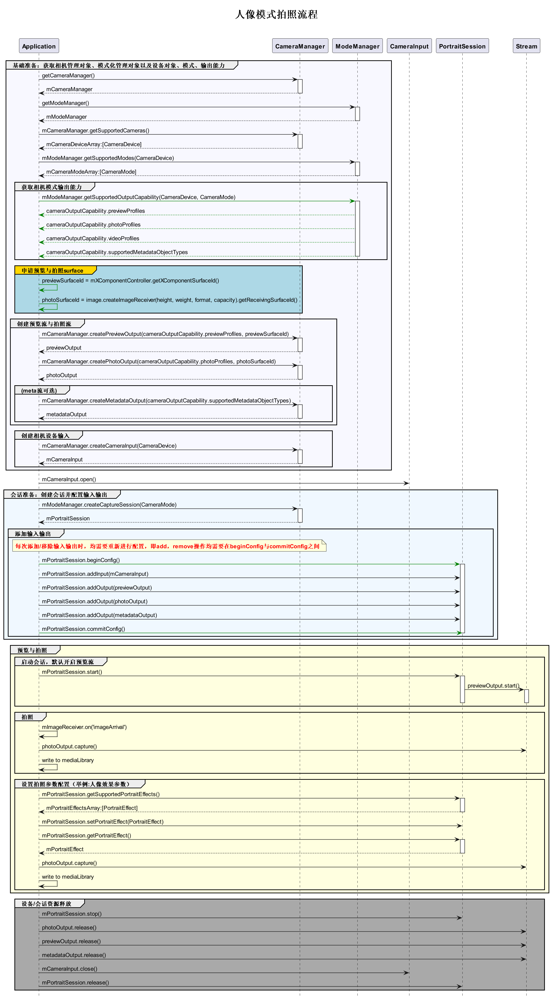

# 人像模式拍照实现方案

## 开发流程

人像模式依赖于模式化管理器，在获取到模式化管理的能力后，开始创建拍照流

模式化管理是对于cameraManager功能的增强与扩充，主要用于一些高级功能的管理，开发流程如下



## 完整示例
[各类Context的获取方式](../application-models/application-context-stage.md)
```ts
import camera from '@ohos.multimedia.camera';
import { BusinessError } from '@ohos.base';
import image from '@ohos.multimedia.image';
import featureAbility from '@ohos.ability.featureAbility';

async function cameraModeCase(context: featureAbility.Context, surfaceId: string): Promise<void> {
  // 创建CameraManager对象
  let cameraManager: camera.CameraManager = camera.getCameraManager(context);
  if (!cameraManager) {
    console.error("camera.getCameraManager error");
    return;
  }
  // 创建ModeManager对象
  let modeManager: camera.ModeManager = camera.getModeManager(context);
  if (!cameraManager) {
    console.error("camera.getModeManager error");
    return;
  }
  // 监听相机状态变化
  cameraManager.on('cameraStatus', (err: BusinessError, cameraStatusInfo: camera.CameraStatusInfo) => {
    console.info(`camera : ${cameraStatusInfo.camera.cameraId}`);
    console.info(`status: ${cameraStatusInfo.status}`);
  });
  // 获取相机列表
  let cameraArray: Array<camera.CameraDevice> = cameraManager.getSupportedCameras();
  if (cameraArray.length <= 0) {
    console.error("cameraManager.getSupportedCameras error");
    return;
  }

  for (let index = 0; index < cameraArray.length; index++) {
    console.info('cameraId : ' + cameraArray[index].cameraId); // 获取相机ID
    console.info('cameraPosition : ' + cameraArray[index].cameraPosition); // 获取相机位置
    console.info('cameraType : ' + cameraArray[index].cameraType); // 获取相机类型
    console.info('connectionType : ' + cameraArray[index].connectionType); // 获取相机连接类型
  }

  // 获取模式列表
  let cameraModeArray: Array<camera.CameraMode> = modeManager.getSupportedModes(cameraArray[0]);
  if (cameraModeArray.length <= 0) {
    console.error("modeManager.getSupportedModes error");
    return;
  }
  // 创建相机输入流
  let cameraInput: camera.CameraInput;
  try {
    cameraInput = cameraManager.createCameraInput(cameraArray[0]);
  } catch (error) {
    let err = error as BusinessError;
    console.error('Failed to createCameraInput errorCode = ' + err.code);
  }
  // 监听cameraInput错误信息
  let cameraDevice: camera.CameraDevice = cameraArray[0];
  cameraInput.on('error', cameraDevice, (error: BusinessError) => {
    console.info(`Camera input error code: ${error.code}`);
  })

  // 打开相机
  await cameraInput.open();

  // 获取当前模式相机设备支持的输出流能力
  let cameraOutputCap: camera.CameraOutputCapability = modeManager.getSupportedOutputCapability(cameraArray[0], cameraModeArray[0]);
  if (!cameraOutputCap) {
    console.error("modeManager.getSupportedOutputCapability error");
    return;
  }
  console.info("outputCapability: " + JSON.stringify(cameraOutputCap));

  let previewProfilesArray: Array<camera.Profile> = cameraOutputCap.previewProfiles;
  if (!previewProfilesArray) {
    console.error("createOutput previewProfilesArray == null || undefined");
  }

  let photoProfilesArray: Array<camera.Profile> = cameraOutputCap.photoProfiles;
  if (!photoProfilesArray) {
    console.error("createOutput photoProfilesArray == null || undefined");
  }

  // 创建预览输出流,其中参数 surfaceId 参考上文 XComponent 组件，预览流为XComponent组件提供的surface
  let previewOutput: camera.PreviewOutput;
  try {
    previewOutput = cameraManager.createPreviewOutput(previewProfilesArray[0], surfaceId);
  } catch (error) {
    let err = error as BusinessError;
    console.error("Failed to create the PreviewOutput instance. error code:" + err.code);
  }
  // 监听预览输出错误信息
  previewOutput.on('error', (error: BusinessError) => {
    console.info(`Preview output error code: ${error.code}`);
  })
  // 创建ImageReceiver对象，并设置照片参数：分辨率大小是根据前面 photoProfilesArray 获取的当前设备所支持的拍照分辨率大小去设置
  let imageReceiver: image.ImageReceiver = image.createImageReceiver(1920, 1080, 4, 8);
  // 获取照片显示SurfaceId
  let photoSurfaceId: string = await imageReceiver.getReceivingSurfaceId();
  // 创建拍照输出流
  let photoOutput: camera.PhotoOutput;
  try {
    photoOutput = cameraManager.createPhotoOutput(photoProfilesArray[0], photoSurfaceId);
  } catch (error) {
    let err = error as BusinessError;
    console.error('Failed to createPhotoOutput errorCode = ' + err.code);
  }
  //创建portrait会话
  let portraitSession: camera.CaptureSession;
  try {
    portraitSession = modeManager.createCaptureSession(cameraModeArray[0]);
  } catch (error) {
    let err = error as BusinessError;
    console.error('Failed to create the CaptureSession instance. errorCode = ' + err.code);
  }

  // 监听portraitSession错误信息
  portraitSession.on('error', (error: BusinessError) => {
    console.info(`Capture session error code: ${error.code}`);
  });

  // 开始配置会话
  try {
    portraitSession.beginConfig();
  } catch (error) {
    let err = error as BusinessError;
    console.error('Failed to beginConfig. errorCode = ' + err.code);
  }

  // 向会话中添加相机输入流
  try {
    portraitSession.addInput(cameraInput);
  } catch (error) {
    let err = error as BusinessError;
    console.error('Failed to addInput. errorCode = ' + err.code);
  }

  // 向会话中添加预览输出流
  try {
    portraitSession.addOutput(previewOutput);
  } catch (error) {
    let err = error as BusinessError;
    console.error('Failed to addOutput(previewOutput). errorCode = ' + err.code);
  }

  // 向会话中添加拍照输出流
  try {
    portraitSession.addOutput(photoOutput);
  } catch (error) {
    let err = error as BusinessError;
    console.error('Failed to addOutput(photoOutput). errorCode = ' + err.code);
  }

  // 提交会话配置
  await portraitSession.commitConfig();

  // 启动会话
  await portraitSession.start().then(() => {
    console.info('Promise returned to indicate the session start success.');
  })

  // 获取支持的美颜类型
  let beautyTypes: Array<camera.BeautyType>;
  try {
    beautyTypes = portraitSession.getSupportedBeautyTypes();
  } catch (error) {
    let err = error as BusinessError;
    console.error('Failed to get the beauty types. errorCode = ' + err.code);
  }
  // 获取支持的美颜类型对应的美颜强度范围
  let beautyRanges: Array<number>;
  try {
    beautyRanges = portraitSession.getSupportedBeautyRange(beautyTypes[0]);
  } catch (error) {
    let err = error as BusinessError;
    console.error('Failed to get the beauty types ranges. errorCode = ' + err.code);
  }
  // 设置美颜类型及对应的美颜强度
  try {
    portraitSession.setBeauty(beautyTypes[0], beautyRanges[0]);
  } catch (error) {
    let err = error as BusinessError;
    console.error('Failed to set the beauty type value. errorCode = ' + err.code);
  }
  // 获取已经设置的美颜类型对应的美颜强度
  let beautyLevel: number;
  try {
    beautyLevel = portraitSession.getBeauty(beautyTypes[0]);
  } catch (error) {
    let err = error as BusinessError;
    console.error('Failed to get the beauty type value. errorCode = ' + err.code);
  }

  // 获取支持的滤镜类型
  let filterTypes: Array<camera.FilterType>;
  try {
    filterTypes = portraitSession.getSupportedFilters();
  } catch (error) {
    let err = error as BusinessError;
    console.error('Failed to get the filter types. errorCode = ' + err.code);
  }
  // 设置滤镜类型
  try {
    portraitSession.setFilter(filterTypes[0]);
  } catch (error) {
    let err = error as BusinessError;
    console.error('Failed to set the filter type value. errorCode = ' + err.code);
  }
  // 获取已经设置的滤镜类型
  let filter: number;
  try {
    filter = portraitSession.getFilter();
  } catch (error) {
    let err = error as BusinessError;
    console.error('Failed to get the filter type value. errorCode = ' + err.code);
  }

  // 获取支持的虚化类型
  let portraitTypes: Array<camera.PortraitEffect>;
  try {
    portraitTypes = portraitSession.getSupportedPortraitEffects();
  } catch (error) {
    let err = error as BusinessError;
    console.error('Failed to get the portrait effects types. errorCode = ' + err.code);
  }
  // 设置虚化类型
  try {
    portraitSession.setPortraitEffect(portraitTypes[0]);
  } catch (error) {
    let err = error as BusinessError;
    console.error('Failed to set the portrait effects value. errorCode = ' + err.code);
  }
  // 获取已经设置的虚化类型
  let effect: camera.PortraitEffect;
  try {
    effect = portraitSession.getPortraitEffect();
  } catch (error) {
    let err = error as BusinessError;
    console.error('Failed to get the portrait effects value. errorCode = ' + err.code);
  }

  let captureSettings: camera.PhotoCaptureSetting;
  // 使用当前拍照设置进行拍照
  photoOutput.capture(captureSettings, async (err: BusinessError) => {
    if (err) {
      console.error('Failed to capture the photo ${err.message}');
      return;
    }
    console.info('Callback invoked to indicate the photo capture request success.');
  });
  // 停止当前会话
  portraitSession.stop();

  // 释放相机输入流
  cameraInput.close();

  // 释放预览输出流
  previewOutput.release();

  // 释放拍照输出流
  photoOutput.release();

  // 释放会话
  portraitSession.release();

  // 会话置空
  portraitSession = null;
}

```
