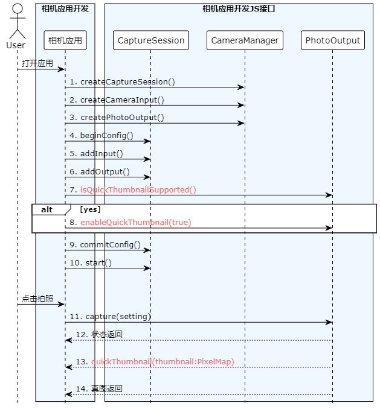
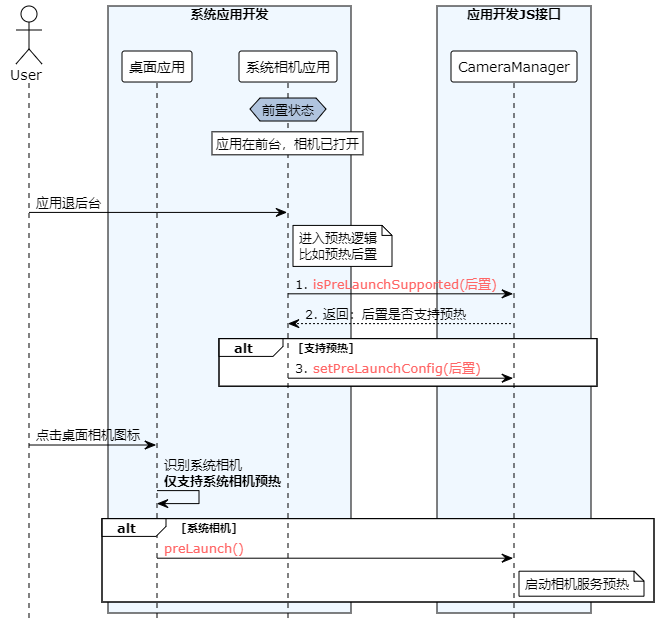

# 性能提升方案（仅对系统应用开放）

相机启动性能受限于底层器件上点、流程Pipeline初始化等耗时操作影响，本文档将为开发者提供更进一步的指导，提升相机启动速度以及拍照返回缩略图速度。相关能力与底层器件相关，请开发者在使用前需确认是否支持相关特性。

​相关特性分别在打开相机设备过程、配流过程以及拍照过程中。本文档针对三个场景分别进行介绍。

## 延时配流

经典的相机启动过程经过“相机设备打开”、“配置数据流”、“启动数据流”等流程，而配流启流之前需要得到图形组件的surfaceId。

延时配流方案是把配流启流与surface解耦，在组件尚未给应用surface之前，可以先进行配流启流，只需要在启流结束之前提供surface，可以提升启动速度，防止影响其他启动优化方案的落地。


优化前：配流动作依赖surface对象，surface对象依赖于UI加载完成。

优化后：配流动作不依赖surface对象，界面加载和配流并行执行。

### 接口说明

详细的API参考说明，请参考[Camera API文档](../reference/apis/js-apis-camera.md)。

| 接口 | 说明 |
| ---- | ---- |
| createDeferredPreviewOutput(profile: Profile): Promise\<PreviewOutput> | 创建延迟预览输出对象，在配流时替代普通的预览输出对象加入数据流。 |
| addDeferredSurface(surfaceId: string): Promise\<void> | 配置延迟预览的Surface，可以在session.commitConfig()配流和session.start()启流之后运行。 |

### 开发示例

接口调用流程建议如下图所示：


```js
import camera from '@ohos.multimedia.camera';

function async preview(context: Context, cameraInfo: camera.Device, previewProfile: camera.Profile, photoProfile: camera.Profile, surfaceId: string): Promise<void> {
  const cameraManager: camera.CameraManager = camera.getCameraManager(context);
  const cameraInput camera.CameraInput = await cameraManager.createCameraInput(cameraInfo)
  const previewOutput: camera.PreviewOutput = await cameraManager.createDeferredPreviewOutput(previewProfile);
  const photoOutput: camera.PhotoOutput = await cameraManager.createPhotoOutput(photoProfile);
  const session: camera.CaptureSession  = await this.mCameraManager.createCaptureSession();
  await session.beginConfig();
  await session.addInput(cameraInput);
  await session.addOutput(previewOutput);
  await session.addOutput(photoOutput);
  await session.commitConfig();
  await session.start();
  await previewOutput.addDeferredSurface(surfaceId);
}
```

## 快速缩略图

相机拍照性能依赖算法处理的速度，算法链越复杂、效果就越好，但同时处理时间就越长。

通过相机快速缩略图，相机拍照可单独输出拇指缩略图，在真图没有上报之前，可以提前上报一张缩略图给应用去做显示，提升shot2see用户感知拍照速度。

这样从拍照流程上进行优化，既可以满足后处理算法处理的要求，又不会阻塞前台的拍照速度。

### 接口说明

详细的API参考说明，请参考[Camera API文档](../reference/apis/js-apis-camera.md)。

| 接口 | 说明 |
| ---- | ---- |
| isQuickThumbnailSupported() : boolean | 是否支持快速缩略图。 |
| enableQuickThumbnail(enabled:bool): void | 使能/去使能快速缩略图。 |
| on(type: 'quickThumbnail', callback: AsyncCallback\<image.PixelMap>): void | 相机缩略图监听回调。 |

> **说明：**
>
> - isQuickThumbnailSupported及enableQuickThumbnail接口的调用需要在CaptureSession.addOutput、CaptureSession.addInput后，CaptureSession.commitConfig()之前。
> - on接口需要在enableQuickThumbnail(true)之后生效。

### 开发示例

接口调用流程建议如下图所示：



```js
import camera from '@ohos.multimedia.camera'

this.cameraManager = camera.getCameraManager(globalThis.abilityContext);
let cameras = this.cameraManager.getSupportedCameras()
// 创建CaptureSession实例
this.captureSession = await this.cameraManager.createCaptureSession()
// 开始配置会话
await this.captureSession.beginConfig()
// 把CameraInput加入到会话
this.cameraInput = await this.cameraManager.createCameraInput(cameras[0])
await this.cameraInput.open()
await this.captureSession.addInput(this.cameraInput)
// 把PhotoOutPut加入到会话
this.photoOutPut = await this.cameraManager.createPhotoOutput(photoProfile, surfaceId)
await this.captureSession.addOutput(this.photoOutPut)
boolean isSupported = this.photoOutPut.isQuickThumbnailSupported()
if (isSupported) {
    // 使能快速缩略图
    this.photoOutPut.enableQuickThumbnail(true)
}
this.photoOutPut.on('quickThumbnail', (err, pixelmap) => {
    if (err || pixelmap === undefined) {
        Logger.error(this.tag, 'photoOutPut on thumbnail failed ')
        return
    }
    // 显示或保存pixelmap
    this.showOrSavePicture(pixelmap)
})
```

## 预热启动

普通情况下相机应用的启动是用户通过点击桌面相机图标触发的。桌面应用感知用户点击相机图标，然后通知应用管理器启动对应的相机应用（进程），这个过程是耗时较长。进入相机应用后，开始进入相机启动流程。经典的相机启动过程会经过，“相机设备打开”，“配置数据流”，“启动数据流等”，这个过程也较为耗时。

​相机启动方案是把“相机设备打开”这个动作提前到相机应用启动之前，即在用户点击相机图标，
还没等相机应用启动的时候，触发相机设备打开的动作，从而缩短相机应用内启动相机的流程，加速相机启动。使用预热启动前后的相机应用流程对比如下：


### 接口说明

详细的API参考说明，请参考[Camera API文档](../reference/apis/js-apis-camera.md)。

| 接口 | 说明 |
| ---- | ---- |
| isPreLaunchSupported(camera: CameraDevice) : boolean |  判断指定cameraDevice是否支持预热启动。 |
| setPreLaunchConfig(camera: CameraDevice) : void | 配置相机预热参数。 |
| preLaunch() : void | 用户点击系统相机图标，拉起相机应用的同时调用，下发预热请求，使能相机预热启动。 |

### 开发示例

接口调用流程建议如下图所示：



使用该功能前，桌面应用和相机应用均需要**申请权限**：ohos.permission.CAMERA

具体申请方式及校验方式，请参考[访问控制授权申请指导](../security/accesstoken-guidelines.md)。

- **桌面应用**

  ```js
  import camera from '@ohos.multimedia.camera'

  this.cameraManager = camera.getCameraManager(globalThis.abilityContext);
  try {
    this.cameraManager.preLaunch(); 
  } catch (error) {
    console.error(`catch error: Code: ${error.code}, message: ${error.message}`)
  }
  ```

- **相机应用**

  ```js
  import camera from '@ohos.multimedia.camera'

  this.cameraManager = camera.getCameraManager(globalThis.abilityContext);
  let cameras = this.cameraManager.getSupportedCameras()
  if(this.cameraManager.isPreLaunchSupported(cameras[0])) {
    try {
      this.cameraManager.setPreLaunchConfig({cameraDevice: cameras[0]});
    } catch (error) {
      console.error(`catch error: Code: ${error.code}, message: ${error.message}`)
    }
  }
  ```
