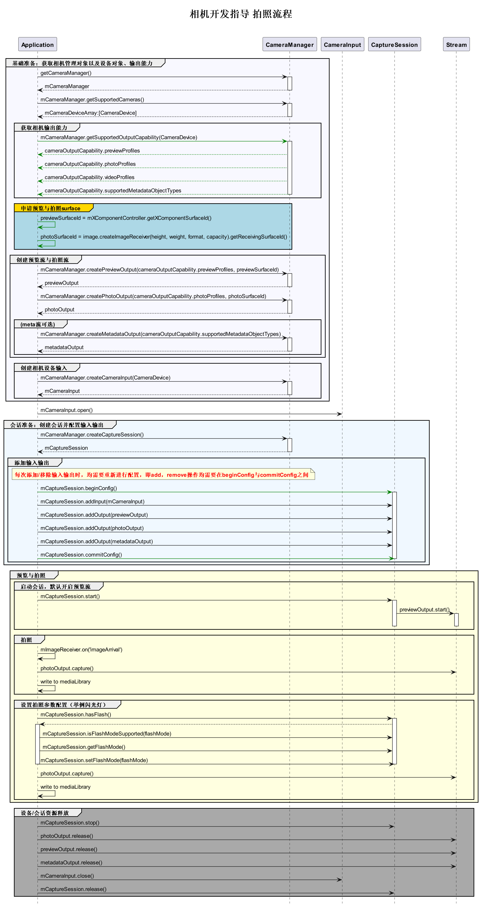

# 拍照实现方案

## 开发流程

在获取到相机支持的输出流能力后，开始创建拍照流，开发流程如下。



## 完整示例
[各类Context的获取方式](../application-models/application-context-stage.md)
```ts
import camera from '@ohos.multimedia.camera';
import image from '@ohos.multimedia.image';
import media from '@ohos.multimedia.media';

// 创建CameraManager对象
let context: Context = getContext(this);
let cameraManager: camera.CameraManager = camera.getCameraManager(context);
if (!cameraManager) {
  console.error("camera.getCameraManager error");
  return;
} 
// 监听相机状态变化
cameraManager.on('cameraStatus', (err: BusinessError, cameraStatusInfo: camera.CameraStatusInfo) => {
  console.info(`camera : ${cameraStatusInfo.camera.cameraId}`);
  console.info(`status: ${cameraStatusInfo.status}`);
});

// 获取相机列表
let cameraArray: Array<camera.CameraDevice> = cameraManager.getSupportedCameras();
if (cameraArray.length <= 0) {
  console.error("cameraManager.getSupportedCameras error");
  return;
} 

for (let index = 0; index < cameraArray.length; index++) {
  console.info('cameraId : ' + cameraArray[index].cameraId);                          // 获取相机ID
  console.info('cameraPosition : ' + cameraArray[index].cameraPosition);              // 获取相机位置
  console.info('cameraType : ' + cameraArray[index].cameraType);                      // 获取相机类型
  console.info('connectionType : ' + cameraArray[index].connectionType);              // 获取相机连接类型
}

// 创建相机输入流
let cameraInput: camera.CameraInput;
try {
  cameraInput = cameraManager.createCameraInput(cameraArray[0]);
} catch (error) {
  let err = error as BusinessError;
  console.error('Failed to createCameraInput errorCode = ' + err.code);
}

// 监听cameraInput错误信息
let cameraDevice: camera.CameraDevice = cameraArray[0];
cameraInput.on('error', cameraDevice, (error: BusinessError) => {
  console.info(`Camera input error code: ${error.code}`);
})

// 打开相机
await cameraInput.open();

// 获取相机设备支持的输出流能力
let cameraOutputCap: camera.CameraOutputCapability = cameraManager.getSupportedOutputCapability(cameraArray[0]);
if (!cameraOutputCap) {
  console.error("cameraManager.getSupportedOutputCapability error");
  return;
}
console.info("outputCapability: " + JSON.stringify(cameraOutputCap));

let previewProfilesArray: Array<camera.Profile> = cameraOutputCap.previewProfiles;
if (!previewProfilesArray) {
  console.error("createOutput previewProfilesArray == null || undefined");
} 

let photoProfilesArray: Array<camera.Profile> = cameraOutputCap.photoProfiles;
if (!photoProfilesArray) {
  console.error("createOutput photoProfilesArray == null || undefined");
} 

// 创建预览输出流,其中参数 surfaceId 参考上文 XComponent 组件，预览流为XComponent组件提供的surface
let previewOutput: camera.PreviewOutput;
try {
  previewOutput = cameraManager.createPreviewOutput(previewProfilesArray[0], surfaceId);
} catch (error) {
  let err = error as BusinessError;
  console.error(`Failed to create the PreviewOutput instance. error code: ${err.code}`);
}

// 监听预览输出错误信息
previewOutput.on('error', (error: BusinessError) => {
  console.info(`Preview output error code: ${error.code}`);
});

// 创建ImageReceiver对象，并设置照片参数：分辨率大小是根据前面 photoProfilesArray 获取的当前设备所支持的拍照分辨率大小去设置
let imageReceiver: image.ImageReceiver = image.createImageReceiver(1920, 1080, 4, 8);
// 获取照片显示SurfaceId
let photoSurfaceId: string = await imageReceiver.getReceivingSurfaceId();
// 创建拍照输出流
let photoOutput: camera.PhotoOutput;
try {
  photoOutput = cameraManager.createPhotoOutput(photoProfilesArray[0], photoSurfaceId);
} catch (error) {
  let err = error as BusinessError;
  console.error('Failed to createPhotoOutput errorCode = ' + err.code);
}
//创建会话
let captureSession: camera.CaptureSession;
try {
  captureSession = cameraManager.createCaptureSession();
} catch (error) {
  let err = error as BusinessError;
  console.error('Failed to create the CaptureSession instance. errorCode = ' + err.code);
}

// 监听session错误信息
captureSession.on('error', (error: BusinessError) => {
  console.info(`Capture session error code: ${error.code}`);
});

// 开始配置会话
try {
  captureSession.beginConfig();
} catch (error) {
  let err = error as BusinessError;
  console.error('Failed to beginConfig. errorCode = ' + err.code);
}

// 向会话中添加相机输入流
try {
  captureSession.addInput(cameraInput);
} catch (error) {
  let err = error as BusinessError;
  console.error('Failed to addInput. errorCode = ' + err.code);
}

// 向会话中添加预览输出流
try {
  captureSession.addOutput(previewOutput);
} catch (error) {
  let err = error as BusinessError;
  console.error('Failed to addOutput(previewOutput). errorCode = ' + err.code);
}

// 向会话中添加拍照输出流
try {
  captureSession.addOutput(photoOutput);
} catch (error) {
  let err = error as BusinessError;
  console.error('Failed to addOutput(photoOutput). errorCode = ' + err.code);
}

// 提交会话配置
await captureSession.commitConfig();

// 启动会话
await captureSession.start().then(() => {
  console.info('Promise returned to indicate the session start success.');
});
// 判断设备是否支持闪光灯
let flashStatus: boolean;
try {
  flashStatus = captureSession.hasFlash();
} catch (error) {
  let err = error as BusinessError;
  console.error('Failed to hasFlash. errorCode = ' + err.code);
}
console.info('Promise returned with the flash light support status:' + flashStatus);

if (flashStatus) {
  // 判断是否支持自动闪光灯模式
  let flashModeStatus: boolean;
  try {
    let status: boolean = captureSession.isFlashModeSupported(camera.FlashMode.FLASH_MODE_AUTO);
    flashModeStatus = status;
  } catch (error) {
    let err = error as BusinessError;
    console.error('Failed to check whether the flash mode is supported. errorCode = ' + err.code);
  }
  if(flashModeStatus) {
    // 设置自动闪光灯模式
    try {
      captureSession.setFlashMode(camera.FlashMode.FLASH_MODE_AUTO);
    } catch (error) {
      let err = error as BusinessError;
      console.error('Failed to set the flash mode. errorCode = ' + err.code);
    }
  }
}

// 判断是否支持连续自动变焦模式
let focusModeStatus: boolean;
try {
  let status: boolean = captureSession.isFocusModeSupported(camera.FocusMode.FOCUS_MODE_CONTINUOUS_AUTO);
  focusModeStatus = status;
} catch (error) {
  let err = error as BusinessError;
  console.error('Failed to check whether the focus mode is supported. errorCode = ' + err.code);
}

if (focusModeStatus) {
  // 设置连续自动变焦模式
  try {
    captureSession.setFocusMode(camera.FocusMode.FOCUS_MODE_CONTINUOUS_AUTO);
  } catch (error) {
    let err = error as BusinessError;
    console.error('Failed to set the focus mode. errorCode = ' + err.code);
  }
}

// 获取相机支持的可变焦距比范围
let zoomRatioRange: Array<number>;
try {
  zoomRatioRange = captureSession.getZoomRatioRange();
} catch (error) {
  let err = error as BusinessError;
  console.error('Failed to get the zoom ratio range. errorCode = ' + err.code);
}

// 设置可变焦距比
try {
  captureSession.setZoomRatio(zoomRatioRange[0]);
} catch (error) {
  let err = error as BusinessError;
  console.error('Failed to set the zoom ratio value. errorCode = ' + err.code);
}
let settings: camera.PhotoCaptureSetting = {
  quality: camera.QualityLevel.QUALITY_LEVEL_HIGH,                                     // 设置图片质量高
  rotation: camera.ImageRotation.ROTATION_0                                            // 设置图片旋转角度0
}
// 使用当前拍照设置进行拍照
photoOutput.capture(settings, async (err: BusinessError) => {
  if (err) {
    console.error('Failed to capture the photo ${err.message}');
    return;
  }
  console.info('Callback invoked to indicate the photo capture request success.');
});
// 停止当前会话
captureSession.stop();

// 释放相机输入流
cameraInput.close();

// 释放预览输出流
previewOutput.release();

// 释放拍照输出流
photoOutput.release();

// 释放会话
captureSession.release();

// 会话置空
captureSession = null;
```

