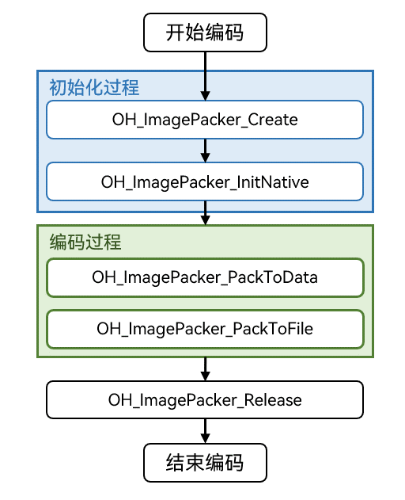

# 图片编码(C/C++)

开发者可以调用本模块的Native API接口，完成图片编码，即将PixelMap压缩成不同格式的存档图片。

当前支持编码为JPEG、WebP 和 PNG 格式。

**适用场景**

- 图片编码转换。

  通过传入图片源ImageSource，封装成想要的格式。
- 图片编辑

  编辑PixelMap后导出图片文件的场景，需要编码成对应图片格式文件。

## 开发指导

详细的API说明请参考[ImagePacker API参考]。

参考以下示例代码，完成图片编码的全流程，包括：创建编码器，初始化资源，编码过程，销毁资源。

在应用开发过程中，开发者应按一定顺序调用方法，执行对应操作，否则系统可能会抛出异常或生成其他未定义的行为。具体顺序可参考下列开发步骤及对应说明。

如下为图片编码调用关系图：


### 在 CMake 脚本中链接动态库
``` cmake
target_link_libraries(sample PUBLIC libimage_packer_ndk.z.so)
```

### 开发步骤

1. 引入编码器头文件。

   首先，应用需要引入image_packer_mdk.h头文件。

   ```cpp
   // 引入编码器image_packer_mdk.h头文件。
   #include "multimedia/image_framework/image_packer_mdk.h"
   ```
2. 创建编码器实例对象。

   应用需要napi_env来创建编码器。

   ```cpp
   // 使用napi_value 承接创建的编码器对象
   napi_value packer;
   // 通过 napi_env 创建编码器，返回result为 IMAGE_RESULT_SUCCESS则创建成功
   int32_t result = OH_ImagePacker_Create(env, packer);
   ```
3. 初始化资源。

   通过OH_ImagePacker_InitNative来初始化编码器原生实例对象。

   ```cpp
   // 通过 napi_env 及上述创建的编码器对象初始化原生实例对象
   ImagePacker_Native* nativePacker = OH_ImagePacker_InitNative(env, packer);
   ```
4. 编码。

   编码接口入参包括：

   - 上述过程中获取的实例对象（ImagePacker_Native）。

   - 需要编码的图像源（napi_value）, PixelMap或ImageSource（未调用过CreatePixelMap）的实例对象均可。

   - 编码参数：包括编码格式与编码质量。
     
    编码接口可按输出方式分为向缓存区（内存）输出和向文件输出两种接口，入参均为上述内容。
    应用可根据输出的不同需求选择编码接口。

    例向缓存区（内存）输出：
    ```cpp
    // 编码参数
    struct ImagePacker_Opts opts;
    // 配置编码格式（必须）
    opts.format = "image/jpeg";
    // 配置编码质量（必须）
    opts.quality = 100;
    // 配置输出的缓存区大小为4k（缓存区大小视应用场景定）
    size_t bufferSize = 4*1024;
    // 申请图片编码缓存区
    uint8_t* outData = (uint8_t *)(malloc(bufferSize));
    // 开始对输入source进行编码过程，返回result为 IMAGE_RESULT_SUCCESS则编码成功，同时bufferSize中包含编码实际使用缓存区大小
    int32_t result = OH_ImagePacker_PackToData(nativePacker, source, &opts, outData, &bufferSize);
    ```
    例向文件输出：
    ```cpp
    // 编码参数
    struct ImagePacker_Opts opts;
    // 配置编码格式（必须）
    opts.format = "image/jpeg";
    // 配置编码质量（必须）
    opts.quality = 100;
    // 打开需要输出的文件（请确保应用有权限访问这个路径）
    int fd = open("/data/test.jpg", O_RDWR | O_CREAT, S_IRUSR | S_IWUSR);
    if (fd >= 0) {
       // 开始对输入source进行编码过程，返回result为 IMAGE_RESULT_SUCCESS则编码成功
       int32_t result = OH_ImagePacker_PackToFile(nativePacker, source, &opts, fd);
 	   // 关闭输出文件
 	   close(fd);
    }
    ```
5. 销毁编码器实例，释放资源。

   > **说明**：
   > 资源不能重复销毁。

   ```c++
   // 调用OH_ImagePacker_Release, 销毁编码器
   int32_t ret = OH_ImagePacker_Release(nativePacker);
   if (result != IMAGE_RESULT_SUCCESS) {
       // 异常处理
   } else {
       nativePacker = NULL; //不可重复destroy
   }
   ```
