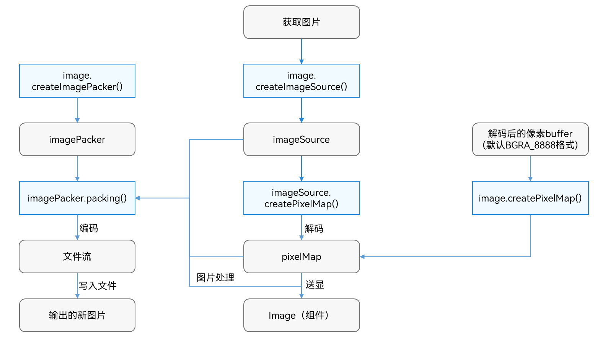

# 图片开发概述

应用开发中的图片开发是对图片像素数据进行解析、处理、构造的过程，达到目标图片效果，主要涉及图片解码、图片处理、图片编码等。

在学习图片开发前，需要熟悉以下基本概念。

- 图片解码
  
  指将所支持格式的存档图片解码成统一的PixelMap，以便在应用或系统中进行图片显示或图片处理。当前支持的存档图片格式包括JPEG、PNG、GIF、RAW、WebP、BMP、SVG。

- PixelMap
  
  指图片解码后无压缩的位图，用于图片显示或图片处理。

- 图片处理
  
  指对PixelMap进行相关的操作，如旋转、缩放、设置透明度、获取图片信息、读写像素数据等。

- 图片编码
  
  指将PixelMap编码成不同格式的存档图片（当前仅支持JPEG和WebP），用于后续处理，如保存、传输等。

图片开发的主要流程如下图所示。

**图1** 图片开发流程示意图  

1. 获取图片：通过应用沙箱等方式获取原始图片。

2. 创建ImageSource实例：ImageSource是图片解码出来的图片源类，用于获取或修改图片相关信息。

3. [图片解码](image-decoding.md)：通过ImageSource解码生成PixelMap。

4. [图片处理](image-transformation.md)：对PixelMap进行处理，更改图片属性实现图片的旋转、缩放、裁剪等效果。然后通过[Image组件](../ui/arkts-graphics-display.md)显示图片。

5. [图片编码](image-encoding.md)：使用图片打包器类ImagePacker，将PixelMap或ImageSource进行压缩编码，生成一张新的图片。

除上述基本图片开发能力外，OpenHarmony还提供常用[图片工具](image-tool.md)，供开发者选择使用。

## 相关实例

针对图片开发，有以下相关实例可供参考：

- [图片显示及处理（ArkTS）（API10）](https://gitee.com/openharmony/applications_app_samples/tree/master/code/BasicFeature/Media/Image)

- [图片显示（ArkTS）（API9）](https://gitee.com/openharmony/applications_app_samples/tree/master/code/BasicFeature/Media/ImageShow)

- [图片裁剪与分割（ArkTS）（API9）](https://gitee.com/openharmony/applications_app_samples/tree/master/code/BasicFeature/Media/GamePuzzle)