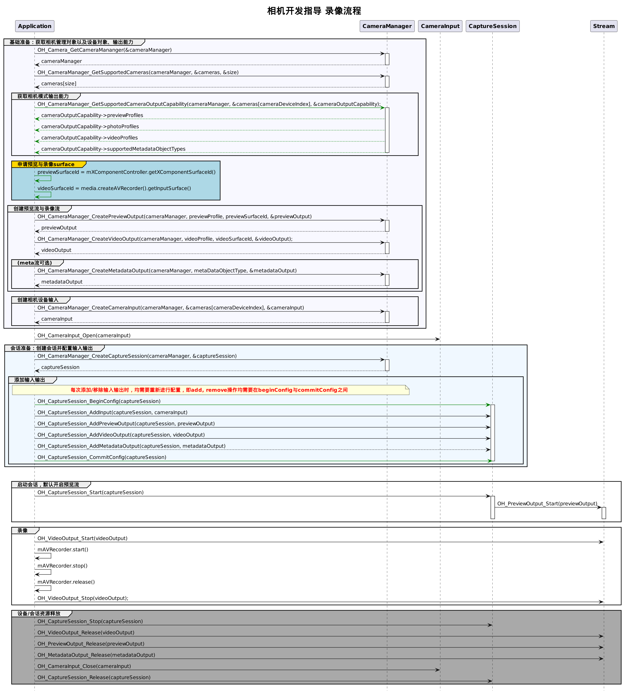

# 录像流二次处理的实现方案(Native)

## 开发流程

在获取到相机支持的输出流能力后，开始创建录像流，开发流程如下。




## 完整示例

```ts
// ts侧需要导入image接口
import image from '@ohos.multimedia.image';
//获取SurfaceId。
async function getVideoSurfaceId(): Promise<string | undefined> {
    let videoSurfaceId: string | undefined = undefined;
    let videoReceiver: image.ImageReceiver = image.createImageReceiver(320, 240, 2000, 8);
    try {
        videoReceiver.on('imageArrival', () => {
            console.info('imageArrival start');
            videoReceiver.readNextImage((err, image) => {
                console.info('readNextImage start');
                if (err || image === undefined) {
                    console.error('readNextImage failed');
                    return;
                }
                image.getComponent(4, (errMsg, img) => {
                    console.info('getComponent start');
                    if (errMsg || img === undefined) {
                        console.error('getComponent failed');
                        return;
                    }
                    let buffer;
                    if (img.byteBuffer) {
                    buffer = img.byteBuffer;
                    } else {
                        console.error('img.byteBuffer is undefined');
                    }
                    // 读取图像
                    try {
                        console.info('savePicture start');
                        let imgFileAsset = await this.mediaUtil.createAndGetUri(mediaLibrary.MediaType.IMAGE);
                        let imgPhotoUri = imgFileAsset.uri;
                        let imgFd = await this.mediaUtil.getFdPath(imgFileAsset);
                        await fileio.write(imgFd, buffer);
                        await imgFileAsset.close(imgFd);
                        await img.release();
                        console.info('save image End');
                    } catch (err) {
                        console.error('savePicture err');
                    }
                })
            })
        })
    } catch {
        console.error('savePicture err');
    }
    console.info('before ImageReceiver check');
    if (videoReceiver !== undefined) {
        console.info('ImageReceiver is ok');
        videoSurfaceId = await videoReceiver.getReceivingSurfaceId();
        console.info(`ImageReceived id: ${JSON.stringify(videoSurfaceId)}`);
    } else {
        console.info('ImageReceiver is not ok');
    }
    return videoSurfaceId;
}
```

```c++
// c++侧需要导入NDK接口
#include "multimedia/camera_framework/camera.h"
#include "multimedia/camera_framework/camera_input.h"
#include "multimedia/camera_framework/capture_session.h"
#include "multimedia/camera_framework/photo_output.h"
#include "multimedia/camera_framework/preview_output.h"
#include "multimedia/camera_framework/video_output.h"
#include "multimedia/camera_framework/camera_manager.h"


void OnCameraInputError(const Camera_Input* cameraInput, Camera_ErrorCode errorCode)
{
    OH_LOG_INFO(LOG_APP, "OnCameraInput errorCode = %{public}d", errorCode);
}

CameraInput_Callbacks* GetCameraInputListener(void)
{
    static CameraInput_Callbacks cameraInputCallbacks = {
        .onError = OnCameraInputError
    };
    return &cameraInputCallbacks;
}

void CaptureSessionOnFocusStateChange(Camera_CaptureSession* session, Camera_FocusState focusState)
{
    OH_LOG_INFO(LOG_APP, "CaptureSessionOnFocusStateChange");
}

void CaptureSessionOnError(Camera_CaptureSession* session, Camera_ErrorCode errorCode)
{
    OH_LOG_INFO(LOG_APP, "CaptureSessionOnError = %{public}d", errorCode);
}

CaptureSession_Callbacks* GetCaptureSessionRegister(void)
{
    static CaptureSession_Callbacks captureSessionCallbacks = {
        .onFocusStateChange = CaptureSessionOnFocusStateChange,
        .onError = CaptureSessionOnError
    };
    return &captureSessionCallbacks;
}

void VideoOutputOnFrameStart(Camera_VideoOutput* videoOutput)
{
    OH_LOG_INFO(LOG_APP, "VideoOutputOnFrameStart");
}

void VideoOutputOnFrameEnd(Camera_VideoOutput* videoOutput, int32_t frameCount)
{
    OH_LOG_INFO(LOG_APP, "VideoOutput frameCount = %{public}d", frameCount);
}

void VideoOutputOnError(Camera_VideoOutput* videoOutput, Camera_ErrorCode errorCode)
{
    OH_LOG_INFO(LOG_APP, "VideoOutput errorCode = %{public}d", errorCode);
}

VideoOutput_Callbacks* GetVideoOutputListener(void)
{
    static VideoOutput_Callbacks videoOutputListener = {
        .onFrameStart = VideoOutputOnFrameStart,
        .onFrameEnd = VideoOutputOnFrameEnd,
        .onError = VideoOutputOnError
    };
    return &videoOutputListener;
}

void CameraManagerStatusCallback(Camera_Manager* cameraManager, Camera_StatusInfo* status)
{
    OH_LOG_INFO(LOG_APP, "CameraManagerStatusCallback is called");
}

CameraManager_Callbacks* GetCameraManagerListener()
{
    static CameraManager_Callbacks cameraManagerListener = {
        .onCameraStatus = CameraManagerStatusCallback
    };
    return &cameraManagerListener;
}

int main()
{
  Camera_Manager* cameraManager = nullptr;
  Camera_Device* cameras = nullptr;
  Camera_CaptureSession* captureSession = nullptr;
  Camera_OutputCapability* cameraOutputCapability = nullptr;
  const Camera_Profile* previewProfile = nullptr;
  const Camera_Profile* photoProfile = nullptr;
  Camera_PreviewOutput* previewOutput = nullptr;
  Camera_PhotoOutput* photoOutput = nullptr;
  Camera_Input* cameraInput = nullptr;
  uint32_t size = 0;
  uint32_t cameraDeviceIndex = 0;
  // 创建CameraManager对象
  Camera_ErrorCode ret = OH_Camera_GetCameraMananger(&cameraManager);
  if (cameraManager == nullptr || ret != CAMERA_OK) {
      OH_LOG_ERROR(LOG_APP, "OH_Camera_GetCameraMananger failed.");
  }
  // 监听相机状态变化
  ret = OH_CameraManager_RegisterCallback(cameraManager, GetCameraManagerListener());
  if (ret != CAMERA_OK) {
      OH_LOG_ERROR(LOG_APP, "OH_CameraManager_RegisterCallback failed.");
  }

  // 获取相机列表
  ret = OH_CameraManager_GetSupportedCameras(cameraManager, &cameras, &size);
  if (cameras == nullptr || size < 0 || ret != CAMERA_OK) {
      OH_LOG_ERROR(LOG_APP, "OH_CameraManager_GetSupportedCameras failed.");
  }

  for (int index = 0; index < size; index++) {
    OH_LOG_ERROR(LOG_APP, "cameraId  =  %{public}s ", cameras[index].cameraId);              // 获取相机ID
    OH_LOG_ERROR(LOG_APP, "cameraPosition  =  %{public}d ", cameras[index].cameraPosition);  // 获取相机位置
    OH_LOG_ERROR(LOG_APP, "cameraType  =  %{public}d ", cameras[index].cameraType);          // 获取相机类型
    OH_LOG_ERROR(LOG_APP, "connectionType  =  %{public}d ", cameras[index].connectionType);  // 获取相机连接类型
  }

  // 获取相机设备支持的输出流能力
  ret = OH_CameraManager_GetSupportedCameraOutputCapability(cameraManager, &cameras[cameraDeviceIndex],
                                                               &cameraOutputCapability);
  if (cameraOutputCapability == nullptr || ret != CAMERA_OK) {
      OH_LOG_ERROR(LOG_APP, "OH_CameraManager_GetSupportedCameraOutputCapability failed.");
  }
  
  if (cameraOutputCapability->previewProfilesSize < 0) {
    console.error("previewProfilesSize == null");
  }
  previewProfile = cameraOutputCapability->previewProfiles[0];

  if (cameraOutputCapability->photoProfilesSize < 0) {
    console.error("photoProfilesSize == null");
  }
  photoProfile = cameraOutputCapability->photoProfiles[0];

  if (cameraOutputCapability->videorofilesSize < 0) {
    console.error("videorofilesSize == null");
  }
  videoProfile = cameraOutputCapability->videoProfiles[0];

  // 调用ts侧 getVideoSurfaceID()

  // 创建VideoOutput对象
  ret = OH_CameraManager_CreateVideoOutput(cameraManager, videoProfile, videoSurfaceId, &videoOutput);
  if (videoProfile == nullptr || videoOutput == nullptr || ret != CAMERA_OK) {
      OH_LOG_ERROR(LOG_APP, "OH_CameraManager_CreateVideoOutput failed.");
  }

  // 监听视频输出错误信息
  ret = OH_VideoOutput_RegisterCallback(videoOutput_, GetVideoOutputListener());
  if (ret != CAMERA_OK) {
      OH_LOG_ERROR(LOG_APP, "OH_VideoOutput_RegisterCallback failed.");
  }

  //创建会话
  ret = OH_CameraManager_CreateCaptureSession(cameraManager, &captureSession);
  if (captureSession == nullptr || ret != CAMERA_OK) {
      OH_LOG_ERROR(LOG_APP, "OH_CameraManager_CreateCaptureSession failed.");
  }
  // 监听session错误信息
  ret = OH_CaptureSession_RegisterCallback(captureSession, GetCaptureSessionRegister());
  if (ret != CAMERA_OK) {
      OH_LOG_ERROR(LOG_APP, "OH_CaptureSession_RegisterCallback failed.");
  }

  // 开始配置会话
  ret = OH_CaptureSession_BeginConfig(captureSession);
  if (ret != CAMERA_OK) {
      OH_LOG_ERROR(LOG_APP, "OH_CaptureSession_BeginConfig failed.");
  }

  // 创建相机输入流
  ret = OH_CameraManager_CreateCameraInput(cameraManager, &cameras[cameraDeviceIndex], &cameraInput);
  if (cameraInput == nullptr || ret != CAMERA_OK) {
      OH_LOG_ERROR(LOG_APP, "OH_CameraManager_CreateCameraInput failed.");
  }

  // 监听cameraInput错误信息
  ret = OH_CameraInput_RegisterCallback(cameraInput, GetCameraInputListener());
  if (ret != CAMERA_OK) {
      OH_LOG_ERROR(LOG_APP, "OH_CameraInput_RegisterCallback failed.");
  }

  // 打开相机
  ret = OH_CameraInput_Open(cameraInput);
  if (ret != CAMERA_OK) {
      OH_LOG_ERROR(LOG_APP, "OH_CameraInput_Open failed.");
  }

  // 向会话中添加相机输入流
  ret = OH_CaptureSession_AddInput(captureSession, cameraInput);
  if (ret != CAMERA_OK) {
      OH_LOG_ERROR(LOG_APP, "OH_CaptureSession_AddInput failed.");
  }

  // 创建预览输出流,其中参数 surfaceId 参考下面 XComponent 组件，预览流为XComponent组件提供的surface
  ret = OH_CameraManager_CreatePreviewOutput(cameraManager, previewProfile, previewSurfaceId, &previewOutput);
  if (previewProfile == nullptr || previewOutput == nullptr || ret != CAMERA_OK) {
      OH_LOG_ERROR(LOG_APP, "OH_CameraManager_CreatePreviewOutput failed.");
  }

  // 向会话中添加预览输入流
  ret = OH_CaptureSession_AddPreviewOutput(captureSession, previewOutput);
  if (ret != CAMERA_OK) {
      OH_LOG_ERROR(LOG_APP, "OH_CaptureSession_AddPreviewOutput failed.");
  }

  // 向会话中添加录像输出流
  ret = OH_CaptureSession_AddVideoOutput(captureSession, videoOutput);
  if (ret != CAMERA_OK) {
      OH_LOG_ERROR(LOG_APP, "OH_CaptureSession_AddVideoOutput failed.");
  }

  // 提交会话配置
  ret = OH_CaptureSession_CommitConfig(captureSession);
  if (ret != CAMERA_OK) {
      OH_LOG_ERROR(LOG_APP, "OH_CaptureSession_CommitConfig failed.");
  }

  // 启动会话
  ret = OH_CaptureSession_Start(captureSession);
  if (ret != CAMERA_OK) {
      OH_LOG_ERROR(LOG_APP, "OH_CaptureSession_Start failed.");
  }

  // 启动录像输出流
  ret = OH_VideoOutput_Start(videoOutput);
  if (ret != CAMERA_OK) {
      OH_LOG_ERROR(LOG_APP, "OH_VideoOutput_Start failed.");
  }

  // 停止录像输出流
  ret = OH_VideoOutput_Stop(videoOutput);
  if (ret != CAMERA_OK) {
      OH_LOG_ERROR(LOG_APP, "OH_VideoOutput_Stop failed.");
  }

  // 停止当前会话
  ret = OH_CaptureSession_Stop(captureSession);
  if (ret == CAMERA_OK) {
      OH_LOG_INFO(LOG_APP, "OH_CaptureSession_Stop success ");
  } else {
      OH_LOG_ERROR(LOG_APP, "OH_CaptureSession_Stop failed. %d ", ret);
  }

  // 释放相机输入流
  ret = OH_CameraInput_Close(cameraInput);
  if (ret == CAMERA_OK) {
      OH_LOG_INFO(LOG_APP, "OH_CameraInput_Close success ");
  } else {
      OH_LOG_ERROR(LOG_APP, "OH_CameraInput_Close failed. %d ", ret);
  }

  // 释放预览输出流
  ret = OH_PreviewOutput_Release(previewOutput);
  if (ret == CAMERA_OK) {
      OH_LOG_INFO(LOG_APP, "OH_PreviewOutput_Release success ");
  } else {
      OH_LOG_ERROR(LOG_APP, "OH_PreviewOutput_Release failed. %d ", ret);
  }


  // 释放录像输出流
  ret = OH_VideoOutput_Release(videoOutput);
  if (ret == CAMERA_OK) {
      OH_LOG_INFO(LOG_APP, "OH_VideoOutput_Release success ");
  } else {
      OH_LOG_ERROR(LOG_APP, "OH_VideoOutput_Release failed. %d ", ret);
  }


  // 释放会话
  ret = OH_CaptureSession_Release(captureSession);
  if (ret == CAMERA_OK) {
      OH_LOG_INFO(LOG_APP, "OH_CaptureSession_Release success ");
  } else {
      OH_LOG_ERROR(LOG_APP, "OH_CaptureSession_Release failed. %d ", ret);
  }

}
```
