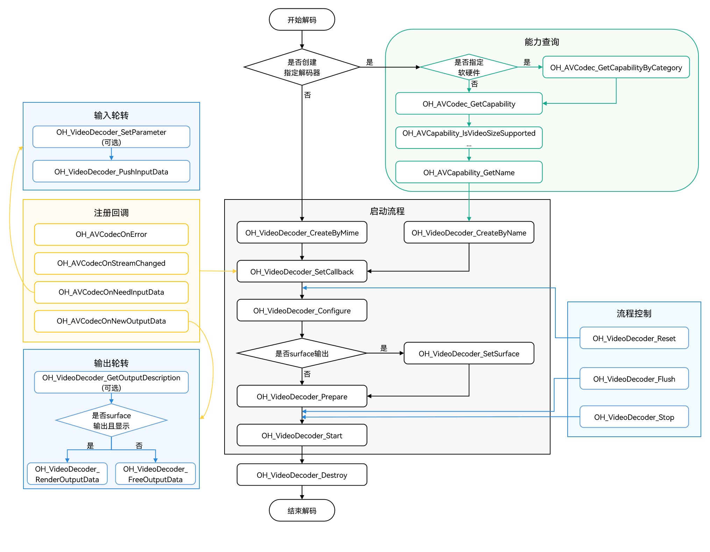

# 视频解码

开发者可以调用本模块的Native API接口，完成视频解码，即将媒体数据解码成YUV文件或送显。

当前支持的解码能力如下：

| 容器规格 | 视频硬解类型       | 视频软解类型   |
| -------- | --------------------- | ---------------- |
| mp4      | AVC(H.264)、HEVC(H.265) |AVC(H.264) |


视频解码软/硬件解码存在差异，基于MimeType创建解码器时，软解当前仅支持 H264 ("video/avc")，硬解则支持 H264 ("video/avc") 和 H265 ("video/hevc")。

## 开发案例

详细的API说明请参考[API文档](../reference/native-apis/_video_decoder.md)。
如下为视频解码调用关系图：


### 在 CMake 脚本中链接动态库
``` cmake
target_link_libraries(sample PUBLIC libnative_media_codecbase.so)
target_link_libraries(sample PUBLIC libnative_media_core.so)
target_link_libraries(sample PUBLIC libnative_media_vdec.so)
```

### 开发步骤

1. 创建编解码器实例对象。
   
   应用可以通过名称或媒体类型创建解码器。

   ``` c++
    // 通过 codecname 创建解码器, 应用有特殊需求，比如选择支持某种分辨率规格的解码器，可先查询capability，再根据codec name创建解码器。
    OH_AVCapability *capability = OH_AVCodec_GetCapability(OH_AVCODEC_MIMETYPE_VIDEO_AVC, false);
    const char *name = OH_AVCapability_GetName(capability);
    OH_AVCodec *videoDec = OH_VideoDecoder_CreateByName(name);
   ```
   ```c++
    // 通过 mimetype 创建解码器
    // 软/硬解: 创建 H264 解码器，存在多个可选解码器时，系统会创建最合适的解码器
    OH_AVCodec *videoDec = OH_VideoDecoder_CreateByMime(OH_AVCODEC_MIMETYPE_VIDEO_AVC);
    // 硬解: 创建 H265 解码器
    OH_AVCodec *videoDec = OH_VideoDecoder_CreateByMime(OH_AVCODEC_MIMETYPE_VIDEO_HEVC);
   ```
   ``` c++
   // 初始化队列
   class VDecSignal {
   public:
       std::mutex inMutex_;
       std::mutex outMutex_;
       std::condition_variable inCond_;
       std::condition_variable outCond_;
       std::queue<uint32_t> inQueue_;
       std::queue<uint32_t> outQueue_;
       std::queue<OH_AVMemory *> inBufferQueue_;
       std::queue<OH_AVMemory *> outBufferQueue_;
       std::queue<OH_AVCodecBufferAttr> attrQueue_;
   };
   VDecSignal *signal_;
   ```

2. 调用OH_VideoDecoder_SetCallback()设置回调函数。

   注册回调函数指针集合OH_AVCodecAsyncCallback，包括：

   - 解码器运行错误
   - 码流信息变化，如码流宽、高变化。
   - 运行过程中需要新的输入数据，即解码器已准备好，可以输入数据。
   - 运行过程中产生了新的输出数据，即解码完成。(注：Surface模式data参数为空)

   开发者可以通过处理该回调报告的信息，确保解码器正常运转。

   ``` c++
    // 解码异常回调OH_AVCodecOnError实现
    static void OnError(OH_AVCodec *codec, int32_t errorCode, void *userData)
    {
        (void)codec;
        (void)errorCode;
        (void)userData;
    }

    // 解码数据流变化回调OH_AVCodecOnStreamChanged实现
    static void OnStreamChanged(OH_AVCodec *codec, OH_AVFormat *format, void *userData)
    {
        (void)codec;
        (void)format;
        (void)userData;
    }

    // 解码输入回调OH_AVCodecOnNeedInputData实现
    static void OnNeedInputData(OH_AVCodec *codec, uint32_t index, OH_AVMemory *data, void *userData)
    {
        (void)codec;
        VDecSignal *signal_ = static_cast<VDecSignal *>(userData);
        std::unique_lock<std::mutex> lock(signal_->inMutex_);
        // 解码输入帧id送入 inQueue_
        signal_->inQueue_.push(index);
        // 解码输入帧数据送入 inBufferQueue_
        signal_->inBufferQueue_.push(data);
        signal_->inCond_.notify_all();
    }

    // 解码输出回调OH_AVCodecOnNewOutputData实现
    static void OnNeedOutputData(OH_AVCodec *codec, uint32_t index, OH_AVMemory *data, OH_AVCodecBufferAttr *attr,
                                        void *userData)
    {
        (void)codec;
        VDecSignal *signal_ = static_cast<VDecSignal *>(userData);
        std::unique_lock<std::mutex> lock(signal_->outMutex_);
        // 将对应输出 buffer 的 index 送入 outQueue_
        signal_->outQueue_.push(index);
        // 将对应解码完成的数据 data 送入 outBufferQueue_ (注： Surface模式下data为空)
        signal_->outBufferQueue_.push(data);
        signal_->attrQueue_.push(*attr);
        signal_->outCond_.notify_all();
    }
    OH_AVCodecAsyncCallback cb = {&OnError, &OnStreamChanged, &OnNeedInputData, &OnNeedOutputData};
    // 配置异步回调
    int32_t ret = OH_VideoDecoder_SetCallback(videoDec, cb, signal_);
   ```

3. 调用OH_VideoDecoder_Configure()配置解码器。

   配置必选项：视频帧宽度、视频帧高度、视频颜色格式。

   ``` c++
    // 配置视频帧宽度（必须）
    constexpr uint32_t DEFAULT_WIDTH = 320; 
    // 配置视频帧高度（必须）
    constexpr uint32_t DEFAULT_HEIGHT = 240;
    OH_AVFormat *format = OH_AVFormat_Create();
    // 写入 format
    OH_AVFormat_SetIntValue(format, OH_MD_KEY_WIDTH, DEFAULT_WIDTH);
    OH_AVFormat_SetIntValue(format, OH_MD_KEY_HEIGHT, DEFAULT_HEIGHT);
    OH_AVFormat_SetIntValue(format, OH_MD_KEY_PIXEL_FORMAT, AV_PIXEL_FORMAT_NV21);
    // 配置解码器
    int32_t ret = OH_VideoDecoder_Configure(videoDec, format);
    OH_AVFormat_Destroy(format);
   ```

4. （如需使用Surface送显，必须设置）设置Surface。应用需要从XComponent组件获取 nativeWindow，获取方式请参考 [XComponent](../reference/arkui-ts/ts-basic-components-xcomponent.md)
   
   ``` c++
    // 配置送显窗口参数
    int32_t ret = OH_VideoDecoder_SetSurface(videoDec, window);    // 从 XComponent 获取 window 
    bool isSurfaceMode = true;
   ```  

5. （仅使用Surface时可配置）配置解码器surface参数。
   
   ``` c++
    OH_AVFormat *format = OH_AVFormat_Create();
    // 配置显示旋转角度
    OH_AVFormat_SetIntValue(format, OH_MD_KEY_ROTATION, 90);
    // 配置视频与显示屏匹配模式(缩放与显示窗口适配, 裁剪与显示窗口适配)
    OH_AVFormat_SetIntValue(format, OH_MD_KEY_SCALING_MODE, SCALING_MODE_SCALE_CROP);
    int32_t ret = OH_VideoDecoder_SetParameter(videoDec, format);
    OH_AVFormat_Destroy(format);
   ``` 

6. 调用OH_VideoDecoder_Start()启动解码器。

   ``` c++
    string_view outputFilePath = "/*yourpath*.yuv";
    std::unique_ptr<std::ifstream> inputFile = std::make_unique<std::ifstream>();
    // 打开待解码二进制文件路径
    inputFile->open(inputFilePath.data(), std::ios::in | std::ios::binary); 
    // buffer 模式下需要配置
    if(!isSurfaceMode) {
        // buffer 模式: 配置解码文件输出路径
        std::unique_ptr<std::ofstream> outFile = std::make_unique<std::ofstream>();
        outFile->open(outputFilePath.data(), std::ios::out | std::ios::binary);
    }
    // 开始解码
    int32_t ret = OH_VideoDecoder_Start(videoDec);
   ```

7. 调用OH_VideoDecoder_PushInputData()，写入解码码流。

   ``` c++
    // 配置 buffer info 信息
    OH_AVCodecBufferAttr info;
    // 调用 FFmpeg 接口 av_packet_alloc 进行初始化并返回一个容器 pkt
    AVPacket pkt = av_packet_alloc();
    // 配置 info 的输入尺寸、偏移量、时间戳等字段信息
    info.size = pkt->size;
    info.offset = 0;
    info.pts = pkt->pts;
    info.flags = AVCODEC_BUFFER_FLAGS_NONE;
    // 送入解码输入队列进行解码, index 为对应队列下标
    int32_t ret = OH_VideoDecoder_PushInputData(videoDec, index, info);
   ```

8. 调用OH_VideoDecoder_FreeOutputData()，输出解码帧。

   ``` c++
    int32_t ret;
    // 将解码完成数据 data 写入到对应输出文件中
    outFile->write(reinterpret_cast<char *>(OH_AVMemory_GetAddr(data)), data.size);
    // buffer 模式, 释放已完成写入的数据, index 为对应 surface/buffer 队列下标
    if (isSurfaceMode) {
        ret = OH_VideoDecoder_RenderOutputData(videoDec, index);
    } else {
        ret = OH_VideoDecoder_FreeOutputData(videoDec, index);
    }
    if (ret != AV_ERR_OK) {
        // 异常处理
    }
   ```

9. （可选）调用OH_VideoDecoder_Flush()刷新解码器。
   
   调用OH_VideoDecoder_Flush()后，解码器仍处于运行态，但会将当前队列清空，将已解码的数据释放。
    
   此时需要调用OH_VideoDecoder_Start()重新开始解码。

   ``` c++
    int32_t ret;
    // 刷新解码器 videoDec
    ret = OH_VideoDecoder_Flush(videoDec);
    if (ret != AV_ERR_OK) {
        // 异常处理
    }
    // 重新开始解码
    ret = OH_VideoDecoder_Start(videoDec);
   ```

10. （可选）调用OH_VideoDecoder_Reset()重置解码器。
    
    调用OH_VideoDecoder_Reset()后，解码器回到初始化的状态，需要调用OH_VideoDecoder_Configure()重新配置。

    ``` c++
     int32_t ret;
     // 重置解码器 videoDec
     ret = OH_VideoDecoder_Reset(videoDec);
     if (ret != AV_ERR_OK) {
         // 异常处理
     }
     // 重新配置解码器参数
     ret = OH_VideoDecoder_Configure(videoDec, format);
    ```

11. 调用OH_VideoDecoder_Stop()停止解码器。
    
    ``` c++
     int32_t ret;
     // 终止解码器 videoDec
     ret = OH_VideoDecoder_Stop(videoDec);
     if (ret != AV_ERR_OK) {
         // 异常处理
     }
    ```

12. 调用OH_VideoDecoder_Destroy()销毁解码器实例，释放资源。

    ``` c++
     int32_t ret;
     // 调用 OH_VideoDecoder_Destroy, 注销解码器
     ret = OH_VideoDecoder_Destroy(videoDec);
     if (ret != AV_ERR_OK) {
         // 异常处理
     }
    ```

