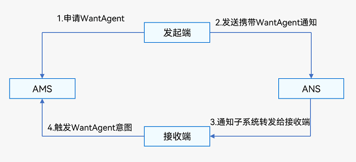

# 为通知添加行为意图


WantAgent提供了封装行为意图的能力，这里所说的行为意图主要是指拉起指定的应用组件及发布公共事件等能力。OpenHarmony支持以通知的形式，将WantAgent从发布方传递至接收方，从而在接收方触发WantAgent中指定的意图。例如，在通知消息的发布者发布通知时，通常期望用户可以通过通知栏点击拉起目标应用组件。为了达成这一目标，开发者可以将WantAgent封装至通知消息中，当系统接收到WantAgent后，在用户点击通知栏时触发WantAgent的意图，从而拉起目标应用组件。


为通知添加行为意图的实现方式如下图所示：发布通知的应用向应用组件管理服务AMS（Ability Manager Service）申请WantAgent，然后随其他通知信息一起发送给桌面，当用户在桌面通知栏上点击通知时，触发WantAgent动作。

  **图1** 携带行为意图的通知运行机制  



## 接口说明

具体接口描述，详见[WantAgent接口文档](../reference/apis/js-apis-wantAgent.md)。

| **接口名** | **描述** |
| -------- | -------- |
| getWantAgent(info:&nbsp;WantAgentInfo,&nbsp;callback:&nbsp;AsyncCallback&lt;WantAgent&gt;):&nbsp;void | 创建WantAgent。 |
| trigger(agent:&nbsp;WantAgent,&nbsp;triggerInfo:&nbsp;TriggerInfo,&nbsp;callback?:&nbsp;Callback&lt;CompleteData&gt;):&nbsp;void | 触发WantAgent意图。 |
| cancel(agent:&nbsp;WantAgent,&nbsp;callback:&nbsp;AsyncCallback&lt;void&gt;):&nbsp;void | 取消WantAgent。 |
| getWant(agent:&nbsp;WantAgent,&nbsp;callback:&nbsp;AsyncCallback&lt;Want&gt;):&nbsp;void | 获取WantAgent的want。 |
| equal(agent:&nbsp;WantAgent,&nbsp;otherAgent:&nbsp;WantAgent,&nbsp;callback:&nbsp;AsyncCallback&lt;boolean&gt;):&nbsp;void | 判断两个WantAgent实例是否相等。 |


## 开发步骤

1. 导入模块。
   
   ```ts
   import NotificationManager from '@ohos.notificationManager';
   import wantAgent from '@ohos.app.ability.wantAgent';
   ```

2. 创建WantAgentInfo信息。
     场景一：创建拉起Ability的WantAgent的[WantAgentInfo](../reference/apis/js-apis-inner-wantAgent-wantAgentInfo.md)信息。
     
   ```ts
   let wantAgentObj = null; // 用于保存创建成功的wantAgent对象，后续使用其完成触发的动作。
   
   // 通过WantAgentInfo的operationType设置动作类型。
   let wantAgentInfo = {
       wants: [
           {
               deviceId: '',
               bundleName: 'com.example.test',
               abilityName: 'com.example.test.MainAbility',
               action: '',
               entities: [],
               uri: '',
               parameters: {}
           }
       ],
       operationType: wantAgent.OperationType.START_ABILITY,
       requestCode: 0,
       wantAgentFlags:[wantAgent.WantAgentFlags.CONSTANT_FLAG]
   }
   ```

     场景二：创建发布公共事件的WantAgent的[WantAgentInfo](../reference/apis/js-apis-inner-wantAgent-wantAgentInfo.md)信息。
   
   ```ts
   let wantAgentObj = null; // 用于保存创建成功的WantAgent对象，后续使用其完成触发的动作。
   
   // wantAgentInfo
   let wantAgentInfo = {
       wants: [
           {
               action: 'event_name', // 设置事件名。
               parameters: {},
           }
       ],
       operationType: wantAgent.OperationType.SEND_COMMON_EVENT,
       requestCode: 0,
       wantAgentFlags: [wantAgent.WantAgentFlags.CONSTANT_FLAG],
   }
   ```

3. 创建WantAgent。
   
   ```ts
   // 创建WantAgent
   wantAgent.getWantAgent(wantAgentInfo, (err, data) => {
       if (err) {
           console.error('[WantAgent]getWantAgent err=' + JSON.stringify(err));
       } else {
           console.info('[WantAgent]getWantAgent success');
           wantAgentObj = data;
       }
   });
   ```

4. 构造NotificationRequest对象。
   
   ```ts
   // 构造NotificationRequest对象
   let notificationRequest = {
       content: {
           contentType: NotificationManager.ContentType.NOTIFICATION_CONTENT_BASIC_TEXT,
           normal: {
               title: 'Test_Title',
               text: 'Test_Text',
               additionalText: 'Test_AdditionalText',
           },
       },
       id: 1,
       label: 'TEST',
       wantAgent: wantAgentObj,
   }
   ```

5. 发布WantAgent通知。
   
   ```ts
   // 通知发送
   NotificationManager.publish(notificationRequest, (err) => {
       if (err) {
           console.error(`[ANS] failed to publish, error[${err}]`);
           return;
       }
       console.info(`[ANS] publish success `);
   });
   ```

6. 用户通过点击通知栏上的通知，触发WantAgent的动作。
   
   ```ts
   // 触发WantAgent
   let triggerInfo = {
       code: 0
   }
   wantAgent.trigger(wantAgentObj, triggerInfo, (completeData) => {
       console.info('[WantAgent]getWantAgent success, completeData: ',  + JSON.stringify(completeData));
   });
   ```
