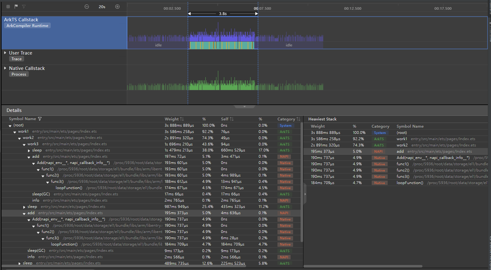
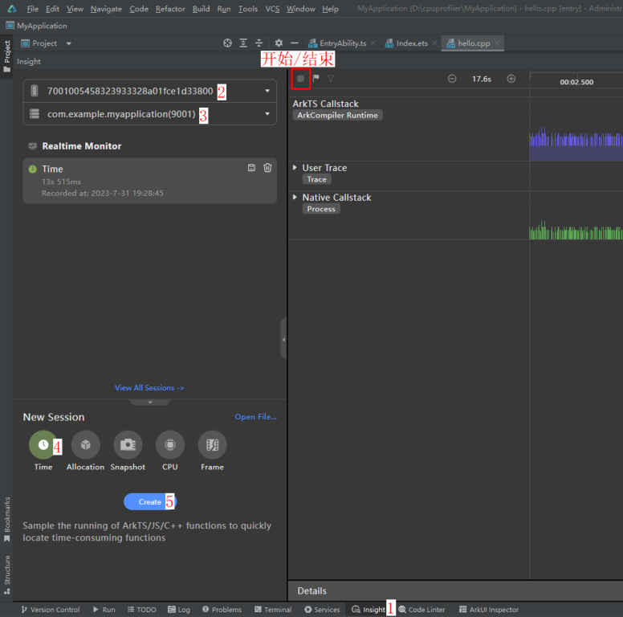

# OpenHarmony 应用性能分析工具 CPU Profiler 使用说明书

## 1. 简介

本文档介绍 OpenHarmony 应用性能分析工具 CPU Profiler 的使用方法，该工具为 OpenHarmony 应用开发者提供性能采样分析手段，可在不插桩情况下获取调用栈上各层函数的执行时间，并展示在时间轴上。开发者可通过该工具查看 TS / JS 代码及 NativeAPI 代码执行过程中的时序及耗时情况，进而发现热点函数及性能瓶颈，指导开发者进行应用层性能优化。

## 2. 性能数据分析视图说明

性能数据可以通过 `Deveco Studio->Insight->Time->ArkTS Callstack` 和 `Chrome浏览器->JavaScript Profiler` 进行展示和分析。前者提供 `Callstack泳道图` 、 `Details图` 。后者提供 `时序火焰图(Chart)` 、 `比重图(Heavy)` 、 `树形图(Tree)`。

### 2.1 Deveco Studio Insight 视图

#### 2.1.1 ArkTS Callstack 泳道图

泳道图展示了时间轴上每个时刻正在执行的函数或者正处于的阶段，对于函数来讲可理解为每个时刻调用栈的栈顶。可以通过 `Ctrl+鼠标滚轮` 任意放大和缩小鼠标所在位置的某一段。值得注意的是NAPI方法在泳道图上被特殊标记为黄色，此类方法会调用到 native 代码中，在 Details 图中可查看到该类方法的 native 调用栈。


#### 2.1.2 Details 图

在泳道图上点击任意时间条，或者选定一个起始和终止范围，工具将在下方 Details 图中显示此时间条代表的函数或者此范围内所有函数的完整调用链，右侧 Heaviest Stack 视图展示该范围内耗时最长的调用链。



从上图中我们不仅可以看到 JS 调用栈，还可以看到 NAPI 接口 native 实现部分的 C++ 调用栈。

对于JS方法及开发者自定义的 native 方法，双击 Detail 中该方法所在行可跳转到代码行（注：当前行号尚未完全对齐函数头行号，实际为函数内部实际执行代码的第一行）。

### 2.2 Chrome 浏览器 JavaScript Profiler 工具视图

Chrome 浏览器 JavaScript Profiler 工具默认调用V8引擎提供的 Profiler 工具，可抓取网页JS性能数据。本文提供的 TS/JS CPU Profiler 工具的性能数据（.cpuprofile）格式与其兼容，可直接导入到该工具进行分析。

在 Chrome 浏览器上打开 JavaScript Profiler 工具并加载数据文件步骤如下：

`F12 -> More tools -> JavaScript Profiler -> Load`


如果找不到此工具，可勾选下图选项后 F12 重新打开。


该工具可将性能分析数据展示在三种视图： `时序火焰图 (Chart)` 、 `比重图 (Heavy)` 、 `树形图 (Tree)` ，下面分别介绍。

#### 2.2.1 时序火焰图 (Chart)


该视图从时间维度展示应用运行过程中每个时刻的函数调用栈，最为直观，时间轴0时刻代表开始采集，可通过鼠标滚轮放大局部。


可将鼠标放在某一函数上，展示该函数详细信息，详情中包含以下几个字段：

**【Name】** 格式:“函数名 (标签) ”，含义：TS/JS 代码函数名，标签信息代表函数类型，将在章节2.3中详细说明。

**【Self Time】** 时间单位：毫秒 (ms)，含义：该函数本次调用过程中，除去调用下一级函数所消耗时间后的自身执行耗时。计算方法为该函数本次调用的总耗时减去该函数本次调用下一级所有函数的总时间。

**【Total Time】** 时间单位：毫秒 (ms)，含义：该函数本次调用过程中的总耗时，包含调用下一级函数所消耗的时间。

**【URL】** 格式：“文件路径：行号”，含义：该函数在 TS/JS 代码中的具体位置，包含所在文件及在该文件中的具体行号，该行号为函数头所在行号（注：当前 Chrome 采集方式 URL 并未进行 sourcemap 转换，所以对应的是应用编译中间产物， build 目录下相应的TS或JS文件，例如：`url xxx/index.ets:100` 实际对应的是 `build/default/cache/default/default@CompileArkTS/esmodule/debug/entry/src/main/ets/pages/Index.js:100` ，当前行号尚未完全对齐函数头行号，实际为函数内部实际执行代码的第一行）。

【Aggregated self time】时间单位：毫秒 (ms)，含义：该函数在整个采样过程中历次调用的 Self Time 的总和（仅限上级调用栈一致的多次调用求和）。

【Aggregated self time】时间单位：毫秒 (ms)，含义：该函数在整个采样过程中历次调用的 Total Time 的总和（仅限上级调用栈一致的多次调用求和）。

#### 2.2.2 比重图 (Heavy)

比重图列出了所有调用栈的栈顶，可以理解为时序火焰图从下往上看，看到的首先是调用链末端函数，以及各自的Self Time时间，将比重图的所有 Self Time 的比例相加结果为 100% 。

具体到某一个函数，箭头展开，可以看到调用该函数的完整调用链，可能包含多条调用链，指代这些调用链最终都会调用到该函数。

该图表可按照 Self Time 的大小排序，排在最前面的代表对应函数的 Self Time 耗时最长，可以作为重点进行分析。


#### 2.2.3 树形图 (Tree)

树形图列出了所有调用栈的栈底，可以理解为时序火焰图从上往下看，看到的首先是调用链的起始函数，以及各自的 Total Time 时间，将树形图的所有 Total Time 的比例相加结果为 100% 。

具体到某一个函数，箭头展开，可以看到该函数调用的完整调用链，可能包含多条调用链，指代这些调用链都是从该函数调用下去的。

该图表可按照Total Time的大小排序，排在最前面的代表对应函数的 Total Time 耗时最长，可以作为重点进行分析。


### 2.3 函数名标签“（TAG）”分类，含义及比例统计

各类视图中函数名可能包含“（TAG）”格式标签，例如 SingleMonthView(AOT)，或者函数名仅为“（TAG）”格式，例如（program）。

#### 2.3.1 函数名包含“（TAG）”标签

当前支持8类函数名标签，分别是 `(NAPI)` 、 `(ARKUI_ENGINE)` 、 `(BUILTIN)` 、 `(GC)` 、 `(AINT)` 、 `(CINT)` 、 `(AOT)` 、 `(RUNTIME)` 。可为应用开发者及系统开发者提供参考。后四种标签默认不可见，可通过命令 `hdc shell param set persist.ark.properties 0x505c; hdc shell reboot` 打开。下面分别介绍其含义。

**(NAPI)** ：系统 NativeAPI 或者开发者在 IDE 上自定义的 NativeAPI ，例如模板 Native C++ 应用中的 testNapi.add() 。

**(ARKUI_ENGINE)** ：Native 实现的ArkUI组件，例如:  onClick() ，此类函数暂无法提供函数名。

**(BUILTIN)** ：JS 标准库接口， Native 实现，虚拟机提供，例如:  JSON.stringify() 

**(GC)** ：调用该方法时触发了虚拟机的垃圾回收。

**(AINT)** ：TS/JS 方法，该方法通过虚拟机的汇编解释器解释执行。

**(CINT)** ：TS/JS 方法，该方法通过虚拟机的C解释器解释执行。

**(AOT)** ：TS/JS 方法，该方法通过虚拟机的 AOT (Ahead Of Time) 编译器提前编译成了机器码，在满足编程规范的前提下可以获得充分编译加速，执行时间比解释执行快。

**(RUNTIME)** ：对于一个 Native 接口 (NAPI,ARKUI_ENGINE.BUILTIN) ，调用该方法时，该方法正在调用虚拟机内部运行时代码。

#### 2.3.2 函数名仅为“（TAG）”标签

该类标签代表的是一类特殊节点，并非实际函数，包含三种，分别是 (root) 、 (program) 、 (idle) ，下面分别介绍其含义。

**(root)** ：根节点，是 program 和 idle 以及所有栈底的父节点，可以理解为 main 函数的上一层。

**(program)** ：代表程序执行进入纯 native 代码阶段，该阶段无 JS 代码执行，也无 JS 调用 native 或者 native 调用 JS 情况，可能处于系统框架层代码执行阶段。

**(idle)** ：被采集线程无任务执行或处于非 running 态，未占用 CPU 。

> 注：当前尚未统计 (idle) 阶段，该部分时间包含在 (program) 阶段中。

#### 2.3.3 （TAG） 时间占比统计工具 （ARK Performence Profile.exe）

工具：

可采集 cpuprofiler 数据，也可直接导入 .cpuprofile 文件，计算出每种 TAG 的耗时占比，并以饼状图展示如下：


## 3. 数据采集方法及适用场景

### 3.1 Deveco Studio Insight 工具采集

#### 3.1.1 适用场景及支持情况


| 场景 | 支持情况 |
| --- | --- |
| debug 应用 / release 应用 | 当前仅支持 debug 应用， release 应用支持待开发 |
| 是否支持采集 worker 线程 | 当前仅支持采集主线程， worker 线程支持待开发 |
| 是否支持采集冷启动数据 | 当前仅支持采集启动后数据，冷启动场景支持待开发 |

#### 3.1.2 采集步骤

1. 启动应用，打开 Deveco Studio 并确保连接到设备（右上角显示设备SN）；
2. 按照下图所示 1 - 5 步骤打开 `Insight -> Time` ，选择设备及应用，创建一个新的 Time Session 监视器。



3. 点击开始录制按钮，箭头变成方块代表开始录制。
4. 操作应用，复现待分析场景；
5. 再次点击录制按钮，方框变成灰色，结束录制。
6. 选择 ArkTS Callstack 泳道，框选时间范围或者直接选择函数进行分析，见[（2.2章节）](#22-chrome-浏览器-javascript-profiler-工具视图)。

### 3.2 Chrome 浏览器 JavaScript Profiler 工具采集

#### 3.2.1 适用场景及支持情况

| 场景 | 支持情况 |
| --- | --- |
| debug 应用 / release 应用 | 仅支持 debug 应用 |
| 是否支持采集 worker 线程 | 支持 |
| 是否支持采集冷启动数据 | 不支持 |

#### 3.2.2 采集步骤

1. 启动应用， `hdc shell "netstat -anp | grep PandaDebugger"` 或者 `adb shell "netstat -anp | grep PandaDebugger"` 查看应用线程号。如果要抓worker线程，列表中会有长线程号（8位），每个worker线程对应一个长线程号。
2.  `hdc fport tcp:9006 localabstract:2172PandaDebugger` 或者 `adb forward tcp:9006 localabstract:2172PandaDebugger` 绑定线程号和端口（注：建议选择较大端口号避免冲突，这里以9006为例。每次断开链接或退出进程后需要绑定新的端口号）。如果是worker线程，选择八位长线程号，多个worker线程同时采集需各自绑定不同的端口号，打开多个chrome窗口采集。


3. 在Chrome浏览器输入网址： `devtools://devtools/bundled/inspector.html?ws=//127.0.0.1:9006` ，端口号跟前面一致，回车，进入 JavaScript 性能剖析器（JavaScript Profiler）页面；
4. 点击左上角录制按钮，按钮变为红色开始录制；
5. 操作应用，复现待分析场景；
6. 再次点击录制按钮，按钮变为灰色结束录制；
7. 点击左上角性能分析报告，右侧显示性能分析图表，可以选择图表类型，显示数据表或者火焰图，见[（2.2章节）](#22-chrome-浏览器-javascript-profiler-工具视图)。


### 3.3 hdc shell 命令采集冷启动阶段

#### 3.3.1 适用场景及限制

| 类型 | 支持情况 |
| --- | --- |
| debug 应用 / release 应用 | 都支持 |
| 是否支持采集 worker 线程 | 即将支持 |
| 是否支持采集冷启动数据 | 支持 |

#### 3.3.2 采集步骤

1. 根据场景设置对应虚拟机参数：

| 场景 | 参数设置 |
| --- | --- |
| 仅采集主线程冷启动 | hdc shell param set persist.ark.properties **0x705c** |
| 仅采集worker线程冷启动 | hdc shell param set persist.ark.properties **0x1505c** |
| 同时采集主线程及worker线程冷启动 | hdc shell param set persist.ark.properties **0x1705c** |

2. 设置待采集应用的包名：`hdc shell param set persist.ark.arkbundlename com.ohos.example （以com.ohos.example为例）`
3. 重启设备：`hdc shell reboot`
4. 启动应用，会在拉起应用前自动开始采集数据；
5. 操作应用，复现待分析场景；
6. `hdc shell kill -39 pid` （pid为应用进程号）；
7. 文件拉取：

``` bash
# 主线程：
hdc file recv /data/app/el2/100/base/com.ohos.example/files/com.ohos.example.cpuprofile ./
# 或者
hdc file recv /data/app/el2/0/base/com.ohos.example/files/com.ohos.example.cpuprofile ./
```
``` bash
# worker线程：
hdc file recv /data/app/el2/100/base/com.ohos.example/files/com.ohos.example_线程id.cpuprofile ./
# 或者
hdc file recv /data/app/el2/0/base/com.ohos.example/files/com.ohos.example_线程id.cpuprofile ./
```
> 以 com.ohos.example 为例，文件实际位置及文件名以实际应用为准

8. 将 com.ohos.example.cpuprofile 文件导入 `Chrome 浏览器 -> JavaScript Profiler` 分析，见[（2.2章节）](#22-chrome-浏览器-javascript-profiler-工具视图)。


### 3.4 hdc shell 命令采集启动后的任意阶段

#### 3.4.1 适用场景及限制

| 类型 | 支持情况 |
| --- | --- |
| debug 应用 / release 应用 | 都支持 |
| 是否支持采集 worker 线程 | 即将支持 |
| 是否支持采集冷启动数据 | 不支持 |

#### 3.4.2 采集步骤
1. 设置虚拟机参数：

| 场景 | 参数设置 |
| --- | --- |
| 仅采集主线程任意阶段 | hdc shell param set persist.ark.properties **0x2505c** |
| 仅采集worker线程任意阶段 | hdc shell param set persist.ark.properties **0x4505c** |
| 同时采集主线程及worker线程任意阶段 | hdc shell param set persist.ark.properties **0x6505c** |

2. 重启设备：`hdc shell reboot`
3. 启动应用；
4. `hdc shell kill -39 pid` （pid为应用进程号），开始采集；
5. 操作应用，复现待分析场景；
6. `hdc shell kill -39 pid` ，结束采集；
7. 文件拉取：

``` bash
# 主线程：
hdc file recv /data/app/el2/100/base/com.ohos.example/files/com.ohos.example_1.cpuprofile ./
# 或者
hdc file recv /data/app/el2/0/base/com.ohos.example/files/com.ohos.example_1.cpuprofile ./
```
``` bash
# worker线程：
hdc file recv /data/app/el2/100/base/com.ohos.example/files/com.ohos.example_线程id_1.cpuprofile ./
# 或者
hdc file recv /data/app/el2/0/base/com.ohos.example/files/com.ohos.example_线程id_1.cpuprofile ./
```
> 以 com.ohos.example 为例，文件实际位置及文件名以实际应用为准

8. 将 com.ohos.example.cpuprofile 文件导入 `Chrome 浏览器 -> JavaScript Profiler` 分析，见[（2.2章节）](#22-chrome-浏览器-javascript-profiler-工具视图)。

> 注：（4）~（6）可重复执行多次，会分别采集多个阶段，生成多个 .cpuprofile 文件，命名规则为 com.ohos.example_次数.cpuprofile （主线程）， com.ohos.example_线程id_次数.cpuprofile （worker线程）

### 3.5 应用代码插桩采集

#### 3.5.1 适用场景及限制

| 类型 | 支持情况 |
| --- | --- |
| debug 应用 / release 应用 | 都支持 |
| 是否支持采集 worker 线程 | 支持 |
| 是否支持采集冷启动数据 | 支持 |

#### 3.5.2 采集步骤

1. 在应用代码中按照如下方式插桩，打包应用，安装应用。（注，插桩位置建议选择为不会重复执行的关键位置，例如onClink中的首行和末行，若重复执行 start ， stop ，仅有第一次的 start ， stop 会成功执行。）

``` TypeScript
// @ts-ignore
ArkTools.startCpuProf("filename", 500); //第一个参数为输出文件的文件名，无需加后缀。第二个参数为采样间隔，单位为微秒。也可以不传参数，默认以当前时间命名，采样间隔500微秒。
// code block
// ...
// code block
// @ts-ignore
ArkTools.stopCpuProf();
```

2. 启动应用，操作应用，复现待分析场景，确保插桩代码行能执行到；
3. 拉取文件

``` bash
hdc file recv /data/app/el2/100/base/com.ohos.example/files/filename.cpuprofile ./
# 或者
hdc file recv /data/app/el2/0/base/com.ohos.example/files/filename.cpuprofile ./
```
> 以 com.ohos.example 为例，文件实际位置及文件名以实际应用为准

4. 将 com.ohos.example.cpuprofile 文件导入 `Chrome 浏览器 -> JavaScript Profiler` 分析，见[（2.2章节）](#22-chrome-浏览器-javascript-profiler-工具视图)。

