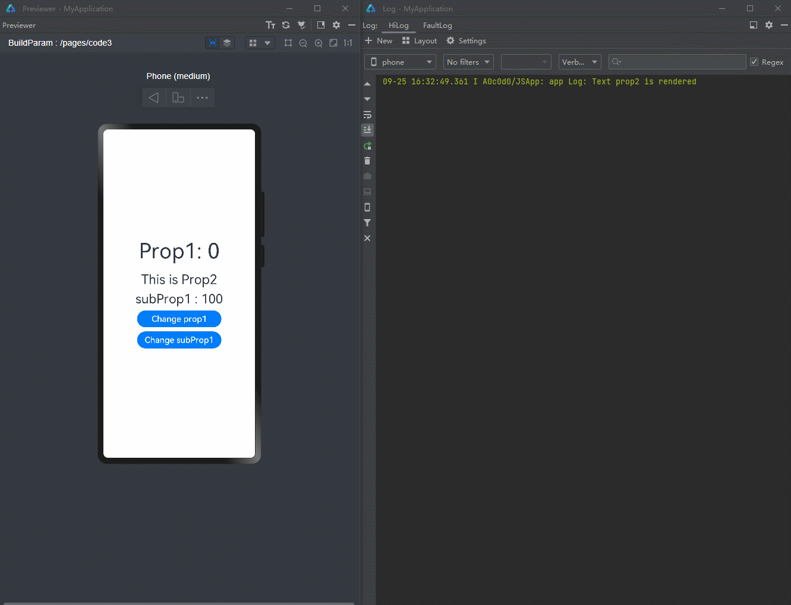
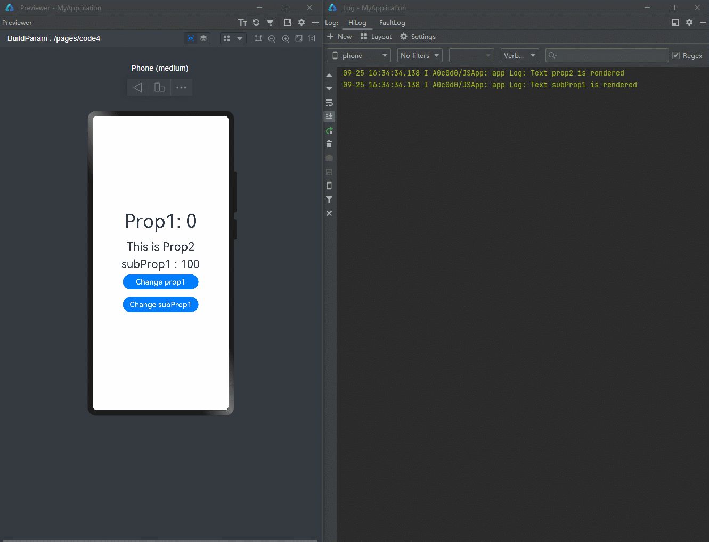
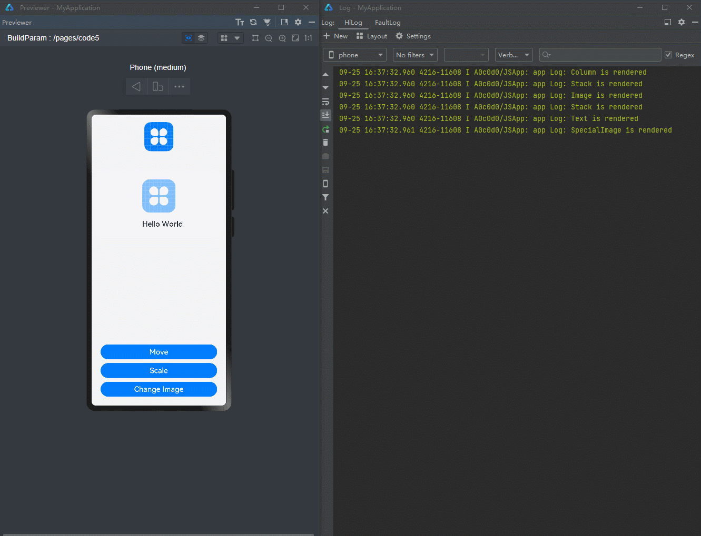

# 精准控制组件的更新范围

在复杂页面开发的场景下，精准控制组件更新的范围对提高应用运行性能尤为重要。

在学习本示例之前，需要了解当前状态管理的刷新机制。

```ts
@Observed
class ClassA {
  prop1: number = 0;
  prop2: string = "This is Prop2";
}
@Component
struct CompA {
  @ObjectLink a: ClassA;
  private sizeFont: number = 30; // the private variable does not invoke rendering
  private isRenderText() : number {
    this.sizeFont++; // the change of sizeFont will not invoke rendering, but showing that the function is called
    console.log("Text prop2 is rendered");
    return this.sizeFont;
  }
  build() {
    Column() {
      Text(this.a.prop2) // when this.a.prop2 changes, it will invoke Text rerendering
        .fontSize(this.isRenderText()) //if the Text renders, the function isRenderText will be called
    }
  }
}
@Entry
@Component
struct Page {
  @State a: ClassA = new ClassA();
  build() {
    Row() {
      Column() {
        Text("Prop1: " + this.a.prop1)
          .fontSize(50)
          .margin({ bottom: 20 })
        CompA({a: this.a})
        Button("Change prop1")
          .width(200)
          .margin({ top: 20 })
          .onClick(() => {
            this.a.prop1 = this.a.prop1 + 1 ;
          })
      }
      .width('100%')
    }
    .width('100%')
    .height('100%')
  }
}
```

在上面的示例中，当点击按钮改变prop1的值时，尽管CompA中的组件并没有使用prop1，但是仍然可以观测到关联prop2的Text组件进行了刷新，这体现在Text组件的字体变大，同时控制台输出了“Text prop2 is rendered”的日志上。这说明当改变了一个由@Observed装饰的类的实例对象中的某个属性时（即上面示例中的prop1），会导致所有关联这个对象中某个属性的组件一起刷新，尽管这些组件可能并没有直接使用到该改变的属性（即上面示例中使用prop的Text组件）。这样就会导致一些隐形的“冗余刷新”，当涉及到“冗余刷新”的组件数量很多时，就会大大影响组件的刷新性能。

上文代码运行图示如下：


下面的示例代码为一个较典型的冗余刷新场景。

```ts
@Observed
class UIStyle {
  translateX: number = 0;
  translateY: number = 0;
  scaleX: number = 0.3;
  scaleY: number = 0.3;
  width: number = 336;
  height: number = 178;
  posX: number = 10;
  posY: number = 50;
  alpha: number = 0.5;
  borderRadius: number = 24;
  imageWidth: number = 78;
  imageHeight: number = 78;
  translateImageX: number = 0;
  translateImageY: number = 0;
  fontSize: number = 20;
}
@Component
struct SpecialImage {
  @ObjectLink uiStyle: UIStyle;
  private isRenderSpecialImage() : number { // function to show whether the component is rendered
    console.log("SpecialImage is rendered");
    return 1;
  }
  build() {
    Image($r('app.media.icon'))
      .width(this.uiStyle.imageWidth)
      .height(this.uiStyle.imageHeight)
      .margin({ top: 20 })
      .translate({
        x: this.uiStyle.translateImageX,
        y: this.uiStyle.translateImageY
      })
      .opacity(this.isRenderSpecialImage()) // if the Image is rendered, it will call the function
  }
}
@Component
struct CompA {
  @ObjectLink uiStyle: UIStyle
  // the following functions are used to show whether the component is called to be rendered
  private isRenderColumn() : number {
    console.log("Column is rendered");
    return 1;
  }
  private isRenderStack() : number {
    console.log("Stack is rendered");
    return 1;
  }
  private isRenderImage() : number {
    console.log("Image is rendered");
    return 1;
  }
  private isRenderText() : number {
    console.log("Text is rendered");
    return 1;
  }
  build() {
    Column() {
      // when you compile this code in API9, IDE may tell you that
      // "Assigning the '@ObjectLink' decorated attribute 'uiStyle' to the '@ObjectLink' decorated attribute 'uiStyle' is not allowed. <etsLint>"
      // But you can still run the code by Previewer
      SpecialImage({
        uiStyle: this.uiStyle
      })
      Stack() {
        Column() {
            Image($r('app.media.icon'))
              .opacity(this.uiStyle.alpha)
              .scale({
                x: this.uiStyle.scaleX,
                y: this.uiStyle.scaleY
              })
              .padding(this.isRenderImage())
              .width(300)
              .height(300)
        }
        .width('100%')
        .position({ y: -80 })
        Stack() {
          Text("Hello World")
            .fontColor("#182431")
            .fontWeight(FontWeight.Medium)
            .fontSize(this.uiStyle.fontSize)
            .opacity(this.isRenderText())
            .margin({ top: 12 })
        }
        .opacity(this.isRenderStack())
        .position({
          x: this.uiStyle.posX,
          y: this.uiStyle.posY
        })
        .width('100%')
        .height('100%')
      }
      .margin({ top: 50 })
      .borderRadius(this.uiStyle.borderRadius)
      .opacity(this.isRenderStack())
      .backgroundColor("#FFFFFF")
      .width(this.uiStyle.width)
      .height(this.uiStyle.height)
      .translate({
        x: this.uiStyle.translateX,
        y: this.uiStyle.translateY
      })
      Column() {
        Button("Move")
          .width(312)
          .fontSize(20)
          .backgroundColor("#FF007DFF")
          .margin({ bottom: 10 })
          .onClick(() => {
            animateTo({
              duration: 500
            },() => {
              this.uiStyle.translateY = (this.uiStyle.translateY + 180) % 250;
            })
          })
        Button("Scale")
          .borderRadius(20)
          .backgroundColor("#FF007DFF")
          .fontSize(20)
          .width(312)
          .onClick(() => {
            this.uiStyle.scaleX = (this.uiStyle.scaleX + 0.6) % 0.8;
          })
      }
      .position({
        y:666
      })
      .height('100%')
      .width('100%')

    }
    .opacity(this.isRenderColumn())
    .width('100%')
    .height('100%')

  }
}
@Entry
@Component
struct Page {
  @State uiStyle: UIStyle = new UIStyle();
  build() {
    Stack() {
      CompA({
        uiStyle: this.uiStyle
      })
    }
    .backgroundColor("#F1F3F5")
  }
}
```

在上面的示例中，UIStyle定义了多个属性，并且这些属性分别被多个组件关联。当点击任意一个按钮更改其中的某些属性时，根据上文介绍的机制，会导致所有这些关联uiStyle的组件进行刷新，虽然它们其实并不需要进行刷新（因为组件的属性都没有改变）。通过定义的一系列isRender函数，可以观察到这些组件的刷新。当点击“move”按钮进行平移动画时，由于translateX与translateY的值的多次改变，会导致每一帧都存在冗余刷新的问题，这对应用的性能有着很大的负面影响。

上文代码运行图示如下：


对此，推荐将属性进行拆分，将一个大的属性对象拆分成几个小的属性对象，来减少甚至避免冗余刷新的现象，达到精准控制组件的更新范围。

为了达成这一目的，首先需要了解当前属性更新观测的另一个机制。

下面为示例代码。

```TS
@Observed
class ClassB {
  subProp1: number = 100;
}
@Observed
class ClassA {
  prop1: number = 0;
  prop2: string = "This is Prop2";
  prop3: ClassB = new ClassB();
}
@Component
struct CompA {
  @ObjectLink a: ClassA;
  private sizeFont: number = 30; // the private variable does not invoke rendering
  private isRenderText() : number {
    this.sizeFont++; // the change of sizeFont will not invoke rendering, but showing that the function is called
    console.log("Text prop2 is rendered");
    return this.sizeFont;
  }
  build() {
    Column() {
      Text(this.a.prop2) // when this.a.prop1 changes, it will invoke Text rerendering
        .margin({ bottom: 10 })
        .fontSize(this.isRenderText()) //if the Text renders, the function isRenderText will be called
      Text("subProp1 : " + this.a.prop3.subProp1) //the Text can not observe the change of subProp1
        .fontSize(30)
    }
  }
}
@Entry
@Component
struct Page {
  @State a: ClassA = new ClassA();
  build() {
    Row() {
      Column() {
        Text("Prop1: " + this.a.prop1)
          .margin({ bottom: 20 })
          .fontSize(50)
        CompA({a: this.a})
        Button("Change prop1")
          .width(200)
          .fontSize(20)
          .backgroundColor("#FF007DFF")
          .margin({
            top: 10,
            bottom: 10
          })
          .onClick(() => {
            this.a.prop1 = this.a.prop1 + 1 ;
          })
        Button("Change subProp1")
          .width(200)
          .fontSize(20)
          .backgroundColor("#FF007DFF")
          .onClick(() => {
            this.a.prop3.subProp1 = this.a.prop3.subProp1 + 1;
          })
      }
      .width('100%')
    }
    .width('100%')
    .height('100%')
  }
}
```

在上面的示例中，当点击按钮“Change subProp1”时，可以发现页面并没有进行刷新，这是因为对subProp1的更改并没有被组件观测到。当再次点击“Change prop1”时，可以发现页面进行了刷新，同时显示了prop1与subProp1的最新值。依据ArkUI状态管理机制，状态变量自身只能观察到第一层的变化，所以对于“Change subProp1"，对第二层的属性赋值，是无法观察到的，即对this.a.prop3.subProp1的变化并不会引起组件的刷新，即使subProp1的值其实已经产生了变化。而对this.a.prop1的改变则会引起刷新。

上文代码运行图示如下：



利用这一个机制，可以做到精准控制组件的更新范围。

```ts
@Observed
class ClassB {
  subProp1: number = 100;
}
@Observed
class ClassA {
  prop1: number = 0;
  prop2: string = "This is Prop2";
  prop3: ClassB = new ClassB();
}
@Component
struct CompA {
  @ObjectLink a: ClassA;
  @ObjectLink b: ClassB; // a new objectlink variable
  private sizeFont: number = 30;
  private isRenderText() : number {
    this.sizeFont++;
    console.log("Text prop2 is rendered");
    return this.sizeFont;
  }
  private isRenderTextSubProp1() : number {
    this.sizeFont++;
    console.log("Text subProp1 is rendered");
    return this.sizeFont;
  }
  build() {
    Column() {
      Text(this.a.prop2) // when this.a.prop1 changes, it will invoke Text rerendering
        .margin({ bottom: 10 })
        .fontSize(this.isRenderText()) //if the Text renders, the function isRenderText will be called
      Text("subProp1 : " + this.b.subProp1) // use directly b rather than a.prop3
        .fontSize(30)
        .opacity(this.isRenderTextSubProp1())
    }
  }
}
@Entry
@Component
struct Page {
  @State a: ClassA = new ClassA();
  build() {
    Row() {
      Column() {
        Text("Prop1: " + this.a.prop1)
          .margin({ bottom: 20 })
          .fontSize(50)
        CompA({
          a: this.a,
          b: this.a.prop3
        })
        Button("Change prop1")
          .width(200)
          .fontSize(20)
          .backgroundColor("#FF007DFF")
          .margin({
            top: 10,
            bottom: 10
          })
          .onClick(() => {
            this.a.prop1 = this.a.prop1 + 1 ;
          })
        Button("Change subProp1")
          .width(200)
          .fontSize(20)
          .backgroundColor("#FF007DFF")
          .margin({
            top: 10,
            bottom: 10
          })
          .onClick(() => {
            this.a.prop3.subProp1 = this.a.prop3.subProp1 + 1;
          })
      }
      .width('100%')
    }
    .width('100%')
    .height('100%')
  }
}
```

在上面的示例中，在CompA中定义了一个新的ObjectLink装饰的变量b，并由Page创建CompA时，将a对象中的prop3传入给b，这样就能在子组件CompA中直接使用b，这使得组件实际上和b进行了关联，组件也就能观测到b中的subProp1的变化，当点击按钮“Change subProp1”的时时候，可以只触发相关联的Text的组件的刷新，而不会引起其他的组件刷新（因为其他组件关联的是a），同样的其他对于a中属性的修改也不会导致该Text组件的刷新。

上文代码运行图示如下：



通过这个方法，可以将上文的复杂冗余刷新场景进行属性拆分实现性能优化。

```ts
@Observed
class NeedRenderImage { // properties only used in the same component can be divided into the same new divided class
  public translateImageX: number = 0;
  public translateImageY: number = 0;
  public imageWidth:number = 78;
  public imageHeight:number = 78;
}
@Observed
class NeedRenderScale { // properties usually used together can be divided into the same new divided class
  public scaleX: number = 0.3;
  public scaleY: number = 0.3;
}
@Observed
class NeedRenderAlpha { // properties that may be used in different places can be divided into the same new divided class
  public alpha: number = 0.5;
}
@Observed
class NeedRenderSize { // properties usually used together can be divided into the same new divided class
  public width: number = 336;
  public height: number = 178;
}
@Observed
class NeedRenderPos { // properties usually used together can be divided into the same new divided class
  public posX: number = 10;
  public posY: number = 50;
}
@Observed
class NeedRenderBorderRadius { // properties that may be used in different places can be divided into the same new divided class
  public borderRadius: number = 24;
}
@Observed
class NeedRenderFontSize { // properties that may be used in different places can be divided into the same new divided class
  public fontSize: number = 20;
}
@Observed
class NeedRenderTranslate { // properties usually used together can be divided into the same new divided class
  public translateX: number = 0;
  public translateY: number = 0;
}
@Observed
class UIStyle {
  // define new variable instead of using old one
  needRenderTranslate: NeedRenderTranslate = new NeedRenderTranslate();
  needRenderFontSize: NeedRenderFontSize = new NeedRenderFontSize();
  needRenderBorderRadius: NeedRenderBorderRadius = new NeedRenderBorderRadius();
  needRenderPos: NeedRenderPos = new NeedRenderPos();
  needRenderSize: NeedRenderSize = new NeedRenderSize();
  needRenderAlpha: NeedRenderAlpha = new NeedRenderAlpha();
  needRenderScale: NeedRenderScale = new NeedRenderScale();
  needRenderImage: NeedRenderImage = new NeedRenderImage();
}
@Component
struct SpecialImage {
  @ObjectLink uiStyle : UIStyle;
  @ObjectLink needRenderImage: NeedRenderImage // receive the new class from its parent component
  private isRenderSpecialImage() : number { // function to show whether the component is rendered
    console.log("SpecialImage is rendered");
    return 1;
  }
  build() {
    Image($r('app.media.icon'))
      .width(this.needRenderImage.imageWidth) // !! use this.needRenderImage.xxx rather than this.uiStyle.needRenderImage.xxx !!
      .height(this.needRenderImage.imageHeight)
      .margin({top:20})
      .translate({
        x: this.needRenderImage.translateImageX,
        y: this.needRenderImage.translateImageY
      })
      .opacity(this.isRenderSpecialImage()) // if the Image is rendered, it will call the function
  }
}
@Component
struct CompA {
  @ObjectLink uiStyle: UIStyle;
  @ObjectLink needRenderTranslate: NeedRenderTranslate; // receive the new class from its parent component
  @ObjectLink needRenderFontSize: NeedRenderFontSize;
  @ObjectLink needRenderBorderRadius: NeedRenderBorderRadius;
  @ObjectLink needRenderPos: NeedRenderPos;
  @ObjectLink needRenderSize: NeedRenderSize;
  @ObjectLink needRenderAlpha: NeedRenderAlpha;
  @ObjectLink needRenderScale: NeedRenderScale;
  // the following functions are used to show whether the component is called to be rendered
  private isRenderColumn() : number {
    console.log("Column is rendered");
    return 1;
  }
  private isRenderStack() : number {
    console.log("Stack is rendered");
    return 1;
  }
  private isRenderImage() : number {
    console.log("Image is rendered");
    return 1;
  }
  private isRenderText() : number {
    console.log("Text is rendered");
    return 1;
  }
  build() {
    Column() {
      // when you compile this code in API9, IDE may tell you that
      // "Assigning the '@ObjectLink' decorated attribute 'uiStyle' to the '@ObjectLink' decorated attribute 'uiStyle' is not allowed. <etsLint>"
      // "Assigning the '@ObjectLink' decorated attribute 'uiStyle' to the '@ObjectLink' decorated attribute 'needRenderImage' is not allowed. <etsLint>"
      // But you can still run the code by Previewer
      SpecialImage({
        uiStyle: this.uiStyle,
        needRenderImage: this.uiStyle.needRenderImage //send it to its child
      })
      Stack() {
        Column() {
          Image($r('app.media.icon'))
            .opacity(this.needRenderAlpha.alpha)
            .scale({
              x: this.needRenderScale.scaleX, // use this.needRenderXxx.xxx rather than this.uiStyle.needRenderXxx.xxx
              y: this.needRenderScale.scaleY
            })
            .padding(this.isRenderImage())
            .width(300)
            .height(300)
        }
        .width('100%')
        .position({ y: -80 })

        Stack() {
          Text("Hello World")
            .fontColor("#182431")
            .fontWeight(FontWeight.Medium)
            .fontSize(this.needRenderFontSize.fontSize)
            .opacity(this.isRenderText())
            .margin({ top: 12 })
        }
        .opacity(this.isRenderStack())
        .position({
          x: this.needRenderPos.posX,
          y: this.needRenderPos.posY
        })
        .width('100%')
        .height('100%')
      }
      .margin({ top: 50 })
      .borderRadius(this.needRenderBorderRadius.borderRadius)
      .opacity(this.isRenderStack())
      .backgroundColor("#FFFFFF")
      .width(this.needRenderSize.width)
      .height(this.needRenderSize.height)
      .translate({
        x: this.needRenderTranslate.translateX,
        y: this.needRenderTranslate.translateY
      })

      Column() {
        Button("Move")
          .width(312)
          .fontSize(20)
          .backgroundColor("#FF007DFF")
          .margin({ bottom: 10 })
          .onClick(() => {
            animateTo({
              duration: 500
            }, () => {
              this.needRenderTranslate.translateY = (this.needRenderTranslate.translateY + 180) % 250;
            })
          })
        Button("Scale")
          .borderRadius(20)
          .backgroundColor("#FF007DFF")
          .fontSize(20)
          .width(312)
          .margin({ bottom: 10 })
          .onClick(() => {
            this.needRenderScale.scaleX = (this.needRenderScale.scaleX + 0.6) % 0.8;
          })
        Button("Change Image")
          .borderRadius(20)
          .backgroundColor("#FF007DFF")
          .fontSize(20)
          .width(312)
          .onClick(() => { // in the parent component, still use this.uiStyle.needRenderXxx.xxx to change the properties
            this.uiStyle.needRenderImage.imageWidth = (this.uiStyle.needRenderImage.imageWidth + 30) % 160;
            this.uiStyle.needRenderImage.imageHeight = (this.uiStyle.needRenderImage.imageHeight + 30) % 160;
          })
      }
      .position({
        y: 616
      })
      .height('100%')
      .width('100%')
    }
    .opacity(this.isRenderColumn())
    .width('100%')
    .height('100%')
  }
}
@Entry
@Component
struct Page {
  @State uiStyle: UIStyle = new UIStyle();
  build() {
    Stack() {
      CompA({
        uiStyle: this.uiStyle,
        needRenderTranslate: this.uiStyle.needRenderTranslate, //send all the new class child need
        needRenderFontSize: this.uiStyle.needRenderFontSize,
        needRenderBorderRadius: this.uiStyle.needRenderBorderRadius,
        needRenderPos: this.uiStyle.needRenderPos,
        needRenderSize: this.uiStyle.needRenderSize,
        needRenderAlpha: this.uiStyle.needRenderAlpha,
        needRenderScale: this.uiStyle.needRenderScale
      })
    }
    .backgroundColor("#F1F3F5")
  }
}
```

上文代码运行图示如下：



在上面的示例中将原先大类中的十五个属性拆成了八个小类，并且在组件的属性绑定中也进行了相应的适配。属性拆分遵循以下几点原则：

- 只作用在同一个组件上的多个属性可以被拆分进同一个新类，即示例中的NeedRenderImage。适用于组件经常被不关联的属性改变而引起刷新的场景，这个时候就要考虑拆分属性，或者重新考虑ViewModel设计是否合理。
- 经常被同时使用的属性可以被拆分进同一个新类，即示例中的NeedRenderScale、NeedRenderTranslate、NeedRenderPos、NeedRenderSize。适用于属性经常成对出现，或者被作用在同一个样式上的情况，例如.translate、.position、.scale等（这些样式通常会接收一个对象作为参数）。
- 可能被用在多个组件上或相对较独立的属性应该被单独拆分进一个新类，即示例中的NeedRenderAlpha，NeedRenderBorderRadius、NeedRenderFontSize。适用于一个属性作用在多个组件上或者与其他属性没有联系的情况，例如.opacity、.borderRadius等（这些样式通常相对独立）。

在对属性进行拆分后，对所有使用属性对组件进行绑定的时候，需要使用以下格式：

```ts
.property(this.needRenderXxx.xxx)

// sample
Text("some text")
.width(this.needRenderSize.width)
.height(this.needRenderSize.height)
.opacity(this.needRenderAlpha.alpha)
```

在父组件改变属性的值时，可以通过外层的父类去修改，即：

```ts
// in parent Component
this.parent.needRenderXxx.xxx = x;

//example
this.uiStyle.needRenderImage.imageWidth = (this.uiStyle.needRenderImage.imageWidth + 20) % 60;
```

在子组件本身改变属性的值时，推荐直接通过新类去修改，即：

```ts
// in child Component
this.needRenderXxx.xxx = x;

//example
this.needRenderScale.scaleX = (this.needRenderScale.scaleX + 0.6) % 1
```

属性拆分应当重点考虑变化较为频繁的属性，来提高应用运行的性能。

如果想要在父组件中使用拆分后的属性，推荐新定义一个@State修饰的状态变量配合使用。

```ts
@Observed
class NeedRenderProperty {
  public property: number = 1;
};
@Observed
class SomeClass {
  needRenderProperty: NeedRenderProperty = new NeedRenderProperty();
}
@Entry
@Component
struct Page {
  @State someClass: SomeClass = new SomeClass();
  @State needRenderProperty: NeedRenderProperty = this.someClass.needRenderProperty
  build() {
    Row() {
      Column() {
        Text("property value: " + this.needRenderProperty.property)
          .fontSize(30)
          .margin({ bottom: 20 })
        Button("Change property")
          .onClick(() => {
            this.needRenderProperty.property++;
          })
      }
      .width('100%')
    }
    .width('100%')
    .height('100%')
  }
}
```

