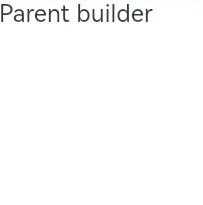
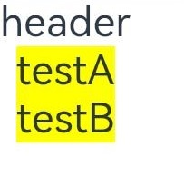

# \@BuilderParam装饰器：引用\@Builder函数


当开发者创建了自定义组件，并想对该组件添加特定功能时，例如在自定义组件中添加一个点击跳转操作。若直接在组件内嵌入事件方法，将会导致所有引入该自定义组件的地方均增加了该功能。为解决此问题，ArkUI引入了\@BuilderParam装饰器，\@BuilderParam用来装饰指向\@Builder方法的变量，开发者可在初始化自定义组件时对此属性进行赋值，为自定义组件增加特定的功能。该装饰器用于声明任意UI描述的一个元素，类似slot占位符。


> **说明：**
>
> 从API version 9开始，该装饰器支持在ArkTS卡片中使用。


## 装饰器使用说明


### 初始化\@BuilderParam装饰的方法

\@BuilderParam装饰的方法只能被自定义构建函数（\@Builder装饰的方法）初始化。

- 使用所属自定义组件的自定义构建函数或者全局的自定义构建函数，在本地初始化\@BuilderParam。

  ```ts
  @Builder function GlobalBuilder0() {}

  @Component
  struct Child {
    @Builder doNothingBuilder() {};

    @BuilderParam aBuilder0: () => void = this.doNothingBuilder;
    @BuilderParam aBuilder1: () => void = GlobalBuilder0;
    build(){}
  }
  ```

- 用父组件自定义构建函数初始化子组件\@BuilderParam装饰的方法。

  ```ts
  @Component
  struct Child {
    @Builder FunABuilder0() {}
    @BuilderParam aBuilder0: () => void = this.FunABuilder0;

    build() {
      Column() {
        this.aBuilder0()
      }
    }
  }

  @Entry
  @Component
  struct Parent {
    @Builder componentBuilder() {
      Text(`Parent builder `)
    }

    build() {
      Column() {
        Child({ aBuilder0: this.componentBuilder })
      }
    }
  }
  ```

  


- 需注意this指向正确。

  以下示例中，Parent组件在调用this.componentBuilder()时，this.label指向其所属组件，即“Parent”。\@Builder componentBuilder()传给子组件\@BuilderParam aBuilder0，在Child组件中调用this.aBuilder0()时，this.label指向在Child的label，即“Child”。对于\@BuilderParam aBuilder1，在将this.componentBuilder传给aBuilder1时，调用bind绑定了this，因此其this.label指向Parent的label。

   >  **说明：**
   >
   >  开发者谨慎使用bind改变函数调用的上下文，可能会使this指向混乱。

  ```ts
  @Component
  struct Child {
    label: string = `Child`
    @Builder FunABuilder0() {}
    @Builder FunABuilder1() {}
    @BuilderParam aBuilder0: () => void = this.FunABuilder0;
    @BuilderParam aBuilder1: () => void = this.FunABuilder1;

    build() {
      Column() {
        this.aBuilder0()
        this.aBuilder1()
      }
    }
  }

  @Entry
  @Component
  struct Parent {
    label: string = `Parent`

    @Builder componentBuilder() {
      Text(`${this.label}`)
    }

    build() {
      Column() {
        this.componentBuilder()
        Child({ aBuilder0: this.componentBuilder, aBuilder1: ():void=>{this.componentBuilder()} })
      }
    }
  }
  ```

  


## 使用场景


### 参数初始化组件

\@BuilderParam装饰的方法可以是有参数和无参数的两种形式，需与指向的\@Builder方法类型匹配。\@BuilderParam装饰的方法类型需要和\@Builder方法类型一致。


```ts
class Tmp{
  label:string = ''
}
@Builder function GlobalBuilder1($$ : Tmp) {
  Text($$.label)
    .width(400)
    .height(50)
    .backgroundColor(Color.Blue)
}

@Component
struct Child {
  label: string = 'Child'
  @Builder FunABuilder0() {}
  // 无参数类，指向的componentBuilder也是无参数类型
  @BuilderParam aBuilder0: () => void = this.FunABuilder0;
  // 有参数类型，指向的GlobalBuilder1也是有参数类型的方法
  @BuilderParam aBuilder1: ($$ : Tmp) => void = GlobalBuilder1;

  build() {
    Column() {
      this.aBuilder0()
      this.aBuilder1({label: 'global Builder label' } )
    }
  }
}

@Entry
@Component
struct Parent {
  label: string = 'Parent'

  @Builder componentBuilder() {
    Text(`${this.label}`)
  }

  build() {
    Column() {
      this.componentBuilder()
      Child({ aBuilder0: this.componentBuilder, aBuilder1: GlobalBuilder1 })
    }
  }
}
```


### 尾随闭包初始化组件

在自定义组件中使用\@BuilderParam装饰的属性时也可通过尾随闭包进行初始化。在初始化自定义组件时，组件后紧跟一个大括号“{}”形成尾随闭包场景。

> **说明：**
>
> 此场景下自定义组件内有且仅有一个使用\@BuilderParam装饰的属性。

开发者可以将尾随闭包内的内容看做\@Builder装饰的函数传给\@BuilderParam。示例如下：


```ts
// xxx.ets
@Component
struct CustomContainer {
  @Prop header: string = '';
  @Builder CloserFun(){}
  @BuilderParam closer: () => void = this.CloserFun

  build() {
    Column() {
      Text(this.header)
        .fontSize(30)
      this.closer()
    }
  }
}

@Builder function specificParam(label1: string, label2: string) {
  Column() {
    Text(label1)
      .fontSize(30)
    Text(label2)
      .fontSize(30)
  }
}

@Entry
@Component
struct CustomContainerUser {
  @State text: string = 'header';

  build() {
    Column() {
      // 创建CustomContainer，在创建CustomContainer时，通过其后紧跟一个大括号“{}”形成尾随闭包
      // 作为传递给子组件CustomContainer @BuilderParam closer: () => void的参数
      CustomContainer({ header: this.text }) {
        Column() {
          specificParam('testA', 'testB')
        }.backgroundColor(Color.Yellow)
        .onClick(() => {
          this.text = 'changeHeader';
        })
      }
    }
  }
}
```


