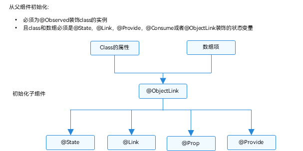

# \@Observed和\@ObjectLink：嵌套类对象属性变化


上文所述的装饰器仅能观察到第一层的变化，但是在实际应用开发中，应用会根据开发需要，封装自己的数据模型。对于多层嵌套的情况，比如二维数组，或者数组项class，或者class的属性是class，他们的第二层的属性变化是无法观察到的。这就引出了\@Observed/\@ObjectLink装饰器。


> **说明：**
> 从API version 9开始，这两个装饰器支持在ArkTS卡片中使用。


## 概述

\@ObjectLink和\@Observed类装饰器用于在涉及嵌套对象或数组的场景中进行双向数据同步：

- 被\@Observed装饰的类，可以被观察到属性的变化；

- 子组件中\@ObjectLink装饰器装饰的状态变量用于接受\@Observed装饰的类的实例，和父组件中对应的状态变量建立双向数据绑定。这个实例可以是数组中的被\@Observed装饰的项，或者是class object中是属性，这个属性同样也需要被\@Observed装饰。

- 单独使用\@Observed是没有任何作用的，需要搭配\@ObjectLink或者[\@Prop](arkts-prop.md)使用。


## 装饰器说明

| \@Observed类装饰器 | 说明                                |
| -------------- | --------------------------------- |
| 装饰器参数          | 无                                 |
| 类装饰器           | 装饰class。需要放在class的定义前，使用new创建类对象。 |

| \@ObjectLink变量装饰器 | 说明                                       |
| ----------------- | ---------------------------------------- |
| 装饰器参数             | 无                                        |
| 同步类型              | 不与父组件中的任何类型同步变量。                         |
| 允许装饰的变量类型         | 必须为被\@Observed装饰的class实例，必须指定类型。<br/>不支持简单类型，可以使用[\@Prop](arkts-prop.md)。<br/>\@ObjectLink的属性是可以改变的，但是变量的分配是不允许的，也就是说这个装饰器装饰变量是只读的，不能被改变。 |
| 被装饰变量的初始值         | 不允许。                                     |

\@ObjectLink装饰的数据为可读示例。


```ts
// 允许@ObjectLink装饰的数据属性赋值
this.objLink.a= ...
// 不允许@ObjectLink装饰的数据自身赋值
this.objLink= ...
```

> **说明：**
>
> \@ObjectLink装饰的变量不能被赋值，如果要使用赋值操作，请使用[@Prop](arkts-prop.md)。
>
> - \@Prop装饰的变量和数据源的关系是是单向同步，\@Prop装饰的变量在本地拷贝了数据源，所以它允许本地更改，如果父组件中的数据源有更新，\@Prop装饰的变量本地的修改将被覆盖；
>
> - \@ObjectLink装饰的变量和数据源的关系是双向同步，\@ObjectLink装饰的变量相当于指向数据源的指针。如果一旦发生\@ObjectLink装饰的变量的赋值，则同步链将被打断。


## 变量的传递/访问规则说明

| \@ObjectLink传递/访问 | 说明                                       |
| ----------------- | ---------------------------------------- |
| 从父组件初始化           | 必须指定。<br/>初始化\@ObjectLink装饰的变量必须同时满足以下场景：<br/>-&nbsp;类型必须是\@Observed装饰的class。<br/>-&nbsp;初始化的数值需要是数组项，或者class的属性。<br/>-&nbsp;同步源的class或者数组必须是\@State，\@Link，\@Provide，\@Consume或者\@ObjectLink装饰的数据。<br/>同步源是数组项的示例请参考[对象数组](#对象数组)。初始化的class的示例请参考[嵌套对象](#嵌套对象)。 |
| 与源对象同步            | 双向。                                      |
| 可以初始化子组件          | 允许，可用于初始化常规变量、\@State、\@Link、\@Prop、\@Provide |


  **图1** 初始化规则图示  





## 观察变化和行为表现


### 观察的变化

\@Observed装饰的类，如果其属性为非简单类型，比如class、Object或者数组，也需要被\@Observed装饰，否则将观察不到其属性的变化。


```ts
class ClassA {
  public c: number;

  constructor(c: number) {
    this.c = c;
  }
}

@Observed
class ClassB {
  public a: ClassA;
  public b: number;

  constructor(a: ClassA, b: number) {
    this.a = a;
    this.b = b;
  }
}
```

以上示例中，ClassB被\@Observed装饰，其成员变量的赋值的变化是可以被观察到的，但对于ClassA，没有被\@Observed装饰，其属性的修改不能被观察到。


```ts
@ObjectLink b: ClassB

// 赋值变化可以被观察到
this.b.a = new ClassA(5)
this.b.b = 5

// ClassA没有被@Observed装饰，其属性的变化观察不到
this.b.a.c = 5
```

\@ObjectLink：\@ObjectLink只能接受被\@Observed装饰class的实例，可以观察到：

- 其属性的数值的变化，其中属性是指Object.keys(observedObject)返回的所有属性，示例请参考[嵌套对象](#嵌套对象)。

- 如果数据源是数组，则可以观察到数组item的替换，如果数据源是class，可观察到class的属性的变化，示例请参考[对象数组](#对象数组)。


### 框架行为

1. 初始渲染：
   1. \@Observed装饰的class的实例会被不透明的代理对象包装，代理了class上的属性的setter和getter方法
   2. 子组件中\@ObjectLink装饰的从父组件初始化，接受被\@Observed装饰的class的实例，\@ObjectLink的包装类会将自己注册给\@Observed class。

2. 属性更新：当\@Observed装饰的class属性改变时，会走到代理的setter和getter，然后遍历依赖它的\@ObjectLink包装类，通知数据更新。


## 使用场景


### 嵌套对象

以下是嵌套类对象的数据结构。


```ts
// objectLinkNestedObjects.ets
let NextID: number = 1;

@Observed
class ClassA {
  public id: number;
  public c: number;

  constructor(c: number) {
    this.id = NextID++;
    this.c = c;
  }
}

@Observed
class ClassB {
  public a: ClassA;

  constructor(a: ClassA) {
    this.a = a;
  }
}
```


  以下组件层次结构呈现的是此数据结构

```ts
@Component
struct ViewA {
  label: string = 'ViewA1';
  @ObjectLink a: ClassA;

  build() {
    Row() {
      Button(`ViewA [${this.label}] this.a.c=${this.a.c} +1`)
        .onClick(() => {
          this.a.c += 1;
        })
    }
  }
}

@Entry
@Component
struct ViewB {
  @State b: ClassB = new ClassB(new ClassA(0));

  build() {
    Column() {
      ViewA({ label: 'ViewA #1', a: this.b.a })
      ViewA({ label: 'ViewA #2', a: this.b.a })

      Button(`ViewB: this.b.a.c+= 1`)
        .onClick(() => {
          this.b.a.c += 1;
        })
      Button(`ViewB: this.b.a = new ClassA(0)`)
        .onClick(() => {
          this.b.a = new ClassA(0);
        })
      Button(`ViewB: this.b = new ClassB(ClassA(0))`)
        .onClick(() => {
          this.b = new ClassB(new ClassA(0));
        })
    }
  }
}
```


ViewB中的事件句柄：


- this.b.a = new ClassA(0) 和this.b = new ClassB(new ClassA(0))： 对\@State装饰的变量b和其属性的修改。

- this.b.a.c = ... ：该变化属于第二次的变化，[@State](arkts-state.md#观察变化)无法观察到第二层的变化，但是ClassA被\@Observed装饰，ClassA的属性c的变化可以被\@ObjectLink观察到。


ViewA中的事件句柄：


- this.a.c += 1：对\@ObjectLink变量a的修改，将触发Button组件的刷新。\@ObjectLink和\@Prop不同，\@ObjectLink不拷贝来自父组件的数据源，而是在本地构建了指向其数据源的引用。

- \@ObjectLink变量是只读的，this.a = new ClassA(...)是不允许的，因为一旦赋值操作发生，指向数据源的引用将被重置，同步将被打断。


### 对象数组

对象数组是一种常用的数据结构。以下示例展示了数组对象的用法。


```ts
@Component
struct ViewA {
  // 子组件ViewA的@ObjectLink的类型是ClassA
  @ObjectLink a: ClassA;
  label: string = 'ViewA1';

  build() {
    Row() {
      Button(`ViewA [${this.label}] this.a.c = ${this.a.c} +1`)
        .onClick(() => {
          this.a.c += 1;
        })
    }
  }
}

@Entry
@Component
struct ViewB {
  // ViewB中有@State装饰的ClassA[]
  @State arrA: ClassA[] = [new ClassA(0), new ClassA(0)];

  build() {
    Column() {
      ForEach(this.arrA,
        (item) => {
          ViewA({ label: `#${item.id}`, a: item })
        },
        (item) => item.id.toString()
      )
      // 使用@State装饰的数组的数组项初始化@ObjectLink，其中数组项是被@Observed装饰的ClassA的实例
      ViewA({ label: `ViewA this.arrA[first]`, a: this.arrA[0] })
      ViewA({ label: `ViewA this.arrA[last]`, a: this.arrA[this.arrA.length-1] })

      Button(`ViewB: reset array`)
        .onClick(() => {
          this.arrA = [new ClassA(0), new ClassA(0)];
        })
      Button(`ViewB: push`)
        .onClick(() => {
          this.arrA.push(new ClassA(0))
        })
      Button(`ViewB: shift`)
        .onClick(() => {
          this.arrA.shift()
        })
      Button(`ViewB: chg item property in middle`)
        .onClick(() => {
          this.arrA[Math.floor(this.arrA.length / 2)].c = 10;
        })
      Button(`ViewB: chg item property in middle`)
        .onClick(() => {
          this.arrA[Math.floor(this.arrA.length / 2)] = new ClassA(11);
        })
    }
  }
}
```

- this.arrA[Math.floor(this.arrA.length/2)] = new ClassA(..) ：该状态变量的改变触发2次更新：
  1. ForEach：数组项的赋值导致ForEach的[itemGenerator](arkts-rendering-control-foreach.md#接口描述)被修改，因此数组项被识别为有更改，ForEach的item builder将执行，创建新的ViewA组件实例。
  2. ViewA({ label: `ViewA this.arrA[first]`, a: this.arrA[0] })：上述更改改变了数组中第一个元素，所以绑定this.arrA[0]的ViewA将被更新；

- this.arrA.push(new ClassA(0)) ： 将触发2次不同效果的更新：
  1. ForEach：新添加的ClassA对象对于ForEach是未知的[itemGenerator](arkts-rendering-control-foreach.md#接口描述)，ForEach的item builder将执行，创建新的ViewA组件实例。
  2. ViewA({ label: `ViewA this.arrA[last]`, a: this.arrA[this.arrA.length-1] })：数组的最后一项有更改，因此引起第二个ViewA的实例的更改。对于ViewA({ label: `ViewA this.arrA[first]`, a: this.arrA[0] })，数组的更改并没有触发一个数组项更改的改变，所以第一个ViewA不会刷新。

- this.arrA[Math.floor(this.arrA.length/2)].c：[@State](arkts-state.md#观察变化)无法观察到第二层的变化，但是ClassA被\@Observed装饰，ClassA的属性的变化将被\@ObjectLink观察到。


### 二维数组

使用\@Observed观察二维数组的变化。可以声明一个被\@Observed装饰的继承Array的子类。


```ts
@Observed
class StringArray extends Array<String> {
}
```

使用new StringArray()来构造StringArray的实例，new运算符使得\@Observed生效，\@Observed观察到StringArray的属性变化。

声明一个从Array扩展的类class StringArray extends Array&lt;String&gt; {}，并创建StringArray的实例。\@Observed装饰的类需要使用new运算符来构建class实例。


```ts
@Observed
class StringArray extends Array<String> {
}

@Component
struct ItemPage {
  @ObjectLink itemArr: StringArray;

  build() {
    Row() {
      Text('ItemPage')
        .width(100).height(100)

      ForEach(this.itemArr,
        item => {
          Text(item)
            .width(100).height(100)
        },
        item => item
      )
    }
  }
}

@Entry
@Component
struct IndexPage {
  @State arr: Array<StringArray> = [new StringArray(), new StringArray(), new StringArray()];

  build() {
    Column() {
      ItemPage({ itemArr: this.arr[0] })
      ItemPage({ itemArr: this.arr[1] })
      ItemPage({ itemArr: this.arr[2] })

      Divider()

      ForEach(this.arr,
        itemArr => {
          ItemPage({ itemArr: itemArr })
        },
        itemArr => itemArr[0]
      )

      Divider()

      Button('update')
        .onClick(() => {
          console.error('Update all items in arr');
          if (this.arr[0][0] !== undefined) {
            // 正常情况下需要有一个真实的ID来与ForEach一起使用，但此处没有
            // 因此需要确保推送的字符串是唯一的。
            this.arr[0].push(`${this.arr[0].slice(-1).pop()}${this.arr[0].slice(-1).pop()}`);
            this.arr[1].push(`${this.arr[1].slice(-1).pop()}${this.arr[1].slice(-1).pop()}`);
            this.arr[2].push(`${this.arr[2].slice(-1).pop()}${this.arr[2].slice(-1).pop()}`);
          } else {
            this.arr[0].push('Hello');
            this.arr[1].push('World');
            this.arr[2].push('!');
          }
        })
    }
  }
}
```
