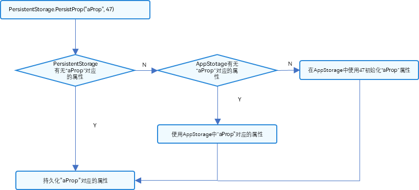

# PersistentStorage：持久化存储UI状态


前两个小节介绍的LocalStorage和AppStorage都是运行时的内存，但是在应用退出再次启动后，依然能保存选定的结果，是应用开发中十分常见的现象，这就需要用到PersistentStorage。


PersistentStorage是应用程序中的可选单例对象。此对象的作用是持久化存储选定的AppStorage属性，以确保这些属性在应用程序重新启动时的值与应用程序关闭时的值相同。


## 概述

PersistentStorage将选定的AppStorage属性保留在设备磁盘上。应用程序通过API，以决定哪些AppStorage属性应借助PersistentStorage持久化。UI和业务逻辑不直接访问PersistentStorage中的属性，所有属性访问都是对AppStorage的访问，AppStorage中的更改会自动同步到PersistentStorage。

PersistentStorage和AppStorage中的属性建立双向同步。应用开发通常通过AppStorage访问PersistentStorage，另外还有一些接口可以用于管理持久化属性，但是业务逻辑始终是通过AppStorage获取和设置属性的。


## 限制条件

持久化数据是一个相对缓慢的操作，应用程序应避免以下情况：

- 持久化大型数据集。

- 持久化经常变化的变量。

当持久化更改的过程变得太繁重时，PersistentStorage实现可能会限制持久化属性更改的频率。

PersistentStorage和UIContext相关联，需要在[UIContext](../reference/apis/js-apis-arkui-UIContext.md#uicontext)明确的时候才可以调用，可以通过在[runScopedTask](../reference/apis/js-apis-arkui-UIContext.md#runscopedtask)里明确上下文。如果没有在UIContext明确的地方调用，将导致无法持久化数据。

## 使用场景


### 从AppStorage中访问PersistentStorage初始化的属性

1. 初始化PersistentStorage：

   ```ts
   PersistentStorage.persistProp('aProp', 47);
   ```

2. 在AppStorage获取对应属性：

   ```ts
   AppStorage.get<number>('aProp'); // returns 47
   ```

   或在组件内部定义：


   ```ts
   @StorageLink('aProp') aProp: number = 48;
   ```

完整代码如下：


```ts
PersistentStorage.persistProp('aProp', 47);

@Entry
@Component
struct Index {
  @State message: string = 'Hello World'
  @StorageLink('aProp') aProp: number = 48

  build() {
    Row() {
      Column() {
        Text(this.message)
        // 应用退出时会保存当前结果。重新启动后，会显示上一次的保存结果
        Text(`${this.aProp}`)
          .onClick(() => {
            this.aProp += 1;
          })
      }
    }
  }
}
```

- 新应用安装后首次启动运行：
  1. 调用persistProp初始化PersistentStorage，首先查询在PersistentStorage本地文件中是否存在“aProp”，查询结果为不存在，因为应用是第一次安装。
  2. 接着查询属性“aProp”在AppStorage中是否存在，依旧不存在。
  3. 在AppStorge中创建名为“aProp”的number类型属性，属性初始值是定义的默认值47。
  4. PersistentStorage将属性“aProp”和值47写入磁盘，AppStorage中“aProp”对应的值和其后续的更改将被持久化。
  5. 在Index组件中创建状态变量\@StorageLink('aProp') aProp，和AppStorage中“aProp”双向绑定，在创建的过程中会在AppStorage中查找，成功找到“aProp”，所以使用其在AppStorage找到的值47。

  **图1** PersistProp初始化流程  



- 触发点击事件后：
  1. 状态变量\@StorageLink('aProp') aProp改变，触发Text组件重新刷新。
  2. \@StorageLink装饰的变量是和AppStorage中建立双向同步的，所以\@StorageLink('aProp') aProp的变化会被同步回AppStorage中。
  3. AppStorage中“aProp”属性的改变会同步到所有绑定该“aProp”的单向或者双向变量，在本示例中没有其他的绑定“aProp”的变量。
  4. 因为“aProp”对应的属性已经被持久化，所以在AppStorage中“aProp”的改变会触发PersistentStorage，将新的改变写入本地磁盘。

- 后续启动应用：
  1. 执行PersistentStorage.persistProp('aProp', 47)，在首先查询在PersistentStorage本地文件查询“aProp”属性，成功查询到。
  2. 将在PersistentStorage查询到的值写入AppStorage中。
  3. 在Index组件里，\@StorageLink绑定的“aProp”为PersistentStorage写入AppStorage中的值，即为上一次退出引用存入的值。


### 在PersistentStorage之前访问AppStorage中的属性

该示例为反例。在调用PersistentStorage.persistProp或者persistProps之前使用接口访问AppStorage中的属性是错误的，因为这样的调用顺序会丢失上一次应用程序运行中的属性值：


```ts
let aProp = AppStorage.setOrCreate('aProp', 47);
PersistentStorage.persistProp('aProp', 48);
```

应用在非首次运行时，先执行AppStorage.setOrCreate('aProp', 47)：属性“aProp”在AppStorage中创建，其类型为number，其值设置为指定的默认值47。'aProp'是持久化的属性，所以会被写回PersistentStorage磁盘中，PersistentStorage存储的上次退出应用的值丢失。

PersistentStorage.persistProp('aProp', 48)：在PersistentStorage中查找到“aProp”，找到，值为47。
