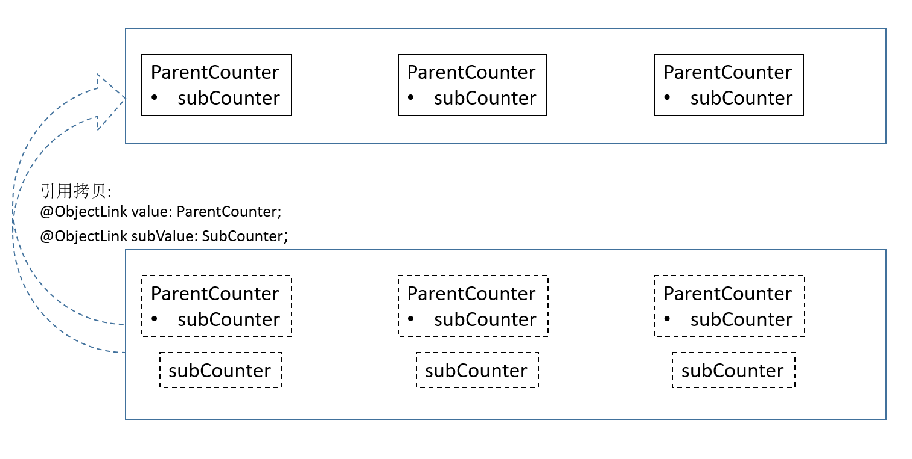
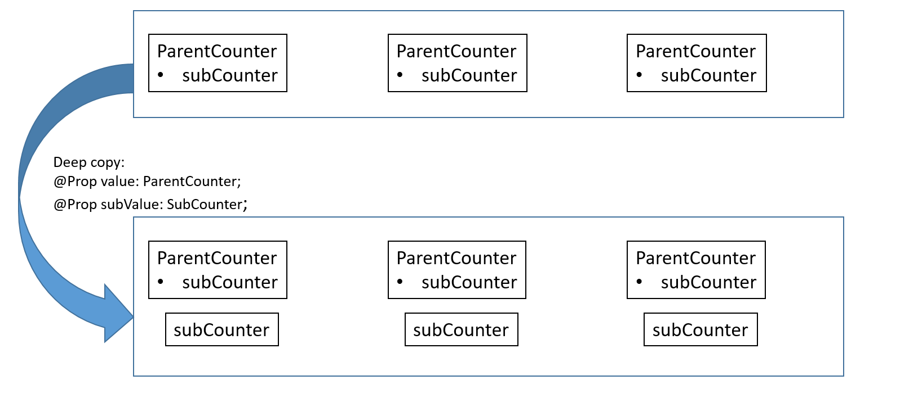
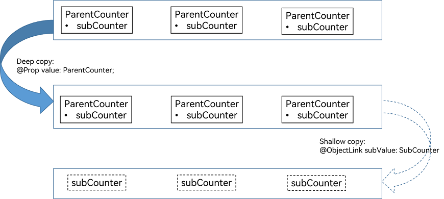

# 状态管理优秀实践


为了帮助应用程序开发人员提高其应用程序质量，特别是在高效的状态管理方面。本章节面向开发者提供了多个在开发ArkUI应用中常见场景和易错问题，并给出了对应的解决方案。此外，还提供了同一场景下，推荐用法和不推荐用法的对比和解释说明，更直观地展示两者区别，从而帮助开发者学习如果正确地在应用开发中使用状态变量，进行高性能开发。


## 基础示例

下面的例子是关于\@Prop，\@Link，\@ObjectLink的初始化规则的，在学习下面这个例子前，我们首先需要了解：

- \@Prop：可以被父组件的\@State初始化，或者\@State是复杂类型Object和class时的属性，或者是数组时的数组项。

- \@ObjectLink：初始化规则和\@Prop相同，但需要被\@Observed装饰class的实例初始化。

- \@Link：必须和\@State或其他数据源类型完全相同。


### 不推荐用法


  
```ts
@Observed
class ClassA {
  public c: number = 0;

  constructor(c: number) {
    this.c = c;
  }
}

@Component
struct LinkChild {
  @Link testNum: number;

  build() {
    Text(`LinkChild testNum ${this.testNum}`)
  }
}


@Component
struct PropChild2 {
  @Prop testNum: ClassA = new ClassA(0);

  build() {
    Text(`PropChild2 testNum ${this.testNum.c}`)
      .onClick(() => {
        this.testNum.c += 1;
      })
  }
}

@Component
struct PropChild3 {
  @Prop testNum: ClassA = new ClassA(0);

  build() {
    Text(`PropChild3 testNum ${this.testNum.c}`)
  }
}

@Component
struct ObjectLinkChild {
  @ObjectLink testNum: ClassA;

  build() {
    Text(`ObjectLinkChild testNum ${this.testNum.c}`)
      .onClick(() => {
        // 问题4：ObjectLink不能被赋值
        this.testNum = new ClassA(47);
      })
  }
}

@Entry
@Component
struct Parent {
  @State testNum: ClassA[] = [new ClassA(1)];

  build() {
    Column() {
      Text(`Parent testNum ${this.testNum.c}`)
        .onClick(() => {
          this.testNum[0].c += 1;
        })
      // 问题1：@Link装饰的变量需要和数据源@State类型一致
      LinkChild({ testNum: this.testNum.c })

      // 问题2：@Prop本地没有初始化，也没有从父组件初始化
      PropChild2()

      // 问题3：PropChild3没有改变@Prop testNum: ClassA的值，所以这时最优的选择是使用@ObjectLink
      PropChild3({ testNum: this.testNum[0] })

      ObjectLinkChild({ testNum: this.testNum[0] })
    }
  }
}
```


上面的例子有以下几个错误：


1. \@Component LinkChild：\@Link testNum: number从父组件的LinkChild({testNum:this.testNum.c})。\@Link的数据源必须是装饰器装饰的状态变量，简而言之，\@Link装饰的数据必须和数据源类型相同，比如\@Link: T和\@State : T。所以，这里应该改为\@Link testNum: ClassA，从父组件初始化的方式为LinkChild({testNum: $testNum})。

2. \@Component PropChild2：\@Prop可以本地初始化，也可以从父组件初始化，但是必须初始化，对于\@Prop testNum: ClassA没有本地初始化，所以必须从父组件初始化PropChild1({testNum: this.testNum})。

3. \@Component PropChild3：没有改变\@Prop testNum: ClassA的值，所以这时较优的选择是使用\@ObjectLink，因为\@Prop是会深拷贝数据，具有拷贝的性能开销，所以这个时候\@ObjectLink是比\@Link和\@Prop更优的选择。

4. 点击ObjectLinkChild给\@ObjectLink装饰的变量赋值：this.testNum = new ClassA(47); 也是不允许的，对于实现双向数据同步的\@ObjectLink，赋值相当于要更新父组件中的数组项或者class的属性，这个对于 TypeScript/JavaScript是不能实现的。框架对于这种行为会发生运行时报错。

5. 如果是非嵌套场景，比如Parent里声明的变量为 \@State testNum: ClassA = new ClassA(1)，ClassA就不需要被\@Observed修饰，因为\@State已经具备了观察第一层变化的能力，不需要再使用\@Observed来加一层代理。


### 推荐用法


  
```ts
@Observed
class ClassA {
  public c: number = 0;

  constructor(c: number) {
    this.c = c;
  }
}

@Component
struct LinkChild {
  @Link testNum: ClassA;

  build() {
    Text(`LinkChild testNum ${this.testNum?.c}`)
  }
}

@Component
struct PropChild1 {
  @Prop testNum: ClassA = new ClassA(1);

  build() {
    Text(`PropChild1 testNum ${this.testNum?.c}`)
      .onClick(() => {
        this.testNum = new ClassA(48);
      })
  }
}

@Component
struct ObjectLinkChild {
  @ObjectLink testNum: ClassA;

  build() {
    Text(`ObjectLinkChild testNum ${this.testNum.c}`)
      // @ObjectLink装饰的变量可以更新属性
      .onClick(() => {
        this.testNum.c += 1;
      })
  }
}

@Entry
@Component
struct Parent {
  @State testNum: ClassA[] = [new ClassA(1)];

  build() {
    Column() {
      Text(`Parent testNum ${this.testNum.c}`)
        .onClick(() => {
          this.testNum[0].c += 1;
        })
      // @Link装饰的变量需要和数据源@State类型一致
      LinkChild({ testNum: this.testNum[0] })

      // @Prop本地有初始化，不需要再从父组件初始化
      PropChild1()

      // 当子组件不需要发生本地改变时，优先使用@ObjectLink，因为@Prop是会深拷贝数据，具有拷贝的性能开销，所以这个时候@ObjectLink是比@Link和@Prop更优的选择
      ObjectLinkChild({ testNum: this.testNum[0] })
    }
  }
}
```


## 基础嵌套对象属性更改失效

在应用开发中，有很多嵌套对象场景，例如，开发者更新了某个属性，但UI没有进行对应的更新。

每个装饰器都有自己可以观察的能力，并不是所有的改变都可以被观察到，只有可以被观察到的变化才会进行UI更新。\@Observed装饰器可以观察到嵌套对象的属性变化，其他装饰器仅能观察到第二层的变化。


### 不推荐用法

下面的例子中，一些UI组件并不会更新。

  
```ts
class ClassA {
  a: number;

  constructor(a: number) {
    this.a = a;
  }

  getA(): number {
    return this.a;
  }

  setA(a: number): void {
    this.a = a;
  }
}

class ClassC {
  c: number;

  constructor(c: number) {
    this.c = c;
  }

  getC(): number {
    return this.c;
  }

  setC(c: number): void {
    this.c = c;
  }
}

class ClassB extends ClassA {
  b: number = 47;
  c: ClassC;

  constructor(a: number, b: number, c: number) {
    super(a);
    this.b = b;
    this.c = new ClassC(c);
  }

  getB(): number {
    return this.b;
  }

  setB(b: number): void {
    this.b = b;
  }

  getC(): number {
    return this.c.getC();
  }

  setC(c: number): void {
    return this.c.setC(c);
  }
}


@Entry
@Component
struct MyView {
  @State b: ClassB = new ClassB(10, 20, 30);

  build() {
    Column({ space: 10 }) {
      Text(`a: ${this.b.a}`)
      Button("Change ClassA.a")
        .onClick(() => {
          this.b.a += 1;
        })

      Text(`b: ${this.b.b}`)
      Button("Change ClassB.b")
        .onClick(() => {
          this.b.b += 1;
        })

      Text(`c: ${this.b.c.c}`)
      Button("Change ClassB.ClassC.c")
        .onClick(() => {
          // 点击时上面的Text组件不会刷新
          this.b.c.c += 1;
        })
    }
  }
}
```

- 最后一个Text组件Text('c: ${this.b.c.c}')，当点击该组件时UI不会刷新。 因为，\@State b : ClassB 只能观察到this.b属性的变化，比如this.b.a, this.b.b 和this.b.c的变化，但是无法观察嵌套在属性中的属性，即this.b.c.c（属性c是内嵌在b中的对象classC的属性）。

- 为了观察到嵌套与内部的ClassC的属性，需要做如下改变：
  - 构造一个子组件，用于单独渲染ClassC的实例。 该子组件可以使用\@ObjectLink c : ClassC或\@Prop c : ClassC。通常会使用\@ObjectLink，除非子组件需要对其ClassC对象进行本地修改。
  - 嵌套的ClassC必须用\@Observed修饰。当在ClassB中创建ClassC对象时（本示例中的ClassB(10, 20, 30）)，它将被包装在ES6代理中，当ClassC属性更改时（this.b.c.c += 1），该代码将修改通知到\@ObjectLink变量。


### 推荐用法

以下示例使用\@Observed/\@ObjectLink来观察嵌套对象的属性更改。

  
```ts
class ClassA {
  a: number;
  constructor(a: number) {
    this.a = a;
  }
  getA() : number {
    return this.a; }
  setA( a: number ) : void {
    this.a = a; }
}

@Observed
class ClassC {
  c: number;
  constructor(c: number) {
    this.c = c;
  }
  getC() : number {
    return this.c; }
  setC(c : number) : void {
    this.c = c; }
}

class ClassB extends ClassA {
  b: number = 47;
  c: ClassC;

  constructor(a: number, b: number, c: number) {
    super(a);
    this.b = b;
    this.c = new ClassC(c);
  }

  getB() : number {
    return this.b; }
  setB(b : number) : void {
    this.b = b; }
  getC() : number {
    return this.c.getC(); }
  setC(c : number) : void {
    return this.c.setC(c); }
}

@Component
struct ViewClassC {

  @ObjectLink c : ClassC;
  build() {
    Column({space:10}) {
      Text(`c: ${this.c.getC()}`)
      Button("Change C")
        .onClick(() => {
          this.c.setC(this.c.getC()+1);
        })
    }
  }
}

@Entry
@Component
struct MyView {
  @State b : ClassB = new ClassB(10, 20, 30);

  build() {
    Column({space:10}) {
      Text(`a: ${this.b.a}`)
      Button("Change ClassA.a")
        .onClick(() => {
          this.b.a +=1;
        })

      Text(`b: ${this.b.b}`)
      Button("Change ClassB.b")
        .onClick(() => {
          this.b.b += 1;
        })

      ViewClassC({c: this.b.c})   // Text(`c: ${this.b.c.c}`)的替代写法
      Button("Change ClassB.ClassC.c")
        .onClick(() => {
          this.b.c.c += 1;
        })
    }
  }
}
```


## 复杂嵌套对象属性更改失效


### 不推荐用法

以下示例创建了一个带有\@ObjectLink装饰变量的子组件，用于渲染一个含有嵌套属性的ParentCounter，用\@Observed装饰嵌套在ParentCounter中的SubCounter。

  
```ts
let nextId = 1;
@Observed
class SubCounter {
  counter: number;
  constructor(c: number) {
    this.counter = c;
  }
}
@Observed
class ParentCounter {
  id: number;
  counter: number;
  subCounter: SubCounter;
  incrCounter() {
    this.counter++;
  }
  incrSubCounter(c: number) {
    this.subCounter.counter += c;
  }
  setSubCounter(c: number): void {
    this.subCounter.counter = c;
  }
  constructor(c: number) {
    this.id = nextId++;
    this.counter = c;
    this.subCounter = new SubCounter(c);
  }
}
@Component
struct CounterComp {
  @ObjectLink value: ParentCounter;
  build() {
    Column({ space: 10 }) {
      Text(`${this.value.counter}`)
        .fontSize(25)
        .onClick(() => {
          this.value.incrCounter();
        })
      Text(`${this.value.subCounter.counter}`)
        .onClick(() => {
          this.value.incrSubCounter(1);
        })
      Divider().height(2)
    }
  }
}
@Entry
@Component
struct ParentComp {
  @State counter: ParentCounter[] = [new ParentCounter(1), new ParentCounter(2), new ParentCounter(3)];
  build() {
    Row() {
      Column() {
        CounterComp({ value: this.counter[0] })
        CounterComp({ value: this.counter[1] })
        CounterComp({ value: this.counter[2] })
        Divider().height(5)
        ForEach(this.counter,
          (item: ParentCounter) => {
            CounterComp({ value: item })
          },
          (item: ParentCounter) => item.id.toString()
        )
        Divider().height(5)
        // 第一个点击事件
        Text('Parent: incr counter[0].counter')
          .fontSize(20).height(50)
          .onClick(() => {
            this.counter[0].incrCounter();
            // 每次触发时自增10
            this.counter[0].incrSubCounter(10);
          })
        // 第二个点击事件
        Text('Parent: set.counter to 10')
          .fontSize(20).height(50)
          .onClick(() => {
            // 无法将value设置为10，UI不会刷新
            this.counter[0].setSubCounter(10);
          })
        Text('Parent: reset entire counter')
          .fontSize(20).height(50)
          .onClick(() => {
            this.counter = [new ParentCounter(1), new ParentCounter(2), new ParentCounter(3)];
          })
      }
    }
  }
}
```

对于Text('Parent: incr counter[0].counter')的onClick事件，this.counter[0].incrSubCounter(10)调用incrSubCounter方法使SubCounter的counter值增加10，UI同步刷新。

但是，在Text('Parent: set.counter to 10')的onClick中调用this.counter[0].setSubCounter(10)，SubCounter的counter值却无法重置为10。

incrSubCounter和setSubCounter都是同一个SubCounter的函数。在第一个点击处理时调用incrSubCounter可以正确更新UI，而第二个点击处理调用setSubCounter时却没有更新UI。实际上incrSubCounter和setSubCounter两个函数都不能触发Text('${this.value.subCounter.counter}')的更新，因为\@ObjectLink value : ParentCounter仅能观察其代理ParentCounter的属性，对于this.value.subCounter.counter是SubCounter的属性，无法观察到嵌套类的属性。

但是，第一个click事件调用this.counter[0].incrCounter()将CounterComp自定义组件中\@ObjectLink value: ParentCounter标记为已更改。此时触发Text('${this.value.subCounter.counter}')的更新。 如果在第一个点击事件中删除this.counter[0].incrCounter()，也无法更新UI。


### 推荐用法

对于上述问题，为了直接观察SubCounter中的属性，以便this.counter[0].setSubCounter(10)操作有效，可以利用下面的方法：


```ts
@ObjectLink value：ParentCounter;
@ObjectLink subValue：SubCounter;
```

该方法使得\@ObjectLink分别代理了ParentCounter和SubCounter的属性，这样对于这两个类的属性的变化都可以观察到，即都会对UI视图进行刷新。即使删除了上面所说的this.counter[0].incrCounter()，UI也会进行正确的刷新。

该方法可用于实现“两个层级”的观察，即外部对象和内部嵌套对象的观察。但是该方法只能用于\@ObjectLink装饰器，无法作用于\@Prop（\@Prop通过深拷贝传入对象）。详情参考@Prop与@ObjectLink的差异。


```ts
let nextId = 1;
@Observed
class SubCounter {
  counter: number;
  constructor(c: number) {
    this.counter = c;
  }
}
@Observed
class ParentCounter {
  id: number;
  counter: number;
  subCounter: SubCounter;
  incrCounter() {
    this.counter++;
  }
  incrSubCounter(c: number) {
    this.subCounter.counter += c;
  }
  setSubCounter(c: number): void {
    this.subCounter.counter = c;
  }
  constructor(c: number) {
    this.id = nextId++;
    this.counter = c;
    this.subCounter = new SubCounter(c);
  }
}
@Component
struct CounterComp {
  @ObjectLink value: ParentCounter;
  @ObjectLink subValue: SubCounter;
  build() {
    Column({ space: 10 }) {
      Text(`${this.value.counter}`)
        .fontSize(25)
        .onClick(() => {
          this.value.incrCounter();
        })
      Text(`${this.subValue.counter}`)
        .onClick(() => {
          this.subValue.counter += 1;
        })
      Divider().height(2)
    }
  }
}
@Entry
@Component
struct ParentComp {
  @State counter: ParentCounter[] = [new ParentCounter(1), new ParentCounter(2), new ParentCounter(3)];
  build() {
    Row() {
      Column() {
        CounterComp({ value: this.counter[0], subValue: this.counter[0].subCounter[0] })
        CounterComp({ value: this.counter[1], subValue: this.counter[1].subCounter[0] })
        CounterComp({ value: this.counter[2], subValue: this.counter[2].subCounter[0] })
        Divider().height(5)
        ForEach(this.counter,
          (item: ParentCounter) => {
            CounterComp({ value: item, subValue: item.subCounter[0] })
          },
          (item: ParentCounter) => item.id.toString()
        )
        Divider().height(5)
        Text('Parent: reset entire counter')
          .fontSize(20).height(50)
          .onClick(() => {
            this.counter = [new ParentCounter(1), new ParentCounter(2), new ParentCounter(3)];
          })
        Text('Parent: incr counter[0].counter')
          .fontSize(20).height(50)
          .onClick(() => {
            this.counter[0].incrCounter();
            this.counter[0].incrSubCounter(10);
          })
        Text('Parent: set.counter to 10')
          .fontSize(20).height(50)
          .onClick(() => {
            this.counter[0].setSubCounter(10);
          })
      }
    }
  }
}
```


## \@Prop与\@ObjectLink的差异

在下面的示例代码中，\@ObjectLink修饰的变量是对数据源的引用，即在this.value.subValue和this.subValue都是同一个对象的不同引用，所以在点击CounterComp的click handler，改变this.value.subCounter.counter，this.subValue.counter也会改变，对应的组件Text(`this.subValue.counter: ${this.subValue.counter}`)会刷新。

  
```ts
let nextId = 1;

@Observed
class SubCounter {
  counter: number;
  constructor(c: number) {
    this.counter = c;
  }
}

@Observed
class ParentCounter {
  id: number;
  counter: number;
  subCounter: SubCounter;
  incrCounter() {
    this.counter++;
  }
  incrSubCounter(c: number) {
    this.subCounter.counter += c;
  }
  setSubCounter(c: number): void {
    this.subCounter.counter = c;
  }
  constructor(c: number) {
    this.id = nextId++;
    this.counter = c;
    this.subCounter = new SubCounter(c);
  }
}

@Component
struct CounterComp {
  @ObjectLink value: ParentCounter;
  @ObjectLink subValue: SubCounter;
  build() {
    Column({ space: 10 }) {
      Text(`this.subValue.counter: ${this.subValue.counter}`)
        .fontSize(30)
      Text(`this.value.counter：increase 7 `)
        .fontSize(30)
        .onClick(() => {
          // click handler, Text(`this.subValue.counter: ${this.subValue.counter}`) will update
          this.value.incrSubCounter(7);
        })
      Divider().height(2)
    }
  }
}

@Entry
@Component
struct ParentComp {
  @State counter: ParentCounter[] = [new ParentCounter(1), new ParentCounter(2), new ParentCounter(3)];
  build() {
    Row() {
      Column() {
        CounterComp({ value: this.counter[0], subValue: this.counter[0].subCounter[0] })
        CounterComp({ value: this.counter[1], subValue: this.counter[1].subCounter[0] })
        CounterComp({ value: this.counter[2], subValue: this.counter[2].subCounter[0] })
        Divider().height(5)
        ForEach(this.counter,
          (item: ParentCounter) => {
            CounterComp({ value: item, subValue: item.subCounter[0] })
          },
          (item: ParentCounter) => item.id.toString()
        )
        Divider().height(5)
        Text('Parent: reset entire counter')
          .fontSize(20).height(50)
          .onClick(() => {
            this.counter = [new ParentCounter(1), new ParentCounter(2), new ParentCounter(3)];
          })
        Text('Parent: incr counter[0].counter')
          .fontSize(20).height(50)
          .onClick(() => {
            this.counter[0].incrCounter();
            this.counter[0].incrSubCounter(10);
          })
        Text('Parent: set.counter to 10')
          .fontSize(20).height(50)
          .onClick(() => {
            this.counter[0].setSubCounter(10);
          })
      }
    }
  }
}
```

\@ObjectLink图示如下：




### 不推荐用法

如果用\@Prop替代\@ObjectLink。点击第一个click handler，UI刷新正常。但是点击第二个onClick事件，\@Prop 对变量做了一个本地拷贝，CounterComp的第一个Text并不会刷新。

  this.value.subCounter和this.subValue并不是同一个对象。所以this.value.subCounter的改变，并没有改变this.subValue的拷贝对象，Text(`this.subValue.counter: ${this.subValue.counter}`)不会刷新。
  
```ts
@Component
struct CounterComp {
  @Prop value: ParentCounter;
  @Prop subValue: SubCounter;
  build() {
    Column({ space: 10 }) {
      Text(`this.subValue.counter: ${this.subValue.counter}`)
        .fontSize(20)
        .onClick(() => {
          // 1st click handler
          this.subValue.counter += 7;
        })
      Text(`this.value.counter：increase 7 `)
        .fontSize(20)
        .onClick(() => {
          // 2nd click handler
          this.value.incrSubCounter(7);
        })
      Divider().height(2)
    }
  }
}
```

\@Prop拷贝的关系图示如下：




### 推荐用法

可以通过从ParentComp到CounterComp仅拷贝一份\@Prop value: ParentCounter，同时必须避免再多拷贝一份SubCounter。

- 在CounterComp组件中只使用一个\@Prop counter：Counter。

- 添加另一个子组件SubCounterComp，其中包含\@ObjectLink subCounter: SubCounter。此\@ObjectLink可确保观察到SubCounter对象属性更改，并且UI更新正常。

- \@ObjectLink subCounter: SubCounter与CounterComp中的\@Prop counter：Counter的this.counter.subCounter共享相同的SubCounter对象。

  
```ts
let nextId = 1;

@Observed
class SubCounter {
  counter: number;
  constructor(c: number) {
    this.counter = c;
  }
}

@Observed
class ParentCounter {
  id: number;
  counter: number;
  subCounter: SubCounter;
  incrCounter() {
    this.counter++;
  }
  incrSubCounter(c: number) {
    this.subCounter.counter += c;
  }
  setSubCounter(c: number): void {
    this.subCounter.counter = c;
  }
  constructor(c: number) {
    this.id = nextId++;
    this.counter = c;
    this.subCounter = new SubCounter(c);
  }
}

@Component
struct SubCounterComp {
  @ObjectLink subValue: SubCounter;
  build() {
    Text(`SubCounterComp: this.subValue.counter: ${this.subValue.counter}`)
      .onClick(() => {
        // 2nd click handler
        this.subValue.incrSubCounter(7);
      })
  }
}
@Component
struct CounterComp {
  @ObjectLink value: ParentCounter;
  build() {
    Column({ space: 10 }) {
      Text(`this.value.incrCounter(): this.value.counter: ${this.value.counter}`)
        .fontSize(20)
        .onClick(() => {
          // 1st click handler
          this.value.incrCounter();
        })
      SubCounterComp({ subValue: this.value.subCounter })
      Text(`this.value.incrSubCounter()`)
        .onClick(() => {
          // 3rd click handler
          this.value.incrSubCounter(77);
        })
      Divider().height(2)
    }
  }
}
@Entry
@Component
struct ParentComp {
  @State counter: ParentCounter[] = [new ParentCounter(1), new ParentCounter(2), new ParentCounter(3)];
  build() {
    Row() {
      Column() {
        CounterComp({ value: this.counter[0] })
        CounterComp({ value: this.counter[1] })
        CounterComp({ value: this.counter[2] })
        Divider().height(5)
        ForEach(this.counter,
          (item: ParentCounter) => {
            CounterComp({ value: item })
          },
          (item: ParentCounter) => item.id.toString()
        )
        Divider().height(5)
        Text('Parent: reset entire counter')
          .fontSize(20).height(50)
          .onClick(() => {
            this.counter = [new ParentCounter(1), new ParentCounter(2), new ParentCounter(3)];
          })
        Text('Parent: incr counter[0].counter')
          .fontSize(20).height(50)
          .onClick(() => {
            this.counter[0].incrCounter();
            this.counter[0].incrSubCounter(10);
          })
        Text('Parent: set.counter to 10')
          .fontSize(20).height(50)
          .onClick(() => {
            this.counter[0].setSubCounter(10);
          })
      }
    }
  }
}
```


拷贝关系图示如下：





## 应用在渲染期间禁止改变状态变量

在学习本示例之前，我们要先明确一个概念，在ArkUI状态管理中，状态驱动UI更新。


所以，不能在自定义组件的build()或\@Builder方法里直接改变状态变量，这可能会造成循环渲染的风险，下面以build()方法举例示意。


### 不推荐用法

在下面的示例中，Text('${this.count++}')在build渲染方法里直接改变了状态变量。

  
```ts
@Entry
@Component
struct CompA {
  @State col1: Color = Color.Yellow;
  @State col2: Color = Color.Green;
  @State count: number = 1;
  build() {
    Column() {
      // 应避免直接在Text组件内改变count的值
      Text(`${this.count++}`)
        .width(50)
        .height(50)
        .fontColor(this.col1)
        .onClick(() => {
          this.col2 = Color.Red;
        })
      Button("change col1").onClick(() =>{
        this.col1 = Color.Pink;
      })
    }
    .backgroundColor(this.col2)
  }
}
```

在ArkUI中，Text('${this.count++}')在全量更新或最小化更新会产生不同的影响：

- 全量更新： ArkUI可能会陷入一个无限的重渲染的循环里，因为Text组件的每一次渲染都会改变应用的状态，就会再引起下一轮渲染的开启。 当 this.col2 更改时，都会执行整个build构建函数，因此，Text(`${this.count++}`)绑定的文本也会更改，每次重新渲染Text(`${this.count++}`)，又会使this.count状态变量更新，导致新一轮的build执行，从而陷入无限循环。

- 最小化更新： 当 this.col2 更改时，只有Column组件会更新，Text组件不会更改。 只当 this.col1 更改时，会去更新整个Text组件，其所有属性函数都会执行，所以会看到Text(`${this.count++}`)自增。因为目前UI以组件为单位进行更新，如果组件上某一个属性发生改变，会更新整体的组件。所以整体的更新链路是：this.col2 = Color.Red -&gt; Text组件整体更新-&gt;this.count++-&gt;Text组件整体更新。


### 推荐用法

建议应用的开发方法在事件处理程序中执行count++操作。

  
```ts
@Entry
@Component
struct CompA {
  @State col1: Color = Color.Yellow;
  @State col2: Color = Color.Green;
  @State count: number = 1;
  build() {
    Column() {
      Text(`${this.count}`)
        .width(50)
        .height(50)
        .backgroundColor(this.col1)
        .onClick(() => {
          this.count++;
        })
    }
    .backgroundColor(this.col2)
  }
}
```

build函数中更改应用状态的行为可能会比上面的示例更加隐蔽，比如：

- 在\@Builder，\@Extend或\@Styles方法内改变状态变量 。

- 在计算参数时调用函数中改变应用状态变量，例如 Text('${this.calcLabel()}')。

- 对当前数组做出修改，sort()改变了数组this.arr，随后的filter方法会返回一个新的数组。

  
```ts
@State arr : Array<..> = [ ... ];
ForEach(this.arr.sort().filter(....), 
  item => { 
  ...
})
```

正确的执行方式为：filter返回一个新数组，后面的sort方法才不会改变原数组this.arr，示例：

  
```ts
ForEach(this.arr.filter(....).sort(), 
  item => { 
  ...
})
```


## 使用状态变量强行更新


### 不推荐用法

  
```ts
@Entry
@Component
struct CompA {
  @State needsUpdate: boolean = true;
  realState1: Array<number> = [4, 1, 3, 2]; // 未使用状态变量装饰器
  realState2: Color = Color.Yellow;

  updateUI1(param: Array<number>): Array<number> {
    const triggerAGet = this.needsUpdate;
    return param;
  }
  updateUI2(param: Color): Color {
    const triggerAGet = this.needsUpdate;
    return param;
  }
  build() {
    Column({ space: 20 }) {
      ForEach(this.updateUI1(this.realState1),
        (item: Array<number>) => {
          Text(`${item}`)
        })
      Text("add item")
        .onClick(() => {
          // 改变realState1不会触发UI视图更新
          this.realState1.push(this.realState1[this.realState1.length-1] + 1);

          // 触发UI视图更新
          this.needsUpdate = !this.needsUpdate;
        })
      Text("chg color")
        .onClick(() => {
          // 改变realState2不会触发UI视图更新
          this.realState2 = this.realState2 == Color.Yellow ? Color.Red : Color.Yellow;

          // 触发UI视图更新
          this.needsUpdate = !this.needsUpdate;
        })
    }.backgroundColor(this.updateUI2(this.realState2))
    .width(200).height(500)
  }
}
```

上述示例存在以下问题：

- 应用程序希望控制UI更新逻辑，但在ArkUI中，UI更新的逻辑应该是由框架来检测应用程序状态变量的更改去实现。

- this.needsUpdate是一个自定义的UI状态变量，应该仅应用于其绑定的UI组件。变量this.realState1、this.realState2没有被装饰，他们的变化将不会触发UI刷新。

- 但是在该应用中，用户试图通过this.needsUpdate的更新来带动常规变量this.realState1、this.realState2的更新。此方法不合理且更新性能较差，如果只想更新背景颜色，且不需要更新ForEach，但this.needsUpdate值的变化也会带动ForEach更新。


### 推荐用法

要解决此问题，应将realState1和realState2成员变量用\@State装饰。一旦完成此操作，就不再需要变量needsUpdate。

  
```ts
@Entry
@Component
struct CompA {
  @State realState1: Array<number> = [4, 1, 3, 2];
  @State realState2: Color = Color.Yellow;
  build() {
    Column({ space: 20 }) {
      ForEach(this.realState1,
        (item: Array<number>) => {
          Text(`${item}`)
        })
      Text("add item")
        .onClick(() => {
          // 改变realState1触发UI视图更新
          this.realState1.push(this.realState1[this.realState1.length-1] + 1);
        })
      Text("chg color")
        .onClick(() => {
          // 改变realState2触发UI视图更新
          this.realState2 = this.realState2 == Color.Yellow ? Color.Red : Color.Yellow;
        })
    }.backgroundColor(this.realState2)
    .width(200).height(500)
  }
}
```

## 组件复用场景

子组件通过@Prop接收父组件传递的数据，如果嵌套的层数过多，会导致深拷贝占用的空间过大以及GarbageCollection(垃圾回收)，引起性能问题。下面给出5层@Prop嵌套传递数据的不推荐用法及通过@Reusable实现父组件向子组件传递数据的推荐用法。

### 不推荐用法

```ts
// 以下是嵌套类对象的数据结构。
@Observed
class ClassA {
  public title: string;

  constructor(title: string) {
    this.title = title;
  }
}

@Observed
class ClassB {
  public name: string;
  public a: ClassA;

  constructor(name: string, a: ClassA) {
    this.name = name;
    this.a = a;
  }
}

@Observed
class ClassC {
  public name: string;
  public b: ClassB;

  constructor(name: string, b: ClassB) {
    this.name = name;
    this.b = b;
  }
}

@Observed
class ClassD {
  public name: string;
  public c: ClassC;

  constructor(name: string, c: ClassC) {
    this.name = name;
    this.c = c;
  }
}

@Observed
class ClassE {
  public name: string;
  public d: ClassD;

  constructor(name: string, d: ClassD) {
    this.name = name;
    this.d = d;
  }
}
@Entry
@Component
struct Parent {
  @State vote: ClassE = new ClassE('Hi', new ClassD('OpenHarmony', new ClassC('Hello', new ClassB('World', new ClassA('Peace')))))

  build() {
    Column() {
      Button('change')
        .onClick(() => {
          this.vote.name = "Hello"
        })
      Child({ voteOne: this.vote })
    }
  }
}

@Component
struct Child {
  @ObjectLink voteOne: ClassE
  build() {
    Column() {
      Text(this.voteOne.name).fontSize(24).fontColor(Color.Red).margin(50)
        .onClick(() => {
          console.log('this.voteOne.name:' + this.voteOne.name);
          this.voteOne.name = 'Bye'
        })
      ChildOne({voteTwo:this.voteOne.d})
    }
  }
}

@Component
struct ChildOne {
  @ObjectLink voteTwo: ClassD
  build() {
    Column() {
      Text(this.voteTwo.name).fontSize(24).fontColor(Color.Red).margin(50)
        .onClick(() => {
          console.log('this.voteTwo.name:' + this.voteTwo.name);
          this.voteTwo.name = 'Bye Bye'
        })
      ChildTwo({voteThree:this.voteTwo.c})
    }
  }
}

@Component
struct ChildTwo {
  @ObjectLink voteThree: ClassC
  build() {
    Column() {
      Text(this.voteThree.name).fontSize(24).fontColor(Color.Red).margin(50)
        .onClick(() => {
          console.log('this.voteThree.name:' + this.voteThree.name);
          this.voteThree.name = 'Bye Bye Bye'
        })
      ChildThree({voteFour:this.voteThree.b})
    }
  }
}

@Component
struct ChildThree {
  @ObjectLink voteFour: ClassB
  build() {
    Column() {
      Text(this.voteFour.name).fontSize(24).fontColor(Color.Red).margin(50)
        .onClick(() => {
          console.log('this.voteFour.name:' + this.voteFour.name);
          this.voteFour.name = 'Bye Bye Bye Bye'
        })
      ChildFour({voteFive:this.voteFour.a})
    }
  }
}

@Component
struct ChildFour {
  @ObjectLink voteFive: ClassA
  build() {
    Column() {
      Text(this.voteFive.title).fontSize(24).fontColor(Color.Red).margin(50)
        .onClick(() => {
          console.log('this.voteFive.title:' + this.voteFive.title);
          this.voteFive.title = 'Bye Bye Bye Bye Bye'
        })
    }
  }
}
```

### 推荐用法

当在组件复用场景时，父组件向子组件传递数据，子组件变化不会同步给父组件，推荐使用aboutToResue。

```ts
// 以下是嵌套类对象的数据结构。
@Observed
class ClassA {
  public title: string;

  constructor(title: string) {
    this.title = title;
  }
}

@Observed
class ClassB {
  public name: string;
  public a: ClassA;

  constructor(name: string, a: ClassA) {
    this.name = name;
    this.a = a;
  }
}

@Observed
class ClassC {
  public name: string;
  public b: ClassB;

  constructor(name: string, b: ClassB) {
    this.name = name;
    this.b = b;
  }
}

@Observed
class ClassD {
  public name: string;
  public c: ClassC;

  constructor(name: string, c: ClassC) {
    this.name = name;
    this.c = c;
  }
}

@Observed
class ClassE {
  public name: string;
  public d: ClassD;

  constructor(name: string, d: ClassD) {
    this.name = name;
    this.d = d;
  }
}

```

以下组件层次结构呈现的是@Reusable组件复用场景的数据结构。

```ts
// 以下是嵌套类对象的数据结构。
@Observed
class ClassA {
  public title: string;

  constructor(title: string) {
    this.title = title;
  }
}

@Observed
class ClassB {
  public name: string;
  public a: ClassA;

  constructor(name: string, a: ClassA) {
    this.name = name;
    this.a = a;
  }
}

@Observed
class ClassC {
  public name: string;
  public b: ClassB;

  constructor(name: string, b: ClassB) {
    this.name = name;
    this.b = b;
  }
}

@Observed
class ClassD {
  public name: string;
  public c: ClassC;

  constructor(name: string, c: ClassC) {
    this.name = name;
    this.c = c;
  }
}

@Observed
class ClassE {
  public name: string;
  public d: ClassD;

  constructor(name: string, d: ClassD) {
    this.name = name;
    this.d = d;
  }
}
@Entry
@Component
struct Parent {
  @State vote: ClassE = new ClassE('Hi', new ClassD('OpenHarmony', new ClassC('Hello', new ClassB('World', new ClassA('Peace')))))

  build() {
    Column() {
      Button('change')
        .onClick(() => {
          this.vote.name = "Hello"
        })
        .reuseId(Child.name)
      Child({voteOne: this.vote})
    }
  }
}

@Reusable
@Component
struct Child {
  @State voteOne: ClassE = new ClassE('voteOne', new ClassD('OpenHarmony', new ClassC('Hello', new ClassB('World', new ClassA('Peace')))))

  aboutToReuse(params: ClassE) {
    this.voteOne = params
  }
  build() {
    Column() {
      Text(this.voteOne.name).fontSize(24).fontColor(Color.Red).margin(50)
        .onClick(() => {
          console.error('this.voteOne.name:' + this.voteOne.name);
          this.voteOne.name = 'Bye'
        })
        .reuseId(ChildOne.name)
      ChildOne({voteTwo: this.voteOne.d})
    }
  }
}

@Reusable
@Component
struct ChildOne {
  @State voteTwo: ClassD = new ClassD('voteTwo', new ClassC('Hello', new ClassB('World', new ClassA('Peace'))))
  aboutToReuse(params: ClassD){
    this.voteTwo = params
  }
  build() {
    Column() {
      Text(this.voteTwo.name).fontSize(24).fontColor(Color.Red).margin(50)
        .onClick(() => {
          console.error('this.voteTwo.name:' + this.voteTwo.name);
          this.voteTwo.name = 'Bye Bye'
        })
        .reuseId(ChildTwo.name)
      ChildTwo({voteThree: this.voteTwo.c})
    }
  }
}

@Reusable
@Component
struct ChildTwo {
  @State voteThree: ClassC = new ClassC('voteThree', new ClassB('World', new ClassA('Peace')))
  aboutToReuse(params: ClassC){
    this.voteThree = params

  }
  build() {
    Column() {
      Text(this.voteThree.name).fontSize(24).fontColor(Color.Red).margin(50)
        .onClick(() => {
          console.log('this.voteThree.name:' + this.voteThree.name);
          this.voteThree.name = 'Bye Bye Bye'
        })
        .reuseId(ChildThree.name)
      ChildThree({voteFour: this.voteThree.b})
    }
  }
}

@Reusable
@Component
struct ChildThree {
  @State voteFour: ClassB = new ClassB('voteFour', new ClassA('Peace'))
  aboutToReuse(params: ClassB){
    this.voteFour = params

  }
  build() {
    Column() {
      Text(this.voteFour.name).fontSize(24).fontColor(Color.Red).margin(50)
        .onClick(() => {
          console.log('this.voteFour.name:' + this.voteFour.name);
          this.voteFour.name = 'Bye Bye Bye Bye'
        })
        .reuseId(ChildFour.name)
      ChildFour({voteFive: this.voteFour.a})
    }
  }
}

@Reusable
@Component
struct ChildFour {
  @State voteFive: ClassA = new ClassA('voteFive')
  aboutToReuse(params: ClassA){
    this.voteFive = params

  }
  build() {
    Column() {
      Text(this.voteFive.title).fontSize(24).fontColor(Color.Red).margin(50)
        .onClick(() => {
          console.log('this.voteFive.title:' + this.voteFive.title);
          this.voteFive.title = 'Bye Bye Bye Bye Bye'
        })
    }
  }
}
```