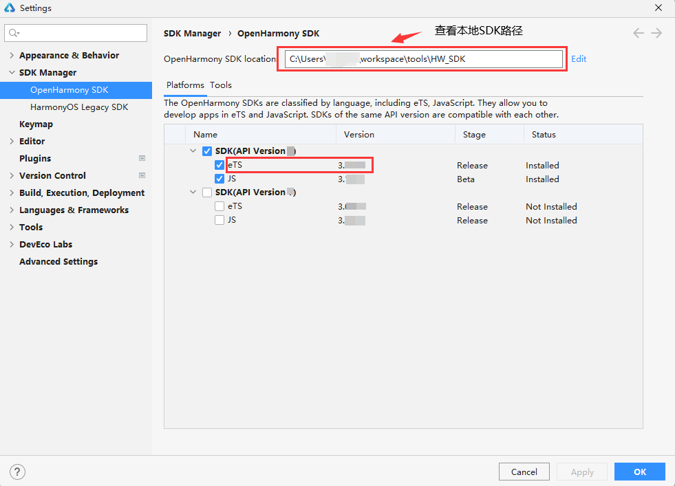
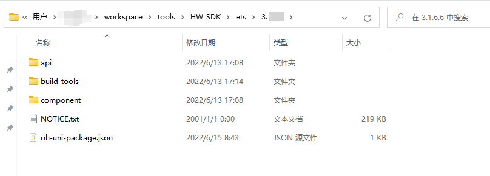
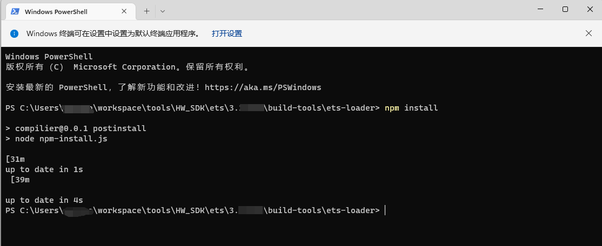
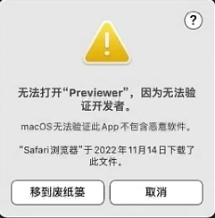
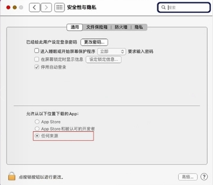

# full-SDK替换指南

**public-SDK**是提供给应用开发的工具包，跟随DevEco Studio下载，不包含系统应用所需要的高权限API

**full-SDK**是提供给OEM厂商开发应用的工具包，不能随DevEco Studio下载，包含了系统应用所需要的高权限API

三方开发者通过DevEco Studio自动下载的**API8版本**SDK均为**public版本**。public-SDK**不支持**开发者使用**所有的系统API**，包括animator组件、xcomponent组件、@ohos.application.abilityManager.d.ts、@ohos.application.formInfo.d.ts、@ohos.bluetooth.d.ts等，如工程必须依赖于系统API，请按照以下步骤替换**full-SDK**。

> **说明**：本文中的截图仅为参考，具体的显示界面请以实际使用的DevEco Studio和SDK的版本为准。

## 下载full-SDK

full-SDK需要手动下载。请参考[版本说明书](../../release-notes/OpenHarmony-v3.2-beta2.md)中的获取方式，从镜像站点获取所需的操作系统的full-SDK。


## 查看本地SDK路径(此处以ets工程为例，1.0工程请以相同方式替换js-SDK)


打开DevEco Studio——>Tools——>OpenHarmony SDK Manager，查看本地SDK安装路径。





## 替换SDK

1. 确认下载的SDK版本是否为full-SDK

   a.检查下载文件名是否包含full-SDK字样

   

   b.检查api中是否包含系统API（@ohos.application.abilityManager.d.ts、@ohos.application.formInfo.d.ts、@ohos.bluetooth.d.ts等）

   注：系统api判定标准以发布api指导文档为主。

   

2. 替换SDK，以public-SDK-3.x.x.x版本为例。

   以windows为例：

   a.解压已下载的full-SDK文件：`ets-windows-3.x.x.x-Release.zip`

   

   b.替换SDK文件

   **备份本地SDK**（复制并重命名ets目录下版本信息目录名，或者将ets目录拷贝至其他本地路径）

   打开获取到的本地已安装SDK文件路径并进行备份。

   

   注：备份版本信息目录名称只要与其下`oh-uni-package.json`配置文件的version字段不一致即可，如下图所示，备份3.1.6.6版本sdk

   

   `oh-uni-package.json`文件配置信息如下，其中，`apiVersion`的值以SDK对应的API version为准，`version`的值以SDK文件的版本号为准：

   ```json
   {
     "apiVersion": "X",
     "displayName": "Ets",
     "meta": {
       "metaVersion": "3.0.0"
     },
     "path": "ets",
     "releaseType": "Release",
     "version": "3.x.x.x"
   }
   ```
   

   **删除原SDK（3.x.x.x）目录中的所有文件**（否则可能会导致文件无法全部覆盖）

   

   **拷贝full-SDK至本地SDK路径**

   将下载的full-SDK文件包中`ets`目录下的所有文件替换至本地SDK路径下`ets\3.x.x.x`目录中

   修改`oh-uni-package.json`配置文件的version字段为当前SDK版本号

   

   在`3.x.x.x\build-tools\ets-loader`目录中打开cmd/powerShell窗口，输入命令`npm install`下载**node_modules**依赖包

   

   

   c.验证系统API接口

   

## 附录:MacOS安全告警处理

官网下载的full-SDK放到MacOS上的DevEcoStudio中替换后，打开预览器会出现告警



我们可以操作以下步骤来处理此问题：

1.打开Terminal终端应用

2.在终端中输入命令:sudo spctl -- master - disable

3.进入系统偏好设置中的[安全与隐私]面板中，打开"任何来源"选项



此时第三方源下载安装的软件就都不会被阻止执行了，为了安全起见，使用后建议将这里的"任何来源"的选项进行变更。

