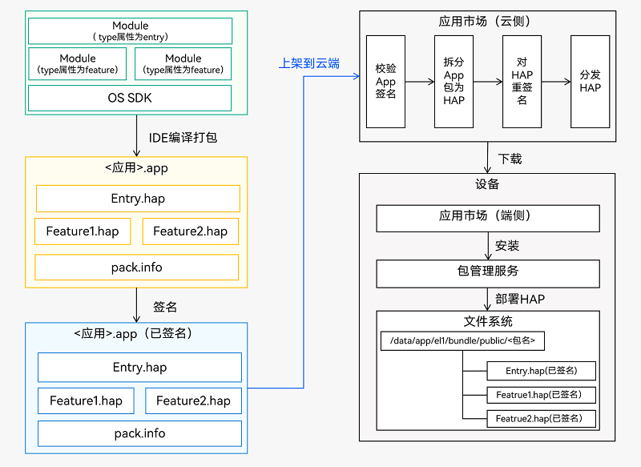

# 多HAP的开发调试与发布部署流程

多HAP的开发调试与发布部署流程如下图所示。

**图1** 多HAP的开发调试与发布部署流程


## 开发
开发者通过[DevEco Studio](https://developer.harmonyos.com/cn/develop/deveco-studio)工具按照业务的需要创建多个Module，在相应的Module中完成自身业务的开发。

## 调试
通过DevEco Studio编译打包，生成单个或者多个HAP，即可基于HAP进行调试。在调试前，需要先安装或更新HAP，以下介绍具体做法。
* 使用DevEco Studio进行调试

   使用指导可参考[应用程序包调试方法](https://developer.harmonyos.com/cn/docs/documentation/doc-guides/ohos-debugging-and-running-0000001263040487#section10491183521520)，其中包括了单HAP与多HAP通过DevEco Studio工具的安装调试方法。

* 使用[hdc工具](../../device-dev/subsystems/subsys-toolchain-hdc-guide.md)(可通过OpenHarmony SDK获取，在SDK的toolchains目录下)进行调试
   
   在调试前，需要先安装或更新HAP，此处有两种方式。。

1. 直接使用hdc安装、更新HAP。 

    HAP的路径为开发平台上的文件路径，以Windows开发平台为例，命令参考如下：

    ```
    // 安装、更新，多HAP可以指定多个文件路径
    hdc install C:\entry.hap C:\feature.hap
    // 执行结果
    install bundle successfully.
    // 卸载
    hdc uninstall com.example.myapplication
    // 执行结果
    uninstall bundle successfully.
    ```
 
2. 先执行hdc shell，再使用bm工具安装、更新HAP。

    HAP的文件路径为真机上的文件路径，命令参考如下：
    
    ```
    // 先执行hdc shell才能使用bm工具
    hdc shell
    // 安装、更新，多HAP可以指定多个文件路径
    bm install -p /data/app/entry.hap /data/app/feature.hap
    // 执行结果
    install bundle successfully.
    // 卸载
    bm uninstall -n com.example.myapplication
    // 执行结果
    uninstall bundle successfully.
    ```
   完成HAP安装或更新后，即可参考相关调试命令进行[调试](https://docs.openharmony.cn/pages/v3.2Beta/zh-cn/application-dev/tools/aa-tool.md/)。

## 发布
当开发的程序包满足发布要求时，可以在工具中打包编译生成App包。将该App包上架到应用市场云端，应用市场会对上架的App包校验签名，校验签名通过后会将App包中的HAP拆分出来，同时对拆分出的HAP重新添加签名，然后对HAP进行分发。

## 部署
用户在设备上的应用市场客户端能够看到各种各样的应用，这些应用均由云端分发而来，有些是多HAP应用，有些是单HAP应用。用户选择某个应用后，应用市场将下载应用包含的全部HAP。

## 应用在终端设备上的安装
下载完成后，应用市场客户端再调用系统中包管理服务的安装接口安装下载的HAP，包管理服务以应用为单位将其中所有HAP部署到指定目录下，以完成应用的安装。
