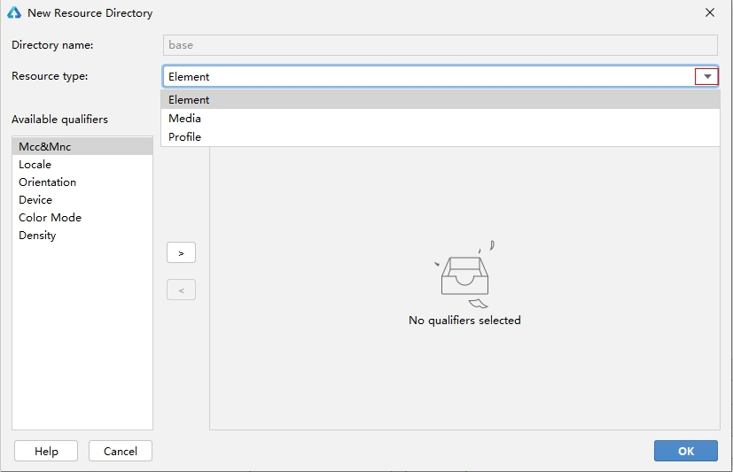

# 资源分类与访问

应用开发过程中，经常需要用到颜色、字体、间距、图片等资源，在不同的设备或配置中，这些资源的值可能不同。

- 应用资源：借助资源文件能力，开发者在应用中自定义资源，自行管理这些资源在不同的设备或配置中的表现。

- 系统资源：开发者直接使用系统预置的资源定义（即[分层参数](../../../design/ux-design/visual-basis.md)，同一资源ID在设备类型、深浅色等不同配置下有不同的取值）。

## 资源分类

应用开发中使用的各类资源文件，需要放入特定子目录中存储管理。资源目录的示例如下所示，base目录、限定词目录、rawfile目录称为资源目录，element、media、profile称为资源组目录。

> **说明**
>
> stage模型多工程情况下，共有的资源文件放到AppScope下的resources目录。 

资源目录示例：
```
resources
|---base
|   |---element
|   |   |---string.json
|   |---media
|   |   |---icon.png
|   |---profile
|   |   |---test_profile.json
|---en_US  // 默认存在的目录，设备语言环境是美式英文时，优先匹配此目录下资源
|   |---element
|   |   |---string.json
|   |---media
|   |   |---icon.png
|   |---profile
|   |   |---test_profile.json
|---zh_CN  // 默认存在的目录，设备语言环境是简体中文时，优先匹配此目录下资源
|   |---element
|   |   |---string.json
|   |---media
|   |   |---icon.png
|   |---profile
|   |   |---test_profile.json
|---en_GB-vertical-car-mdpi // 自定义限定词目录示例，由开发者创建
|   |---element
|   |   |---string.json
|   |---media
|   |   |---icon.png
|   |---profile
|   |   |---test_profile.json
|---rawfile // 其他类型文件，原始文件形式保存，不会被集成到resources.index文件中。文件名可自定义。
```
### 资源目录

#### base目录

base目录是默认存在的目录，二级子目录element用于存放字符串、颜色、布尔值等基础元素，media、profile存放媒体、动画、布局等资源文件。<br/>
目录中的资源文件会被编译成二进制文件，并赋予资源文件ID。通过指定资源类型（type）和资源名称（name）引用。

#### 限定词目录

en_US和zh_CN是默认存在的两个限定词目录，其余限定词目录需要开发者根据开发需要自行创建。二级子目录element、media、profile用于存放字符串、颜色、布尔值等基础元素，以及媒体、动画、布局等资源文件。<br/>同样，目录中的资源文件会被编译成二进制文件，并赋予资源文件ID。通过指定资源类型（type）和资源名称（name）来引用。

**限定词目录的命名要求**

限定词目录可以由一个或多个表征应用场景或设备特征的限定词组合而成，包括移动国家码和移动网络码、语言、文字、国家或地区、横竖屏、设备类型、颜色模式和屏幕密度等维度，限定词之间通过下划线（\_）或者中划线（\-）连接。开发者在创建限定词目录时，需要遵守限定词目录的命名规则。

- 限定词的组合顺序：\_移动国家码_移动网络码-语言_文字_国家或地区-横竖屏-设备类型-颜色模式-屏幕密度_。开发者可以根据应用的使用场景和设备特征，选择其中的一类或几类限定词组成目录名称。

- 限定词的连接方式：语言、文字、国家或地区之间采用下划线（\_）连接，移动国家码和移动网络码之间也采用下划线（\_）连接，除此之外的其他限定词之间均采用中划线（-）连接。例如：**zh_Hant_CN**、**zh_CN-car-ldpi**。

- 限定词的取值范围：每类限定词的取值必须符合限定词取值要求表中的条件，如表2。否则，将无法匹配目录中的资源文件。

表2 限定词取值要求

| 限定词类型       | 含义与取值说明                                  |
| ----------- | ---------------------------------------- |
| 移动国家码和移动网络码 | 移动国家码（MCC）和移动网络码（MNC）的值取自设备注册的网络。<br/>MCC可与MNC合并使用，使用下划线（_）连接，也可以单独使用。例如：mcc460表示中国，mcc460_mnc00表示中国_中国移动。<br/>详细取值范围，请查阅**ITU-T&nbsp;E.212**（国际电联相关标准）。 |
| 语言          | 表示设备使用的语言类型，由2~3个小写字母组成。例如：zh表示中文，en表示英语，mai表示迈蒂利语。<br/>详细取值范围，请查阅**ISO&nbsp;639**（ISO制定的语言编码标准）。 |
| 文字          | 表示设备使用的文字类型，由1个大写字母（首字母）和3个小写字母组成。例如：Hans表示简体中文，Hant表示繁体中文。<br/>详细取值范围，请查阅**ISO&nbsp;15924**（ISO制定的文字编码标准）。 |
| 国家或地区       | 表示用户所在的国家或地区，由2~3个大写字母或者3个数字组成。例如：CN表示中国，GB表示英国。<br/>详细取值范围，请查阅**ISO&nbsp;3166-1**（ISO制定的国家和地区编码标准）。 |
| 横竖屏         | 表示设备的屏幕方向，取值如下：<br/>-&nbsp;vertical：竖屏<br/>-&nbsp;horizontal：横屏 |
| 设备类型        | 表示设备的类型，取值如下：<br/>-&nbsp;car：车机<br/>-&nbsp;tablet：平板<br/>-&nbsp;tv：智慧屏<br/>-&nbsp;wearable：智能穿戴 |
| 颜色模式        | 表示设备的颜色模式，取值如下：<br/>-&nbsp;dark：深色模式<br/>-&nbsp;light：浅色模式 |
| 屏幕密度        | 表示设备的屏幕密度（单位为dpi），取值如下：<br/>-&nbsp;sdpi：表示小规模的屏幕密度（Small-scale&nbsp;Dots&nbsp;Per&nbsp;Inch），适用于dpi取值为(0,&nbsp;120]的设备。<br/>-&nbsp;mdpi：表示中规模的屏幕密度（Medium-scale&nbsp;Dots&nbsp;Per&nbsp;Inch），适用于dpi取值为(120,&nbsp;160]的设备。<br/>-&nbsp;ldpi：表示大规模的屏幕密度（Large-scale&nbsp;Dots&nbsp;Per&nbsp;Inch），适用于dpi取值为(160,&nbsp;240]的设备。<br/>-&nbsp;xldpi：表示特大规模的屏幕密度（Extra&nbsp;Large-scale&nbsp;Dots&nbsp;Per&nbsp;Inch），适用于dpi取值为(240,&nbsp;320]的设备。<br/>-&nbsp;xxldpi：表示超大规模的屏幕密度（Extra&nbsp;Extra&nbsp;Large-scale&nbsp;Dots&nbsp;Per&nbsp;Inch），适用于dpi取值为(320,&nbsp;480]的设备。<br/>-&nbsp;xxxldpi：表示超特大规模的屏幕密度（Extra&nbsp;Extra&nbsp;Extra&nbsp;Large-scale&nbsp;Dots&nbsp;Per&nbsp;Inch），适用于dpi取值为(480,&nbsp;640]的设备。 |

#### rawfile目录

支持创建多层子目录，目录名称可以自定义，文件夹内可以自由放置各类资源文件。<br/>目录中的资源文件会被直接打包进应用，不经过编译，也不会被赋予资源文件ID。通过指定文件路径和文件名引用。

### 资源组目录

资源组目类型包括element、media、profile，用于存放特定类型的资源文件。

  表3 资源组目录说明

| 目录类型    | 说明                                     | 资源文件                                     |
| --------- | ---------------------------------------- | ---------------------------------------- |
| element | 表示元素资源，以下每一类数据都采用相应的JSON文件来表征（目录下仅支持文件类型）。<br/>-&nbsp;boolean，布尔型<br/>-&nbsp;color，颜色<br/>-&nbsp;float，浮点型<br/>-&nbsp;intarray，整型数组<br/>-&nbsp;integer，整型<br/>-&nbsp;pattern，样式<br/>-&nbsp;plural，复数形式<br/>-&nbsp;strarray，字符串数组<br/>-&nbsp;string，字符串 | element目录中的文件名称建议与下面的文件名保持一致。每个文件中只能包含同一类型的数据。<br/>-&nbsp;boolean.json<br/>-&nbsp;color.json<br/>-&nbsp;float.json<br/>-&nbsp;intarray.json<br/>-&nbsp;integer.json<br/>-&nbsp;pattern.json<br/>-&nbsp;plural.json<br/>-&nbsp;strarray.json<br/>-&nbsp;string.json |
| media   | 表示媒体资源，包括图片、音频、视频等非文本格式的文件（目录下只支持文件类型）。<br/>图片和音视频的类型说明间表4和表5。              | 文件名可自定义，例如：icon.png。                     |
| profile  | 表示自定义配置文件，其文件内容可[通过包管理接口](../reference/apis/js-apis-bundleManager.md#bundlemanagergetprofilebyability)获取（目录下只支持文件类型）。       | 文件名可自定义，例如：test_profile.json。           |

**媒体资源类型说明**

表4 图片资源类型说明

| 格式   | 文件后缀名 |
| ---- | ----- |
| JPEG | .jpg  |
| PNG  | .png  |
| GIF  | .gif  |
| SVG  | .svg  |
| WEBP | .webp |
| BMP  | .bmp  |

表5 音视频资源类型说明

| 格式                                   | 支持的文件类型         |
| ------------------------------------ | --------------- |
| H.263                                | .3gp <br>.mp4   |
| H.264 AVC <br> Baseline Profile (BP) | .3gp <br>.mp4   |
| MPEG-4 SP                            | .3gp            |
| VP8                                  | .webm <br> .mkv |

**资源文件示例**

color.json文件的内容如下：


```json
{
    "color": [
        {
            "name": "color_hello",
            "value": "#ffff0000"
        },
        {
            "name": "color_world",
            "value": "#ff0000ff"
        }
    ]
}
```

float.json文件的内容如下：


```json
{
    "float":[
        {
            "name":"font_hello",
            "value":"28.0fp"
        },
	{
            "name":"font_world",
            "value":"20.0fp"
        }
    ]
}
```

string.json文件的内容如下：


```json
{
    "string":[
        {
            "name":"string_hello",
            "value":"Hello"
        },
	{
            "name":"string_world",
            "value":"World"
        },
	{
            "name":"message_arrive",
            "value":"We will arrive at %s."
        }
    ]
}
```

plural.json文件的内容如下：


```json
{
    "plural":[
        {
            "name":"eat_apple",
            "value":[
                {
                    "quantity":"one",
                    "value":"%d apple"
                },
                {
                    "quantity":"other",
                    "value":"%d apples"
                }
            ]
        }
    ]
}
```

## 创建资源目录和资源文件

在resources目录下，可按照限定词目录命名规则，以及资源组目录支持的文件类型和说明，创建资源目录和资源组目录，添加特定类型资源。DevEco Studio支持同时创建资源目录和资源文件，也支持单独创建资源目录或资源文件。

### 创建资源目录和资源文件

在resources目录右键菜单选择“New > Resource File”，可同时创建资源目录和资源文件，文件默认创建在base目录的对应资源组。如果选择了限定词，则会按照命名规范自动生成限定词和资源组目录，并将文件创建在限定词目录中。

图中File name为需要创建的文件名。Resource type为资源组类型，默认是element。Root Element为资源类型。Avaliable qualifiers为供选择的限定词目录，通过右边的小箭头可添加或者删除。<br/>创建的目录名自动生成，格式固定为“限定词.资源组”，例如：创建一个限定词为dark的element目录，自动生成的目录名称为“dark.element”。

  

### 创建资源目录

在resources目录右键菜单选择“New > Resource Directory”，可创建资源目录，默认创建的是base目录。如果选择了限定词，则会按照命名规范自动生成限定词和资源组目录。确定限定词后，选择资源组类型，当前资源组类型支持Element、Media、Profile三种，创建后生成资源目录。

  

### 创建资源文件

在资源目录（element、media、profile）的右键菜单选择“New > XXX Resource File”，即可创建对应资源组目录的资源文件。例如，在element目录下可新建Element Resource File。

  

## 资源访问

### 应用资源

- 对于应用资源，在工程中，通过```"$r('app.type.name')"```形式引用。其中，app为应用内resources目录中定义的资源；type为资源类型或资源的存放位置，取值包含“color”、“float”、“string”、“plural”、“media”；name为资源命名，由开发者定义资源时确定。// 是上面图中的filename吗

- 对于rawfile目录资源，通过```"$rawfile('filename')"```形式引用。其中，filename为rawfile目录下文件的相对路径，文件名需要包含后缀，路径开头不可以以"/"开头。// 补充举例

- 对于rawfile目录的descriptor，可通过资源管理的[getRawFd](../reference/apis/js-apis-resource-manager.md#getrawfd9)接口引用，其返回值descriptor.fd为hap包的fd。此时，访问rawfile文件需要结合{fd, offset, length}一起使用。

> **说明：**
> 
> 资源描述符不能拼接使用，仅支持普通字符串如`'app.type.name'`。
>
> `$r`返回值为Resource对象，可通过[getStringValue](../reference/apis/js-apis-resource-manager.md#getstringvalue9) 方法获取对应的字符串。//这个说明是针对那种情况的

[资源组目录](#资源组目录)下的“资源文件示例”显示了.json文件内容，包含color.json文件、string.json文件和plural.json文件，访问应用资源时需先了解.json文件的使用规范。<br/>资源的具体使用方法如下：

```ts
Text($r('app.string.string_hello'))
  .fontColor($r('app.color.color_hello'))
  .fontSize($r('app.float.font_hello'))

Text($r('app.string.string_world'))
  .fontColor($r('app.color.color_world'))
  .fontSize($r('app.float.font_world'))

// 引用string.json资源。Text中$r的第一个参数指定string资源，第二个参数用于替换string.json文件中的%s。
//如下示例代码value为"We will arrive at five of the clock"。
Text($r('app.string.message_arrive', "five of the clock"))
  .fontColor($r('app.color.color_hello'))
  .fontSize($r('app.float.font_hello'))

// 引用plural$资源。Text中$r的第一个指定plural资源，第二个参数用于指定单复数（在中文，单复数均使用other。在英文，one：代表单数，取值为1；other：代表复数，取值为大于等于1的整数），第三个参数用于替换%d
// 如下示例代码为复数，value为"5 apples"。
Text($r('app.plural.eat_apple', 5, 5))
  .fontColor($r('app.color.color_world'))
  .fontSize($r('app.float.font_world'))

Image($r('app.media.my_background_image'))  // media资源的$r引用

Image($rawfile('test.png'))                 // rawfile$r引用rawfile目录下图片

Image($rawfile('newDir/newTest.png'))       // rawfile$r引用rawfile目录下图片
```

### 系统资源

除了自定义资源，开发者也可以使用系统中预定义的资源（即[分层参数](../../../design/ux-design/visual-basis.md)），统一应用的视觉风格。

在开发过程中，分层参数的用法与资源限定词基本一致。对于系统资源，可以通过```“$r('sys.type.resource_id')”```的形式引用。其中，sys为系统资源；type为资源类型，取值包括“color”、“float”、“string”、“media”；resource_id为资源id。

可以查看[应用UX设计中关于资源的介绍](../../../design/ux-design/design-resources.md)，获取支持的系统资源ID及其在不同配置下的取值。

> **说明：**
>
> - 仅声明式开发范式支持使用系统资源。
>
> - 对于系统预置应用，建议使用系统资源；对于三方应用，可以根据需要选择使用系统资源或自定义应用资源。

```ts
Text('Hello')
  .fontColor($r('sys.color.ohos_id_color_emphasize'))
  .fontSize($r('sys.float.ohos_id_text_size_headline1'))
  .fontFamily($r('sys.string.ohos_id_text_font_family_medium'))
  .backgroundColor($r('sys.color.ohos_id_color_palette_aux1'))

Image($r('sys.media.ohos_app_icon'))
  .border({
    color: $r('sys.color.ohos_id_color_palette_aux1'),
    radius: $r('sys.float.ohos_id_corner_radius_button'), width: 2
  })
  .margin({
    top: $r('sys.float.ohos_id_elements_margin_horizontal_m'),
    bottom: $r('sys.float.ohos_id_elements_margin_horizontal_l')
  })
  .height(200)
  .width(300)
```

## 资源匹配

应用使用某资源时，系统会根据当前设备状态优先从相匹配的限定词目录中寻找该资源。只有当resources目录中没有与设备状态匹配的限定词目录，或者在限定词目录中找不到该资源时，才会去base目录中查找。rawfile是原始文件目录，不会根据设备状态去匹配不同的资源。

**限定词目录与设备状态的匹配规则**

- 在为设备匹配对应的资源文件时，限定词目录匹配的优先级从高到低依次为：移动国家码和移动网络码 > 区域（可选组合：语言、语言_文字、语言_国家或地区、语言_文字_国家或地区）> 横竖屏 > 设备类型 > 颜色模式 > 屏幕密度。

- 如果限定词目录中包含移动国家码和移动网络码、语言、文字、横竖屏、设备类型、颜色模式限定词，则对应限定词的取值必须与当前的设备状态完全一致，该目录才能够参与设备的资源匹配。例如，限定词目录“zh_CN-car-ldpi”不能参与“en_US”设备的资源匹配。

应用界面加载资源规则，更多请参考国际化和本地化文档。

## 相关实例

针对访问应用资源，有以下相关实例可供参考：

- [资源管理（ArkTS）（API10）](https://gitee.com/openharmony/applications_app_samples/tree/master/code/BasicFeature/Resource/ResourceManager)
