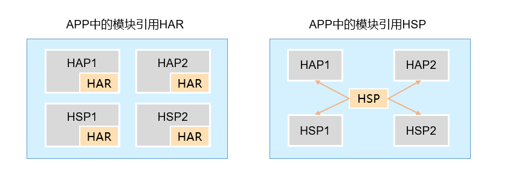

# 共享包概述

OpenHarmony提供了两种共享包，[HAR（Harmony Achive）](har-package.md)静态共享包，和HSP（Harmony Shared Package）动态共享包。

HAR与HSP都是为了实现代码和资源的共享，都可以包含代码、C++库、资源和配置文件，最大的不同之处在于：HAR中的代码和资源跟随使用方编译，如果有多个使用方，它们的编译产物中会存在多份相同拷贝；而HSP中的代码和资源可以独立编译，运行时在一个进程中代码也只会存在一份。

**图1** `HAR`和`HSP`在`APP`包中的形态示意图

**HSP旨在解决HAR存在的几个问题：**
- 多个`HAP`引用相同的`HAR`，导致的`APP`包大小膨胀问题。
- 多个`HAP`引用相同的`HAR`，`HAR`中的一些状态变量无法共享的问题。

**HSP的一些约束：**
- `HSP`及其使用方都必须是`Stage`模型。
- `HSP`及其使用方都必须使用`esmodule`编译模式。
- `HSP`不支持在配置文件中声明`abilities`、`extensionAbilities`标签。

`HSP`按照使用场景可以分为[应用内HSP](in-app-hsp.md)和[应用间HSP](cross-app-hsp.md)。它们在配置文件和使用方式等方面有所区别。