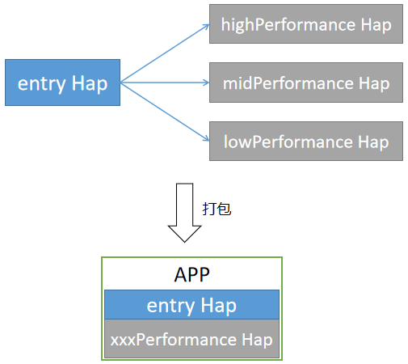

# ExtensionContext

ExtensionContext是Extension的上下文环境，继承自Context。

ExtensionContext模块提供访问特定Extension的资源的能力，对于拓展的Extension，可直接将ExtensionContext作为上下文环境，或者定义一个继承自ExtensionContext的类型作为上下文环境。如：ServiceExtension提供了ServiceExtensionContext，它在ExtensionContext的基础上扩展了启动、停止、绑定、解绑Ability的能力，详见[ServiceExtensionContext](js-apis-inner-application-serviceExtensionContext.md)。

> **说明：**
> 
>  - 本模块首批接口从API version 9开始支持。后续版本的新增接口，采用上角标单独标记接口的起始版本。
>  - 本模块接口仅可在Stage模型下使用。

## 属性

**系统能力**：SystemCapability.Ability.AbilityRuntime.Core

| 名称 | 类型 | 可读 | 可写 | 说明 | 
| -------- | -------- | -------- | -------- | -------- |
| currentHapModuleInfo | [HapModuleInfo](js-apis-bundle-HapModuleInfo.md) | 是 | 否 | 所属Hap包的信息。<br>(详见SDK目录下的 `api\bundle\hapModuleInfo.d.ts`)  |
| config   | [Configuration](js-apis-app-ability-configuration.md) | 是 | 否 | 所属Module的配置信息。<br>(详见SDK目录下的 `api\@ohos.app.ability.Configuration.d.ts`) |
| extensionAbilityInfo | [ExtensionAbilityInfo](js-apis-bundleManager-extensionAbilityInfo.md) | 是 | 否 | 所属Extension的信息。<br>(详见SDK目录下的 `api\bundle\extensionAbilityInfo.d.ts`) |

## 使用场景
ExtensionContext主要用于查询所属Extension的信息、Module的配置信息以及Hap包的信息，开发者可根据自身业务需求使用对应的信息。此处以ServiceExtension为例，展示ExtensionContext的一种使用场景。

**场景说明：**
一个应用为了适配不同性能的设备，提供了highPerformance、midPerformance、lowPerformance三个Module，这三个Module均提供了一个ServiceExtension给entry使用。安装应用时，应用市场会根据设备的性能，选择对应Module的Hap包与entry的Hap包进行打包安装，实际运行应用时，entry将解析ServiceExtensionContext.HapModuleInfo获取Hap包信息，根据不同的Hap包执行不同的业务逻辑。



**示例：**

三个Module内都定义一个相同名称的ServiceExtension：
```ts
import ServiceExtension from '@ohos.app.ability.ServiceExtensionAbility'
import Want from '@ohos.application.Want'
export default class TheServiceExtension extends ServiceExtension {
    onCreate(want:Want) {
        console.log('ServiceAbility onCreate, want: ' + want.abilityName);
        // 通过globalThis传递ExtensionContext给entry
        globalThis.ExtensionContext = this.context;
    }

    onRequest(want, startId) {
        console.log('ServiceAbility onRequest, want: ' + want.abilityName + ', startId: ' + startId);
    }

    onConnect(want) {
        console.log('ServiceAbility onConnect, want:' + want.abilityName);
        return null;
    }

    onDisconnect(want) {
        console.log('ServiceAbility onDisconnect, want:' + want.abilityName);
    }

    onDestroy() {
        console.log('ServiceAbility onDestroy');
    }
};
```

在entry的MainAbility的onCreate回调内启动ServiceExtension
```ts
import Ability from '@ohos.app.ability.Ability'
export default class MainAbility extends Ability {
    onCreate(want, launchParam) {
        console.log("[Demo] MainAbility onCreate");
        let wantExt = {
            deviceId: "",
            bundleName: "com.example.TheServiceExtension",
            abilityName: "TheServiceExtension",
        };
        this.context.startServiceExtensionAbility(wantExt);
    }
};
```

在entry内新建一个ServiceModule.ts，专用于执行业务逻辑
```ts
export default class ServiceModel {
    moduleName: string;

    constructor() {}

    executeTask() {
        if (globalThis.ExtensionContext == undefined) {
            console.log("ERROR, ServiceExtension does not exist");
            return;
        }

        var moduleInfo = globalThis.ExtensionContext.currentHapModuleInfo;
        this.moduleName = moduleInfo.name;
        // 根据moduleName执行不同的业务逻辑，实现对不同性能设备的区分
        switch (this.moduleName) {
            case "highPerformance":
                console.log("This is high performance device.");
                // 执行对应业务逻辑
                break;
            case "midPerformance":
                console.log("This is mid performance device.");
                // 执行对应业务逻辑
                break;
            case "lowPerformance":
                console.log("This is low performance device.");
                // 执行对应业务逻辑
                break;
            default:
                console.log("ERROR, invalid moduleName.");
                break;
        }
    }
};
```