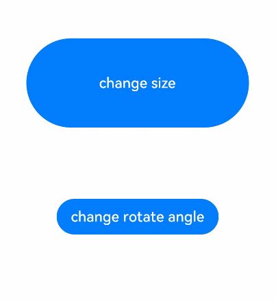

# 属性动画（animation）

组件的某些通用属性变化时，可以通过属性动画实现渐变过渡效果，提升用户体验。支持的属性包括width、height、backgroundColor、opacity、scale、rotate、translate等。布局类改变宽高的动画，内容都是直接到终点状态，例如文字、canvas的内容、linearGradient等，如果要内容跟随宽高变化，可以使用[renderFit](ts-universal-attributes-renderfit.md)属性配置。

> **说明：**
>
> 从API Version 7开始支持。后续版本如有新增内容，则采用上角标单独标记该内容的起始版本。

animation(value: {duration?: number, tempo?: number, curve?: string | Curve | ICurve, delay?:number, iterations?: number, playMode?: PlayMode, onFinish?: () => void})

从API version 9开始，该接口支持在ArkTS卡片中使用。

**参数：**

| 名称         | 参数类型                                     | 必填   | 描述                                       |
| ---------- | ---------------------------------------- | ---- | ---------------------------------------- |
| duration   | number                                   | 否    | 动画时长，单位为毫秒。<br/>默认值：1000<br/>从API version 9开始，该接口支持在ArkTS卡片中使用。<br/>**说明：**<br/>- 在ArkTS卡片上最大动画持续时间为1000毫秒。<br/>-&nbsp;设置小于0的值时按0处理。<br/>-&nbsp;设置浮点型类型的值时，向下取整。例如，设置值为1.2，按照1处理。 |
| tempo      | number                                   | 否    | 动画播放速度。数值越大，动画播放速度越快，数值越小，播放速度越慢。<br/>值为0时，表示不存在动画。<br/>默认值：1<br/>**说明：** <br/>当设置小于0的值时按值为1处理。 |
| curve      | string&nbsp;\|&nbsp;[Curve](ts-appendix-enums.md#curve)&nbsp;\|&nbsp;[ICurve](../apis/js-apis-curve.md#icurve)<sup>9+</sup> | 否    | 设置动画曲线。<br/>默认值：Curve.EaseInOut<br/>从API version 9开始，该接口支持在ArkTS卡片中使用。 |
| delay      | number                                   | 否    | 动画延迟播放时间。单位为毫秒，默认不延时播放。<br/>默认值：0<br/>取值范围：(-∞, +∞)<br/>**说明：** <br/>-&nbsp;delay>=0为延迟播放，delay<0表示提前播放。对于delay<0的情况：当delay的绝对值小于实际动画时长，动画将在开始后第一帧直接运动到delay绝对值的时刻的状态；当delay的绝对值大于等于实际动画时长，动画将在开始后第一帧直接运动到终点状态。其中实际动画时长等于单次动画时长乘以动画播放次数。<br/>-&nbsp;设置浮点型类型的值时，向下取整。例如，设置值为1.2，按照1处理。 |
| iterations | number                                   | 否    | 动画播放次数。<br/>默认值：1<br/>取值范围：[-1, +∞)<br/>**说明：** <br/>设置为-1时表示无限次播放。设置为0时表示无动画效果。 |
| playMode   | [PlayMode](ts-appendix-enums.md#playmode) | 否    | 动画播放模式，默认播放完成后重头开始播放。<br/>默认值：PlayMode.Normal<br/>从API version 9开始，该接口支持在ArkTS卡片中使用。<br/>相关使用约束请参考PlayMode说明。 |
| onFinish   | () => void                               | 否    | 结束回调，动画播放完成时触发。<br/>从API version 9开始，该接口支持在ArkTS卡片中使用。<br/>**说明：** <br/>当iterations设置为-1时，动画效果无限循环不会停止，所以不会触发此回调。 |

> **PlayMode说明：**
> - PlayMode推荐使用PlayMode.Normal和PlayMode.Alternate，此场景下动画的第一轮是正向播放的。如使用PlayMode.Reverse和PlayMode.AlternateReverse，则动画的第一轮是逆向播放的，在动画刚开始时会跳变到终止状态，然后逆向播放动画。
> - 使用PlayMode.Alternate或PlayMode.AlternateReverse时，开发者应保证动画最终状态和状态变量的取值一致，即应保证动画的最后一轮是正向播放的。使用PlayMode.Alternate时，iterations应为奇数。使用PlayMode.AlternateReverse时，iterations应为偶数。
> - 不推荐使用PlayMode.Reverse，此场景下不仅会导致动画刚开始就跳变到终止状态，也会导致动画最终状态和状态变量的取值不同。

## 示例

```ts
// xxx.ets
@Entry
@Component
struct AttrAnimationExample {
  @State widthSize: number = 250
  @State heightSize: number = 100
  @State rotateAngle: number = 0
  @State flag: boolean = true

  build() {
    Column() {
      Button('change size')
        .onClick(() => {
          if (this.flag) {
            this.widthSize = 150
            this.heightSize = 60
          } else {
            this.widthSize = 250
            this.heightSize = 100
          }
          this.flag = !this.flag
        })
        .margin(30)
        .width(this.widthSize)
        .height(this.heightSize)
        .animation({
          duration: 2000,
          curve: Curve.EaseOut,
          iterations: 3,
          playMode: PlayMode.Normal
        })
      Button('change rotate angle')
        .onClick(() => {
          this.rotateAngle = 90
        })
        .margin(50)
        .rotate({ angle: this.rotateAngle })
        .animation({
          duration: 1200,
          curve: Curve.Friction,
          delay: 500,
          iterations: -1, // 设置-1表示动画无限循环
          playMode: PlayMode.Alternate
        })
    }.width('100%').margin({ top: 20 })
  }
}
```

