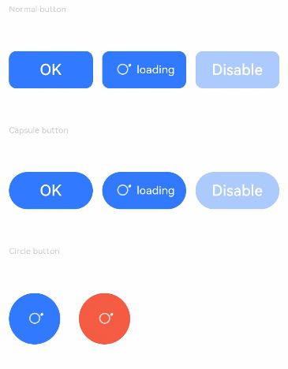

# Button

按钮组件，可快速创建不同样式的按钮。

>  **说明：**
>
>  该组件从API Version 7开始支持。后续版本如有新增内容，则采用上角标单独标记该内容的起始版本。


## 子组件

可以包含单个子组件。


## 接口

**方法1：** Button(options?: {type?: ButtonType, stateEffect?: boolean})

从API version 9开始，该接口支持在ArkTS卡片中使用。

**参数：**

| 参数名         | 参数类型       | 必填        | 参数描述                              |
| ----------- | ---------- | ------| --------------------------------- |
| type        | ButtonType | 否    | 描述按钮显示样式。<br/>默认值：ButtonType.Capsule                           |
| stateEffect | boolean    | 否    |  按钮按下时是否开启按压态显示效果，当设置为false时，按压效果关闭。<br/>默认值：true |

**方法2：** Button(label?: ResourceStr, options?: { type?: ButtonType, stateEffect?: boolean })

  使用文本内容创建相应的按钮组件，此时Button无法包含子组件。

从API version 9开始，该接口支持在ArkTS卡片中使用。

**参数：**

| 参数名     | 参数类型                                | 必填   | 参数描述          |
| ------- | ----------------------------------- | ---- | ------------- |
| label   | [ResourceStr](ts-types.md#resourcestr) | 否    | 按钮文本内容。       |
| options | { type?: ButtonType, stateEffect?: boolean }   | 否    | 见方法1参数说明。 |


## 属性

| 名称          | 参数类型           | 描述                                |
| ----------- | ----------- | --------------------------------- |
| type        | ButtonType  | 设置Button样式。<br/>默认值：ButtonType.Capsule<br/>从API version 9开始，该接口支持在ArkTS卡片中使用。 |
| stateEffect | boolean     | 按钮按下时是否开启按压态显示效果，当设置为false时，按压效果关闭。<br/>默认值：true<br/>从API version 9开始，该接口支持在ArkTS卡片中使用。 |
| labelStyle<sup>10+</sup> | [LabelStyle](#labelstyle10对象说明) | 设置Button组件label文本和字体的样式。 |

## ButtonType枚举说明

从API version 9开始，该接口支持在ArkTS卡片中使用。

| 名称      | 描述                 |
| ------- | ------------------ |
| Capsule | 胶囊型按钮（圆角默认为高度的一半）。 |
| Circle  | 圆形按钮。              |
| Normal  | 普通按钮（默认不带圆角）。      |

>  **说明：**
>  - 按钮圆角通过[通用属性borderRadius](ts-universal-attributes-border.md)设置（不支持通过border接口设置圆角），且只支持设置参数为[Length](ts-types.md#length)的圆角。
>  - 当按钮类型为Capsule时，borderRadius设置不生效，按钮圆角始终为宽、高中较小值的一半。
>  - 当按钮类型为Circle时，borderRadius即为按钮半径，若未设置borderRadius按钮半径则为宽、高中较小值的一半。
>  - 按钮文本通过[通用文本样式](ts-universal-attributes-text-style.md)进行设置。

## LabelStyle<sup>10+</sup>对象说明

| 名称                 | 参数类型                                                     | 必填 | 描述                                                         |
| -------------------- | ------------------------------------------------------------ | ---- | ------------------------------------------------------------ |
| overflow             | [TextOverflow](ts-appendix-enums.md#textoverflow)            | 否   | 设置Label文本超长时的显示方式。文本截断是按字截断。例如，英文以单词为最小单位进行截断，若需要以字母为单位进行截断，可在字母间添加零宽空格。 |
| maxLines             | number                                                       | 否   | 设置Label文本的最大行数。默认情况下，文本是自动折行的，如果指定此参数，则文本最多不会超过指定的行。如果有多余的文本，可以通过textOverflow来指定截断方式。 |
| minFontSize          | number \| [ResourceStr](ts-types.md#resourcestr)             | 否   | 设置Label文本最小显示字号。需配合maxFontSize以及maxLines或布局大小限制使用。 |
| maxFontSize          | number \| [ResourceStr](ts-types.md#resourcestr)             | 否   | 设置Label文本最大显示字号。需配合minFontSize以及maxLines或布局大小限制使用。 |
| heightAdaptivePolicy | [TextHeightAdaptivePolicy](ts-appendix-enums.md#TextHeightAdaptivePolicy10) | 否   | 设置Label文本自适应高度的方式。                              |
| font                 | [Font](ts-types.md#Font)                                     | 否   | 设置Label文本字体样式。                                      |

## 示例

```ts
// xxx.ets
@Entry
@Component
struct ButtonExample {
  build() {
    Flex({ direction: FlexDirection.Column, alignItems: ItemAlign.Start, justifyContent: FlexAlign.SpaceBetween }) {
      Text('Normal button').fontSize(9).fontColor(0xCCCCCC)
      Flex({ alignItems: ItemAlign.Center, justifyContent: FlexAlign.SpaceBetween }) {
        Button('OK', { type: ButtonType.Normal, stateEffect: true }).borderRadius(8).backgroundColor(0x317aff).width(90)
        Button({ type: ButtonType.Normal, stateEffect: true }) {
          Row() {
            LoadingProgress().width(20).height(20).margin({ left: 12 }).color(0xFFFFFF)
            Text('loading').fontSize(12).fontColor(0xffffff).margin({ left: 5, right: 12 })
          }.alignItems(VerticalAlign.Center)
        }.borderRadius(8).backgroundColor(0x317aff).width(90).height(40)

        Button('Disable', { type: ButtonType.Normal, stateEffect: false }).opacity(0.4)
          .borderRadius(8).backgroundColor(0x317aff).width(90)
      }

      Text('Capsule button').fontSize(9).fontColor(0xCCCCCC)
      Flex({ alignItems: ItemAlign.Center, justifyContent: FlexAlign.SpaceBetween }) {
        Button('OK', { type: ButtonType.Capsule, stateEffect: true }).backgroundColor(0x317aff).width(90)
        Button({ type: ButtonType.Capsule, stateEffect: true }) {
          Row() {
            LoadingProgress().width(20).height(20).margin({ left: 12 }).color(0xFFFFFF)
            Text('loading').fontSize(12).fontColor(0xffffff).margin({ left: 5, right: 12 })
          }.alignItems(VerticalAlign.Center).width(90).height(40)
        }.backgroundColor(0x317aff)

        Button('Disable', { type: ButtonType.Capsule, stateEffect: false }).opacity(0.4)
          .backgroundColor(0x317aff).width(90)
      }

      Text('Circle button').fontSize(9).fontColor(0xCCCCCC)
      Flex({ alignItems: ItemAlign.Center, wrap: FlexWrap.Wrap }) {
        Button({ type: ButtonType.Circle, stateEffect: true }) {
          LoadingProgress().width(20).height(20).color(0xFFFFFF)
        }.width(55).height(55).backgroundColor(0x317aff)

        Button({ type: ButtonType.Circle, stateEffect: true }) {
          LoadingProgress().width(20).height(20).color(0xFFFFFF)
        }.width(55).height(55).margin({ left: 20 }).backgroundColor(0xF55A42)
      }
    }.height(400).padding({ left: 35, right: 35, top: 35 })
  }
}
```

