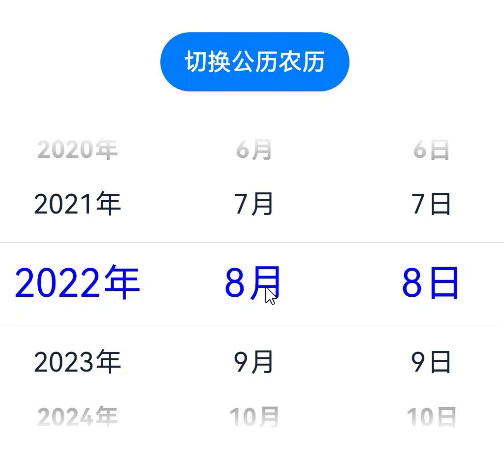

# DatePicker

日期选择器组件，用于根据指定日期范围创建日期滑动选择器。

>  **说明：**
>
>  该组件从API Version 8开始支持。后续版本如有新增内容，则采用上角标单独标记该内容的起始版本。


## 子组件

无


## 接口

DatePicker(options?: {start?: Date, end?: Date, selected?: Date})

根据指定范围的Date创建可以选择日期的滑动选择器。

**参数:**

| 参数名   | 参数类型 | 必填 | 参数描述                                                     |
| -------- | -------- | ---- | ------------------------------------------------------------ |
| start    | Date     | 否   | 指定选择器的起始日期。<br/>默认值：Date('1970-1-1')          |
| end      | Date     | 否   | 指定选择器的结束日期。<br/>默认值：Date('2100-12-31')        |
| selected | Date     | 否   | 设置选中项的日期。<br/>默认值：当前系统日期<br />从API version 10开始，该参数支持[$$](../../quick-start/arkts-two-way-sync.md)双向绑定变量。 |

**异常情形说明:**

| 异常情形   | 对应结果  |
| -------- |  ------------------------------------------------------------ |
| 起始日期晚于结束日期，选中日期未设置    | 起始日期、结束日期和选中日期都为默认值  |
| 起始日期晚于结束日期，选中日期早于起始日期默认值    | 起始日期、结束日期都为默认值，选中日期为起始日期默认值  |
| 起始日期晚于结束日期，选中日期晚于结束日期默认值    | 起始日期、结束日期都为默认值，选中日期为结束日期默认值  |
| 起始日期晚于结束日期，选中日期在起始日期与结束日期默认值范围内    | 起始日期、结束日期都为默认值，选中日期为设置的值 |
| 选中日期早于起始日期    | 选中日期为起始日期  |
| 选中日期晚于结束日期    | 选中日期为结束日期  |
| 起始日期晚于当前系统日期，选中日期未设置    | 选中日期为起始日期  |
| 结束日期早于当前系统日期，选中日期未设置    | 选中日期为结束日期  |
| 日期格式不符合规范，如‘1999-13-32’   | 取默认值  |
| 起始日期或结束日期早于系统有效范围    | 起始日期或结束日期取系统有效范围最早日期  |
| 起始日期或结束日期晚于系统有效范围    | 起始日期或结束日期取系统有效范围最晚日期  |

系统日期范围：1900-1-31 ~ 2100-12-31

选中日期会在起始日期与结束日期异常处理完成后再进行异常情形判断处理

## 属性

除支持[通用属性](ts-universal-attributes-size.md)外，还支持以下属性：

| 名称                             | 参数类型                                      | 描述                                                         |
| -------------------------------- | --------------------------------------------- | ------------------------------------------------------------ |
| lunar                            | boolean                                       | 日期是否显示农历。<br/>-&nbsp;true：展示农历。<br/>-&nbsp;false：不展示农历。<br/>默认值：false |
| disappearTextStyle<sup>10+</sup> | [PickerTextStyle](#pickertextstyle10类型说明) | 设置所有选项中最上和最下两个选项的文本颜色、字号、字体粗细。<br/>默认值：<br/>{<br/>color: '#ff182431',<br/>font: {<br>size: '14fp', <br/>weight: FontWeight.Regular<br/>}<br/>} |
| textStyle<sup>10+</sup>          | [PickerTextStyle](#pickertextstyle10类型说明) | 设置所有选项中除了最上、最下及选中项以外的文本颜色、字号、字体粗细。<br/>默认值：<br/>{<br/>color: '#ff182431',<br/>font: {<br/>size: '16fp', <br/>weight: FontWeight.Regular<br/>}<br/>} |
| selectedTextStyle<sup>10+</sup>  | [PickerTextStyle](#pickertextstyle10类型说明) | 设置选中项的文本颜色、字号、字体粗细。<br/>默认值：<br/>{<br/>color: '#ff007dff',<br/>font: {<br/>size: '20vp', <br/>weight: FontWeight.Medium<br/>}<br/>} |

## PickerTextStyle<sup>10+</sup>类型说明

| 参数名   | 参数类型                                     | 必填   | 参数描述                      |
| ----- | ---------------------------------------- | ---- | ------------------------- |
| color | [ResourceColor](ts-types.md#resourcecolor) | 否    | 文本颜色。                     |
| font  | [Font](ts-types.md#font)                 | 否    | 文本样式，picker只支持字号、字体粗细的设置。 |

## 事件

除支持[通用事件](ts-universal-events-click.md)外，还支持以下事件：

| 名称                                                         | 功能描述                                                     |
| ------------------------------------------------------------ | ------------------------------------------------------------ |
| onChange(callback:&nbsp;(value:&nbsp;DatePickerResult)&nbsp;=&gt;&nbsp;void)<sup>(deprecated)</sup> | 选择日期时触发该事件。<br />**说明：**<br />从API version 8 开始支持，从 API version 10 开始废弃，建议使用onDateChange(callback: (value: Date) => void)。 |
| onDateChange(callback: (value: Date) => void)<sup>10+</sup>  | 选择日期时触发该事件。<br/>Date：返回选中的时间，年月日为选中的日期，时分取决于当前系统时间的时分，秒恒为00。|

## DatePickerResult对象说明

| 名称    | 参数类型   | 描述                          |
| ----- | ------ | --------------------------- |
| year  | number | 选中日期的年。                     |
| month | number | 选中日期的月(0~11)，0表示1月，11表示12月。 |
| day   | number | 选中日期的日。                     |


## 示例


```ts
// xxx.ets
@Entry
@Component
struct DatePickerExample {
  @State isLunar: boolean = false
  private selectedDate: Date = new Date('2021-08-08')

  build() {
    Column() {
      Button('切换公历农历')
        .margin({ top: 30, bottom: 30 })
        .onClick(() => {
          this.isLunar = !this.isLunar
        })
      DatePicker({
        start: new Date('1970-1-1'),
        end: new Date('2100-1-1'),
        selected: this.selectedDate
      })
        .disappearTextStyle({color: Color.Gray, font: {size: '16fp', weight: FontWeight.Bold}})
        .textStyle({color: '#ff182431', font: {size: '18fp', weight: FontWeight.Normal}})
        .selectedTextStyle({color: '#ff0000FF', font: {size: '26fp', weight: FontWeight.Regular}})
        .lunar(this.isLunar)
        .onDateChange((value: Date) => {
          this.selectedDate = value
          console.info('select current date is: ' + value.toString())
        })

    }.width('100%')
  }
}
```


