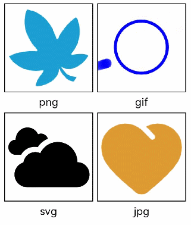

# Image

图片组件，用来渲染展示图片。

>  **说明：**
>
>  该组件从API Version 7开始支持。后续版本如有新增内容，则采用上角标单独标记该内容的起始版本。

## 需要权限

使用网络图片时，需要申请权限ohos.permission.INTERNET。具体申请方式请参考[权限申请声明](../../security/accesstoken-guidelines.md)。

## 子组件

无


## 接口

Image(src: string | PixelMap | Resource)

**参数：**

| 参数名  | 参数类型                                     | 必填   | 默认值  | 参数描述                                     |
| ---- | ---------------------------------------- | ---- | ---- | ---------------------------------------- |
| src  | string\|&nbsp;[PixelMap](../apis/js-apis-image.md#pixelmap7)\|&nbsp;[Resource](ts-types.md#resource) | 是    | -    | 图片的数据源，支持本地图片和网络图片。<br/>当使用相对路径引用图片资源时，例如`Image("common/test.jpg")`，不支持该Image组件被跨包/跨模块调用，建议使用`$r`方式来管理需全局使用的图片资源。<br/>\- 支持的图片格式包括png、jpg、bmp、svg和gif。<br/>\- 支持`Base64`字符串。格式`data:image/[png\|jpeg\|bmp\|webp];base64,[base64 data]`, 其中`[base64 data]`为`Base64`字符串数据。<br/>\- 支持`dataability://`路径前缀的字符串，用于访问通过data&nbsp;ability提供的图片路径。<br/>\- 支持file:///data/storage路径前缀的字符串，用于读取本应用安装目录下files文件夹下的图片资源。需要保证目录包路径下的文件有可读权限。 |

## 属性

| 名称                    | 参数类型                                     | 默认值      | 描述                                       |
| --------------------- | ---------------------------------------- | -------- | ---------------------------------------- |
| alt                   | string \| [Resource](ts-types.md#resource) | -        | 加载时显示的占位图。仅支持本地图片。                       |
| objectFit             | [ImageFit](ts-appendix-enums.md#imagefit) | Cover    | 设置图片的缩放类型。                               |
| objectRepeat          | [ImageRepeat](ts-appendix-enums.md#imagerepeat) | NoRepeat | 设置图片的重复样式。<br/>>&nbsp;&nbsp;**说明：**<br/>>&nbsp;-&nbsp;svg类型图源不支持该属性。 |
| interpolation         | ImageInterpolation                       | None     | 设置图片的插值效果，即减轻低清晰度图片在放大显示的时候出现的锯齿问题，仅针对图片放大插值。<br/>>&nbsp;&nbsp;**说明：**<br/>>&nbsp;-&nbsp;svg类型图源不支持该属性。<br/>>&nbsp;-&nbsp;PixelMap资源不支持该属性。 |
| renderMode            | ImageRenderMode                          | Original | 设置图片渲染的模式。<br/>>&nbsp;&nbsp;**说明：**<br/>>&nbsp;-&nbsp;svg类型图源不支持该属性。 |
| sourceSize            | {<br/>width:&nbsp;number,<br/>height:&nbsp;number<br/>} | -        | 设置图片解码尺寸，将原始图片解码成指定尺寸的图片，number类型单位为px。<br/>>&nbsp;&nbsp;**说明：**<br/>>&nbsp;-&nbsp;PixelMap资源不支持该属性。 |
| matchTextDirection    | boolean                                  | false    | 设置图片是否跟随系统语言方向，在RTL语言环境下显示镜像翻转显示效果。      |
| fitOriginalSize       | boolean                                  | true     | 图片组件尺寸未设置时，其显示尺寸是否跟随图源尺寸。                |
| fillColor             | [ResourceColor](ts-types.md#resourcecolor8) | -        | 仅对svg图源生效，设置后会替换svg图片的fill颜色。            |
| autoResize            | boolean                                  | true     | 是否需要在图片解码过程中对图源做resize操作，该操作会根据显示区域的尺寸决定用于绘制的图源尺寸，有利于减少内存占用。 |
| syncLoad<sup>8+</sup> | boolean                                  | false    | 设置是否同步加载图片，默认是异步加载。同步加载时阻塞UI线程，不会显示占位图。  |

>  **说明：**
>
>  图片设置svg图源时，支持的标签范围有限，目前支持的svg标签包括svg、rect、circle、ellipse、path、line、polyline、polygon、animate、animateMotion、animateTransform。

## ImageInterpolation枚举说明

| 名称     | 描述                       |
| ------ | ------------------------ |
| None   | 不使用插值图片数据。               |
| High   | 高度使用插值图片数据，可能会影响图片渲染的速度。 |
| Medium | 中度使用插值图片数据。              |
| Low    | 低度使用插值图片数据。              |

## ImageRenderMode枚举说明

| 名称       | 描述                    |
| -------- | --------------------- |
| Original | 按照原图进行渲染，包括颜色。        |
| Template | 将图像渲染为模板图像，忽略图片的颜色信息。 |

## 事件

| 名称                                       | 功能描述                                     |
| ---------------------------------------- | ---------------------------------------- |
| onComplete(callback:&nbsp;(event?:&nbsp;{&nbsp;width:&nbsp;number,&nbsp;height:&nbsp;number,&nbsp;componentWidth:&nbsp;number,<br>&nbsp;componentHeight:&nbsp;number,&nbsp;loadingStatus:&nbsp;number&nbsp;})&nbsp;=&gt;&nbsp;void) | 图片成功加载时触发该回调，返回成功加载的图源尺寸。                |
| onError(callback:&nbsp;(event?:&nbsp;{&nbsp;componentWidth:&nbsp;number,&nbsp;componentHeight:&nbsp;number&nbsp;})&nbsp;=&gt;&nbsp;void) | 图片加载出现异常时触发该回调。                          |
| onFinish(event:&nbsp;()&nbsp;=&gt;&nbsp;void) | 当加载的源文件为带动效的svg图片时，当svg动效播放完成时会触发这个回调，如果动效为无限循环动效，则不会触发这个回调。 |


## 示例

```ts
@Entry
@Component
struct ImageExample1 {
  build() {
    Column() {
      Flex({ direction: FlexDirection.Column, alignItems: ItemAlign.Start }) {
        Row({ space: 5 }) {
          Image($r('app.media.example_png'))
            .width(110).height(110).border({ width: 1 })
            .overlay('png', { align: Alignment.Bottom, offset: { x: 0, y: 20 } })
          Image($r('app.media.example_gif'))
            .width(110).height(110).border({ width: 1 })
            .overlay('gif', { align: Alignment.Bottom, offset: { x: 0, y: 20 } })
        }

        Row({ space: 5 }) {
          Image($r('app.media.example_svg'))
            .width(110).height(110).border({ width: 1 })
            .overlay('svg', { align: Alignment.Bottom, offset: { x: 0, y: 20 } })
          Image($r('app.media.example_jpg'))
            .width(110).height(110).border({ width: 1 })
            .overlay('jpg', { align: Alignment.Bottom, offset: { x: 0, y: 20 } })
        }.margin({ top: 25, bottom: 10 })
      }
    }.height(320).width(360).padding({ right: 10, top: 10 })
  }
}
```



```ts
// Image2
@Entry
@Component
struct ImageExample2 {
  @State width: number = 100
  @State height: number = 100

  build() {
    Column({ space: 10 }) {
      Text('renderMode').fontSize(12).fontColor(0xcccccc).width('96%').height(30)
      Row({ space: 50 }) {
        Image($r('app.media.img_example'))
          .renderMode(ImageRenderMode.Original).width(100).height(100)
          .border({ width: 1 }).borderStyle(BorderStyle.Dashed)
          .overlay('Original', { align: Alignment.Bottom, offset: { x: 0, y: 20 } })
        Image($r('app.media.img_example'))
          .renderMode(ImageRenderMode.Template).width(100).height(100)
          .border({ width: 1 }).borderStyle(BorderStyle.Dashed)
          .overlay('Template', { align: Alignment.Bottom, offset: { x: 0, y: 20 } })
      }

      Text('alt').fontSize(12).fontColor(0xcccccc).width('96%').height(30)
      Image('')
        .alt($r('app.media.Image_none'))
        .width(100).height(100).border({ width: 1 }).borderStyle(BorderStyle.Dashed)

      Text('sourceSize').fontSize(12).fontColor(0xcccccc).width('96%')
      Row({ space: 50 }) {
        Image($r('app.media.img_example'))
          .sourceSize({
            width: 150,
            height: 150
          })
          .objectFit(ImageFit.ScaleDown).width('25%').aspectRatio(1)
          .border({ width: 1 }).borderStyle(BorderStyle.Dashed)
          .overlay('w:150 h:150', { align: Alignment.Bottom, offset: { x: 0, y: 20 } })
        Image($r('app.media.img_example'))
          .sourceSize({
            width: 200,
            height: 200
          })
          .objectFit(ImageFit.ScaleDown).width('25%').aspectRatio(1)
          .border({ width: 1 }).borderStyle(BorderStyle.Dashed)
          .overlay('w:200 h:200', { align: Alignment.Bottom, offset: { x: 0, y: 20 } })
      }

      Text('objectRepeat').fontSize(12).fontColor(0xcccccc).width('96%').height(30)
      Row({ space: 5 }) {
        Image($r('app.media.ic_health_heart'))
          .width(120).height(125).border({ width: 1 }).borderStyle(BorderStyle.Dashed)
          .objectRepeat(ImageRepeat.XY).objectFit(ImageFit.ScaleDown)
          .overlay('ImageRepeat.XY', { align: Alignment.Bottom, offset: { x: 0, y: 20 } })
        Image($r('app.media.ic_health_heart'))
          .width(110).height(125).border({ width: 1 }).borderStyle(BorderStyle.Dashed)
          .objectRepeat(ImageRepeat.Y).objectFit(ImageFit.ScaleDown)
          .overlay('ImageRepeat.Y', { align: Alignment.Bottom, offset: { x: 0, y: 20 } })
        Image($r('app.media.ic_health_heart'))
          .width(110).height(125).border({ width: 1 }).borderStyle(BorderStyle.Dashed)
          .objectRepeat(ImageRepeat.X).objectFit(ImageFit.ScaleDown)
          .overlay('ImageRepeat.X', { align: Alignment.Bottom, offset: { x: 0, y: 20 } })
      }
    }.height(150).width('100%').padding({ right: 10 })
  }
}
```


```ts
// Image3
@Entry
@Component
struct ImageExample3 {
  @State widthValue: number = 0
  @State heightValue: number = 0
  private on: Resource = $r('app.media.wifi_on')
  private off: Resource = $r('app.media.wifi_off')
  private on2off: Resource = $r('app.media.wifi_on2off')
  private off2on: Resource = $r('app.media.wifi_off2on')
  @State src: Resource = this.on

  build() {
    Column() {
      Row({ space: 20 }) {
        Column() {
          Image($r('app.media.img_example1'))
            .alt($r('app.media.ic_public_picture'))
            .sourceSize({
              width: 900,
              height: 900
            })
            .objectFit(ImageFit.Cover)
            .height(180).width(180)
            .onComplete((msg: { width: number,height: number }) => {
              this.widthValue = msg.width
              this.heightValue = msg.height
            })
            .onError(() => {
              console.log('load image fail')
            })
            .overlay('\nwidth: ' + String(this.widthValue) + ' height: ' + String(this.heightValue), {
              align: Alignment.Bottom,
              offset: { x: 0, y: 20 }
            })
        }

        Image(this.src)
          .width(120).height(120)
          .onClick(() => {
            if (this.src == this.on || this.src == this.off2on) {
              this.src = this.on2off
            } else {
              this.src = this.off2on
            }
          })
          .onFinish(() => {
            if (this.src == this.off2on) {
              this.src = this.on
            } else {
              this.src = this.off
            }
          })
      }
    }.width('100%')
  }
}
```


