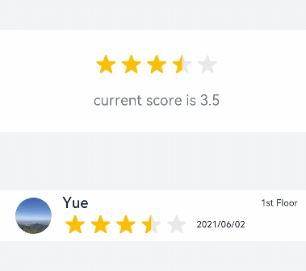

# Rating

提供在给定范围内选择评分的组件。

>  **说明：**
>
>  该组件从API Version 7开始支持。后续版本如有新增内容，则采用上角标单独标记该内容的起始版本。


## 子组件

无


## 接口

Rating(options?: { rating: number, indicator?: boolean })

**参数：**

| 参数名 | 参数类型 | 必填 | 参数描述 |
| -------- | -------- | -------- | -------- |
| rating | number | 是 | 设置并接收评分值。<br/>默认值：0 |
| indicator | boolean | 否 | 设置评分组件作为指示器使用，不可改变评分。<br/>默认值：false, 可进行评分 |


## 属性

| 名称 | 参数类型 | 描述 |
| -------- | -------- | -------- |
| stars | number | 设置评星总数。<br/>默认值：5 <br/>从API version 9开始，该接口支持在ArkTS卡片中使用。|
| stepSize | number | 操作评级的步长。<br/>默认值：0.5 <br/>从API version 9开始，该接口支持在ArkTS卡片中使用。|
| starStyle | {<br/>backgroundUri:&nbsp;string,<br/>foregroundUri:&nbsp;string,<br/>secondaryUri?:&nbsp;string<br/>} | backgroundUri：未选中的星级的图片链接，可由用户自定义或使用系统默认图片。<br/>foregroundUri：选中的星级的图片路径，可由用户自定义或使用系统默认图片。<br/>secondaryUir：部分选中的星级的图片路径，可由用户自定义或使用系统默认图片。<br/>从API version 9开始，该接口支持在ArkTS卡片中使用。<br/>**说明：** <br/>startStyle属性所支持的图片类型能力参考[Image](ts-basic-components-image.md)组件。<br/>支持加载本地图片和网络图片，暂不支持PixelMap类型和Resource资源。<br/>默认图片加载方式为异步，暂不支持同步加载。 |


## 事件

| 名称 | 功能描述 |
| -------- | -------- |
| onChange(callback:(value:&nbsp;number)&nbsp;=&gt;&nbsp;void) | 操作评分条的评星发生改变时触发该回调。 |

## 示例

### 示例1

```ts
// xxx.ets
@Entry
@Component
struct RatingExample {
  @State rating: number = 3.5

  build() {
    Column() {
      Column() {
        Rating({ rating: this.rating, indicator: false })
          .stars(5)
          .stepSize(0.5)
          .margin({ top: 24 })
          .onChange((value: number) => {
            this.rating = value
          })
        Text('current score is ' + this.rating)
          .fontSize(16)
          .fontColor('rgba(24,36,49,0.60)')
          .margin({ top: 16 })
      }.width(360).height(113).backgroundColor('#FFFFFF').margin({ top: 68 })

      Row() {
        Image('common/testImage.jpg')
          .width(40)
          .height(40)
          .borderRadius(20)
          .margin({ left: 24 })
        Column() {
          Text('Yue')
            .fontSize(16)
            .fontColor('#182431')
            .fontWeight(500)
          Row() {
            Rating({ rating: 3.5, indicator: true }).margin({ top: 1, right: 8 })
            Text('2021/06/02')
              .fontSize(10)
              .fontColor('#182431')
          }
        }.margin({ left: 12 }).alignItems(HorizontalAlign.Start)

        Text('1st Floor')
          .fontSize(10)
          .fontColor('#182431')
          .position({ x: 295, y: 8 })
      }.width(360).height(56).backgroundColor('#FFFFFF').margin({ top: 64 })
    }.width('100%').height('100%').backgroundColor('#F1F3F5')
  }
}
```



### 示例2

```ts
// xxx.ets
@Entry
@Component
struct RatingExample {
  @State rating: number = 3.5

  build() {
    Column() {
      Rating({ rating: this.rating, indicator: false })
        .stars(5)
        .stepSize(0.5)
        .starStyle({
          backgroundUri: '/common/imag1.png', // common目录与pages同级
          foregroundUri: '/common/imag2.png',
          secondaryUri: '/common/imag3.png'
        })
        .margin({ top: 24 })
        .onChange((value: number) => {
          this.rating = value
        })
      Text('current score is ' + this.rating)
        .fontSize(16)
        .fontColor('rgba(24,36,49,0.60)')
        .margin({ top: 16 })
    }.width('100%').height('100%').backgroundColor('#F1F3F5')
  }
}
```

