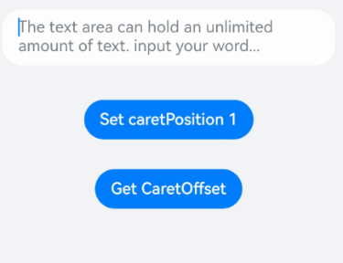

# TextArea

多行文本输入框组件，当输入的文本内容超过组件宽度时会自动换行显示。

>  **说明：**
>
>  该组件从API Version 7开始支持。后续版本如有新增内容，则采用上角标单独标记该内容的起始版本。


## 子组件

无


## 接口

TextArea(value?:{placeholder?: ResourceStr, text?: ResourceStr, controller?: TextAreaController})

**参数：**

| 参数名                     | 参数类型                                     | 必填   | 参数描述           |
| ----------------------- | ---------------------------------------- | ---- | -------------- |
| placeholder      | [ResourceStr](ts-types.md#resourcestr)  | 否    | 设置无输入时的提示文本。输入内容后，提示文本不显示。<br/>仅设置placeholder属性时，手柄依然跟随拖动，手柄松开后光标停留在文字开头位置。     |
| text             | [ResourceStr](ts-types.md#resourcestr)  | 否    | 设置输入框当前的文本内容。</br>当组件设置[stateStyles](ts-universal-attributes-polymorphic-style.md)等刷新属性时，建议通过onChange事件将状态变量与文本实时绑定，</br>避免组件刷新时TextArea中的文本内容异常。<br />从API version 10开始，该参数支持[$$](../../quick-start/arkts-two-way-sync.md)双向绑定变量。 |
| controller<sup>8+</sup> | [TextAreaController](#textareacontroller8) | 否    | 设置TextArea控制器。 |


## 属性

除支持[通用属性](ts-universal-attributes-size.md)和[文本通用属性](ts-universal-attributes-text-style.md)的fontColor、fontSize、fontStyle、fontWeight、fontFamily外，还支持以下属性：

| 名称                      | 参数类型                                                     | 描述                                                         |
| ------------------------- | ------------------------------------------------------------ | ------------------------------------------------------------ |
| placeholderColor          | [ResourceColor](ts-types.md#resourcecolor)                   | 设置placeholder文本颜色。<br/>默认值跟随主题。               |
| placeholderFont           | [Font](ts-types.md#font)                                     | 设置placeholder文本样式，包括字体大小，字体粗细，字体族，字体风格。目前仅支持默认字体族。 |
| textAlign                 | [TextAlign](ts-appendix-enums.md#textalign)                  | 设置文本在输入框中的水平对齐方式。<br/>默认值：TextAlign.Start<br/>说明：<br/>可通过[align](ts-universal-attributes-location.md)属性控制文本段落在垂直方向上的位置，此组件中不可通过align属性控制文本段落在水平方向上的位置，即align属性中Alignment.TopStart、Alignment.Top、Alignment.TopEnd效果相同，控制内容在顶部，Alignment.Start、Alignment.Center、Alignment.End效果相同，控制内容垂直居中，Alignment.BottomStart、Alignment.Bottom、Alignment.BottomEnd效果相同，控制内容在底部。 |
| caretColor                | [ResourceColor](ts-types.md#resourcecolor)                   | 设置输入框光标颜色。<br/>默认值：'#007DFF'。                 |
| inputFilter<sup>8+</sup>  | {<br/>value:&nbsp;[ResourceStr](ts-types.md#resourcestr),<br/>error?:&nbsp;(value:&nbsp;string) => void<br/>} | 通过正则表达式设置输入过滤器。匹配表达式的输入允许显示，不匹配的输入将被过滤。仅支持单个字符匹配，不支持字符串匹配。<br/>-&nbsp;value：设置正则表达式。<br/>-&nbsp;error：正则匹配失败时，返回被过滤的内容。 |
| copyOption<sup>9+</sup>   | [CopyOptions](ts-appendix-enums.md#copyoptions9)             | 设置输入的文本是否可复制。<br/>默认值：CopyOptions.LocalDevice，支持设备内复制。 <br/>设置CopyOptions.None时，当前TextArea中的文字无法被复制或剪切，仅支持粘贴。 |
| maxLength<sup>10+</sup>   | number                                                       | 设置文本的最大输入字符数。<br/>默认不设置最大输入字符数限制。 |
| showCounter<sup>10+</sup> | boolean                                                      | 设置文本最大输入字符数后，是否显示字数。<br/>默认值：false   |
| style<sup>10+</sup>       | [TextContentStyle](ts-appendix-enums.md#textcontentstyle10)  | 设置文本框多态样式。<br/>默认值：TextContentStyle.DEFAULT    |

>  **说明：**
>
>  [通用属性padding](ts-universal-attributes-size.md)的默认值为：<br>{<br>&nbsp;top: 8 vp,<br>&nbsp;right: 16 vp,<br>&nbsp;bottom: 8 vp,<br>&nbsp;left: 16 vp<br> }

## 事件

除支持[通用事件](ts-universal-events-click.md)外，还支持以下事件：

| 名称                                                         | 功能描述                                                     |
| ------------------------------------------------------------ | ------------------------------------------------------------ |
| onChange(callback:&nbsp;(value:&nbsp;string)&nbsp;=&gt;&nbsp;void) | 输入内容发生变化时，触发该回调。<br/>- value：当前输入的文本内容。 |
| onEditChange(callback:&nbsp;(isEditing:&nbsp;boolean)&nbsp;=&gt;&nbsp;void)<sup>10+</sup> | 输入状态变化时，触发该回调。有光标时为编辑态，无光标时为非编辑态。isEditing为true表示正在输入。 |
| onCopy<sup>8+</sup>(callback:(value:&nbsp;string)&nbsp;=&gt;&nbsp;void) | 长按输入框内部区域弹出剪贴板后，点击剪切板复制按钮，触发该回调。<br/>- value：复制的文本内容。 |
| onCut<sup>8+</sup>(callback:(value:&nbsp;string)&nbsp;=&gt;&nbsp;void) | 长按输入框内部区域弹出剪贴板后，点击剪切板剪切按钮，触发该回调。<br/>- value：剪切的文本内容。 |
| onPaste<sup>8+</sup>(callback:(value:&nbsp;string)&nbsp;=&gt;&nbsp;void) | 长按输入框内部区域弹出剪贴板后，点击剪切板粘贴按钮，触发该回调。<br/>- value：粘贴的文本内容。 |

## TextAreaController<sup>8+</sup>

TextArea组件的控制器，目前可通过它设置TextArea组件的光标位置。

### 导入对象

```
controller: TextAreaController = new TextAreaController()
```

### caretPosition<sup>8+</sup>

caretPosition(value: number): void

设置输入光标的位置。

**参数：**

| 参数名 | 参数类型 | 必填 | 参数描述                               |
| ------ | -------- | ---- | -------------------------------------- |
| value  | number   | 是   | 从字符串开始到光标所在位置的字符长度。 |

### setTextSelection<sup>10+</sup>

setTextSelection(selectionStart: number, selectionEnd: number): void

组件在获焦状态下，调用该接口设置文本选择区域并高亮显示，且只有在selectionStart小于selectionEnd时，文字才会被选取、高亮显示。

**参数：**

| 参数名         | 参数类型 | 必填 | 参数描述                                                     |
| -------------- | -------- | ---- | ------------------------------------------------------------ |
| selectionStart | number   | 是   | 文本选择区域起始位置，文本框中文字的起始位置为0。<br/>当selectionStart小于0时、按照0处理；当selectionStart大于文字最大长度时、按照文字最大长度处理。<br/> |
| selectionEnd   | number   | 是   | 文本选择区域结束位置。<br/>当selectionEnd小于0时、按照0处理；当selectionEnd大于文字最大长度时、按照文字最大长度处理。<br/> |

## 示例

```ts
// xxx.ets
@Entry
@Component
struct TextAreaExample {
  @State text: string = ''
  controller: TextAreaController = new TextAreaController()

  build() {
    Column() {
      TextArea({
        text: this.text,
        placeholder: 'The text area can hold an unlimited amount of text. input your word...',
        controller: this.controller
      })
        .placeholderFont({ size: 16, weight: 400 })
        .width(336)
        .height(56)
        .margin(20)
        .fontSize(16)
        .fontColor('#182431')
        .backgroundColor('#FFFFFF')
        .onChange((value: string) => {
          this.text = value
        })
      Text(this.text)
      Button('Set caretPosition 1')
        .backgroundColor('#007DFF')
        .margin(15)
        .onClick(() => {
          // 设置光标位置到第一个字符后
          this.controller.caretPosition(1)
        })
    }.width('100%').height('100%').backgroundColor('#F1F3F5')
  }
}
```


