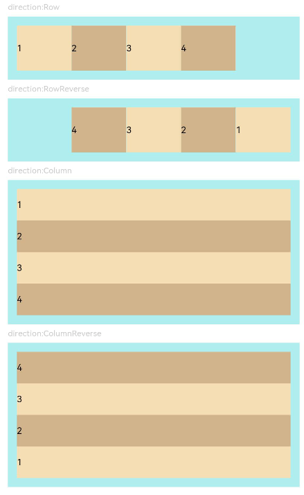

# Flex

以弹性方式布局子组件的容器组件。

> **说明：**
> - 该组件从API Version 7开始支持。后续版本如有新增内容，则采用上角标单独标记该内容的起始版本。
> - Flex组件在渲染时存在二次布局过程，因此在对性能有严格要求的场景下建议使用[Column](ts-container-column.md)、[Row](ts-container-row.md)代替。
> - Flex组件主轴默认不设置时撑满父容器，[Column](ts-container-column.md)、[Row](ts-container-row.md)组件主轴不设置时默认是跟随子节点大小。


## 权限列表

无


## 子组件

可以包含子组件。


## 接口

Flex(value?: { direction?: FlexDirection, wrap?: FlexWrap,  justifyContent?: FlexAlign, alignItems?: ItemAlign, alignContent?: FlexAlign })

标准Flex布局容器。

从API version 9开始，该接口支持在ArkTS卡片中使用。

**参数:**

| 参数名            | 参数类型                                     | 必填   | 默认值               | 参数描述                                     |
| -------------- | ---------------------------------------- | ---- | ----------------- | ---------------------------------------- |
| direction      | [FlexDirection](ts-appendix-enums.md#flexdirection) | 否    | FlexDirection.Row | 子组件在Flex容器上排列的方向，即主轴的方向。                |
| wrap           | [FlexWrap](ts-appendix-enums.md#flexwrap)  | 否    | FlexWrap.NoWrap   | Flex容器是单行/列还是多行/列排列。<br/>**说明：** <br/>在多行布局时，通过交叉轴方向，确认新行堆叠方向。 |
| justifyContent | [FlexAlign](ts-appendix-enums.md#flexalign) | 否    | FlexAlign.Start   | 所有子组件在Flex容器主轴上的对齐格式。                    |
| alignItems     | [ItemAlign](ts-appendix-enums.md#itemalign) | 否    | ItemAlign.Start | 所有子组件在Flex容器交叉轴上的对齐格式。                 |
| alignContent   | [FlexAlign](ts-appendix-enums.md#flexalign) | 否    | FlexAlign.Start   | 交叉轴中有额外的空间时，多行内容的对齐方式。仅在wrap为Wrap或WrapReverse下生效。 |


## 示例

```ts
// xxx.ets
@Entry
@Component
struct FlexExample1 {
  build() {
    Column() {
      Column({ space: 5 }) {
        Text('direction:Row').fontSize(9).fontColor(0xCCCCCC).width('90%')
        Flex({ direction: FlexDirection.Row }) {
          Text('1').width('20%').height(50).backgroundColor(0xF5DEB3)
          Text('2').width('20%').height(50).backgroundColor(0xD2B48C)
          Text('3').width('20%').height(50).backgroundColor(0xF5DEB3)
          Text('4').width('20%').height(50).backgroundColor(0xD2B48C)
        }
        .height(70)
        .width('90%')
        .padding(10)
        .backgroundColor(0xAFEEEE)

        Text('direction:RowReverse').fontSize(9).fontColor(0xCCCCCC).width('90%')
        Flex({ direction: FlexDirection.RowReverse }) {
          Text('1').width('20%').height(50).backgroundColor(0xF5DEB3)
          Text('2').width('20%').height(50).backgroundColor(0xD2B48C)
          Text('3').width('20%').height(50).backgroundColor(0xF5DEB3)
          Text('4').width('20%').height(50).backgroundColor(0xD2B48C)
        }
        .height(70)
        .width('90%')
        .padding(10)
        .backgroundColor(0xAFEEEE)

        Text('direction:Column').fontSize(9).fontColor(0xCCCCCC).width('90%')
        Flex({ direction: FlexDirection.Column }) {
          Text('1').width('100%').height(40).backgroundColor(0xF5DEB3)
          Text('2').width('100%').height(40).backgroundColor(0xD2B48C)
          Text('3').width('100%').height(40).backgroundColor(0xF5DEB3)
          Text('4').width('100%').height(40).backgroundColor(0xD2B48C)
        }
        .height(160)
        .width('90%')
        .padding(10)
        .backgroundColor(0xAFEEEE)

        Text('direction:ColumnReverse').fontSize(9).fontColor(0xCCCCCC).width('90%')
        Flex({ direction: FlexDirection.ColumnReverse }) {
          Text('1').width('100%').height(40).backgroundColor(0xF5DEB3)
          Text('2').width('100%').height(40).backgroundColor(0xD2B48C)
          Text('3').width('100%').height(40).backgroundColor(0xF5DEB3)
          Text('4').width('100%').height(40).backgroundColor(0xD2B48C)
        }
        .height(160)
        .width('90%')
        .padding(10)
        .backgroundColor(0xAFEEEE)
      }.width('100%').margin({ top: 5 })
    }.width('100%')
  }
}
```



```ts
// xxx.ets
@Entry
@Component
struct FlexExample2 {
  build() {
    Column() {
      Column({ space: 5 }) {
        Text('Wrap').fontSize(9).fontColor(0xCCCCCC).width('90%')
        Flex({ wrap: FlexWrap.Wrap }) {
          Text('1').width('50%').height(50).backgroundColor(0xF5DEB3)
          Text('2').width('50%').height(50).backgroundColor(0xD2B48C)
          Text('3').width('50%').height(50).backgroundColor(0xD2B48C)
        }
        .width('90%')
        .padding(10)
        .backgroundColor(0xAFEEEE)

        Text('NoWrap').fontSize(9).fontColor(0xCCCCCC).width('90%')
        Flex({ wrap: FlexWrap.NoWrap }) {
          Text('1').width('50%').height(50).backgroundColor(0xF5DEB3)
          Text('2').width('50%').height(50).backgroundColor(0xD2B48C)
          Text('3').width('50%').height(50).backgroundColor(0xF5DEB3)
        }
        .width('90%')
        .padding(10)
        .backgroundColor(0xAFEEEE)

        Text('WrapReverse').fontSize(9).fontColor(0xCCCCCC).width('90%')
        Flex({ wrap: FlexWrap.WrapReverse , direction:FlexDirection.Row }) {
          Text('1').width('50%').height(50).backgroundColor(0xF5DEB3)
          Text('2').width('50%').height(50).backgroundColor(0xD2B48C)
          Text('3').width('50%').height(50).backgroundColor(0xD2B48C)
        }
        .width('90%')
        .height(120)
        .padding(10)
        .backgroundColor(0xAFEEEE)
      }.width('100%').margin({ top: 5 })
    }.width('100%')
  }
}
```


```ts
// xxx.ets
@Component
struct JustifyContentFlex {
  justifyContent : number

  build() {
    Flex({ justifyContent: this.justifyContent }) {
      Text('1').width('20%').height(50).backgroundColor(0xF5DEB3)
      Text('2').width('20%').height(50).backgroundColor(0xD2B48C)
      Text('3').width('20%').height(50).backgroundColor(0xF5DEB3)
    }
    .width('90%')
    .padding(10)
    .backgroundColor(0xAFEEEE)
  }
}

@Entry
@Component
struct FlexExample3 {
  build() {
    Column() {
      Column({ space: 5 }) {
        Text('justifyContent:Start').fontSize(9).fontColor(0xCCCCCC).width('90%')
        JustifyContentFlex({ justifyContent: FlexAlign.Start })

        Text('justifyContent:Center').fontSize(9).fontColor(0xCCCCCC).width('90%')
        JustifyContentFlex({ justifyContent: FlexAlign.Center })

        Text('justifyContent:End').fontSize(9).fontColor(0xCCCCCC).width('90%')
        JustifyContentFlex({ justifyContent: FlexAlign.End })

        Text('justifyContent:SpaceBetween').fontSize(9).fontColor(0xCCCCCC).width('90%')
        JustifyContentFlex({ justifyContent: FlexAlign.SpaceBetween })

        Text('justifyContent:SpaceAround').fontSize(9).fontColor(0xCCCCCC).width('90%')
        JustifyContentFlex({ justifyContent: FlexAlign.SpaceAround })

        Text('justifyContent:SpaceEvenly').fontSize(9).fontColor(0xCCCCCC).width('90%')
        JustifyContentFlex({ justifyContent: FlexAlign.SpaceEvenly })
      }.width('100%').margin({ top: 5 })
    }.width('100%')
  }
}
```


```ts
// xxx.ets
@Component
struct AlignItemsFlex {
  alignItems : number

  build() {
    Flex({ alignItems: this.alignItems }) {
      Text('1').width('33%').height(30).backgroundColor(0xF5DEB3)
      Text('2').width('33%').height(40).backgroundColor(0xD2B48C)
      Text('3').width('33%').height(50).backgroundColor(0xF5DEB3)
    }
    .size({width: '90%', height: 80})
    .padding(10)
    .backgroundColor(0xAFEEEE)
  }
}

@Entry
@Component
struct FlexExample4 {
  build() {
    Column() {
      Column({ space: 5 }) {
        Text('alignItems:Auto').fontSize(9).fontColor(0xCCCCCC).width('90%')
        AlignItemsFlex({ alignItems: ItemAlign.Auto })

        Text('alignItems:Start').fontSize(9).fontColor(0xCCCCCC).width('90%')
        AlignItemsFlex({ alignItems: ItemAlign.Start })

        Text('alignItems:Center').fontSize(9).fontColor(0xCCCCCC).width('90%')
        AlignItemsFlex({ alignItems: ItemAlign.Center })

        Text('alignItems:End').fontSize(9).fontColor(0xCCCCCC).width('90%')
        AlignItemsFlex({ alignItems: ItemAlign.End })

        Text('alignItems:Stretch').fontSize(9).fontColor(0xCCCCCC).width('90%')
        AlignItemsFlex({ alignItems: ItemAlign.Stretch })

        Text('alignItems:Baseline').fontSize(9).fontColor(0xCCCCCC).width('90%')
        AlignItemsFlex({ alignItems: ItemAlign.Baseline })
      }.width('100%').margin({ top: 5 })
    }.width('100%')
  }
}
```


```ts
// xxx.ets
@Component
struct AlignContentFlex {
  alignContent: number

  build() {
    Flex({ wrap: FlexWrap.Wrap, alignContent: this.alignContent }) {
      Text('1').width('50%').height(20).backgroundColor(0xF5DEB3)
      Text('2').width('50%').height(20).backgroundColor(0xD2B48C)
      Text('3').width('50%').height(20).backgroundColor(0xD2B48C)
    }
    .size({ width: '90%', height: 90 })
    .padding(10)
    .backgroundColor(0xAFEEEE)
  }
}

@Entry
@Component
struct FlexExample5 {
  build() {
    Column() {
      Column({ space: 5 }) {
        Text('alignContent:Start').fontSize(9).fontColor(0xCCCCCC).width('90%')
        AlignContentFlex({ alignContent: FlexAlign.Start })

        Text('alignContent:Center').fontSize(9).fontColor(0xCCCCCC).width('90%')
        AlignContentFlex({ alignContent: FlexAlign.Center })

        Text('alignContent:End').fontSize(9).fontColor(0xCCCCCC).width('90%')
        AlignContentFlex({ alignContent: FlexAlign.End })

        Text('alignContent:SpaceBetween').fontSize(9).fontColor(0xCCCCCC).width('90%')
        AlignContentFlex({ alignContent: FlexAlign.SpaceBetween })

        Text('alignContent:SpaceAround').fontSize(9).fontColor(0xCCCCCC).width('90%')
        AlignContentFlex({ alignContent: FlexAlign.SpaceAround })

        Text('alignContent:SpaceEvenly').fontSize(9).fontColor(0xCCCCCC).width('90%')
        AlignContentFlex({ alignContent: FlexAlign.SpaceEvenly })
      }.width('100%').margin({ top: 5 })
    }.width('100%')
  }
}
```


