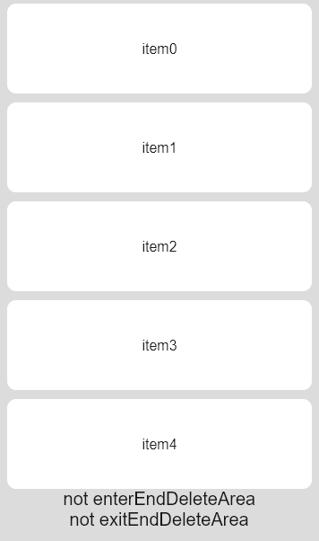

# ListItem

用来展示列表具体item，必须配合List来使用。

>  **说明：**
>
>  该组件从API Version 7开始支持。后续版本如有新增内容，则采用上角标单独标记该内容的起始版本。


## 子组件

可以包含单个子组件。

## 接口

从API version 9开始，该接口支持在ArkTS卡片中使用。

**方法1：** ListItem(value?: ListItemOptions)<sup>10+</sup>

**参数：**

| 参数名 | 参数类型                                      | 必填 | 参数描述                                                     |
| ------ | --------------------------------------------- | ---- | ------------------------------------------------------------ |
| value  | [ListItemOptions](#listitemoptions10对象说明) | 否   | 为ListItem提供可选参数, 该对象内含有ListItemStyle枚举类型的style参数。 |

**方法2：** ListItem(value?: string)<sup>(deprecated)</sup>

从API version 10开始, 该接口不再维护，推荐使用方法1。

**参数：**

| 参数名 | 参数类型                      | 必填 | 参数描述 |
| ------ | ----------------------------- | ---- | -------- |
| value  | string<sup>(deprecated)</sup> | 否   | 无       |

## 属性

除支持[通用属性](ts-universal-attributes-size.md)外，还支持以下属性：

| 名称 | 参数类型 | 描述 |
| -------- | -------- | -------- |
| sticky<sup>(deprecated)</sup> | [Sticky](#stickydeprecated枚举说明) | 设置ListItem吸顶效果。<br/>默认值：Sticky.None<br/>从API version9开始废弃，推荐使用[List组件sticky属性](ts-container-list.md#属性)。 |
| editable<sup>(deprecated)</sup>  | boolean&nbsp;\|&nbsp;[EditMode](#editmodedeprecated枚举说明) | 当前ListItem元素是否可编辑，进入编辑模式后可删除或移动列表项。<br/>从API version9开始废弃。<br/>默认值：false |
| selectable<sup>8+</sup> | boolean | 当前ListItem元素是否可以被鼠标框选。<br/>**说明：**<br/>外层List容器的鼠标框选开启时，ListItem的框选才生效。<br/>默认值：true |
| selected<sup>10+</sup> | boolean | 设置当前ListItem选中状态。该属性支持[$$](../../quick-start/arkts-two-way-sync.md)双向绑定变量。<br/>**说明：**<br/>该属性需要在设置[选中态样式](./ts-universal-attributes-polymorphic-style.md)前使用才能生效选中态样式。<br/>默认值：false|
| swipeAction<sup>9+</sup> | {<br/>start?:&nbsp;CustomBuilder&nbsp;\|&nbsp;[SwipeActionItem](#swipeactionitem10对象说明),<br/>end?:CustomBuilder&nbsp;\|&nbsp;[SwipeActionItem](#swipeactionitem10对象说明),<br/>edgeEffect?:&nbsp;[SwipeEdgeEffect](#swipeedgeeffect9枚举说明),<br/>} | 用于设置ListItem的划出组件。<br/>- start:&nbsp;ListItem向右划动时item左边的组件（List垂直布局时）或ListItem向下划动时item上方的组件（List水平布局时）。<br/>- end:&nbsp;ListItem向左划动时item右边的组件（List垂直布局时）或ListItem向上划动时item下方的组件（List水平布局时）。<br/>- edgeEffect:&nbsp;滑动效果。<br/>**说明：** <br/>- start和end对应的@builder函数中顶层必须是单个组件，不能是if/else、ForEach、LazyForEach语句。<br/> - 滑动手势只在listItem区域上，如果子组件划出ListItem区域外，在ListItem以外部分不会响应划动手势。所以在多列模式下，建议不要将划出组件设置太宽。 |

## Sticky<sup>(deprecated)</sup>枚举说明
从API version9开始废弃，推荐使用[List组件stickyStyle枚举](ts-container-list.md#stickystyle9枚举说明)。
| 名称 | 描述 |
| -------- | -------- |
| None | 无吸顶效果。 |
| Normal | 当前item吸顶。 |
| Opacity | 当前item吸顶显示透明度变化效果。 |

## EditMode<sup>(deprecated)</sup>枚举说明
从API version9开始废弃。
| 名称     | 描述        |
| ------ | --------- |
| None   | 编辑操作不限制。    |
| Deletable | 可删除。 |
| Movable | 可移动。 |

## SwipeEdgeEffect<sup>9+</sup>枚举说明
| 名称 | 描述 |
| -------- | -------- |
| Spring | ListItem划动距离超过划出组件大小后可以继续划动。如果设置了删除区域，ListItem划动距离超过删除阈值后可以继续划动，松手后按照弹簧阻尼曲线回弹。 |
| None | ListItem划动距离不能超过划出组件大小。如果设置了删除区域，ListItem划动距离不能超过删除阈值，并且在设置删除回调的情况下，达到删除阈值后松手触发删除回调。 |

## SwipeActionItem<sup>10+</sup>对象说明
List垂直布局，ListItem向右滑动，item左边的长距离滑动删除选项或向左滑动时，item右边的长距离滑动删除选项。
</br>List水平布局，ListItem向上滑动，item下边的长距离滑动删除选项或向下滑动时，item上边的长距离滑动删除选项。

| 名称                 | 参数类型                                                     | 必填 | 描述                                                         |
| -------------------- | ------------------------------------------------------------ | ---- | ------------------------------------------------------------ |
| actionAreaDistance | [Length](ts-types.md#length) | 否 | 设置组件长距离滑动删除距离阈值。<br/>默认值：56vp <br/>**说明：** <br/>不支持设置百分比。<br/>删除距离阈值大于item宽度减去划出组件宽度，或删除距离阈值小于等于0就不会设置删除区域。|
| onAction | () => void | 否 | 组件进入长距删除区后删除ListItem时调用，进入长距删除区后抬手时触发。<br/>**说明：** <br/> 滑动后松手的位置超过或等于设置的距离阈值，并且设置的距离阈值有效时才会触发。|
| onEnterActionArea | () => void | 否 | 在滑动条目进入删除区域时调用，只触发一次，当再次进入时仍触发。 |
| onExitActionArea | () => void | 否 |当滑动条目退出删除区域时调用，只触发一次，当再次退出时仍触发。 |
| builder |  CustomBuilder | 否 |当列表项向右或向右滑动（当列表方向为“垂直”时），向下或向下滑动（当列方向为“水平”时）时显示的操作项。 |
## ListItemOptions<sup>10+</sup>对象说明

| 名称  | 参数类型                                  | 必填 | 描述                                                         |
| ----- | ----------------------------------------- | ---- | ------------------------------------------------------------ |
| style | [ListItemStyle](#listitemstyle10枚举说明) | 否   | 设置List组件卡片样式。<br/>默认值: ListItemStyle.NONE<br/>设置为ListItemStyle.NONE时无样式。<br/>设置为ListItemStyle.CARD时，必须配合[ListItemGroup](ts-container-listitemgroup.md)的ListItemGroupStyle.CARD同时使用，显示默认卡片样式。  <br/>卡片样式下，ListItem默认规格：高度48vp，宽度100%。<br/>卡片样式下, 为卡片内的列表选项提供了默认的focus、hover、press、selected和disable样式。<br/>**说明：**<br/>当前卡片模式下，不支持listDirection属性设置，使用默认Axis.Vertical排列方向。<br/>当前卡片模式下，List属性alignListItem默认为ListItemAlign.Center，居中对齐显示。 |

## ListItemStyle<sup>10+</sup>枚举说明

| 名称 | 描述               |
| ---- | ------------------ |
| NONE | 无样式。           |
| CARD | 显示默认卡片样式。 |

## 事件

| 名称 | 功能描述 |
| -------- | -------- |
| onSelect(event:&nbsp;(isSelected:&nbsp;boolean)&nbsp;=&gt;&nbsp;void)<sup>8+</sup> | ListItem元素被鼠标框选的状态改变时触发回调。<br/>isSelected：进入鼠标框选范围即被选中返回true，&nbsp;移出鼠标框选范围即未被选中返回false。 |


## 示例

```ts
// xxx.ets
@Entry
@Component
struct ListItemExample {
  private arr: number[] = [0, 1, 2, 3, 4, 5, 6, 7, 8, 9]

  build() {
    Column() {
      List({ space: 20, initialIndex: 0 }) {
        ForEach(this.arr, (item) => {
          ListItem() {
            Text('' + item)
              .width('100%').height(100).fontSize(16)
              .textAlign(TextAlign.Center).borderRadius(10).backgroundColor(0xFFFFFF)
          }
        }, item => item)
      }.width('90%')
      .scrollBar(BarState.Off)
    }.width('100%').height('100%').backgroundColor(0xDCDCDC).padding({ top: 5 })
  }
}
```


```ts
// xxx.ets
@Entry
@Component
struct ListItemExample2 {
  @State message: string = 'Hello World'
  @State arr: number[] = [0, 1, 2, 3, 4]
  @State enterEndDeleteAreaString: string = "not enterEndDeleteArea"
  @State exitEndDeleteAreaString: string = "not exitEndDeleteArea"

  @Builder itemEnd() {
    Row() {
      Button("Delete").margin("4vp")
      Button("Set").margin("4vp")
    }.padding("4vp").justifyContent(FlexAlign.SpaceEvenly)
  }

  build() {
    Column() {
      List({ space: 10 }) {
        ForEach(this.arr, (item) => {
          ListItem() {
            Text("item" + item)
              .width('100%')
              .height(100)
              .fontSize(16)
              .textAlign(TextAlign.Center)
              .borderRadius(10)
              .backgroundColor(0xFFFFFF)
          }
          .transition({ type: TransitionType.Delete, opacity: 0 })
          .swipeAction({
            end: {
              builder: this.itemEnd.bind(this, item),
              useDefaultDeleteAnimation: true,
              onDelete: () => {
                animateTo({ duration: 1000 }, () => {
                  let index = this.arr.indexOf(item)
                  this.arr.splice(index, 1)
                })
              },
              deleteAreaDistance: 80,
              onEnterDeleteArea: () => {
                this.enterEndDeleteAreaString = "enterEndDeleteArea"
                this.exitEndDeleteAreaString = "not exitEndDeleteArea"
              },
              onExitDeleteArea: () => {
                this.enterEndDeleteAreaString = "not enterEndDeleteArea"
                this.exitEndDeleteAreaString = "exitEndDeleteArea"
              }
            }
          })
        }, item => item)
      }
      Text(this.enterEndDeleteAreaString).fontSize(20)
      Text(this.exitEndDeleteAreaString).fontSize(20)
    }
    .padding(10)
    .backgroundColor(0xDCDCDC)
    .width('100%')
    .height('100%')
  }
}
```


## 示例3
```ts
// xxx.ets
@Entry
@Component
struct ListItemExample3 {
 private arr: any = [ListItemStyle.CARD, ListItemStyle.CARD,ListItemStyle.NONE]
 build() {
  Column() {
   List({ space: "4vp", initialIndex: 0 }) {
    ListItemGroup({style:ListItemGroupStyle.CARD}){
     ForEach(this.arr, (itemStyle,index) => {
      ListItem({style:itemStyle}) {
       Text(""+index)
        .width("100%")
        .textAlign(TextAlign.Center)
      }
     })
    }
    ForEach(this.arr, (itemStyle,index) => {
     ListItem({style:itemStyle}) {
      Text(""+index)
       .width("100%")
       .textAlign(TextAlign.Center)
     }
    })
   }
   .width('100%')
   .multiSelectable(true)
   .backgroundColor(0xDCDCDC) // 浅蓝色的List
  }
  .width('100%')
  .padding({ top: 5 })
 }
}

```
