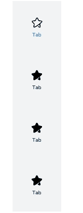

# TabContent

仅在Tabs中使用，对应一个切换页签的内容视图。

>  **说明：**
>
>  该组件从API Version 7开始支持。后续版本如有新增内容，则采用上角标单独标记该内容的起始版本。


## 子组件

支持单个子组件。


## 接口

TabContent()


## 属性

除支持[通用属性](ts-universal-attributes-size.md)外，还支持以下属性：

| 名称 | 参数类型 | 描述 |
| -------- | -------- | -------- |
| tabBar | string&nbsp;\|&nbsp;Resource&nbsp;\|&nbsp;{<br/>icon?:&nbsp;string&nbsp;\|&nbsp;Resource,<br/>text?:&nbsp;string&nbsp;\|&nbsp;Resource<br/>}<br/>\|&nbsp;[CustomBuilder](ts-types.md)<sup>8+</sup> | 设置TabBar上显示内容。<br/>CustomBuilder:&nbsp;构造器，内部可以传入组件（API8版本以上适用）。<br/>>&nbsp;&nbsp;**说明：**<br/>>&nbsp;如果icon采用svg格式图源，则要求svg图源删除其自有宽高属性值。如采用带有自有宽高属性的svg图源，icon大小则是svg本身内置的宽高属性值大小。 |
| tabBar<sup>9+</sup> | [SubTabBarStyle](#subtabbarstyle) \| [BottomTabBarStyle](#bottomtabbarstyle) | 设置TabBar上显示内容。<br/>SubTabBarStyle:&nbsp;子页签样式，参数为文字。<br/>BottomTabBarStyle:&nbsp;底部页签和侧边页签样式，参数为文字和图片。 |

>  **说明：**
> - TabContent组件不支持设置通用宽度属性，其宽度默认撑满Tabs父组件。
> - TabContent组件不支持设置通用高度属性，其高度由Tabs父组件高度与TabBar组件高度决定。
> - TabContent组件不支持内容过长时页面的滑动，如需页面滑动，可嵌套List使用。

## SubTabBarStyle<sup>9+</sup>

子页签样式。

### constructor

constructor(content: string | Resource)

SubTabBarStyle的构造函数。

**参数：**

| 参数名 | 参数类型         | 必填 | 参数描述 |
| -------- | -------- | -------- | -------- |
| content | string \| [Resource](ts-types.md#resource) | 是 | 页签内的文字内容。从API version 10开始，content类型为ResourceStr。 |

### of<sup>10+</sup>

static of(content: ResourceStr)

SubTabBarStyle的静态构造函数。

**参数：**

| 参数名  | 参数类型                                   | 必填 | 参数描述           |
| ------- | ------------------------------------------ | ---- | ------------------ |
| content | [ResourceStr](ts-types.md#resourcestr) | 是   | 页签内的文字内容。 |

### 属性

支持以下属性：

| 名称         | 参数类型                                                     | 描述                                                         |
| ------------ | ------------------------------------------------------------ | ------------------------------------------------------------ |
| indicator<sup>10+</sup> | [IndicatorStyle](#indicatorstyle10对象说明)| 设置选中子页签的下划线风格。<br />                |
| selectedMode<sup>10+</sup> | [SelectedMode](#selectedmode10枚举说明)   | 设置选中子页签的显示方式。<br />默认值：SelectedMode.Indicator |
| board<sup>10+</sup> | [BoardStyle](#boardstyle10对象说明)   | 设置选中子页签的背板风格。 |
| labelStyle<sup>10+</sup> | [LabelStyle](#labelstyle10对象说明) | 设置选中子页签的label文本和字体的样式。 |

## IndicatorStyle<sup>10+</sup>对象说明

| 名称 | 参数类型 | 必填 | 描述 |
| -------- | -------- | -------- | -------------------------------- |
| color | [ResourceColor](ts-types.md#resourcecolor) | 否 | 下划线的颜色。<br/>默认值:#FF007DFF |
| height | [Length](ts-types.md#length) | 否 | 下划线的高度。<br/>默认值:2.0vp |
| width | [Length](ts-types.md#length) | 否 | 下划线的宽度。<br/>默认值：0.0vp |
| borderRadius | [Length](ts-types.md#length) | 否 | 下划线的圆角半径。<br/>默认值：0.0vp |
| marginTop | [Length](ts-types.md#length) | 否 | 下划线与文字的间距。<br/>默认值：8.0vp |

## SelectedMode<sup>10+</sup>枚举说明
| 名称       | 描述                     |
| ---------- | ------------------------ |
| Indicator | 使用下划线模式。     |
| Board   | 使用背板模式。     |

## BoardStyle<sup>10+</sup>对象说明

| 名称 | 参数类型 | 必填 | 描述 |
| -------- | -------- | -------- | ------------------------------------ |
| borderRadius | [Length](ts-types.md#length) | 否 | 下划线的圆角半径。<br/>默认值：8.0vp |

## LabelStyle<sup>10+</sup>对象说明

| 名称                 | 参数类型                                                     | 必填 | 描述                                                         |
| -------------------- | ------------------------------------------------------------ | ---- | ------------------------------------------------------------ |
| overflow             | [TextOverflow](ts-appendix-enums.md#textoverflow)            | 否   | 设置Label文本超长时的显示方式。文本截断是按字截断。例如，英文以单词为最小单位进行截断，若需要以字母为单位进行截断，可在字母间添加零宽空格。 |
| maxLines             | number                                                       | 否   | 设置Label文本的最大行数。默认情况下，文本是自动折行的，如果指定此参数，则文本最多不会超过指定的行。如果有多余的文本，可以通过 textOverflow来指定截断方式。 |
| minFontSize          | number \| [ResourceStr](ts-types.md#resourcestr)             | 否   | 设置Label文本最小显示字号。需配合maxFontSize以及maxLines或布局大小限制使用。 |
| maxFontSize          | number \| [ResourceStr](ts-types.md#resourcestr)             | 否   | 设置Label文本最大显示字号。需配合minFontSize以及maxLines或布局大小限制使用。 |
| heightAdaptivePolicy | [TextHeightAdaptivePolicy](ts-appendix-enums.md#textheightadaptivepolicy10) | 否   | 设置Label文本自适应高度的方式。                              |
| font                 | [Font](ts-types.md#font)                                     | 否   | 设置Label文本字体样式。                                      |

## BottomTabBarStyle<sup>9+</sup>

底部页签和侧边页签样式。

### constructor

constructor(icon: string | Resource, content: string | Resource)

BottomTabBarStyle的构造函数。

**参数：**

| 参数名 | 参数类型         | 必填 | 参数描述 |
| -------- | -------- | -------- | -------- |
| icon | string \| [Resource](ts-types.md#resource) | 是 | 页签内的图片内容。从API version 10开始，icon类型为ResourceStr。 |
| text | string \| [Resource](ts-types.md#resource) | 是 | 页签内的文字内容。从API version 10开始，text类型为ResourceStr。 |

### of<sup>10+</sup>

static of(icon: ResourceStr, text: ResourceStr)
BottomTabBarStyle的静态构造函数。

**参数：**

| 参数名 | 参数类型         | 必填 | 参数描述 |
| -------- | -------- | -------- | -------- |
| icon | [ResourceStr](ts-types.md#resourcestr) | 是 | 页签内的图片内容。 |
| text | [ResourceStr](ts-types.md#resourcestr) | 是 | 页签内的文字内容。 |

## 示例

示例1：

```ts
// xxx.ets
@Entry
@Component
struct TabContentExample {
  @State fontColor: string = '#182431'
  @State selectedFontColor: string = '#007DFF'
  @State currentIndex: number = 0
  private controller: TabsController = new TabsController()

  @Builder TabBuilder(index: number) {
    Column() {
      Image(this.currentIndex === index ? '/common/public_icon_on.svg' : '/common/public_icon_off.svg')
        .width(24)
        .height(24)
        .margin({ bottom: 4 })
        .objectFit(ImageFit.Contain)
      Text(`Tab${index + 1}`)
        .fontColor(this.currentIndex === index ? this.selectedFontColor : this.fontColor)
        .fontSize(10)
        .fontWeight(500)
        .lineHeight(14)
    }.width('100%')
  }

  build() {
    Column() {
      Tabs({ barPosition: BarPosition.End, controller: this.controller }) {
        TabContent() {
          Column() {
            Text('Tab1')
              .fontSize(36)
              .fontColor('#182431')
              .fontWeight(500)
              .opacity(0.4)
              .margin({ top: 30, bottom: 56.5 })
            Divider()
              .strokeWidth(0.5)
              .color('#182431')
              .opacity(0.05)
          }.width('100%')
        }.tabBar(this.TabBuilder(0))

        TabContent() {
          Column() {
            Text('Tab2')
              .fontSize(36)
              .fontColor('#182431')
              .fontWeight(500)
              .opacity(0.4)
              .margin({ top: 30, bottom: 56.5 })
            Divider()
              .strokeWidth(0.5)
              .color('#182431')
              .opacity(0.05)
          }.width('100%')
        }.tabBar(this.TabBuilder(1))

        TabContent() {
          Column() {
            Text('Tab3')
              .fontSize(36)
              .fontColor('#182431')
              .fontWeight(500)
              .opacity(0.4)
              .margin({ top: 30, bottom: 56.5 })
            Divider()
              .strokeWidth(0.5)
              .color('#182431')
              .opacity(0.05)
          }.width('100%')
        }.tabBar(this.TabBuilder(2))

        TabContent() {
          Column() {
            Text('Tab4')
              .fontSize(36)
              .fontColor('#182431')
              .fontWeight(500)
              .opacity(0.4)
              .margin({ top: 30, bottom: 56.5 })
            Divider()
              .strokeWidth(0.5)
              .color('#182431')
              .opacity(0.05)
          }.width('100%')
        }.tabBar(this.TabBuilder(3))
      }
      .vertical(false)
      .barHeight(56)
      .onChange((index: number) => {
        this.currentIndex = index
      })
      .width(360)
      .height(190)
      .backgroundColor('#F1F3F5')
      .margin({ top: 38 })
    }.width('100%')
  }
}
```


示例2：

```ts
// xxx.ets
@Entry
@Component
struct TabContentExample {
  @State fontColor: string = '#182431'
  @State selectedFontColor: string = '#007DFF'
  @State currentIndex: number = 0
  private controller: TabsController = new TabsController()

  @Builder TabBuilder(index: number) {
    Column() {
      Image(this.currentIndex === index ? '/common/public_icon_on.svg' : '/common/public_icon_off.svg')
        .width(24)
        .height(24)
        .margin({ bottom: 4 })
        .objectFit(ImageFit.Contain)
      Text('Tab')
        .fontColor(this.currentIndex === index ? this.selectedFontColor : this.fontColor)
        .fontSize(10)
        .fontWeight(500)
        .lineHeight(14)
    }.width('100%').height('100%').justifyContent(FlexAlign.Center)
  }

  build() {
    Column() {
      Tabs({ barPosition: BarPosition.Start, controller: this.controller }) {
        TabContent()
          .tabBar(this.TabBuilder(0))
        TabContent()
          .tabBar(this.TabBuilder(1))
        TabContent()
          .tabBar(this.TabBuilder(2))
        TabContent()
          .tabBar(this.TabBuilder(3))
      }
      .vertical(true)
      .barWidth(96)
      .barHeight(414)
      .onChange((index: number) => {
        this.currentIndex = index
      })
      .width(96)
      .height(414)
      .backgroundColor('#F1F3F5')
      .margin({ top: 52 })
    }.width('100%')
  }
}
```



示例3：

```ts
// xxx.ets
@Entry
@Component
struct TabBarStyleExample {
  build() {
    Column({ space: 5 }) {
      Text("子页签样式")
      Column() {
        Tabs({ barPosition: BarPosition.Start }) {
          TabContent() {
            Column().width('100%').height('100%').backgroundColor(Color.Pink)
          }.tabBar(new SubTabBarStyle('Pink'))

          TabContent() {
            Column().width('100%').height('100%').backgroundColor(Color.Yellow)
          }.tabBar(new SubTabBarStyle('Yellow'))

          TabContent() {
            Column().width('100%').height('100%').backgroundColor(Color.Blue)
          }.tabBar(new SubTabBarStyle('Blue'))

          TabContent() {
            Column().width('100%').height('100%').backgroundColor(Color.Green)
          }.tabBar(new SubTabBarStyle('Green'))
        }
        .vertical(false)
        .scrollable(true)
        .barMode(BarMode.Fixed)
        .onChange((index: number) => {
          console.info(index.toString())
        })
        .width('100%')
        .backgroundColor(0xF1F3F5)
      }.width('100%').height(200)
      Text("底部页签样式")
      Column() {
        Tabs({ barPosition: BarPosition.End }) {
          TabContent() {
            Column().width('100%').height('100%').backgroundColor(Color.Pink)
          }.tabBar(new BottomTabBarStyle($r('sys.media.ohos_app_icon'), 'pink'))

          TabContent() {
            Column().width('100%').height('100%').backgroundColor(Color.Yellow)
          }.tabBar(new BottomTabBarStyle($r('sys.media.ohos_app_icon'), 'Yellow'))

          TabContent() {
            Column().width('100%').height('100%').backgroundColor(Color.Blue)
          }.tabBar(new BottomTabBarStyle($r('sys.media.ohos_app_icon'), 'Blue'))

          TabContent() {
            Column().width('100%').height('100%').backgroundColor(Color.Green)
          }.tabBar(new BottomTabBarStyle($r('sys.media.ohos_app_icon'), 'Green'))
        }
        .vertical(false)
        .scrollable(true)
        .barMode(BarMode.Fixed)
        .onChange((index: number) => {
          console.info(index.toString())
        })
        .width('100%')
        .backgroundColor(0xF1F3F5)
      }.width('100%').height(200)
      Text("侧边页签样式")
      Column() {
        Tabs({ barPosition: BarPosition.Start }) {
          TabContent() {
            Column().width('100%').height('100%').backgroundColor(Color.Pink)
          }.tabBar(new BottomTabBarStyle($r('sys.media.ohos_app_icon'), 'pink'))

          TabContent() {
            Column().width('100%').height('100%').backgroundColor(Color.Yellow)
          }.tabBar(new BottomTabBarStyle($r('sys.media.ohos_app_icon'), 'Yellow'))

          TabContent() {
            Column().width('100%').height('100%').backgroundColor(Color.Blue)
          }.tabBar(new BottomTabBarStyle($r('sys.media.ohos_app_icon'), 'Blue'))

          TabContent() {
            Column().width('100%').height('100%').backgroundColor(Color.Green)
          }.tabBar(new BottomTabBarStyle($r('sys.media.ohos_app_icon'), 'Green'))
        }
        .vertical(true).scrollable(true).barMode(BarMode.Fixed)
        .onChange((index: number) => {
          console.info(index.toString())
        })
        .width('100%')
        .backgroundColor(0xF1F3F5)
      }.width('100%').height(400)
    }
  }
}
```


