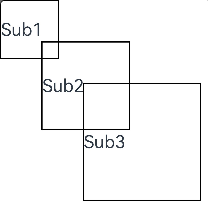

# 自定义组件的生命周期


自定义组件的生命周期回调函数用于通知用户该自定义组件的生命周期，这些回调函数是私有的，在运行时由开发框架在特定的时间进行调用，不能从应用程序中手动调用这些回调函数。


>**说明：**
>
>允许在生命周期函数中使用Promise和异步回调函数，比如网络资源获取，定时器设置等；


## aboutToAppear

aboutToAppear?(): void

aboutToAppear函数在创建自定义组件的新实例后，在执行其build()函数之前执行。允许在aboutToAppear函数中改变状态变量，更改将在后续执行build()函数中生效。

从API version 9开始，该接口支持在ArkTS卡片中使用。

## aboutToDisappear

aboutToDisappear?(): void

aboutToDisappear函数在自定义组件析构销毁之前执行。不允许在aboutToDisappear函数中改变状态变量，特别是\@Link变量的修改可能会导致应用程序行为不稳定。

从API version 9开始，该接口支持在ArkTS卡片中使用。

## onPageShow

onPageShow?(): void

页面每次显示时触发一次，包括路由过程、应用进入前台等场景，仅\@Entry装饰的自定义组件生效。


## onPageHide

onPageHide?(): void

页面每次隐藏时触发一次，包括路由过程、应用进入前后台等场景，仅\@Entry装饰的自定义组件生效。


## onBackPress

onBackPress?(): void

当用户点击返回按钮时触发，仅\@Entry装饰的自定义组件生效。


```ts
// xxx.ets
@Entry
@Component
struct IndexComponent {
  @State textColor: Color = Color.Black;

  onPageShow() {
    this.textColor = Color.Blue;
    console.info('IndexComponent onPageShow');
  }

  onPageHide() {
    this.textColor = Color.Transparent;
    console.info('IndexComponent onPageHide');
  }

  onBackPress() {
    this.textColor = Color.Red;
    console.info('IndexComponent onBackPress');
  }

  build() {
    Column() {
      Text('Hello World')
        .fontColor(this.textColor)
        .fontSize(30)
        .margin(30)
    }.width('100%')
  }
}
```


## onLayout<sup>9+</sup>

onLayout?(children: Array&lt;LayoutChild&gt;, constraint: ConstraintSizeOptions): void

框架会在自定义组件布局时，将该自定义组件的子节点信息和自身的尺寸范围通过onLayout传递给该自定义组件。不允许在onLayout函数中改变状态变量。

从API version 9开始，该接口支持在ArkTS卡片中使用。

**参数：**

| 参数名        | 类型                                       | 说明               |
| ---------- | ---------------------------------------- | ---------------- |
| children   | Array&lt;[LayoutChild](#layoutchild9)&gt; | 子组件布局信息。         |
| constraint | [ConstraintSizeOptions](ts-types.md#constraintsizeoptions) | 父组件constraint信息。 |


## onMeasure<sup>9+</sup>

onMeasure?(children: Array&lt;LayoutChild&gt;, constraint: ConstraintSizeOptions): void

框架会在自定义组件确定尺寸时，将该自定义组件的子节点信息和自身的尺寸范围通过onMeasure传递给该自定义组件。不允许在onMeasure函数中改变状态变量。

从API version 9开始，该接口支持在ArkTS卡片中使用。

**参数：**

| 参数名        | 类型                                       | 说明               |
| ---------- | ---------------------------------------- | ---------------- |
| children   | Array&lt;[LayoutChild](#layoutchild9)&gt; | 子组件布局信息。         |
| constraint | [ConstraintSizeOptions](ts-types.md#constraintsizeoptions) | 父组件constraint信息。 |

## onRecycle<sup>10+</sup>

onRecycle?(params: { [key: string]: unknown }): void

当一个可复用的自定义组件从复用缓存中重新加入到节点树时，触发onRecycle生命周期回调，并将组件的构造参数传递给onRecycle。

从API version 10开始，该接口支持在ArkTS卡片中使用。

**参数：**

| 参数名 | 类型                       | 说明                 |
| ------ | -------------------------- | -------------------- |
| params | { [key: string]: unknown } | 自定义组件的构造参数 |

## LayoutChild<sup>9+</sup>

子组件布局信息。

从API version 9开始，该接口支持在ArkTS卡片中使用。

| 参数         | 参数类型                                     | 描述                  |
| ---------- | ---------------------------------------- | ------------------- |
| name       | string                                   | 子组件名称。              |
| id         | string                                   | 子组件id。              |
| constraint | [ConstraintSizeOptions](ts-types.md#constraintsizeoptions) | 子组件约束尺寸。            |
| borderInfo | [LayoutBorderInfo](#layoutborderinfo9)   | 子组件border信息。        |
| position   | [Position](ts-types.md#position)         | 子组件位置坐标。            |
| measure    | (childConstraint:)&nbsp;=&gt;&nbsp;void  | 调用此方法对子组件的尺寸范围进行限制。 |
| layout     | (LayoutInfo：&nbsp;[LayoutInfo](#layoutinfo9))&nbsp;=&gt;&nbsp;void | 调用此方法对子组件的位置信息进行限制。 |


## LayoutBorderInfo<sup>9+</sup>

子组件border信息。

从API version 9开始，该接口支持在ArkTS卡片中使用。

| 参数          | 参数类型                                 | 描述                      |
| ----------- | ------------------------------------ | ----------------------- |
| borderWidth | [EdgeWidths](ts-types.md#edgewidths) | 边框宽度类型，用于描述组件边框不同方向的宽度。 |
| margin      | [Margin](ts-types.md#margin)         | 外边距类型，用于描述组件不同方向的外边距。   |
| padding     | [Padding](ts-types.md#padding)       | 内边距类型，用于描述组件不同方向的内边距。   |


## LayoutInfo<sup>9+</sup>

子组件layout信息。

从API version 9开始，该接口支持在ArkTS卡片中使用。

| 参数         | 参数类型                                     | 描述       |
| ---------- | ---------------------------------------- | -------- |
| position   | [Position](ts-types.md#position)         | 子组件位置坐标。 |
| constraint | [ConstraintSizeOptions](ts-types.md#constraintsizeoptions) | 子组件约束尺寸。 |


```ts
// xxx.ets
@Entry
@Component
struct Index {
  build() {
    Column() {
      CustomLayout() {
        ForEach([1, 2, 3], (index) => {
          Text('Sub' + index)
            .fontSize(30)
            .borderWidth(2)
        })
      }
    }
  }
}


@Component
struct CustomLayout {
  @BuilderParam builder: () => {};

  onLayout(children: Array<LayoutChild>, constraint: ConstraintSizeOptions) {
    let pos = 0;
    children.forEach((child) => {
      child.layout({ position: { x: pos, y: pos }, constraint: constraint })
      pos += 100;
    })
  }

  onMeasure(children: Array<LayoutChild>, constraint: ConstraintSizeOptions) {
    let size = 100;
    children.forEach((child) => {
      child.measure({ minHeight: size, minWidth: size, maxWidth: size, maxHeight: size })
      size += 50;
    })
  }

  build() {
    this.builder()
  }
}
```


